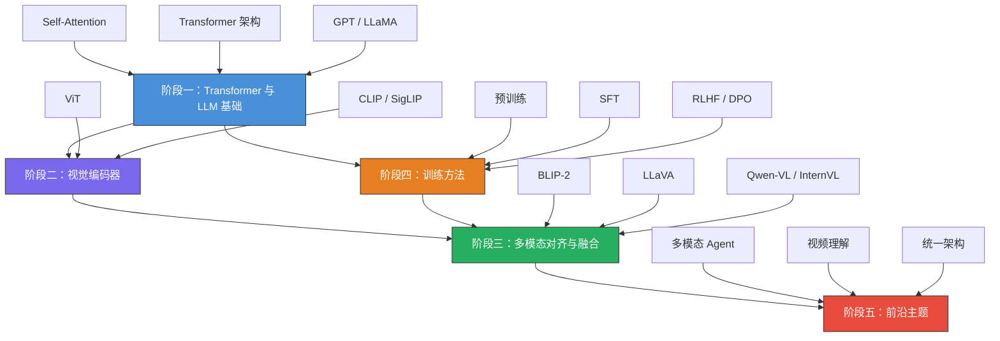

# LLM Learning Lab

> 一个系统学习多模态大语言模型（Multimodal LLM）的个人知识库

## 项目简介

本仓库旨在系统性地学习和记录多模态大语言模型（MLLM）领域的核心知识，涵盖从 Transformer 基础到前沿多模态架构的完整路径。内容包括：

- **学习笔记**：对关键概念的结构化梳理，兼顾直觉理解与技术细节
- **论文阅读**：经典与前沿论文的精读笔记，附带个人评价与横向对比
- **代码实验**：基于 PyTorch 的动手实验，加深对模型架构和训练流程的理解
- **资源汇总**：课程、开源项目、博客、基准测试等优质资源的整理

## 学习路线图

### 阶段一：Transformer 与 LLM 基础

- Self-Attention 机制与多头注意力（Multi-Head Attention）
- Transformer 编码器-解码器架构
- 位置编码（Sinusoidal、RoPE、ALiBi）
- 大语言模型核心架构（GPT 系列、LLaMA 系列）
- Tokenization 与 BPE（Byte Pair Encoding）
- 推理优化：KV Cache、Flash Attention

### 阶段二：视觉编码器（ViT、CLIP）

- Vision Transformer（ViT）：将图像建模为 patch 序列
- CLIP：对比学习实现图文对齐
- 视觉编码器变体：SigLIP、EVA-CLIP、InternViT
- 图像预处理：分辨率策略、动态分辨率（Dynamic Resolution）

### 阶段三：多模态对齐与融合

- 多模态架构设计范式：
  - 基于投影层（Linear Projection）：LLaVA
  - 基于 Q-Former / Cross-Attention：BLIP-2、Flamingo
  - 基于重采样器（Resampler）：Qwen-VL
- 代表性模型精读：
  - BLIP-2：冻结视觉与语言模型，用 Q-Former 桥接
  - LLaVA / LLaVA-NeXT：简洁高效的视觉指令微调
  - Qwen-VL / Qwen2-VL：多分辨率视觉理解
  - InternVL 系列：可扩展的开源多模态模型
  - GPT-4V / GPT-4o：闭源前沿能力参考

### 阶段四：训练方法

- 预训练（Pre-training）：图文对齐预训练、大规模数据策略
- 监督微调（SFT, Supervised Fine-Tuning）：指令数据构建、多任务混合训练
- 人类反馈强化学习（RLHF）：奖励模型、PPO 算法
- 直接偏好优化（DPO, Direct Preference Optimization）
- 参数高效微调（PEFT）：LoRA、QLoRA
- 数据工程：高质量数据筛选、合成数据生成

### 阶段五：前沿主题

- 多模态 Agent：工具调用、GUI 操控、具身智能
- 视频理解：时序建模、长视频处理
- 统一架构：图像生成与理解的统一（Emu、Janus）
- 多模态思维链（Multimodal Chain-of-Thought）
- 模型评估与基准测试（MMBench、MMMU、MathVista）

## 学习路线流程图



## 仓库结构

```
.
├── CLAUDE.md                # AI 协作指南
├── README.md                # 项目总览与学习路线图（本文件）
├── notes/                   # 学习笔记
│   ├── fundamentals/        # 基础概念（Transformer、Attention、LLM 基础）
│   ├── vision-language/     # 视觉-语言模型（CLIP、BLIP、LLaVA 等）
│   ├── multimodal-arch/     # 多模态架构设计（融合策略、对齐方法）
│   ├── training/            # 训练技术（预训练、指令微调、RLHF）
│   └── applications/        # 应用场景（VQA、图像描述、多模态 Agent）
├── papers/                  # 论文阅读笔记
│   ├── README.md            # 论文阅读清单与进度追踪
│   └── <paper-name>.md      # 单篇论文笔记
├── experiments/             # 代码实验
│   ├── notebooks/           # Jupyter notebooks
│   └── scripts/             # 可复用脚本
├── resources/               # 学习资源汇总
│   └── awesome-mllm.md      # 资源链接集合
└── weekly-log/              # 周记 / 学习日志
    └── YYYY-WXX.md          # 按周归档
```

## 推荐学习资源

### 经典课程

| 课程 | 机构 | 说明 |
|------|------|------|
| [CS231n: Deep Learning for Computer Vision](http://cs231n.stanford.edu/) | Stanford | 计算机视觉深度学习基础 |
| [CS224N: NLP with Deep Learning](http://web.stanford.edu/class/cs224n/) | Stanford | 自然语言处理基础 |
| [CS25: Transformers United](https://web.stanford.edu/class/cs25/) | Stanford | Transformer 专题 |
| [LLM Course](https://github.com/mlabonne/llm-course) | mlabonne | 开源 LLM 学习路线 |

### 必读论文

| 论文 | 年份 | 意义 |
|------|------|------|
| Attention Is All You Need | 2017 | Transformer 奠基之作 |
| An Image is Worth 16x16 Words (ViT) | 2020 | 视觉 Transformer 开创 |
| Learning Transferable Visual Models (CLIP) | 2021 | 图文对比学习里程碑 |
| BLIP-2 | 2023 | Q-Former 多模态桥接 |
| Visual Instruction Tuning (LLaVA) | 2023 | 视觉指令微调范式 |
| Qwen-VL | 2023 | 高性能开源多模态模型 |

> 完整论文清单请查看 [papers/README.md](papers/README.md)，更多学习资源请查看 [resources/awesome-mllm.md](resources/awesome-mllm.md)。

## 当前进度

- [ ] 阶段一：Transformer 与 LLM 基础
- [ ] 阶段二：视觉编码器（ViT、CLIP）
- [ ] 阶段三：多模态对齐与融合
- [ ] 阶段四：训练方法
- [ ] 阶段五：前沿主题

## 更新日志

- 2026-02-21: 初始化仓库，创建学习路线图与基础结构

Prompt：
# Prompt: 多模态大语言模型学习 Repo 助手

> 将以下 prompt 复制到与 Claude 的对话中使用，可根据需要选择对应场景的 prompt。

---

## 🚀 Prompt 1: 初始化 Repo

```
你是一个多模态大语言模型（Multimodal LLM）领域的学习助手。请帮我初始化一个学习笔记仓库，要求如下：

1. 创建 README.md，包含：
   - 项目简介：这是一个系统学习多模态大语言模型的个人知识库
   - 学习路线图：从基础到前沿，分为 5 个阶段
     - 阶段一：Transformer 与 LLM 基础
     - 阶段二：视觉编码器（ViT、CLIP）
     - 阶段三：多模态对齐与融合（BLIP-2、LLaVA、Qwen-VL 等）
     - 阶段四：训练方法（预训练、SFT、RLHF/DPO）
     - 阶段五：前沿主题（多模态 Agent、视频理解、统一架构）
   - 用 Mermaid 画出学习路线的流程图
   - 推荐学习资源列表

2. 创建 papers/README.md 作为论文阅读清单，按主题分类，包含：
   - 基础模型（GPT、LLaMA、ViT、CLIP）
   - 多模态模型（BLIP-2、LLaVA、LLaVA-NeXT、Qwen-VL、InternVL、GPT-4V）
   - 训练方法相关论文
   - 每篇标注阅读状态：⬜ 未读 / 📖 在读 / ✅ 已读

3. 创建 resources/awesome-mllm.md，汇总：
   - 经典课程和教程链接
   - 重要开源项目
   - 知名博客和技术文章
   - 基准测试和排行榜

请严格遵循 CLAUDE.md 中定义的格式规范。
```

---

## 📝 Prompt 2: 写论文阅读笔记

```
请帮我写一篇关于 [论文名称] 的阅读笔记。

要求：
1. 严格按照 CLAUDE.md 中定义的论文笔记模板
2. 用中文撰写，专有名词保留英文
3. 方法部分：
   - 先用一段话给出直觉层面的理解
   - 再详细拆解技术方案，配合架构图（Mermaid）
   - 解释关键公式，每个符号都要说明含义
4. 实验部分：重点关注消融实验，分析每个组件的贡献
5. 个人评价部分：
   - 分析这篇工作相对于前人的核心改进是什么
   - 指出可能的局限性
   - 对我后续学习有什么启发
6. 在末尾列出 3-5 篇最值得接下来阅读的相关论文

论文信息：[粘贴论文标题、摘要或链接]
```

---

## 📚 Prompt 3: 写概念学习笔记

```
请帮我写一篇关于 [概念/主题] 的学习笔记，放入 notes/ 对应子目录。

要求：
1. 遵循 CLAUDE.md 中的笔记格式规范
2. 讲解结构：
   - 先用类比或直觉解释这个概念是什么、为什么重要
   - 再给出正式的技术定义和数学表达
   - 用具体例子说明
   - 用 Mermaid 图解释关键流程或架构
3. 与已有笔记的关联：指出这个概念和哪些已学内容有联系
4. 常见误区：列出初学者容易搞混的点
5. 面试/口述版：用 3-5 句话总结，像对面试官解释一样

主题：[填写具体概念，例如 "Cross-Attention 在多模态模型中的作用"]
```

---

## 🧪 Prompt 4: 设计代码实验

```
请帮我设计一个关于 [主题] 的代码实验，用于加深理解。

要求：
1. 使用 PyTorch，代码放入 experiments/ 目录
2. 实验目标明确，例如"验证 XX 机制的效果"或"复现 XX 论文的核心模块"
3. 代码结构清晰：
   - 数据准备
   - 模型定义
   - 训练循环
   - 可视化结果
4. 每段代码有注释解释意图
5. 在 notebook 开头写明：实验目标、预期结果、所需环境
6. 在 notebook 结尾写明：实验结论、与理论的对照

主题：[例如 "从零实现一个简化版的 CLIP 对比学习"]
```

---

## 📅 Prompt 5: 生成周记

```
请根据以下信息帮我生成本周的学习周记（放入 weekly-log/ 目录）：

本周完成的内容：
- [列出本周读了哪些论文、写了哪些笔记、做了哪些实验]

遇到的问题：
- [列出不理解的概念或卡住的地方]

要求：
1. 遵循 CLAUDE.md 中的周记格式
2. 对"关键收获"部分做提炼总结，不是简单复述
3. 对"遇到的问题"给出具体的解决思路或学习建议
4. "下周计划"要具体可执行，包含预计时间
5. 如果发现知识盲区，建议补充哪些前置知识
```

---

## 🔗 Prompt 6: 知识关联与复习

```
请帮我做一次阶段性的知识梳理。

要求：
1. 回顾 notes/ 和 papers/ 中已有的笔记
2. 用 Mermaid 画出一张知识关系图，展示各概念之间的依赖和演进关系
3. 找出当前知识体系中的薄弱环节或缺失部分
4. 生成 5 个"自测问题"，检验我对核心概念的理解
5. 建议接下来最应该补充学习的 3 个方向

当前已完成的笔记：[列出已有笔记标题或贴出目录结构]
```

---

## 💡 使用技巧

1. **每次对话开头**提醒 Claude 阅读 CLAUDE.md，确保格式一致
2. **论文笔记**建议先自己粗读一遍，再让 Claude 帮你整理，效果更好
3. **周记**建议每周五花 10 分钟列出要点，再用 Prompt 5 生成完整版
4. **定期使用 Prompt 6** 做知识图谱梳理，避免学成碎片化
5. 所有 prompt 中的 `[方括号内容]` 需要替换为你的实际信息