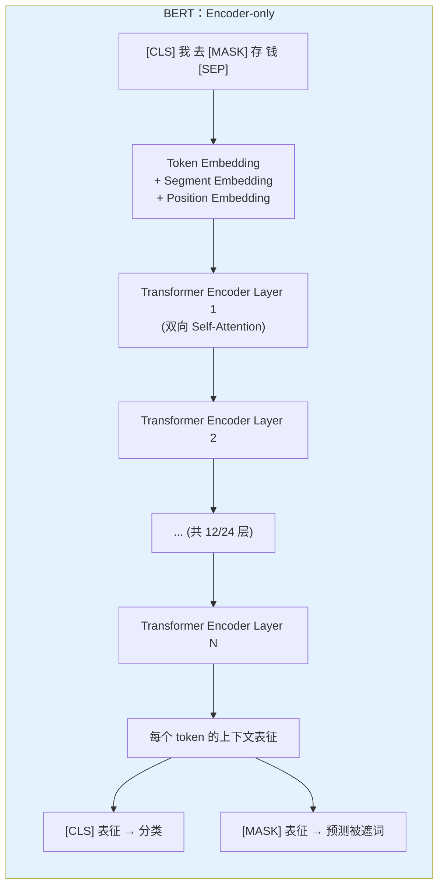
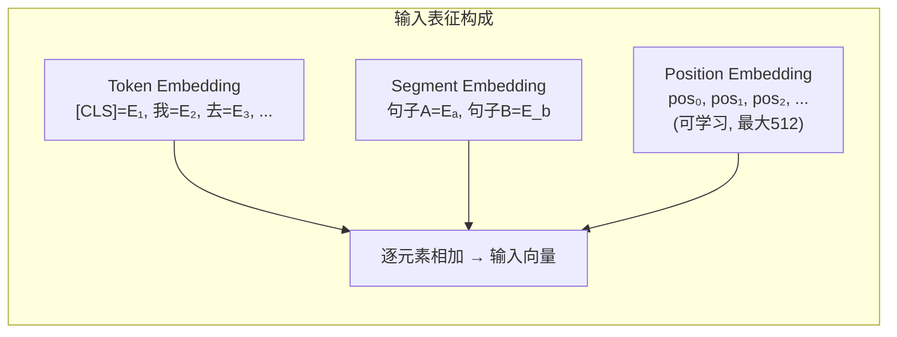
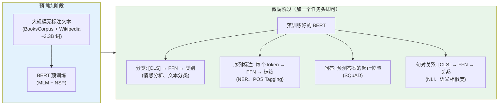
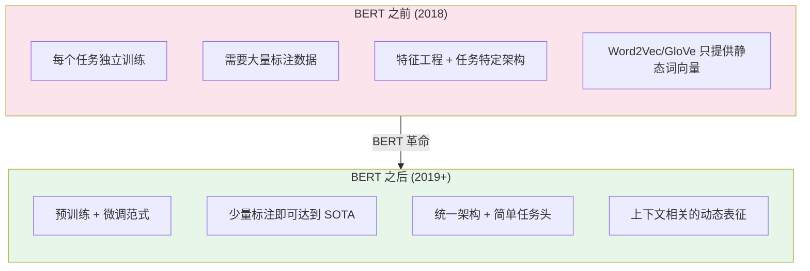

# BERT：双向预训练的开山之作

> BERT 是第一个真正让"预训练 + 微调"范式席卷 NLP 的模型——它的核心洞察是：通过**随机遮住一些词让模型猜**（Masked Language Model），Transformer Encoder 可以学到深度双向的语言表征，这种表征在几乎所有下游任务上都能通过简单微调达到 SOTA。BERT 之后，NLP 进入了"预训练模型"时代。

## 关键概念

| 概念 | 含义 |
|------|------|
| BERT（Bidirectional Encoder Representations from Transformers） | Google 提出的双向预训练语言模型，基于 Transformer Encoder |
| MLM（Masked Language Model） | BERT 的核心预训练任务：随机遮住 15% 的 token，让模型预测被遮住的词 |
| NSP（Next Sentence Prediction） | BERT 的辅助预训练任务：判断两个句子是否是原文中的上下句 |
| Encoder-only 架构 | 只使用 Transformer Encoder（双向注意力），不含 Decoder |
| 双向注意力（Bidirectional Attention） | 每个 token 可以同时看到左侧和右侧的所有 token |
| [CLS] Token | BERT 输入序列的起始特殊 token，其最终表征用于分类任务 |
| [SEP] Token | 分隔两个句子的特殊 token |
| [MASK] Token | MLM 中替代被遮住词的特殊 token |
| WordPiece | BERT 使用的子词分词算法，词表大小 30522 |
| Fine-tuning（微调） | 在预训练模型基础上，用少量标注数据训练特定任务 |
| RoBERTa | BERT 的改进版：去掉 NSP、更大数据、更长训练、动态遮码 |
| ALBERT | BERT 的轻量版：参数共享 + 因式分解嵌入 |

## 详细笔记

### 一、BERT 解决了什么问题？

#### 预训练时代之前

2018 年之前，NLP 的做法是为每个任务**从头训练**一个模型：

```
情感分类 → 训练一个 LSTM
命名实体识别 → 训练另一个 LSTM
问答系统 → 训练又一个模型
```

每个任务都需要大量标注数据，模型之间无法共享知识。

#### ELMo 和 GPT 的探索

- **ELMo**（2018）：用双向 LSTM 预训练词向量，但只提供"特征提取"，下游任务仍需独立模型
- **GPT**（2018）：用 Transformer Decoder 做自回归预训练（从左到右），再微调。但自回归的**单向性**限制了它对上下文的理解

**直觉比喻**：

理解一个词的含义时，你需要同时看它的前文和后文：

```
"我去银行存钱"  →  银行 = 金融机构
"河的两边有银行"  →  ??? (需要看到"河"和"两边"才知道是"岸")
```

GPT 只能看左边（"河的两边有"），无法看到右边的上下文。这就是 GPT 的"单向"限制。

#### BERT 的核心洞察

> **与其从左到右预测下一个词（GPT），不如随机遮住一些词让模型从两个方向猜（MLM）。这样模型就能同时利用左右上下文，学到更好的语言表征。**

### 二、BERT 的架构

#### 2.1 Encoder-only Transformer

BERT 使用 Transformer 的 **Encoder 部分**（详见 [transformer.md](./transformer.md)），核心区别是注意力掩码：

| 架构 | 代表模型 | 注意力方向 | 适合任务 |
|------|---------|:---------:|---------|
| Encoder-only | BERT, RoBERTa | 双向（看所有 token） | 理解任务（分类、NER、QA） |
| Decoder-only | GPT 系列 | 单向（只看左侧） | 生成任务（文本生成） |
| Encoder-Decoder | T5, BART | 编码双向 + 解码单向 | 序列到序列（翻译、摘要） |



#### 2.2 模型规格

| 版本 | 层数 (L) | 隐藏维度 (H) | 注意力头 (A) | 参数量 |
|------|:--------:|:----------:|:----------:|:------:|
| BERT-Base | 12 | 768 | 12 | 110M |
| BERT-Large | 24 | 1024 | 16 | 340M |

#### 2.3 输入表征

BERT 的输入由三种嵌入相加构成：

$$E_{\text{input}} = E_{\text{token}} + E_{\text{segment}} + E_{\text{position}}$$



- **Token Embedding**：WordPiece 子词嵌入（词表 30522）
- **Segment Embedding**：区分句子 A 和句子 B（只有 $E_A$ 和 $E_B$ 两个向量）
- **Position Embedding**：可学习的绝对位置编码（最大 512），与现代 LLM 使用的 RoPE 不同（详见 [positional-encoding.md](./positional-encoding.md)）

### 三、预训练任务一：Masked Language Model（MLM）

#### 3.1 机制

随机选择输入序列中 **15%** 的 token 进行处理：

| 操作 | 比例 | 示例 |
|------|:----:|------|
| 替换为 `[MASK]` | 80% | "我去**银行**存钱" → "我去 `[MASK]` 存钱" |
| 替换为随机词 | 10% | "我去**银行**存钱" → "我去**苹果**存钱" |
| 保持不变 | 10% | "我去**银行**存钱" → "我去**银行**存钱" |

模型需要预测被选中位置的**原始 token**：

$$\mathcal{L}_{\text{MLM}} = -\sum_{i \in \mathcal{M}} \log p_\theta(x_i \mid x_{\backslash \mathcal{M}})$$

其中 $\mathcal{M}$ 是被遮码的位置集合，$x_{\backslash \mathcal{M}}$ 是未被遮码的上下文。

#### 3.2 为什么不全部替换为 [MASK]？

如果 100% 使用 `[MASK]` 替换，模型会学到一个"快捷方式"——只在看到 `[MASK]` 时才认真编码上下文，对正常 token 不上心。这导致**预训练与微调的不匹配**（微调时输入中没有 `[MASK]`）。

80/10/10 的比例设计：
- **80% [MASK]**：主要学习任务
- **10% 随机词**：迫使模型不能只依赖位置信息，必须真正理解上下文
- **10% 不变**：让模型学会对正常 token 也输出有意义的表征

#### 3.3 MLM vs CLM 的本质区别

| 维度 | MLM（BERT） | CLM（GPT） |
|------|:-----------:|:---------:|
| 预测方式 | 预测被遮住的词（完形填空） | 预测下一个词（续写） |
| 上下文 | **双向**（前文 + 后文） | **单向**（只有前文） |
| 注意力掩码 | 全可见 | Causal（三角形） |
| 适合任务 | 理解（分类、NER、QA） | 生成（文本续写、对话） |
| 训练效率 | 每步只预测 15% token | 每步预测所有 token |

**训练效率的代价**：MLM 每步只能利用 15% 的 token 做损失计算，而 CLM 可以利用 100%。这是 BERT 需要更大数据和更长训练来补偿的原因之一——也是后续 RoBERTa 大幅增加训练量的动机。

### 四、预训练任务二：Next Sentence Prediction（NSP）

#### 4.1 机制

输入两个句子（A 和 B），判断 B 是否是 A 在原文中的下一句：

```
正样本 (IsNext):     [CLS] 今天天气很好 [SEP] 我们去公园散步 [SEP]
负样本 (NotNext):    [CLS] 今天天气很好 [SEP] 量子力学很有趣 [SEP]
```

用 `[CLS]` token 的最终表征做二分类：

$$\mathcal{L}_{\text{NSP}} = -\left[y \log p_{\text{next}} + (1-y) \log(1-p_{\text{next}})\right]$$

#### 4.2 NSP 的争议

NSP 是 BERT 中**最具争议**的设计。后续研究发现：

- **RoBERTa** 去掉 NSP 后性能反而提升
- NSP 任务太简单——负样本来自不同文档，模型只需判断话题是否一致，而非真正理解句间逻辑
- NSP 的有效性可能来自"让模型处理双句输入"的附带效果，而非任务本身

#### 4.3 总预训练损失

$$\mathcal{L}_{\text{BERT}} = \mathcal{L}_{\text{MLM}} + \mathcal{L}_{\text{NSP}}$$

### 五、BERT 的微调范式

BERT 最革命性的贡献不是架构本身，而是确立了 **"预训练 + 微调"** 范式：



#### 不同任务的微调方式

| 任务类型 | 输入格式 | 使用的表征 | 输出 |
|---------|---------|----------|------|
| 单句分类 | `[CLS] 句子 [SEP]` | `[CLS]` 表征 | 类别概率 |
| 句对分类 | `[CLS] 句A [SEP] 句B [SEP]` | `[CLS]` 表征 | 关系标签 |
| 序列标注 | `[CLS] 句子 [SEP]` | 每个 token 表征 | 每个 token 的标签 |
| 抽取式问答 | `[CLS] 问题 [SEP] 段落 [SEP]` | 段落中每个 token | 答案起止位置 |

**[CLS] token 的角色**：BERT 的 Self-Attention 让 `[CLS]` 能看到序列中的所有 token，因此 `[CLS]` 的最终表征可以视为**整个序列的聚合表征**。

### 六、BERT 的预训练细节

| 配置项 | BERT-Base | BERT-Large |
|--------|:---------:|:----------:|
| 数据 | BooksCorpus + English Wikipedia (~16GB) | 同左 |
| 词表 | WordPiece, 30522 | 同左 |
| 最大序列长度 | 512 | 512 |
| Batch Size | 256 | 256 |
| 训练步数 | 1M | 1M |
| 学习率 | 1e-4 | 同左 |
| 优化器 | Adam ($\beta_1=0.9, \beta_2=0.999$) | 同左 |
| 学习率调度 | Linear warmup (10K steps) + Linear decay | 同左 |
| Dropout | 0.1 | 0.1 |
| 激活函数 | GELU | GELU |
| 位置编码 | 可学习绝对位置（最大 512） | 同左 |

### 七、BERT 的重要变体

#### 7.1 RoBERTa（2019, Meta）

**"Robustly optimized BERT approach"**——不改架构，只优化训练策略：

| 改进 | BERT | RoBERTa |
|------|------|---------|
| NSP 任务 | ✅ 使用 | ❌ 去掉（发现有害） |
| 遮码策略 | 静态（预处理时确定） | **动态**（每 epoch 重新遮码） |
| 训练数据 | 16 GB | **160 GB**（10x） |
| Batch Size | 256 | **8K** |
| 训练步数 | 1M | **500K**（但更大 batch） |
| 输入格式 | 句对 | **完整文档** |

**核心启示**：BERT 的架构和 MLM 目标没有问题，问题在于训练不够充分。更多数据 + 更大 batch + 更长训练 = 更好的模型。

#### 7.2 ALBERT（2019, Google）

**"A Lite BERT"**——减少参数量：

| 技术 | 效果 |
|------|------|
| **因式分解嵌入** | 将 $V \times H$ 的嵌入矩阵分解为 $V \times E + E \times H$（$E \ll H$），大幅减少嵌入参数 |
| **跨层参数共享** | 所有 Transformer 层共享同一套参数，参数量锐减 |
| **SOP 替代 NSP** | Sentence Order Prediction：判断两句的顺序是否正确（比 NSP 更难） |

ALBERT-xxlarge 参数量只有 BERT-Large 的 70%，但性能更好。

#### 7.3 DistilBERT（2019, HuggingFace）

知识蒸馏：用 BERT-Base 作为 Teacher 训练一个 6 层的 Student，保留 97% 性能但参数减少 40%、速度提升 60%。

#### 7.4 变体对比

| 模型 | 参数量 | 核心改进 | 相对 BERT-Base 性能 |
|------|:------:|---------|:---:|
| BERT-Base | 110M | 基准 | 100% |
| BERT-Large | 340M | 更大 | +2-3% |
| RoBERTa-Large | 355M | 训练优化 | **+5-7%** |
| ALBERT-xxlarge | 235M | 参数共享 | +3-5% |
| DistilBERT | 66M | 知识蒸馏 | -3% |

### 八、BERT 的历史地位与影响

#### 8.1 BERT 之前 vs 之后



#### 8.2 BERT 对多模态的影响

BERT 直接启发了一系列多模态预训练模型（详见 [mllm-evolution.md](../multimodal-arch/mllm-evolution.md)）：

| 模型 | 年份 | 与 BERT 的关系 |
|------|:----:|--------------|
| ViLBERT | 2019 | 双流 BERT：图文各一个 Transformer，通过 Co-Attention 交互 |
| VisualBERT | 2019 | 单流 BERT：图文 token 拼接后共享 Transformer |
| UNITER | 2020 | 单流 BERT + MLM + ITM + MRC + WRA |
| LXMERT | 2019 | 双流 BERT + 交叉注意力层 |

这些模型本质上是"把 BERT 的 MLM 从文本扩展到图文多模态"。

#### 8.3 BERT vs GPT：两条路线

BERT 和 GPT 代表了预训练模型的两条技术路线，最终 GPT 路线（自回归 + 规模扩展）在 LLM 时代占据主导：

| 维度 | BERT 路线 | GPT 路线 |
|------|---------|---------|
| 架构 | Encoder-only | Decoder-only |
| 预训练 | MLM（完形填空） | CLM（续写） |
| 核心能力 | **理解** | **生成** |
| 规模趋势 | 停留在百M~十亿 | 扩展到千亿+ |
| 当前定位 | 嵌入模型、分类任务 | 通用 AI 助手 |
| 代表 | BERT, RoBERTa | GPT-4, LLaMA, Claude |

**为什么 GPT 路线"赢了"？**
- 自回归生成天然支持对话、写作等高价值应用
- 生成能力涌现出推理、规划等"理解"能力（足够大的 GPT 也能做好分类任务）
- Scaling Law 在自回归模型上表现更一致

**但 BERT 路线并未消亡**：
- 语义嵌入（Sentence-BERT）仍是检索系统的核心
- 分类、NER 等判别任务中，BERT 微调仍然高效
- 现代嵌入模型（如 BGE, E5）继承了 BERT 的双向编码思想

### 九、BERT 的局限

1. **无法生成文本**：Encoder-only 架构不支持自回归生成
2. **序列长度限制**：可学习位置编码限制最大 512 token（vs 现代 LLM 的 128K+）
3. **[MASK] 的预训练-微调不匹配**：预训练有 `[MASK]`，微调没有
4. **独立性假设**：MLM 假设被遮住的 token 之间相互独立（条件独立），忽略了它们之间的依赖
5. **训练效率低**：每步只利用 15% 的 token 计算损失
6. **NSP 的无效性**：后续研究证明 NSP 任务对模型质量贡献有限甚至有害

### 十、BERT 在现代 AI 中的位置

虽然 LLM 时代的焦点转向了 GPT 路线的生成模型，BERT 的思想仍然活跃在多个领域：

| 领域 | BERT 的影响 |
|------|-----------|
| 语义搜索 | Sentence-BERT → BGE / E5 等嵌入模型，双向编码保证理解质量 |
| 视觉预训练 | BEiT 将 MLM 思想迁移到视觉领域（Masked Image Modeling） |
| 多模态预训练 | ViLBERT/UNITER 等直接扩展 BERT 到图文 |
| 知识蒸馏 | DistilBERT 开创了"大模型蒸馏小模型"的范式 |
| 高效微调 | BERT 微调范式启发了 LoRA 等参数高效方法（详见 [llm-optimization-techniques.md](../training/llm-optimization-techniques.md)） |

## 个人理解与思考

### 交叉引用

1. **[transformer.md](./transformer.md)** — BERT 使用的 Encoder-only 架构、Self-Attention 机制、GELU 激活函数
2. **[positional-encoding.md](./positional-encoding.md)** — BERT 使用可学习绝对位置编码（最大 512），与现代 LLM 的 RoPE 对比
3. **[llm-pretraining.md](../training/llm-pretraining.md)** — MLM vs CLM 的对比，BERT 与 GPT 代表的两条预训练路线
4. **[contrastive-learning.md](./contrastive-learning.md)** — Sentence-BERT 利用对比学习改善 BERT 的句子表征
5. **[mllm-evolution.md](../multimodal-arch/mllm-evolution.md)** — ViLBERT、UNITER 等 BERT 启发的多模态模型
6. **[supervised-fine-tuning-sft.md](../training/supervised-fine-tuning-sft.md)** — BERT 的微调范式是后续 LLM SFT 的思想基础
7. **[llm-optimization-techniques.md](../training/llm-optimization-techniques.md)** — BERT 微调范式启发了 LoRA 等参数高效方法

### 常见误区

| 误区 | 纠正 |
|------|------|
| "BERT 是生成式 AI" | BERT 是**判别式/编码式**模型（Encoder-only），不能生成文本。生成式是 GPT 路线 |
| "双向就是从左到右 + 从右到左" | BERT 的双向不是 BiLSTM 那种拼接两个方向。BERT 的 Self-Attention 让每个 token **同时**看到所有位置，是真正的双向 |
| "MLM 就是完形填空" | MLM 的 80/10/10 策略不只是简单遮词——10% 随机替换和 10% 保持不变是为了缓解预训练-微调的分布不匹配 |
| "NSP 很重要" | RoBERTa 证明去掉 NSP 性能反而更好。NSP 任务太简单，模型只需判断话题一致性 |
| "BERT 已经过时了" | BERT 的架构和思想仍活跃在嵌入模型（BGE/E5）、分类任务和多模态预训练中。"过时"的只是用 BERT 做所有事情的时代 |
| "BERT 的位置编码和 GPT 一样" | BERT 用可学习绝对位置编码（最大 512），现代 GPT 用 RoPE 相对位置编码（可扩展到 128K+），两者完全不同 |
| "[CLS] 天然就是好的句子表征" | 原始 BERT 的 [CLS] 表征质量一般，需要 Sentence-BERT 等方法通过对比学习微调才能得到好的句子嵌入 |

### 面试/口述版

BERT（2018, Google）是第一个让"预训练 + 微调"范式席卷 NLP 的模型，基于 **Transformer Encoder**（双向注意力）。它的核心预训练任务是 **MLM（Masked Language Model）**：随机遮住 15% 的 token（80% 替换为 [MASK]、10% 随机词、10% 不变），让模型从双向上下文预测被遮住的词，从而学到深度双向的语言表征。另一个预训练任务 NSP（判断句对是否相邻）后来被 RoBERTa 证明是不必要的。BERT 确立的范式是：在大规模无标注文本上预训练 → 在下游任务上只需加一个简单任务头做微调（如 [CLS] + FFN 做分类），就能在几乎所有 NLP 基准上达到 SOTA。虽然 LLM 时代的焦点转向了 GPT 路线的自回归生成，但 BERT 的双向编码思想仍活跃在语义嵌入（BGE/E5）、视觉预训练（BEiT）和多模态预训练（ViLBERT/UNITER）中。

## 相关链接

### 核心论文
- [BERT: Pre-training of Deep Bidirectional Transformers for Language Understanding (Devlin et al., 2019)](https://arxiv.org/abs/1810.04805) — BERT 原始论文，NAACL 2019
- [RoBERTa: A Robustly Optimized BERT Pretraining Approach (Liu et al., 2019)](https://arxiv.org/abs/1907.11692) — 优化 BERT 训练策略
- [ALBERT: A Lite BERT for Self-supervised Learning (Lan et al., 2020)](https://arxiv.org/abs/1909.11942) — 轻量化 BERT
- [DistilBERT (Sanh et al., 2019)](https://arxiv.org/abs/1910.01108) — BERT 知识蒸馏

### 相关工作
- [ELMo (Peters et al., 2018)](https://arxiv.org/abs/1802.05365) — BERT 之前的上下文词向量
- [GPT (Radford et al., 2018)](https://cdn.openai.com/research-covers/language-unsupervised/language_understanding_paper.pdf) — 自回归预训练路线
- [Sentence-BERT (Reimers & Gurevych, 2019)](https://arxiv.org/abs/1908.10084) — 用对比学习改善 BERT 句子表征

### 多模态扩展
- [ViLBERT (Lu et al., 2019)](https://arxiv.org/abs/1908.02265) — 双流 BERT 多模态
- [BEiT (Bao et al., 2022)](https://arxiv.org/abs/2106.08254) — MLM 思想迁移到视觉

### 本仓库相关笔记
- [Transformer 详解](./transformer.md) — BERT 的架构基础
- [位置编码](./positional-encoding.md) — BERT vs RoPE 的位置编码差异
- [LLM 预训练](../training/llm-pretraining.md) — MLM vs CLM 两条路线
- [多模态模型发展](../multimodal-arch/mllm-evolution.md) — BERT 启发的多模态模型

## 更新日志

- 2026-03-22: 初始创建，覆盖 BERT 架构、MLM/NSP 预训练、微调范式、变体（RoBERTa/ALBERT/DistilBERT）、历史地位
