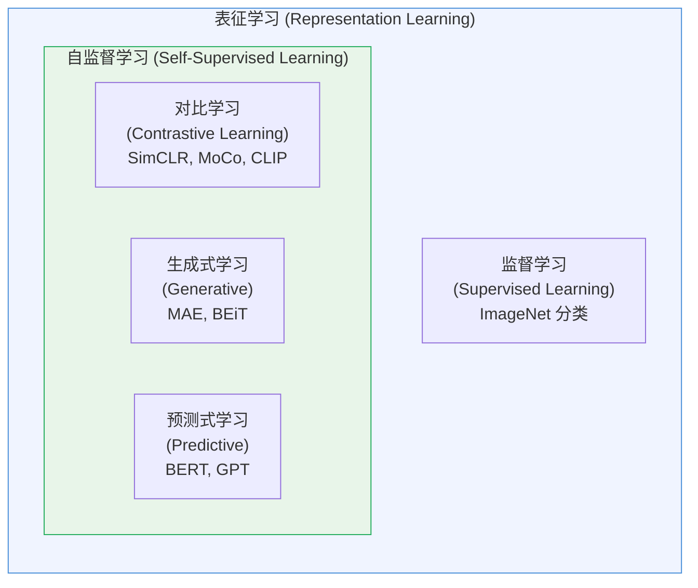
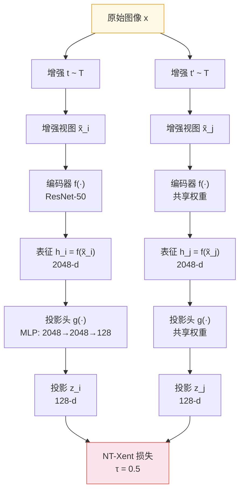
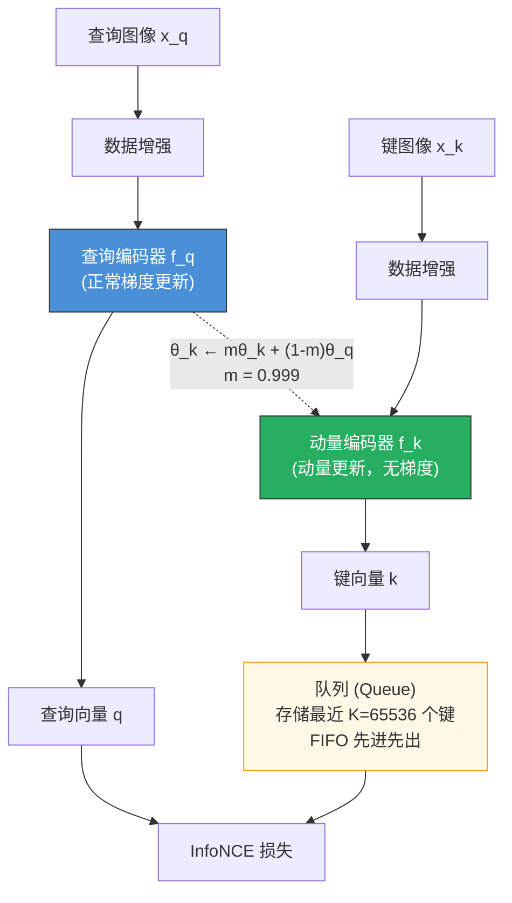
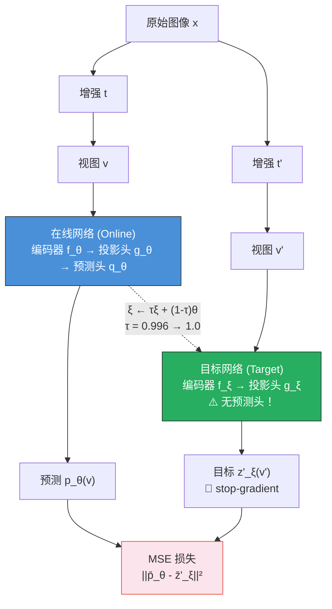
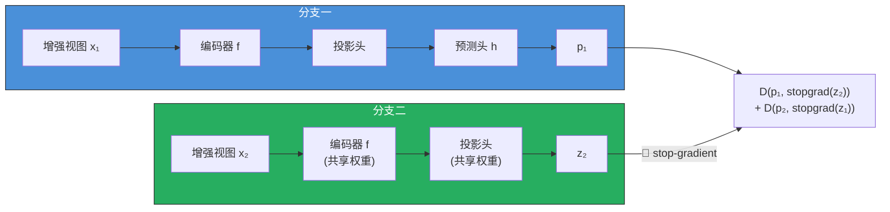
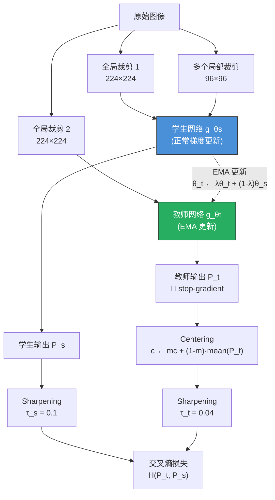
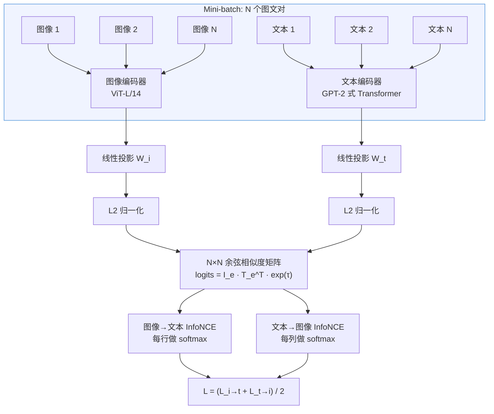
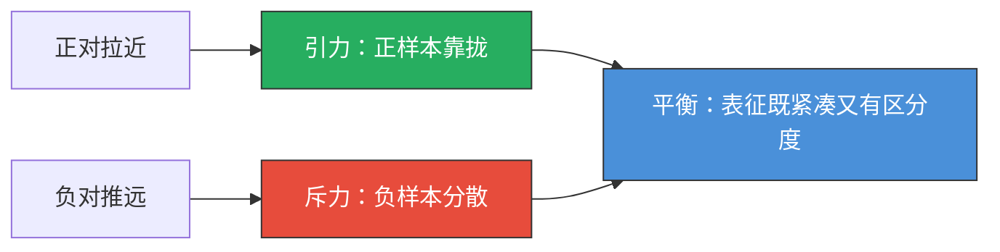
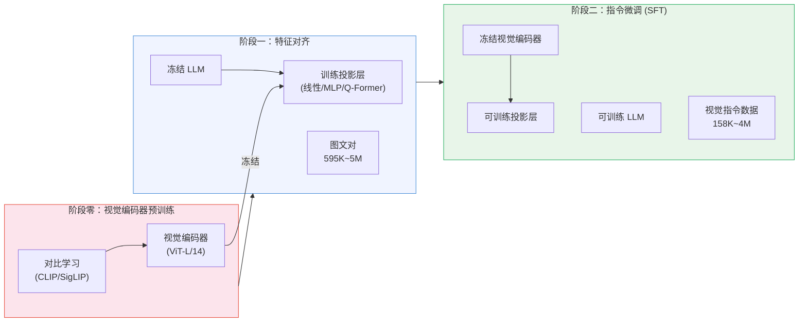
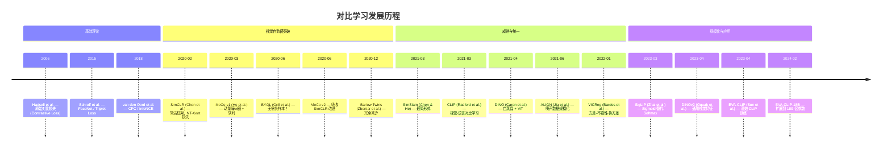

# 对比学习（Contrastive Learning）详解

> 对比学习是自监督学习的核心范式之一——它不需要人工标注，而是通过"拉近相似样本、推远不相似样本"来学习有意义的表征。从 SimCLR 到 CLIP，对比学习彻底改变了视觉表征学习和多模态理解的面貌。

## 关键概念

| 概念 | 含义 |
|------|------|
| 对比学习（Contrastive Learning） | 通过比较正样本对和负样本对之间的相似性来学习表征，核心思想是"相似的拉近，不相似的推远" |
| 自监督学习（Self-Supervised Learning） | 不依赖人工标注，利用数据自身结构构造监督信号的学习范式 |
| 表征学习（Representation Learning） | 学习将原始数据映射为紧凑且语义丰富的向量表示 |
| 正样本对（Positive Pair） | 语义相同的两个样本（如同一图片的两种增强视图、匹配的图文对） |
| 负样本对（Negative Pair） | 语义不同的两个样本（如不同图片的增强视图、不匹配的图文对） |
| InfoNCE 损失 | 基于噪声对比估计的损失函数，对比学习中最核心的目标函数 |
| 投影头（Projection Head） | 编码器之上的 MLP 网络，将表征映射到对比损失计算的空间 |
| 表征坍缩（Representation Collapse） | 模型输出退化为常数向量的病理现象，是对比学习需要解决的核心挑战 |
| 温度参数（Temperature $\tau$） | 控制相似度分布锐度的超参数，影响模型对困难负样本的关注程度 |
| 动量编码器（Momentum Encoder） | 通过指数移动平均更新参数的编码器，提供稳定的负样本表征 |

## 详细笔记

### 一、核心概念：什么是对比学习？

#### 直觉理解

想象你是一个刚出生的婴儿，没有人告诉你"这是猫"、"这是狗"。但你通过**观察**逐渐发现：同一只猫从不同角度看虽然像素完全不同，但它们是"同一个东西"；而猫和狗虽然都是四条腿的毛茸茸动物，但它们是"不同的东西"。这种"不依赖标签，通过比较来学习区分事物"的能力，就是对比学习要做的事情。

更具体地说：
- **正样本对**：同一张图片经过不同数据增强（裁剪、翻转、颜色变换）后的两个版本 → 应该有相似的表征
- **负样本对**：不同图片的增强版本 → 应该有不同的表征

通过大量这样的比较，模型被迫学会**忽略低层次的视觉差异（角度、光照、裁剪）**，而关注**高层次的语义信息（这是一只猫、这是一辆车）**。

#### 对比学习与自监督学习、表征学习的关系



**三者关系**：
- **表征学习**是最上层的概念——学习从原始数据到有用向量表示的映射
- **自监督学习**是表征学习的一种方式——不依赖人工标签，从数据本身构造监督信号
- **对比学习**是自监督学习中最成功的范式之一——通过正负样本的比较来学习表征

#### 为什么对比学习重要？

| 对比项 | 监督学习 | 对比学习（自监督） |
|--------|:--------:|:------------------:|
| 标注需求 | 大量人工标注（ImageNet: 1400 万标签） | **零标注** |
| 任务泛化 | 与标签类别绑定（1000 类分类） | 学习通用表征，迁移到任意下游任务 |
| 数据利用 | 只能利用标注数据 | 能利用互联网上海量无标注数据 |
| 表征质量 | 可能过拟合于特定分类任务 | 更通用、更鲁棒的语义表征 |

2020 年以来，对比学习在以下方面取得了突破：
1. **视觉表征**：SimCLR、MoCo 等方法在 ImageNet 线性评估上接近甚至超过监督预训练
2. **多模态对齐**：CLIP 通过图文对比学习实现了零样本视觉识别的范式转变
3. **多模态 LLM 基石**：CLIP/SigLIP 训练的视觉编码器成为 LLaVA、Qwen-VL 等模型的标准视觉骨干

---

### 二、数学基础

#### 2.1 原始对比损失（Contrastive Loss）

最早由 Hadsell et al. (2006) 在 "Dimensionality Reduction by Learning an Invariant Mapping" 中提出，用于学习降维映射：

$$\mathcal{L} = (1-y) \cdot \|f(x_1) - f(x_2)\|^2 + y \cdot \max\big(0,\; m - \|f(x_1) - f(x_2)\|\big)^2$$

其中：
- $f(\cdot)$：编码器网络，将输入映射为向量表征
- $x_1, x_2$：一对输入样本
- $y \in \{0, 1\}$：标签。$y=0$ 表示正样本对（相似），$y=1$ 表示负样本对（不相似）
- $m > 0$：边界超参数（margin），规定负样本对之间的最小距离
- $\|\cdot\|$：欧氏距离

**直觉解释**：
- 当 $y=0$（正对）：损失 $= \|f(x_1) - f(x_2)\|^2$，迫使相似样本在嵌入空间中**靠近**
- 当 $y=1$（负对）：损失 $= \max(0, m - \|f(x_1) - f(x_2)\|)^2$，只有当负样本距离**小于** $m$ 时才产生惩罚，一旦距离够远就不再施加梯度

**局限性**：只处理成对关系，每次只比较两个样本，无法同时利用大量负样本的信息。

#### 2.2 三元组损失（Triplet Loss）

由 Schroff et al. (2015) 在 FaceNet 中提出，引入了"锚点-正例-负例"三元组结构：

$$\mathcal{L} = \max\big(0,\; \|f(a) - f(p)\|^2 - \|f(a) - f(n)\|^2 + \alpha\big)$$

其中：
- $a$：锚点样本（anchor）
- $p$：正例样本（positive）——与锚点属于同一类
- $n$：负例样本（negative）——与锚点属于不同类
- $\alpha > 0$：边界值（margin）

**几何含义**：要求锚点到正例的距离**至少比**锚点到负例的距离**小** $\alpha$：

$$\|f(a) - f(p)\|^2 + \alpha < \|f(a) - f(n)\|^2$$

**三元组挖掘策略**：
- **简单三元组（Easy Triplet）**：$\|f(a)-f(p)\|^2 + \alpha < \|f(a)-f(n)\|^2$，已满足约束，梯度为零
- **困难三元组（Hard Triplet）**：$\|f(a)-f(n)\|^2 < \|f(a)-f(p)\|^2$，负例比正例还近
- **半困难三元组（Semi-Hard Triplet）**：$\|f(a)-f(p)\|^2 < \|f(a)-f(n)\|^2 < \|f(a)-f(p)\|^2 + \alpha$，介于两者之间

FaceNet 发现使用**半困难三元组**训练效果最佳——太简单的三元组提供不了有用的梯度，太困难的三元组则导致训练不稳定。

#### 2.3 InfoNCE 损失（完整推导）

InfoNCE（Noise-Contrastive Estimation）由 van den Oord et al. (2018) 在 CPC（Contrastive Predictive Coding）论文中提出，是现代对比学习的**核心损失函数**。

##### 出发点：互信息最大化

对比学习的理论目标是最大化正样本对之间的**互信息**：

$$I(X; Y) = \sum_{x,y} p(x,y) \log \frac{p(x,y)}{p(x)p(y)} = \mathbb{E}_{p(x,y)} \left[\log \frac{p(x|y)}{p(x)}\right]$$

互信息衡量了"知道 $Y$ 后，对 $X$ 的不确定性减少了多少"。在对比学习中：
- $X$ 和 $Y$ 分别是同一数据的两个增强视图
- 最大化 $I(X;Y)$ 意味着让两个视图的表征尽可能共享相同的语义信息

但直接计算互信息需要知道联合分布 $p(x,y)$，这在高维空间中是 intractable 的。

##### 推导过程

**第一步：构造判别任务**

给定一个正样本 $x^+$（与查询 $q$ 配对）和 $K-1$ 个负样本 $\{x^-_1, \dots, x^-_{K-1}\}$（独立采样），构造一个 $K$ 路分类问题：从 $K$ 个候选中识别出正样本。

**第二步：定义分类概率**

使用可学习的评分函数 $f(q, x)$（如向量内积或余弦相似度），正样本被正确识别的概率为：

$$p(\text{positive} = x^+ \mid q, \{x^+, x^-_1, \dots, x^-_{K-1}\}) = \frac{\exp(f(q, x^+))}{\exp(f(q, x^+)) + \sum_{k=1}^{K-1}\exp(f(q, x^-_k))}$$

**第三步：最大化对数似然**

取负对数得到 InfoNCE 损失：

$$\mathcal{L}_{\text{InfoNCE}} = -\log \frac{\exp\big(\text{sim}(z_i, z_j) / \tau\big)}{\sum_{k=1}^{K} \exp\big(\text{sim}(z_i, z_k) / \tau\big)}$$

其中：
- $z_i, z_j$ 是正样本对的表征向量
- $z_k$ 遍历所有候选（1 个正样本 + $K-1$ 个负样本）
- $\text{sim}(u, v) = \frac{u^\top v}{\|u\| \cdot \|v\|}$ 是余弦相似度
- $\tau > 0$ 是温度参数

**第四步：与互信息的联系**

van den Oord et al. 证明了 InfoNCE 损失提供了互信息的**下界**：

$$I(X; Y) \geq \log K - \mathcal{L}_{\text{InfoNCE}}$$

即：

$$\mathcal{L}_{\text{InfoNCE}} \geq \log K - I(X; Y)$$

这意味着**最小化 InfoNCE 损失等价于最大化互信息的下界**。且这个下界随负样本数量 $K$ 的增加而变紧——更多的负样本使得互信息估计更准确。这从理论上解释了为什么**更多负样本（更大 batch size）能提升对比学习的效果**。

##### 关于下界的理解

当 $K \to \infty$ 时，InfoNCE 的下界趋近于真实互信息，但永远不会超过 $\log K$。这意味着：
- 如果真实互信息很大（如 $I(X;Y) = 100$ nats），但只用 $K = 1000$ 个负样本，下界最多只能达到 $\log 1000 \approx 6.9$ nats
- 这就是为什么 SimCLR 需要 batch size 4096-8192，CLIP 需要 batch size 32768——**更大的 $K$ 才能捕获更大的互信息**

#### 2.4 NT-Xent 损失（SimCLR 使用的变体）

NT-Xent（Normalized Temperature-scaled Cross-Entropy）是 SimCLR 对 InfoNCE 的具体实现形式。

给定一个包含 $N$ 个样本的 mini-batch，经过数据增强生成 $2N$ 个样本。对于第 $i$ 个样本，设第 $j$ 个是它的正样本（同一图片的另一个增强视图），则损失为：

$$\ell_{i,j} = -\log \frac{\exp\big(\text{sim}(z_i, z_j) / \tau\big)}{\sum_{k=1}^{2N} \mathbb{1}_{[k \neq i]} \exp\big(\text{sim}(z_i, z_k) / \tau\big)}$$

总损失对所有 $2N$ 个样本的所有正对取平均：

$$\mathcal{L}_{\text{NT-Xent}} = \frac{1}{2N} \sum_{k=1}^{N} \left[\ell_{2k-1, 2k} + \ell_{2k, 2k-1}\right]$$

**NT-Xent 与 InfoNCE 的关系**：
- NT-Xent 本质上就是 InfoNCE，但：
  1. 使用 **L2 归一化后的余弦相似度**而非原始内积
  2. 分母中**排除自身**（$\mathbb{1}_{[k \neq i]}$），即正样本只与同一 batch 的其他 $2N-2$ 个负样本比较
  3. 对称地计算两个方向的损失

#### 2.5 温度参数 $\tau$：为什么重要？

温度 $\tau$ 对对比学习的训练动态有**深远影响**。

**数学分析**：

考虑 softmax 中的相似度分数 $s_k = \text{sim}(z_i, z_k) / \tau$，温度 $\tau$ 控制了分布的"锐度"：

$$p_k = \frac{\exp(s_k / \tau)}{\sum_j \exp(s_j / \tau)}$$

- **$\tau \to 0$（低温度）**：分布趋向 one-hot，模型几乎只关注最困难的负样本（与正样本最相似的负样本）。梯度集中在少数困难样本上，训练更具辨别性但可能不稳定
- **$\tau \to \infty$（高温度）**：分布趋向均匀分布，所有负样本被同等对待。梯度分布均匀，训练更平滑但区分度降低
- **适中 $\tau$**：在"关注困难样本"和"训练稳定性"之间取得平衡

**梯度分析**：

Wang & Liu (2021) 的分析表明，温度 $\tau$ 直接影响梯度如何在不同负样本之间分配权重：

$$\frac{\partial \mathcal{L}}{\partial z_i} \propto \sum_k w_k \cdot \frac{\partial \text{sim}(z_i, z_k)}{\partial z_i}$$

其中权重 $w_k \propto \exp(\text{sim}(z_i, z_k) / \tau)$。低温度使 $w_k$ 更集中于高相似度的（困难）负样本，高温度使 $w_k$ 更均匀。

**典型温度值**：

| 方法 | 温度 $\tau$ | 说明 |
|------|:-----------:|------|
| SimCLR | 0.5 | 视觉自监督，相对较高 |
| MoCo v2 | 0.07 | 视觉自监督，较低 |
| CLIP | 0.07（初始） | 可学习温度，裁剪上界 $\exp(\tau) \leq 100$ |
| SigLIP | 可学习 | 使用 sigmoid 损失，温度含义不同 |

---

### 三、关键方法——视觉自监督

#### 3.1 SimCLR（Chen et al., 2020）

> A Simple Framework for Contrastive Learning of Visual Representations

SimCLR 以其**极致的简洁性**成为对比学习的里程碑——整个框架只有四个组件：数据增强、编码器、投影头、对比损失。

##### 架构



##### 数据增强流水线

SimCLR 最重要的发现之一是：**数据增强的选择比模型架构更重要**。

```
输入图像 → Random Resized Crop (224×224) → Random Horizontal Flip
         → Random Color Jitter (p=0.8)
           - 亮度: 0.4, 对比度: 0.4, 饱和度: 0.4, 色调: 0.1
         → Random Grayscale (p=0.2)
         → Random Gaussian Blur (p=0.5, σ ∈ [0.1, 2.0])
```

**关键消融发现**：
- Random Crop + Color Jitter 的组合**至关重要**——单独使用任何一种增强，性能大幅下降
- 原因：如果只做随机裁剪，模型可以通过颜色直方图这种"捷径"来匹配正对，而不需要真正理解语义
- 加上颜色抖动后，颜色信息被破坏，模型被迫学习更高层次的语义特征

##### 投影头（Projection Head）

SimCLR 的另一个关键发现：在编码器 $f$ 之上添加一个非线性投影头 $g$，在投影空间 $z = g(h)$ 上计算对比损失，但评估时使用**投影头之前的表征 $h$**。

$$g(h) = W^{(2)} \sigma(W^{(1)} h)$$

其中 $\sigma$ 是 ReLU 激活函数。

**为什么投影头有效？**

| 使用表征 | ImageNet Top-1（线性评估） |
|----------|:--------------------------:|
| $h$（编码器输出，无投影头） | 63.6% |
| $z$（投影头输出，线性） | 61.7% |
| $z$（投影头输出，非线性 MLP） | 64.7% |
| $h$（编码器输出，有非线性投影头） | **66.6%** |

最佳方案是：用非线性投影头计算损失，但评估时用投影头**之前**的 $h$。

**直觉解释**：对比损失鼓励表征对增强不变，这会**丢弃与增强相关的信息**（如颜色、纹理细节）。投影头 $g$ 充当"信息过滤器"——它将增强相关的信息丢弃在 $z$ 空间，而 $h$ 空间保留了更完整的语义信息，适用于更广泛的下游任务。

##### 大 Batch Size 的重要性

| Batch Size | Top-1（线性评估, 100 epochs） |
|:----------:|:----------------------------:|
| 256 | 58.2% |
| 512 | 60.6% |
| 1024 | 62.8% |
| 2048 | 64.3% |
| 4096 | **66.6%** |
| 8192 | 66.5% |

**原因**：更大的 batch 提供更多负样本，使 InfoNCE 对互信息的下界估计更紧。每个正对需要与尽可能多的负样本比较，才能学到真正有区分度的表征。

##### 训练细节

| 超参数 | 值 |
|--------|-----|
| 编码器 | ResNet-50 |
| 投影头 | 2 层 MLP, 2048 → 2048 → 128 |
| Batch Size | 4096 |
| 训练 Epochs | 100 (或 1000) |
| 优化器 | LARS |
| 学习率 | $4.8 = 0.3 \times \text{BatchSize} / 256$ |
| 学习率调度 | Linear Warmup (10 epochs) + Cosine Decay |
| 权重衰减 | $10^{-6}$ |
| 温度 $\tau$ | 0.5 |
| 硬件 | 32-128 TPU v3 |

#### 3.2 MoCo v1/v2/v3（He et al., 2020-2021）

> Momentum Contrast for Unsupervised Visual Representation Learning

MoCo 的核心洞察：对比学习本质上是在做**字典查找**（dictionary look-up），好的对比学习需要一个**大且一致**的字典。

##### MoCo v1 的核心设计



**动量更新机制**：

$$\theta_k \leftarrow m \cdot \theta_k + (1 - m) \cdot \theta_q$$

其中 $m = 0.999$（非常接近 1）。这意味着动量编码器的参数**非常缓慢地**跟随查询编码器更新。

**为什么用动量更新而非端到端训练？**

对比学习需要大量负样本，但端到端训练（如 SimCLR）要求所有负样本在**同一个前向传播中**生成，导致：
1. 需要**极大的 batch size**（SimCLR: 4096-8192），对硬件要求极高
2. 所有负样本的编码器参数**完全一致**（同一步的参数），这很好但很贵

MoCo 的解决方案：用**队列**存储历史负样本键，将字典大小与 batch size 解耦。但队列中不同时间步的键是用不同参数的编码器生成的，如果编码器参数变化太快，队列中的旧键就**不一致**了。

**动量更新的精妙之处**：$m = 0.999$ 确保编码器参数**极其缓慢地**变化，即使队列中存储了 65536 个步骤的键，最旧和最新的键之间的编码器参数差异也非常小——保证了字典的一致性。

| 方法 | 字典大小 | Batch Size 需求 | 一致性 |
|------|:--------:|:---------------:|:------:|
| 端到端（SimCLR） | = Batch Size | 4096-8192 | 完美 |
| Memory Bank | 整个数据集 | 任意 | 差（参数更新快） |
| **MoCo（队列 + 动量）** | **65536**（可配置） | **256** | **好** |

##### MoCo v1 → v2 → v3 的演进

| 版本 | 年份 | 关键改进 | 骨干网络 | ImageNet Top-1（线性评估） |
|------|:----:|----------|:--------:|:--------------------------:|
| MoCo v1 | 2020 | 队列 + 动量编码器 | ResNet-50 | 60.6% |
| MoCo v2 | 2020 | + MLP 投影头 + 更强增强 + cosine 调度 | ResNet-50 | 71.1% |
| MoCo v3 | 2021 | + ViT 骨干 + 对称损失（SimSiam 式） | ViT-B/16 | 76.7% |

**MoCo v2 的改进**（吸收了 SimCLR 的发现）：
1. 将单层线性投影头替换为 **2 层 MLP 投影头**
2. 添加**高斯模糊**增强
3. 使用 **Cosine 学习率调度**

仅这三个改进就将 Top-1 从 60.6% 提升到 71.1%（+10.5%），显示了投影头和数据增强的巨大影响。

**MoCo v3 的改进**：
1. 骨干网络从 ResNet 扩展到 **ViT**
2. 去掉了队列机制，改用 **SimSiam 式对称损失**
3. 重点研究了 ViT 在自监督训练中的不稳定性问题（通过冻结 patch embedding 层解决）

#### 3.3 BYOL（Grill et al., 2020）

> Bootstrap Your Own Latent: A New Approach to Self-Supervised Learning

BYOL 的最大突破：**完全不需要负样本**，照样能学到优秀的表征。这打破了"对比学习必须有负样本"的常识。

##### 架构



**BYOL 的损失函数**：

$$\mathcal{L}_{\text{BYOL}} = 2 - 2 \cdot \frac{\langle p_\theta(v), \; \text{sg}(z'_\xi(v')) \rangle}{\|p_\theta(v)\| \cdot \|z'_\xi(v')\|}$$

等价于 L2 归一化后的 MSE：$\|\bar{p}_\theta - \bar{z}'_\xi\|^2$，其中 $\bar{x} = x / \|x\|$。

**关键组件**：
1. **预测头（Predictor）$q_\theta$**：只存在于在线网络，是一个额外的 MLP
2. **Stop-gradient**：目标网络的输出不传播梯度
3. **动量更新**：$\xi \leftarrow \tau \xi + (1-\tau)\theta$，$\tau$ 从 0.996 余弦调度到 1.0

##### 为什么 BYOL 不坍缩？

这是对比学习领域最引人入胜的问题之一。没有负样本来"推开"不同样本的表征，为什么所有样本不直接映射到同一个点？

**三个互补的解释**：

**解释一：非对称架构打破平衡**

预测头 $q_\theta$ 只在在线网络中，目标网络没有。如果去掉预测头，BYOL 立即坍缩。直觉：预测头让在线网络需要"多做一步工作"来匹配目标网络，这种不对称性打破了坍缩解的稳定性。

**解释二：Stop-gradient 阻止了坍缩梯度**

如果没有 stop-gradient，两个网络可以通过**互相靠拢到同一个常数向量**来最小化损失。Stop-gradient 把优化分解成两个子问题：
- 在线网络优化 $\theta$ 以预测目标网络的输出（固定的目标）
- 目标网络通过 EMA 缓慢跟随在线网络

这类似于 **Expectation-Maximization（EM 算法）**：E 步固定目标计算期望，M 步更新参数。

**解释三：Batch Normalization 的隐含作用**

早期研究发现去掉 BN 会导致 BYOL 坍缩。BN 隐含地引入了 batch 内样本之间的**统计依赖**——它强制每个 batch 的特征均值为 0、方差为 1，这本身就阻止了所有样本映射到同一个点。但后续研究表明，适当设置超参数后，没有 BN 的 BYOL 也能工作。

##### BYOL 的性能

| 方法 | ImageNet Top-1（线性评估） | 需要负样本？ |
|------|:--------------------------:|:------------:|
| SimCLR | 69.3% (1000 epochs) | 是 |
| MoCo v2 | 71.1% (800 epochs) | 是 |
| **BYOL** | **74.3% (1000 epochs)** | **否** |

BYOL 不仅不需要负样本，性能还超过了需要负样本的方法。

#### 3.4 SimSiam（Chen & He, 2021）

> Exploring Simple Siamese Representation Learning

SimSiam 是 BYOL 的**极致简化版**——去掉动量编码器，证明 **stop-gradient 是避免坍缩的唯一必要条件**。

##### 架构



**SimSiam 的损失**：

$$\mathcal{L} = \frac{1}{2} D(p_1, \text{stopgrad}(z_2)) + \frac{1}{2} D(p_2, \text{stopgrad}(z_1))$$

其中 $D(p, z) = -\frac{p}{\|p\|} \cdot \frac{z}{\|z\|}$（负余弦相似度）。

**与 BYOL 的关键区别**：
- 没有动量编码器——两个分支使用**完全相同的权重**
- 没有动量更新——参数直接通过梯度更新
- **唯一的"魔法"是 stop-gradient**

##### Stop-gradient 的消融实验

| 配置 | 坍缩？ | KNN Top-1 |
|------|:------:|:---------:|
| 完整 SimSiam | 否 | 67.7% |
| 去掉 stop-gradient | **是** | 无意义 |
| 去掉预测头 | **是** | 无意义 |
| 去掉 stop-gradient + 预测头 | **是** | 无意义 |

**假说**：SimSiam 隐式地实现了 EM 算法。设 $\eta$ 为表征的期望，则 SimSiam 的优化可以分解为：
- **E 步**：固定 $\theta$，更新 $\eta$（对应 stop-gradient 分支）
- **M 步**：固定 $\eta$，更新 $\theta$（对应有梯度的分支）

这种交替优化天然避免了坍缩——因为 $\eta$ 不是通过梯度下降到达的，而是通过统计估计得到的。

#### 3.5 DINO（Caron et al., 2021）

> Emerging Properties in Self-Supervised Vision Transformers

DINO 将对比学习重新解释为**自蒸馏（Self-Distillation）**，并首次揭示了自监督 ViT 的惊人特性。

##### 架构



##### DINO 的损失函数

$$\mathcal{L}_{\text{DINO}} = \sum_{x \in \{x_1^g, x_2^g\}} \sum_{\substack{x' \in V \\ x' \neq x}} H\big(P_t(x), P_s(x')\big)$$

其中 $V$ 是所有视图（2 个全局 + 多个局部），$H$ 是交叉熵：

$$H(P_t, P_s) = -\sum_k P_t^{(k)} \log P_s^{(k)}$$

教师和学生的输出概率：

$$P_s(x)^{(k)} = \frac{\exp(g_{\theta_s}(x)^{(k)} / \tau_s)}{\sum_{k'} \exp(g_{\theta_s}(x)^{(k')} / \tau_s)}$$

$$P_t(x)^{(k)} = \frac{\exp\big((g_{\theta_t}(x)^{(k)} - c^{(k)}) / \tau_t\big)}{\sum_{k'} \exp\big((g_{\theta_t}(x)^{(k')} - c^{(k')}) / \tau_t\big)}$$

##### Centering + Sharpening 防止坍缩

DINO 没有使用负样本（与 BYOL、SimSiam 类似），而是用 **centering + sharpening** 组合防止坍缩：

1. **Centering**：减去教师输出的指数移动平均中心 $c$
   - $c \leftarrow m \cdot c + (1 - m) \cdot \frac{1}{B}\sum_{i=1}^B g_{\theta_t}(x_i)$
   - 防止某一维度主导，但倾向于使分布趋向均匀分布
2. **Sharpening**：教师网络使用极低温度 $\tau_t = 0.04$（远低于学生的 $\tau_s = 0.1$）
   - 使教师的输出分布更加尖锐（接近 one-hot）
   - 与 centering 的效果互补——centering 防止坍缩到一个点，sharpening 防止坍缩到均匀分布

##### DINO 的特殊发现

自监督 ViT（DINO 训练）的注意力图展现出**惊人的语义分割能力**——[CLS] token 的自注意力图自动学会了区分前景物体和背景，无需任何像素级标注。这种"涌现属性"在监督训练的 ViT 或卷积网络中**不会出现**。

---

### 四、关键方法——视觉-语言对比学习

#### 4.1 CLIP（Radford et al., 2021）

> Learning Transferable Visual Models From Natural Language Supervision

CLIP 将对比学习从"单模态视觉"扩展到"跨模态视觉-语言"，彻底改变了视觉模型的训练范式。（详细内容见 [papers/clip.md](../../papers/clip.md)）

##### 核心架构



##### CLIP 对比损失详解

给定 $N$ 个图文对，计算 $N \times N$ 的相似度矩阵：

$$s_{ij} = \frac{I_{e_i}^\top \cdot T_{e_j}}{\|I_{e_i}\| \cdot \|T_{e_j}\|} \cdot \exp(\tau)$$

对称 InfoNCE 损失：

$$\mathcal{L}_{i \to t} = -\frac{1}{N} \sum_{i=1}^{N} \log \frac{\exp(s_{ii})}{\sum_{j=1}^{N} \exp(s_{ij})}$$

$$\mathcal{L}_{t \to i} = -\frac{1}{N} \sum_{j=1}^{N} \log \frac{\exp(s_{jj})}{\sum_{i=1}^{N} \exp(s_{ij})}$$

$$\mathcal{L}_{\text{CLIP}} = \frac{1}{2}(\mathcal{L}_{i \to t} + \mathcal{L}_{t \to i})$$

**$N \times N$ 矩阵的含义**：
- 对角线元素 $s_{ii}$：正确匹配的图文对（正样本）
- 非对角线元素 $s_{ij} (i \neq j)$：错误匹配的图文对（负样本）
- 每个图像有 1 个正文本 + $(N-1)$ 个负文本
- 每个文本有 1 个正图像 + $(N-1)$ 个负图像
- 总共：$N$ 个正对，$N^2 - N$ 个负对

**CLIP 的关键训练细节**：
- Batch Size: **32,768**（极大，提供大量负样本）
- 温度参数 $\tau$：**可学习标量**，初始化为 $\exp(\tau) = 1/0.07 \approx 14.3$
- 数据规模：4 亿图文对（WIT 数据集）
- 训练开销：256 张 V100 GPU 训练 12 天

##### 零样本迁移

CLIP 训练完成后，无需任何标注数据即可做图像分类——将类别名放入文本模板"A photo of a {class name}"，用文本编码器编码后与图像嵌入比较余弦相似度。ViT-L/14@336px 在 ImageNet 上达到 76.2% 的零样本 Top-1——与完全监督训练的 ResNet-50 相当。

#### 4.2 ALIGN（Jia et al., 2021）

> Scaling Up Visual and Vision-Language Representation Learning with Noisy Text Supervision

ALIGN 的核心洞察：**不需要精心清洗的数据，用规模来弥补噪声**。

| 对比 | CLIP | ALIGN |
|------|------|-------|
| 数据规模 | 4 亿对（精心构造） | **18 亿对**（简单过滤） |
| 数据质量 | 高（50 万查询词平衡采样） | 低（互联网 alt-text，含大量噪声） |
| 数据处理 | 复杂采样策略 | 简单的频率过滤 |
| 图像编码器 | ViT-L/14 | EfficientNet-L2 |
| 文本编码器 | GPT-2 式 Transformer | BERT |
| 性能 | ImageNet ZS: 76.2% | ImageNet ZS: 76.4% |

ALIGN 的核心启示：在对比学习中，**数据规模可以补偿数据质量**。只要数据量足够大（18 亿对），即使存在大量噪声和错误匹配的图文对，模型仍然能学到优秀的跨模态表征。

#### 4.3 SigLIP（Zhai et al., 2023）

> Sigmoid Loss for Language Image Pre-Training

SigLIP 的核心创新：用 **sigmoid 损失**替代 CLIP 的 softmax 损失，从根本上改变了对比学习的问题定义。

##### Softmax vs. Sigmoid 损失

**CLIP（Softmax/InfoNCE）**——多分类问题：
- "这张图像匹配 $N$ 个文本中的哪一个？"
- 需要在整个 batch 维度上做归一化：$\text{softmax}(s_{i1}, s_{i2}, \dots, s_{iN})$
- **要求所有 GPU 共享完整的 $N \times N$ 相似度矩阵**

**SigLIP（Sigmoid）**——二分类问题：
- "这个图文对是否匹配？"——对每对独立判断
- 每对独立计算：$\sigma(s_{ij} \cdot y_{ij})$，其中 $y_{ij} = 1$（匹配）或 $y_{ij} = -1$（不匹配）
- **不需要跨样本归一化**

SigLIP 的损失函数：

$$\mathcal{L}_{\text{SigLIP}} = -\frac{1}{N^2} \sum_{i=1}^{N} \sum_{j=1}^{N} \log \sigma\big(y_{ij} \cdot (s_{ij} \cdot \exp(\tau) + b)\big)$$

其中：
- $y_{ij} = \begin{cases} 1 & \text{if } i = j \text{（正对）} \\ -1 & \text{if } i \neq j \text{（负对）} \end{cases}$
- $\tau$：可学习温度参数
- $b$：可学习偏置项

##### SigLIP 的优势

| 特性 | CLIP (Softmax) | SigLIP (Sigmoid) |
|------|:--------------:|:----------------:|
| 归一化方式 | 全局 softmax（需要完整 $N \times N$ 矩阵） | 逐对独立（无需全局视图） |
| 多 GPU 通信 | 需要 all-gather 所有嵌入 | 只需局部计算，通信量更少 |
| 相同硬件下 Batch Size | 2048（4 TPU v4） | **4096**（4 TPU v4） |
| 小 Batch Size 性能 | 差 | **好**（不依赖大 batch 的负样本量） |
| 最优 Batch Size | 32,768+ | ~32,768（但 16K 已很好） |

##### SigLIP 在多模态 LLM 中的应用

SigLIP（特别是 SigLIP-So400m 变体）已成为新一代多模态 LLM 的首选视觉编码器：

| 模型 | 视觉编码器 |
|------|:----------:|
| PaliGemma | SigLIP-So400m |
| InternVL / InternVL-1.5 | InternViT（SigLIP 损失训练） |
| Cambrian-1 | SigLIP + DINOv2 融合 |

#### 4.4 EVA-CLIP 与 OpenCLIP

**OpenCLIP**：CLIP 的开源复现项目，使用公开数据集（LAION-2B、LAION-5B）训练。提供了 CLIP 风格模型的开源生态系统。

**EVA-CLIP**（Sun et al., 2023）：通过一系列训练技巧大幅提升 CLIP 效率：
- 从 **Masked Image Modeling（MAE/EVA）预训练**初始化视觉编码器
- 使用 **LAMB 优化器**
- **FLIP 式图像 token 掩码**（训练时随机丢弃 50% 的图像 patch）
- 集成 **FlashAttention**

关键结果：EVA-02-CLIP-L 以仅 **1/6 的参数和 1/6 的训练数据**就超过了 OpenCLIP-G/14（80.4% vs. 80.1% ImageNet ZS）。EVA-CLIP-18B（2024）更进一步，在 27 个分类基准上平均达到 80.7% 零样本 Top-1。

---

### 五、正/负样本对构建

正负样本对的构建方式**直接决定了模型学到什么样的表征**——选择什么作为"相似"和"不相似"，就定义了模型的**不变性（invariance）**。

#### 5.1 视觉自监督中的正/负对

**正样本对构建**：

同一图片 $x$ 经过两次独立采样的数据增强 $t_1, t_2 \sim \mathcal{T}$ 得到两个视图 $\tilde{x}_1 = t_1(x), \tilde{x}_2 = t_2(x)$。这两个视图构成一个正对。

关键洞察：**增强策略定义了模型的不变性**。
- 使用颜色抖动 → 模型学会对颜色变化不变
- 使用随机裁剪 → 模型学会对位置和尺度变化不变
- 使用高斯模糊 → 模型学会对纹理细节不变
- 如果**不使用**某种增强，模型可能会对该属性敏感（这可能正是你需要的）

**负样本对构建**：

同一 batch 中**不同图像**的增强视图互为负对。

#### 5.2 视觉-语言中的正/负对

| 正样本 | 负样本 |
|--------|--------|
| 匹配的图文对 $(I_i, T_i)$ | 不匹配的图文对 $(I_i, T_j)$ 或 $(I_j, T_i)$，$i \neq j$ |

CLIP 的巧妙之处：不需要显式构造负样本，同一 batch 内的其他样本自动成为负样本。

#### 5.3 困难负样本挖掘（Hard Negative Mining）

**问题**：大部分负样本对模型来说是"太简单了"——猫的图片和飞机的文本描述很容易区分，模型不需要学到精细的语义就能判断。真正推动模型学习的是**困难负样本**——语义接近但不完全相同的样本。

**困难负样本的例子**：
- 视觉："一只金毛犬" vs. "一只拉布拉多犬"
- 视觉-语言："一个男人在打网球" vs. "一个女人在打网球"的图文

**主要技术**：
1. **基于相似度的挖掘**：选择嵌入空间中与锚点最接近的负样本
2. **课程学习**：训练初期用简单负样本，后期逐渐增加困难负样本
3. **更大 Batch Size**：batch 越大，包含困难负样本的概率越高

#### 5.4 假负样本问题（False Negatives）

**问题定义**：当 batch 中两张不同的图片碰巧包含**相同语义**的内容时（如两张都是猫的照片），它们会被错误地当作负样本处理。这会给模型发送矛盾的信号——"这两只猫的表征应该远离彼此"。

**影响**：
- 在 ImageNet（1000 类，128 万张图）中，batch size 4096 时，约有 0.4% 的"负样本"实际上是同类样本
- 在大规模互联网数据中，语义重复更加严重

**缓解方法**：
1. **软标签**：不用硬 0/1 标签，而用基于特征相似度的连续标签
2. **原型学习**（Prototypical Contrastive Learning）：先聚类，同一聚类内的样本不作为负对
3. **SigLIP 的天然优势**：sigmoid 损失对假负样本更鲁棒，因为每对独立计算，单个假负样本不会通过 softmax 归一化影响其他所有对

---

### 六、避免表征坍缩

表征坍缩是对比学习面临的最核心挑战——理解坍缩以及各方法如何解决它，是理解整个领域的关键。

#### 6.1 什么是表征坍缩？

**完全坍缩（Complete Collapse）**：所有输入被映射到嵌入空间中的**同一个点**。

$$f(x) = c, \quad \forall x$$

如果所有样本的表征相同，正样本对的距离为零（损失为零），看似"完美"，但表征完全没有语义区分度。

**维度坍缩（Dimensional Collapse）**：表征向量只使用了嵌入空间的少数几个维度，其余维度携带的信息为零。表征看起来不同，但实际有效维度远低于标称维度。

#### 6.2 对比方法：用负样本防坍缩



SimCLR、MoCo、CLIP 等对比方法通过负样本提供"斥力"——如果所有表征坍缩到同一个点，负对的损失会变得极大（被强制推开），从而阻止坍缩。

#### 6.3 非对比方法：不用负样本的防坍缩策略

| 方法 | 防坍缩机制 | 核心思想 |
|------|------------|----------|
| **BYOL** | 预测头 + Stop-gradient + 动量更新 | 非对称架构打破坍缩解的稳定性 |
| **SimSiam** | 预测头 + Stop-gradient | Stop-gradient 实现隐式 EM 算法 |
| **Barlow Twins** | 冗余减少（Redundancy Reduction） | 使特征维度之间的相关性矩阵趋近单位矩阵 |
| **VICReg** | 方差 + 不变性 + 协方差正则化 | 显式控制表征的三个统计性质 |
| **DINO** | Centering + Sharpening | 中心化防止坍缩到一个点，锐化防止坍缩到均匀分布 |

#### 6.4 Barlow Twins（Zbontar et al., 2021）

> Barlow Twins: Self-Supervised Learning via Redundancy Reduction

灵感来自神经科学家 H. Barlow 的冗余减少假说——大脑的目标是最小化神经元输出之间的冗余。

**损失函数**：

$$\mathcal{L}_{\text{BT}} = \sum_i (1 - \mathcal{C}_{ii})^2 + \lambda \sum_i \sum_{j \neq i} \mathcal{C}_{ij}^2$$

其中 $\mathcal{C}$ 是两个分支输出 $Z^A, Z^B$ 之间的**互相关矩阵**（cross-correlation matrix）：

$$\mathcal{C}_{ij} = \frac{\sum_b z^A_{b,i} \cdot z^B_{b,j}}{\sqrt{\sum_b (z^A_{b,i})^2} \cdot \sqrt{\sum_b (z^B_{b,j})^2}}$$

$\mathcal{C} \in \mathbb{R}^{d \times d}$，$d$ 是嵌入维度，$b$ 遍历 batch 中的样本。

**两项的含义**：
1. **不变性项** $\sum_i (1 - \mathcal{C}_{ii})^2$：让对角线元素趋近 1 → 同一维度在两个视图中的相关性最大 → 表征对增强不变
2. **冗余减少项** $\lambda \sum_i \sum_{j \neq i} \mathcal{C}_{ij}^2$：让非对角线元素趋近 0 → 不同维度之间去相关 → 防止维度坍缩

**目标**：$\mathcal{C} \to I$（单位矩阵）。

#### 6.5 VICReg（Bardes et al., 2022）

> VICReg: Variance-Invariance-Covariance Regularization for Self-Supervised Learning

VICReg 将防坍缩机制分解为三个**显式**且**可独立理解**的正则化项：

$$\mathcal{L}_{\text{VICReg}} = \lambda \cdot v(Z) + \mu \cdot s(Z, Z') + \nu \cdot c(Z)$$

**方差项（Variance）**——防止完全坍缩：

$$v(Z) = \frac{1}{d}\sum_{j=1}^{d} \max\big(0,\; \gamma - \sqrt{\text{Var}(z_j) + \epsilon}\big)$$

要求每个维度 $j$ 的标准差**大于阈值** $\gamma$（通常 $\gamma = 1$）。如果所有样本映射到同一点，方差为零，惩罚最大。

**不变性项（Invariance）**——正对对齐：

$$s(Z, Z') = \frac{1}{N}\sum_{i=1}^{N} \|z_i - z'_i\|^2$$

同一样本两个视图的表征应该相近。这是标准的 MSE 损失。

**协方差项（Covariance）**——防止维度坍缩：

$$c(Z) = \frac{1}{d} \sum_{i \neq j} [C(Z)]_{ij}^2, \quad C(Z)_{ij} = \frac{1}{N-1}\sum_{n=1}^{N}(z_{n,i} - \bar{z}_i)(z_{n,j} - \bar{z}_j)$$

最小化不同维度之间的协方差，鼓励每个维度编码独立信息。

**VICReg 的优势**：
- 不要求两个分支相同或相似（可以用不同架构）
- 不需要归一化操作（如 BN）
- 三个正则化项各自独立、物理意义清晰

#### 6.6 为什么非对比方法能工作？与 EM 的联系

Tian et al. (2021) 在 "Understanding Self-Supervised Learning Dynamics without Contrastive Pairs" 中给出了理论分析。核心思想：

非对比方法（BYOL、SimSiam）可以理解为在优化以下目标：

$$\min_\theta \mathbb{E}_{x, t_1, t_2}\left[\|f_\theta(t_1(x)) - \mathbb{E}_{t_2}[f_\theta(t_2(x))]\|^2\right]$$

即：每个视图的表征应该接近**所有可能增强的平均表征**。

Stop-gradient 的作用是将 $\mathbb{E}_{t_2}[f_\theta(t_2(x))]$（目标网络的输出）视为固定目标，在线网络去拟合这个目标。这等价于 EM 算法中：
- **E 步**：用当前参数估计平均表征（目标网络的输出）
- **M 步**：更新参数以匹配平均表征（在线网络的梯度更新）

EM 算法不会坍缩，因为 E 步不是通过梯度优化的，而是通过**统计估计**得到的——坍缩解不是 E 步的不动点。

---

### 七、实践要点

#### 7.1 投影头：为什么必须有？

| 方案 | 评估表征 | ImageNet Top-1（SimCLR） |
|------|:--------:|:------------------------:|
| 无投影头 | 编码器输出 $h$ | 63.6% |
| 线性投影头 | 投影输出 $z$ | 61.7% |
| 非线性投影头 | **投影输出 $z$** | 64.7% |
| 非线性投影头 | **编码器输出 $h$** | **66.6%** |

**最佳实践**：用非线性投影头计算对比损失，但评估时使用投影头**之前**的编码器输出。

**为什么？** 对比学习目标鼓励表征对增强不变，这意味着增强改变的信息（颜色、纹理、局部结构）会被丢弃。投影头充当"牺牲层"——它负责丢弃这些信息以优化对比目标，同时编码器 $f$ 的输出 $h$ 保留了更完整的语义信息。

#### 7.2 Batch Size 与负样本数量

**为什么更大的 Batch 更好？**

1. **互信息下界更紧**：$I(X;Y) \geq \log K - \mathcal{L}_{\text{InfoNCE}}$，$K$ 越大，估计越准确
2. **困难负样本概率更高**：batch 越大，越可能包含与正样本语义接近的负样本
3. **梯度估计更准确**：更多样本提供更好的梯度方向

**各方法的 Batch Size 需求**：

| 方法 | Batch Size | 有效负样本数 | 硬件需求 |
|------|:----------:|:------------:|----------|
| SimCLR | 4096 ~ 8192 | 8190 ~ 16382 | 32-128 TPU v3 |
| MoCo | 256 | 65536（队列） | 8 GPU |
| CLIP | 32768 | 32767 | 256 V100 |
| SigLIP | 32768 | 32767 | 但 16K 已足够好 |
| BYOL | 4096 | 0（无负样本） | 32 TPU v3 |

MoCo 的"队列"设计将有效负样本数与 batch size 解耦，这是它能在 8 GPU 上达到竞争性能的关键。

#### 7.3 数据增强是核心

**增强定义不变性**——模型学到的不变性完全取决于训练时使用的增强策略。

```
SimCLR 增强组合的消融实验（Top-1 线性评估）:

仅 Random Crop:           59.1%
仅 Color Jitter:          46.5%
Crop + Flip:              60.5%
Crop + Color:             64.5%   ← 组合后显著提升
Crop + Color + Blur:      66.6%   ← 最优组合
全部增强:                 66.6%
```

**CLIP 场景的增强**：CLIP 只使用了**随机裁剪**（Random Resized Crop），因为：
1. 文本本身已经提供了丰富的"增强"——同一图像的不同文本描述天然是多样的
2. 视觉-语言对比学习的目标不是对颜色不变，而是对**语义**不变

#### 7.4 评估方式

**线性探针（Linear Probing）**：

冻结预训练编码器，只训练一个线性分类器。评估表征的**开箱即用**质量——好的表征应该让简单的线性分类器就能取得好成绩。

$$\text{Linear Probe}: \hat{y} = \text{softmax}(W \cdot f_{\text{frozen}}(x) + b)$$

**微调（Fine-tuning）**：

在下游任务上解冻编码器，用较小学习率全参数训练。评估表征的**可塑性**——能多好地适应特定任务。

| 评估方式 | 优点 | 缺点 |
|----------|------|------|
| 线性探针 | 快速、公平比较表征质量 | 低估了非线性可分离但语义丰富的表征 |
| 微调 | 反映实际应用性能 | 结果受微调超参数影响，比较不够公平 |
| KNN | 最简单，无需训练 | 受维度灾难影响 |
| 零样本（CLIP） | 不需要任何下游数据 | 只适用于视觉-语言模型 |

#### 7.5 温度选择指南

| 场景 | 推荐 $\tau$ | 理由 |
|------|:-----------:|------|
| 视觉自监督（大 Batch） | 0.1 ~ 0.5 | 较多负样本，无需过度关注困难样本 |
| 视觉自监督（小 Batch） | 0.07 ~ 0.1 | 负样本少，需要更关注困难样本 |
| 视觉-语言（CLIP） | 0.07（可学习） | 图文匹配需要高区分度 |
| 细粒度任务 | 0.01 ~ 0.07 | 细微差异需要极高的区分能力 |

---

### 八、对比学习在多模态大语言模型中的角色

对比学习不仅是一种训练方法，更是多模态 LLM 架构中的**基础组件**——它提供了连接视觉世界和语言世界的桥梁。

#### 8.1 CLIP 作为标准视觉编码器

几乎所有主流多模态 LLM 都使用**对比学习预训练的视觉编码器**（CLIP 或 SigLIP）作为"眼睛"：

| 多模态 LLM | 视觉编码器 | 编码器来源 |
|------------|:----------:|:----------:|
| LLaVA / LLaVA-1.5 | CLIP ViT-L/14@336px | OpenAI CLIP |
| Qwen-VL | CLIP ViT-bigG | OpenCLIP |
| InternVL | InternViT-6B | SigLIP 损失训练 |
| PaliGemma | SigLIP-So400m | Google SigLIP |
| Cambrian-1 | SigLIP + DINOv2 | 融合方案 |
| BLIP-2 | CLIP ViT-G/14 | EVA-CLIP |

**为什么 CLIP/SigLIP 编码器如此受欢迎？**

1. **语义对齐**：对比学习训练的视觉编码器输出的特征**天然与文本语义对齐**，LLM 更容易理解
2. **通用性**：在 4 亿+图文对上训练的编码器见过极其丰富的视觉概念
3. **可迁移性**：线性探针在多个下游任务上表现优异，说明表征质量高
4. **标准化**：社区统一使用使得结果可比较

#### 8.2 对比预训练 → 特征对齐 → 指令微调流水线

现代多模态 LLM 的典型三阶段训练流水线中，对比学习占据**第零阶段**（视觉编码器预训练）和**第一阶段**（特征对齐）：



#### 8.3 BLIP / BLIP-2 中的 ITC 目标

BLIP（Bootstrapping Language-Image Pre-training）和 BLIP-2 在预训练中同时使用三个目标，其中之一就是**图文对比损失（ITC, Image-Text Contrastive）**：

$$\mathcal{L}_{\text{BLIP}} = \mathcal{L}_{\text{ITC}} + \mathcal{L}_{\text{ITM}} + \mathcal{L}_{\text{LM}}$$

其中：
- $\mathcal{L}_{\text{ITC}}$：**图文对比损失**——与 CLIP 相同的对比目标，对齐图像和文本的全局表征
- $\mathcal{L}_{\text{ITM}}$：图文匹配损失（Image-Text Matching）——二分类，判断图文对是否匹配
- $\mathcal{L}_{\text{LM}}$：语言建模损失——给定图像生成文本描述

BLIP-2 的 Q-Former（Querying Transformer）在第一阶段预训练时也使用 ITC 目标，让 learned queries 学会从冻结图像编码器中提取与文本对齐的视觉特征。

#### 8.4 SigLIP 在新一代模型中的趋势

SigLIP 正在逐渐替代 CLIP 成为新一代多模态 LLM 的首选：

- **PaliGemma**（Google）：使用 SigLIP-So400m 作为视觉编码器，搭配 Gemma-2B LLM
- **InternVL**（上海 AI Lab）：InternViT-6B 使用 SigLIP 损失训练（而非 CLIP 的 softmax 损失）
- **Idefics2**（HuggingFace）：使用 SigLIP-So400m

原因：SigLIP 在相同算力下性能更好、训练更稳定、对 batch size 不那么敏感。

---

### 九、关键论文时间线



#### 完整论文列表

| 论文 | 年份 | 核心贡献 | 引用量级 |
|------|:----:|----------|:--------:|
| Dimensionality Reduction by Learning an Invariant Mapping (Hadsell et al.) | 2006 | 原始对比损失，奠定对比学习理论基础 | 5000+ |
| FaceNet (Schroff et al.) | 2015 | Triplet Loss，人脸识别里程碑 | 15000+ |
| Representation Learning with Contrastive Predictive Coding / CPC (van den Oord et al.) | 2018 | InfoNCE 损失，连接对比学习与互信息 | 7000+ |
| Momentum Contrast for Unsupervised Visual Representation Learning / MoCo (He et al.) | 2020 | 动量编码器 + 队列字典，解耦 batch size | 10000+ |
| A Simple Framework for Contrastive Learning / SimCLR (Chen et al.) | 2020 | 极简框架，揭示数据增强和投影头的重要性 | 15000+ |
| Bootstrap Your Own Latent / BYOL (Grill et al.) | 2020 | 无需负样本的自监督学习 | 5000+ |
| Exploring Simple Siamese Representation Learning / SimSiam (Chen & He) | 2021 | 最简形式，stop-gradient 的核心作用 | 3000+ |
| Learning Transferable Visual Models / CLIP (Radford et al.) | 2021 | 视觉-语言对比预训练，零样本迁移 | 20000+ |
| Scaling Up Visual and Vision-Language Representation Learning / ALIGN (Jia et al.) | 2021 | 噪声数据规模化（18 亿对） | 3000+ |
| Emerging Properties in Self-Supervised Vision Transformers / DINO (Caron et al.) | 2021 | 自蒸馏 + ViT，涌现分割能力 | 5000+ |
| Barlow Twins (Zbontar et al.) | 2021 | 冗余减少原则防坍缩 | 2500+ |
| VICReg (Bardes et al.) | 2022 | 方差-不变性-协方差三项正则化 | 1500+ |
| DINOv2 (Oquab et al.) | 2023 | 通用视觉特征基础模型 | 3000+ |
| Sigmoid Loss for Language Image Pre-Training / SigLIP (Zhai et al.) | 2023 | Sigmoid 替代 Softmax，更高效的对比学习 | 500+ |

---

## 个人理解与思考

### 对比学习的本质：学习"什么是相同的"

对比学习最深刻的洞察是：**你不需要告诉模型"这是什么"，只需要告诉模型"哪些是相同的、哪些是不同的"**。

这与人类婴儿的学习过程高度类似——婴儿在学会语言之前，就已经通过多感官的对比学习（看到同一个物体的不同视角、听到同一个词的不同发音）建立了对世界的基本理解。

### 从 SimCLR 到 SigLIP 的技术演进逻辑

对比学习的发展遵循一条清晰的简化路径：

```
SimCLR (2020)    需要大 batch（负样本来自 batch 内）
    ↓
MoCo (2020)      队列解耦 batch size 和负样本数
    ↓
BYOL (2020)      根本不需要负样本！
    ↓
SimSiam (2021)   连动量编码器也不需要！
    ↓
CLIP (2021)      从视觉扩展到跨模态
    ↓
SigLIP (2023)    连 softmax 归一化也不需要！
```

每一步都在**去除一个看似必要的组件**，同时保持或提升性能。这种"做减法"的研究思路非常值得学习。

### 投影头的信息论直觉

投影头可能是对比学习中最"反直觉"的组件——用它计算损失，但扔掉它做评估。深入理解后会发现这非常自然：

对比目标要求表征对增强不变 → 增强改变的信息必须被丢弃 → 投影头负责做这个"脏活" → 编码器输出保留了增强改变但可能有用的信息（颜色、纹理）。

这与 Information Bottleneck 原理一致：投影头进一步压缩了表征中与对比目标无关的信息，而编码器输出处于信息保留和任务优化之间的最佳平衡点。

### 温度参数的物理类比

温度 $\tau$ 的物理含义可以用热力学来类比：
- **低温**（$\tau \to 0$）：系统趋向基态，只有能量最低的状态（最相似的样本）被"激活"
- **高温**（$\tau \to \infty$）：系统高度混沌，所有状态等概率出现
- **合适的温度**：系统在有序和混沌之间，既能区分不同状态，又不过度关注噪声

### 与已有笔记的关联

- **Transformer 架构** → [notes/fundamentals/transformer.md](./transformer.md)：CLIP 的两个编码器（ViT 和 Text Transformer）都是 Transformer 架构；ViT 将图像切成 patch 作为 token 输入 Transformer
- **CLIP 论文笔记** → [papers/clip.md](../../papers/clip.md)：CLIP 是对比学习在视觉-语言领域的里程碑应用，本笔记提供了更深入的对比学习理论基础
- **多模态模型发展历程** → [notes/multimodal-arch/mllm-evolution.md](../multimodal-arch/mllm-evolution.md)：对比学习对应发展历程中的"第四阶段：对比学习突破"（CLIP, ALIGN）
- **SFT 学习笔记** → [notes/training/supervised-fine-tuning-sft.md](../training/supervised-fine-tuning-sft.md)：多模态 SFT（LLaVA）使用对比学习预训练的 CLIP 编码器作为视觉骨干
- **RLHF 学习笔记** → [notes/training/rlhf.md](../training/rlhf.md)：RLHF 中的奖励模型训练也使用了对比式的偏好学习（Bradley-Terry 模型）

### 常见误区

| 误区 | 纠正 |
|------|------|
| "对比学习必须有负样本" | BYOL、SimSiam、DINO 等方法完全不使用负样本，且性能优于使用负样本的方法 |
| "Batch Size 越大越好" | 有边际递减效应。SimCLR 从 4096 到 8192 几乎没有提升；SigLIP 在 32K 时就接近最优 |
| "温度越低越好" | 过低的温度导致训练不稳定，只关注最困难的负样本会产生噪声梯度 |
| "投影头的输出是最好的表征" | 恰恰相反——投影头之前的编码器输出才是下游任务的最佳表征 |
| "对比学习和生成学习互斥" | BLIP/BLIP-2 同时使用对比目标（ITC）和生成目标（LM），两者互补 |
| "CLIP 只能做分类" | CLIP 的表征可用于检索、生成引导（DALL-E）、目标检测（ViLD）等多种任务 |
| "SigLIP 只是 CLIP 的小改进" | SigLIP 从根本上改变了问题定义（多分类→二分类），带来了训练效率和稳定性的质变 |
| "自监督方法不如监督方法" | DINOv2 的表征在多项任务上超过了 ImageNet 监督预训练，且无需任何标签 |

### 面试/口述版

> 对比学习是自监督表征学习的核心范式，核心思想是"拉近正样本对、推远负样本对"来学习有意义的向量表征。数学上，现代对比学习基于 InfoNCE 损失函数——本质是一个 $K$ 路分类问题，从 $K$ 个候选中识别正样本，其最小化提供了互信息的下界估计。关键的方法包括：SimCLR（极简框架，证明了数据增强和投影头的重要性）、MoCo（用动量编码器和队列字典解耦了 batch size 和负样本数量）、BYOL 和 SimSiam（不需要负样本，通过 stop-gradient 避免坍缩）、DINO（自蒸馏 + ViT，涌现出语义分割能力）。在多模态领域，CLIP 将对比学习从视觉扩展到图文匹配，用 4 亿图文对训练的双塔模型实现了零样本视觉识别；SigLIP 进一步将 softmax 损失替换为 sigmoid 损失，消除了对大 batch size 的依赖。对比学习预训练的视觉编码器（CLIP ViT-L/14、SigLIP-So400m）已成为多模态 LLM（LLaVA、Qwen-VL、PaliGemma、InternVL）的标准视觉骨干，是连接视觉世界和语言模型的关键桥梁。

## 相关链接

- [Dimensionality Reduction by Learning an Invariant Mapping (Hadsell et al., 2006)](http://yann.lecun.com/exdb/publis/pdf/hadsell-chopra-lecun-06.pdf) — 原始对比损失
- [CPC / InfoNCE (van den Oord et al., 2018)](https://arxiv.org/abs/1807.03748) — InfoNCE 损失与互信息
- [SimCLR (Chen et al., 2020)](https://arxiv.org/abs/2002.05709) — 对比学习的简洁框架
- [MoCo (He et al., 2020)](https://arxiv.org/abs/1911.05722) — 动量对比学习
- [BYOL (Grill et al., 2020)](https://arxiv.org/abs/2006.07733) — 无需负样本
- [SimSiam (Chen & He, 2021)](https://arxiv.org/abs/2011.10566) — 最简形式
- [CLIP (Radford et al., 2021)](https://arxiv.org/abs/2103.00020) — 视觉-语言对比预训练
- [ALIGN (Jia et al., 2021)](https://arxiv.org/abs/2102.05918) — 噪声数据规模化
- [DINO (Caron et al., 2021)](https://arxiv.org/abs/2104.14294) — 自蒸馏 ViT
- [DINOv2 (Oquab et al., 2023)](https://arxiv.org/abs/2304.07193) — 通用视觉特征
- [Barlow Twins (Zbontar et al., 2021)](https://arxiv.org/abs/2103.03230) — 冗余减少
- [VICReg (Bardes et al., 2022)](https://arxiv.org/abs/2105.04906) — 方差-不变性-协方差正则化
- [SigLIP (Zhai et al., 2023)](https://arxiv.org/abs/2303.15343) — Sigmoid 损失
- [EVA-CLIP (Sun et al., 2023)](https://arxiv.org/abs/2303.15389) — 高效 CLIP 训练
- [Contrastive Representation Learning — Lilian Weng](https://lilianweng.github.io/posts/2021-05-31-contrastive/) — 优秀综述博客
- [Understanding the Behaviour of Contrastive Loss (Wang & Liu, 2021)](https://openaccess.thecvf.com/content/CVPR2021/papers/Wang_Understanding_the_Behaviour_of_Contrastive_Loss_CVPR_2021_paper.pdf) — 温度参数的理论分析

## 更新日志

- 2026-02-21: 初始创建
