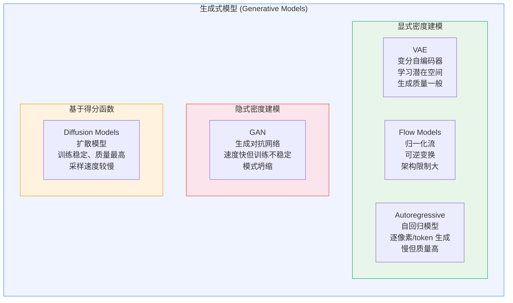
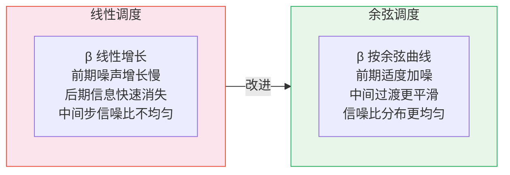
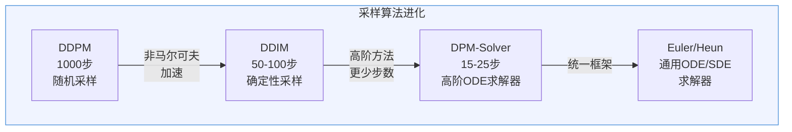
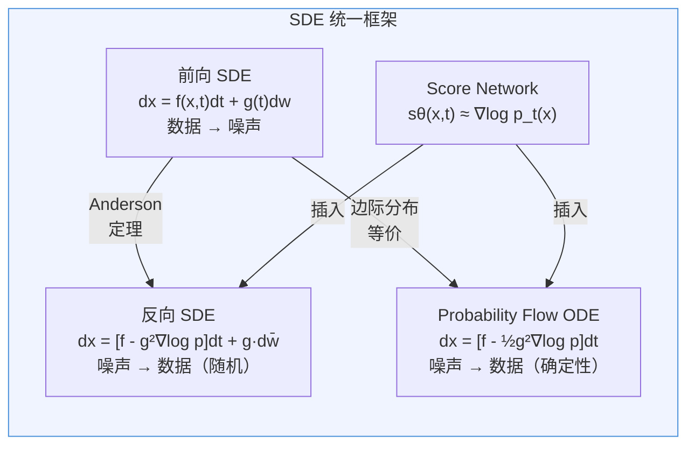
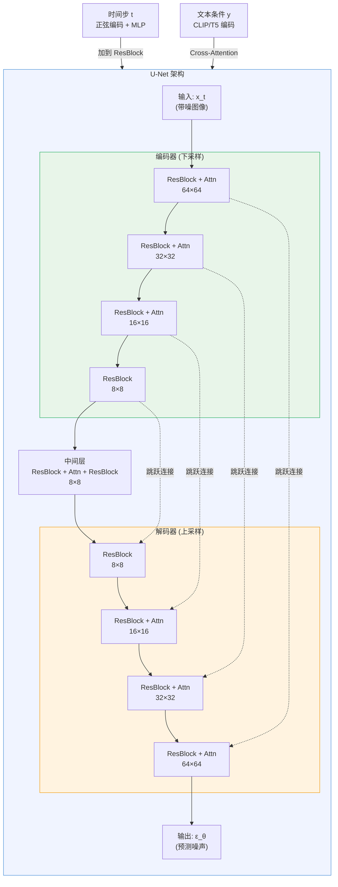
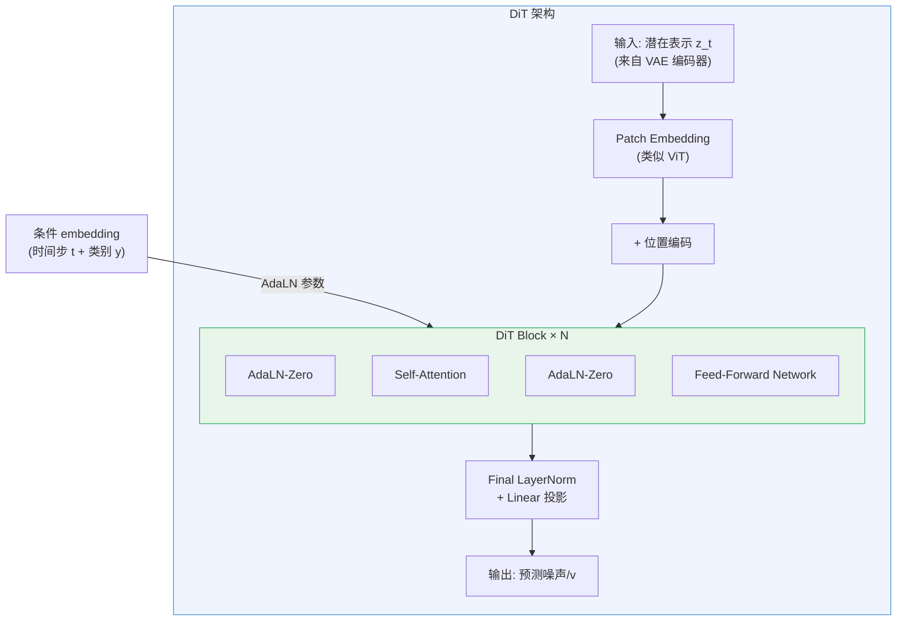
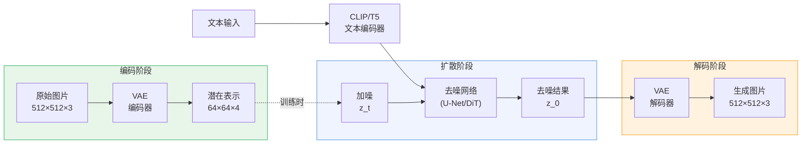
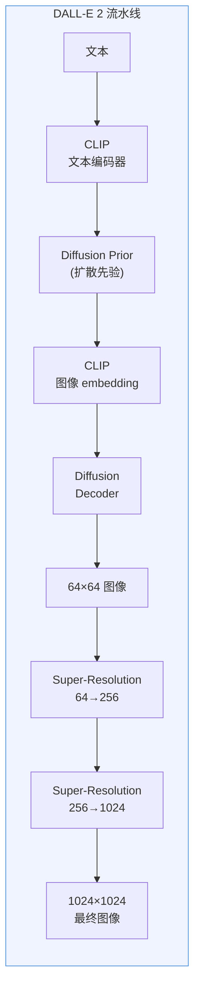
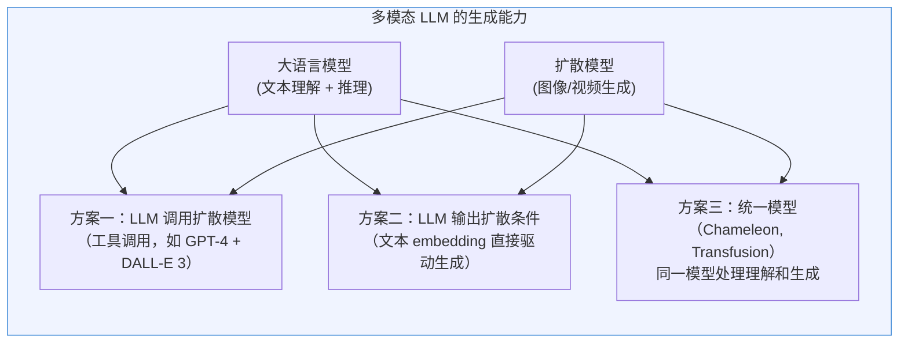

# 扩散模型（Diffusion Models）详解

> 扩散模型是当前最强大的生成式模型范式——它通过学习"逆转噪声"来生成数据，从 DALL-E 到 Stable Diffusion 再到 Sora，扩散模型已成为图像、视频、音频生成的统治性架构。

## 关键概念

| 概念 | 含义 |
|------|------|
| 扩散模型（Diffusion Model） | 一类通过学习逆转噪声添加过程来生成数据的生成式模型，先向数据逐步加噪至纯噪声，再学习逐步去噪恢复数据 |
| 前向过程（Forward Process） | 从真实数据 $x_0$ 出发，逐步添加高斯噪声直到变成纯噪声 $x_T \sim \mathcal{N}(0, I)$ 的马尔可夫链 |
| 反向过程（Reverse Process） | 从纯噪声 $x_T$ 出发，逐步去噪恢复清晰数据 $x_0$ 的学习过程，由神经网络参数化 |
| 噪声调度（Noise Schedule） | 控制每步加噪强度的序列 $\{\beta_t\}_{t=1}^T$，常见有线性调度和余弦调度 |
| DDPM（Denoising Diffusion Probabilistic Models） | Ho et al. (2020) 提出的里程碑工作，简化了扩散模型训练为预测噪声的简单 MSE 损失 |
| DDIM（Denoising Diffusion Implicit Models） | Song et al. (2020) 提出的确定性采样方法，可将推理步数从 1000 降至 50-100 |
| Score Function（得分函数） | 数据对数概率密度的梯度 $\nabla_x \log p(x)$，指向数据密度增大的方向 |
| SDE/ODE 框架 | Song et al. (2021) 提出的统一框架，将离散扩散推广为连续随机/常微分方程 |
| Classifier-Free Guidance（无分类器引导） | 通过对比条件生成与无条件生成来增强条件信号的采样技巧，无需额外分类器 |
| Latent Diffusion Model（潜在扩散模型） | 在预训练 VAE 的潜在空间而非像素空间做扩散，大幅降低计算成本（Stable Diffusion 的核心思路） |
| U-Net | 扩散模型中最经典的去噪网络架构，带有编码器-解码器结构和跳跃连接 |
| DiT（Diffusion Transformer） | 用 Transformer 替代 U-Net 的扩散架构，遵循类似 LLM 的缩放法则（Sora 的基础） |
| Flow Matching（流匹配） | 一种更简洁的 ODE 生成框架，用直线轨迹连接噪声和数据，被 SD3/Flux 采用 |

## 详细笔记

### 一、核心概念：什么是扩散模型？

#### 直觉理解

想象你有一幅精美的油画。现在你每天往画上撒一点沙子，一天天下来，最终画面被沙子完全覆盖，只剩一片混沌——这就是**前向扩散过程**。

现在反过来想：如果你**学会了怎么从混沌中一步步去除沙子**，你就能从一堆随机的沙子中"创造"出一幅新的油画——这就是**反向去噪过程**，也就是扩散模型的生成机制。

更准确地说：
- **前向过程**：逐步向真实图片添加高斯噪声，直到图片变成纯随机噪声
- **反向过程**：训练一个神经网络学习每一步的去噪操作，生成时从纯噪声开始逐步去噪

这个思路为什么好用？因为**加噪是简单的**（只需要加高斯噪声），而**去噪虽然难，但可以分解成很多小步**——每一步只需要去除一点点噪声，这对神经网络来说是一个相对简单的任务。

#### 扩散模型在生成式模型家族中的位置



**扩散模型 vs 其他生成模型**：

| 特性 | GAN | VAE | Flow | Autoregressive | Diffusion |
|------|:---:|:---:|:----:|:--------------:|:---------:|
| 生成质量 | 高 | 中 | 中 | 高 | **最高** |
| 训练稳定性 | 差（模式坍缩） | 好 | 好 | 好 | **好** |
| 模式覆盖 | 差 | 好 | 好 | 好 | **好** |
| 采样速度 | **最快（单次前传）** | 快 | 快 | 慢 | 慢（需多步迭代） |
| 似然估计 | 无 | 下界 | 精确 | 精确 | 下界 |
| 架构灵活性 | 高 | 高 | 低（可逆约束） | 高 | **高** |

扩散模型的核心优势是**训练稳定 + 生成质量高 + 模式覆盖好**（不会像 GAN 那样忽略部分数据模式）。代价是采样速度慢，但 DDIM、DPM-Solver 等加速算法已大幅缓解。

#### 数学符号约定

在开始详细推导之前，统一以下符号：

| 符号 | 含义 |
|------|------|
| $x_0$ | 真实数据样本（如一张图片） |
| $x_t$ | 第 $t$ 步的带噪数据，$t \in \{1, 2, \dots, T\}$ |
| $x_T$ | 终态，近似纯高斯噪声 |
| $\beta_t$ | 第 $t$ 步的噪声强度（noise schedule） |
| $\alpha_t$ | $\alpha_t = 1 - \beta_t$ |
| $\bar{\alpha}_t$ | 累积乘积 $\bar{\alpha}_t = \prod_{s=1}^{t} \alpha_s$ |
| $\epsilon$ | 标准高斯噪声 $\epsilon \sim \mathcal{N}(0, I)$ |
| $\epsilon_\theta(x_t, t)$ | 神经网络预测的噪声 |
| $T$ | 总扩散步数（DDPM 中通常 $T=1000$） |

---

### 二、前向过程（Forward Process / Diffusion Process）

#### 直觉

前向过程就是"逐步加噪"。每一步，我们将当前数据与一点高斯噪声混合，让数据变得更模糊。经过足够多步后，数据完全被噪声淹没，变成纯随机噪声。

关键在于：这个过程是**固定的、不需要学习的**——噪声的添加量完全由预先设定的噪声调度 $\{\beta_t\}$ 决定。

#### 单步加噪

前向过程是一个马尔可夫链，每步只依赖上一步：

$$q(x_t | x_{t-1}) = \mathcal{N}\left(x_t;\; \sqrt{1-\beta_t}\, x_{t-1},\; \beta_t I\right)$$

用重参数化技巧展开：

$$x_t = \sqrt{1-\beta_t}\, x_{t-1} + \sqrt{\beta_t}\, \epsilon_t, \quad \epsilon_t \sim \mathcal{N}(0, I)$$

**直觉理解**：
- $\sqrt{1-\beta_t}\, x_{t-1}$：对上一步的数据做一个略微的缩放（保留大部分信号）
- $\sqrt{\beta_t}\, \epsilon_t$：混入一点噪声
- $\beta_t$ 越大，这一步加的噪声越多

#### 噪声调度（Noise Schedule）

$\beta_t$ 的取值策略对生成质量影响很大。

**线性调度**（DDPM 原文，Ho et al., 2020）：

$$\beta_t = \beta_{\text{min}} + \frac{t-1}{T-1}(\beta_{\text{max}} - \beta_{\text{min}})$$

DDPM 使用 $\beta_1 = 10^{-4}$，$\beta_T = 0.02$，$T = 1000$。

**余弦调度**（Nichol & Dhariwal, 2021）：

$$\bar{\alpha}_t = \frac{f(t)}{f(0)}, \quad f(t) = \cos\left(\frac{t/T + s}{1 + s} \cdot \frac{\pi}{2}\right)^2$$

其中 $s = 0.008$ 是一个小偏移量，防止 $\beta_t$ 在 $t$ 接近 0 时过小。

余弦调度的优势：相比线性调度，它在中间时间步加噪更均匀，避免了线性调度中"前期加噪太慢、后期太快"的问题，尤其对低分辨率图片效果更好。



#### 任意时刻的闭式采样（核心公式）

逐步加噪太慢——如果我们想从 $x_0$ 直接跳到 $x_t$，能不能一步算出来？答案是肯定的。

**推导过程**：

首先，$x_1 = \sqrt{\alpha_1}\, x_0 + \sqrt{1-\alpha_1}\, \epsilon_1$

然后，$x_2 = \sqrt{\alpha_2}\, x_1 + \sqrt{1-\alpha_2}\, \epsilon_2$

展开：

$$x_2 = \sqrt{\alpha_2}\left(\sqrt{\alpha_1}\, x_0 + \sqrt{1-\alpha_1}\, \epsilon_1\right) + \sqrt{1-\alpha_2}\, \epsilon_2$$

$$= \sqrt{\alpha_1 \alpha_2}\, x_0 + \sqrt{\alpha_2(1-\alpha_1)}\, \epsilon_1 + \sqrt{1-\alpha_2}\, \epsilon_2$$

由于两个独立高斯噪声的加权和仍然是高斯噪声：

$$\mathcal{N}(0, \alpha_2(1-\alpha_1)) + \mathcal{N}(0, 1-\alpha_2) = \mathcal{N}(0, 1-\alpha_1\alpha_2)$$

所以 $x_2 = \sqrt{\alpha_1\alpha_2}\, x_0 + \sqrt{1 - \alpha_1\alpha_2}\, \epsilon$

推广到任意时刻 $t$，定义 $\bar{\alpha}_t = \prod_{s=1}^{t} \alpha_s$：

$$\boxed{q(x_t | x_0) = \mathcal{N}\left(x_t;\; \sqrt{\bar{\alpha}_t}\, x_0,\; (1-\bar{\alpha}_t)\, I\right)}$$

**重参数化形式**：

$$\boxed{x_t = \sqrt{\bar{\alpha}_t}\, x_0 + \sqrt{1-\bar{\alpha}_t}\, \epsilon, \quad \epsilon \sim \mathcal{N}(0, I)}$$

**直觉理解**：
- $\sqrt{\bar{\alpha}_t}$ 是信号的保留系数——$t$ 越大，$\bar{\alpha}_t$ 越接近 0，信号越弱
- $\sqrt{1-\bar{\alpha}_t}$ 是噪声的混入系数——$t$ 越大，噪声越占主导
- 当 $t = T$ 且 $\bar{\alpha}_T \approx 0$ 时，$x_T \approx \epsilon \sim \mathcal{N}(0, I)$，即纯噪声
- 这个公式使得训练时可以**一步到位**采样任意噪声水平的数据，无需逐步前向

#### 信噪比（Signal-to-Noise Ratio, SNR）

从闭式公式可以定义 SNR：

$$\text{SNR}(t) = \frac{\bar{\alpha}_t}{1 - \bar{\alpha}_t}$$

- $t = 0$：$\text{SNR} = \infty$（纯信号）
- $t = T$：$\text{SNR} \approx 0$（纯噪声）
- 不同噪声调度本质上决定了 SNR 随 $t$ 的衰减曲线

---

### 三、反向过程（Reverse Process / Denoising）

#### 直觉

反向过程是扩散模型的核心——从纯噪声 $x_T$ 出发，逐步去噪恢复数据 $x_0$。每一步去噪都是一个条件概率分布 $p_\theta(x_{t-1} | x_t)$，由神经网络参数化。

关键洞察：虽然前向过程 $q(x_t | x_{t-1})$ 很简单（加高斯噪声），但其真实反向 $q(x_{t-1} | x_t)$ 是非常复杂的——它依赖于整个数据分布。然而，当每步加的噪声足够小时（$\beta_t$ 足够小），反向过程 $q(x_{t-1} | x_t)$ 也可以近似为高斯分布！这就是 DDPM 的基础假设。

#### 参数化反向过程

我们将反向过程参数化为：

$$p_\theta(x_{t-1} | x_t) = \mathcal{N}\left(x_{t-1};\; \mu_\theta(x_t, t),\; \Sigma_\theta(x_t, t)\right)$$

**需要学习的是均值 $\mu_\theta$ 和方差 $\Sigma_\theta$**。DDPM 中方差取固定值（后面会讲），所以核心任务是学均值。

#### 真实反向过程（给定 $x_0$ 时）

利用贝叶斯公式，当 $x_0$ 已知时，反向过程有闭式解：

$$q(x_{t-1} | x_t, x_0) = \mathcal{N}(x_{t-1};\; \tilde{\mu}_t(x_t, x_0),\; \tilde{\beta}_t I)$$

其中：

$$\tilde{\mu}_t(x_t, x_0) = \frac{\sqrt{\bar{\alpha}_{t-1}}\,\beta_t}{1 - \bar{\alpha}_t}\, x_0 + \frac{\sqrt{\alpha_t}(1-\bar{\alpha}_{t-1})}{1 - \bar{\alpha}_t}\, x_t$$

$$\tilde{\beta}_t = \frac{1 - \bar{\alpha}_{t-1}}{1 - \bar{\alpha}_t}\, \beta_t$$

**推导关键步骤**：

由贝叶斯公式：

$$q(x_{t-1} | x_t, x_0) = \frac{q(x_t | x_{t-1}, x_0)\, q(x_{t-1} | x_0)}{q(x_t | x_0)}$$

其中三个分布都是高斯的（利用我们之前推导的闭式公式）：
- $q(x_t | x_{t-1}, x_0) = q(x_t | x_{t-1}) = \mathcal{N}(x_t; \sqrt{\alpha_t}\, x_{t-1}, \beta_t I)$（马尔可夫性质）
- $q(x_{t-1} | x_0) = \mathcal{N}(x_{t-1}; \sqrt{\bar{\alpha}_{t-1}}\, x_0, (1-\bar{\alpha}_{t-1}) I)$
- $q(x_t | x_0) = \mathcal{N}(x_t; \sqrt{\bar{\alpha}_t}\, x_0, (1-\bar{\alpha}_t) I)$

三个高斯分布的比值仍然是高斯分布。通过"凑平方"（completing the square）可以得到上面的 $\tilde{\mu}_t$ 和 $\tilde{\beta}_t$。

#### 三种预测目标的等价性

由 $x_t = \sqrt{\bar{\alpha}_t}\, x_0 + \sqrt{1-\bar{\alpha}_t}\, \epsilon$ 可得：

$$x_0 = \frac{x_t - \sqrt{1-\bar{\alpha}_t}\, \epsilon}{\sqrt{\bar{\alpha}_t}}$$

代入 $\tilde{\mu}_t$ 的公式：

$$\tilde{\mu}_t = \frac{1}{\sqrt{\alpha_t}}\left(x_t - \frac{\beta_t}{\sqrt{1-\bar{\alpha}_t}}\, \epsilon\right)$$

这揭示了三种等价的预测目标：

| 预测目标 | 网络输出 | 均值公式 | 特点 |
|----------|---------|---------|------|
| **预测噪声** $\epsilon_\theta(x_t, t)$ | $\hat{\epsilon}$ | $\mu_\theta = \frac{1}{\sqrt{\alpha_t}}\left(x_t - \frac{\beta_t}{\sqrt{1-\bar{\alpha}_t}}\, \epsilon_\theta\right)$ | DDPM 默认，训练最稳定 |
| **预测原始数据** $x_\theta(x_t, t)$ | $\hat{x}_0$ | $\mu_\theta = \frac{\sqrt{\bar{\alpha}_{t-1}}\beta_t}{1-\bar{\alpha}_t}\, x_\theta + \frac{\sqrt{\alpha_t}(1-\bar{\alpha}_{t-1})}{1-\bar{\alpha}_t}\, x_t$ | 某些场景更直觉 |
| **v-prediction** $v_\theta(x_t, t)$ | $\hat{v}$ | $v = \sqrt{\bar{\alpha}_t}\, \epsilon - \sqrt{1-\bar{\alpha}_t}\, x_0$ | Imagen、SD2 使用，数值更稳定 |

DDPM（Ho et al., 2020）选择**预测噪声**，实验发现这比预测 $x_0$ 效果更好。

#### 与 Score Function 的深层联系

Score function 定义为数据对数概率密度的梯度：

$$s(x, t) = \nabla_{x_t} \log p_t(x_t)$$

在扩散模型中，$p_t(x_t) = \int q(x_t | x_0) p_{\text{data}}(x_0) dx_0$，其 score 可以推导为：

$$\nabla_{x_t} \log p_t(x_t) = -\frac{\mathbb{E}[\epsilon | x_t]}{\sqrt{1-\bar{\alpha}_t}}$$

因此，训练噪声预测网络 $\epsilon_\theta(x_t, t)$ **等价于**训练一个 score 估计器：

$$\boxed{\epsilon_\theta(x_t, t) \approx -\sqrt{1-\bar{\alpha}_t}\, \nabla_{x_t} \log p_t(x_t)}$$

**直觉**：score function 指向数据密度增大的方向（"数据在哪里"），而预测的噪声方向与之相反（"噪声从哪里来"）。去噪就是沿着 score function 的方向"走向"数据。

---

### 四、训练目标（DDPM — Ho et al., 2020）

#### ELBO 推导（简要）

扩散模型通过最大化数据的 Evidence Lower Bound（ELBO）来训练。生成过程的对数似然为：

$$\log p_\theta(x_0) \geq \mathbb{E}_q\left[\log \frac{p_\theta(x_{0:T})}{q(x_{1:T} | x_0)}\right] = -\mathcal{L}_{\text{VLB}}$$

ELBO 可以分解为三部分：

$$\mathcal{L}_{\text{VLB}} = \underbrace{D_{KL}(q(x_T | x_0)\, \|\, p(x_T))}_{\mathcal{L}_T\,\text{（常数，可忽略）}} + \sum_{t=2}^{T} \underbrace{D_{KL}(q(x_{t-1} | x_t, x_0)\, \|\, p_\theta(x_{t-1} | x_t))}_{\mathcal{L}_{t-1}} + \underbrace{(-\log p_\theta(x_0 | x_1))}_{\mathcal{L}_0}$$

其中：
- $\mathcal{L}_T$：前向过程终态与先验的 KL 散度，不含可学习参数，是常数
- $\mathcal{L}_{t-1}$：核心项，衡量网络预测的反向分布与真实反向分布的差距
- $\mathcal{L}_0$：重建项

#### 核心项 $\mathcal{L}_{t-1}$ 的展开

由于 $q(x_{t-1} | x_t, x_0)$ 和 $p_\theta(x_{t-1} | x_t)$ 都是高斯分布，KL 散度有闭式解：

$$\mathcal{L}_{t-1} = \frac{1}{2\tilde{\beta}_t}\, \|\tilde{\mu}_t(x_t, x_0) - \mu_\theta(x_t, t)\|^2 + C$$

将 $\mu_\theta$ 用噪声预测参数化后：

$$\mathcal{L}_{t-1} = \frac{\beta_t^2}{2\alpha_t(1-\bar{\alpha}_t)\tilde{\beta}_t}\, \|\epsilon - \epsilon_\theta(x_t, t)\|^2 + C$$

#### 简化损失（DDPM 的核心贡献）

Ho et al. 发现，去掉时间步相关的加权系数后，训练效果反而更好：

$$\boxed{\mathcal{L}_{\text{simple}} = \mathbb{E}_{t \sim U[1,T],\; x_0 \sim q(x_0),\; \epsilon \sim \mathcal{N}(0,I)}\left[\|\epsilon - \epsilon_\theta(x_t, t)\|^2\right]}$$

其中 $x_t = \sqrt{\bar{\alpha}_t}\, x_0 + \sqrt{1-\bar{\alpha}_t}\, \epsilon$。

**为什么简化损失效果更好？** 原始 ELBO 中每个 $\mathcal{L}_{t-1}$ 的权重与 $t$ 相关。去掉权重后，所有时间步被**均匀采样**，模型对小 $t$（接近数据，需要精细去噪）投入更多学习精力。实验表明这种"平等对待所有时间步"的策略生成了更高质量的样本。

#### 完整训练算法

```
Algorithm 1: DDPM Training
───────────────────────────
repeat:
    x_0 ~ q(x_0)                              # 从数据集采样一张图片
    t ~ Uniform({1, 2, ..., T})                # 随机采样时间步
    ε ~ N(0, I)                                # 采样噪声
    x_t = √(ᾱ_t) · x_0 + √(1-ᾱ_t) · ε       # 一步加噪
    loss = ||ε - ε_θ(x_t, t)||²               # 计算简化损失
    θ ← θ - η · ∇_θ loss                      # 梯度下降更新
until converged
```

**关键优势**：训练非常简单！每次迭代只需要：(1) 采样一张图和一个随机时间步，(2) 加噪，(3) 让网络预测噪声，(4) 算 MSE 损失。不需要像 GAN 那样维护判别器和生成器的对抗平衡。

#### v-prediction 参数化

v-prediction（Salimans & Ho, 2022）定义预测目标为：

$$v_t = \sqrt{\bar{\alpha}_t}\, \epsilon - \sqrt{1-\bar{\alpha}_t}\, x_0$$

直觉上，$v$ 是信号与噪声的加权组合的"速度"方向。v-prediction 的优势：
- 在**高信噪比**（$t$ 接近 0）和**低信噪比**（$t$ 接近 $T$）时数值更稳定
- 特别适合使用余弦调度时
- 被 Imagen 和 Stable Diffusion 2.x 采用

从 $\hat{v}$ 可以反推：

$$\hat{x}_0 = \sqrt{\bar{\alpha}_t}\, x_t - \sqrt{1-\bar{\alpha}_t}\, \hat{v}$$

$$\hat{\epsilon} = \sqrt{1-\bar{\alpha}_t}\, x_t + \sqrt{\bar{\alpha}_t}\, \hat{v}$$

---

### 五、采样算法

#### DDPM 采样（原始方法）

```
Algorithm 2: DDPM Sampling
───────────────────────────
x_T ~ N(0, I)                                  # 从纯噪声开始
for t = T, T-1, ..., 1:
    z ~ N(0, I) if t > 1, else z = 0
    x_{t-1} = (1/√α_t)(x_t - β_t/√(1-ᾱ_t) · ε_θ(x_t,t)) + √(β̃_t) · z
return x_0
```

其中 $\tilde{\beta}_t = \frac{1-\bar{\alpha}_{t-1}}{1-\bar{\alpha}_t}\beta_t$（也可以简单取 $\tilde{\beta}_t = \beta_t$，DDPM 原文两者都试过）。

**问题**：需要 $T=1000$ 步迭代，在 GPU 上生成一张图片需要约 20 秒，比 GAN 的单次前传慢了上千倍。

#### DDIM（Song et al., 2020）——加速采样的突破

**核心思想**：DDPM 的前向过程是马尔可夫链（每步只依赖上一步），但 Song et al. 发现可以构造**非马尔可夫前向过程**，它有相同的边际分布 $q(x_t | x_0)$，但允许更大步长的跳跃。

**DDIM 采样公式**：

给定 $x_t$ 和预测的噪声 $\epsilon_\theta(x_t, t)$，首先估计 $x_0$：

$$\hat{x}_0 = \frac{x_t - \sqrt{1-\bar{\alpha}_t}\, \epsilon_\theta(x_t, t)}{\sqrt{\bar{\alpha}_t}}$$

然后更新：

$$\boxed{x_{t-1} = \sqrt{\bar{\alpha}_{t-1}}\, \hat{x}_0 + \sqrt{1 - \bar{\alpha}_{t-1} - \sigma_t^2}\, \epsilon_\theta(x_t, t) + \sigma_t\, z}$$

其中 $z \sim \mathcal{N}(0, I)$，$\sigma_t$ 控制随机性：
- $\sigma_t = \sqrt{\tilde{\beta}_t}$：退化为 DDPM
- $\sigma_t = 0$：**完全确定性采样**（DDIM 的默认选择）

**DDIM 的三大优势**：

1. **更少步数**：可以选择步数子集 $\{t_1, t_2, \dots, t_S\} \subset \{1, \dots, T\}$，$S \ll T$（例如 $S=50$），直接在这些时间步之间跳跃
2. **确定性采样**：$\sigma_t = 0$ 时，同一个初始噪声 $x_T$ 总是生成同一张图片，这对编辑和插值很重要
3. **语义插值**：在潜在空间 $x_T$ 做线性插值，生成的图片会平滑过渡（因为采样是确定性的）

**DDIM 与常微分方程（ODE）的联系**：

当 $\sigma_t = 0$ 时，DDIM 采样可以看作是对一个常微分方程的离散化求解：

$$\frac{dx}{dt} = f_\theta(x, t)$$

这个联系为后续的 ODE/SDE 框架奠定了基础。

#### DPM-Solver / DPM-Solver++（Lu et al., 2022）

**核心思想**：既然 DDIM 是 ODE 的一阶欧拉离散化，为什么不用更高阶的 ODE 求解器？

DPM-Solver 将扩散 ODE 写成半线性形式，利用变量替换将其转化为指数积分器（exponential integrator）可高效求解的形式：

$$\frac{d\bar{x}}{d\lambda} = \epsilon_\theta(\bar{x}, \lambda)$$

其中 $\lambda = \log(\bar{\alpha}_t / (1-\bar{\alpha}_t))$ 是 log-SNR。

- **DPM-Solver-1**（一阶）：等价于 DDIM
- **DPM-Solver-2**（二阶）：利用中间点估计提高精度
- **DPM-Solver-3**（三阶）：进一步提高精度

**DPM-Solver++** 改进了高阶方法的数值稳定性，引入了"data prediction"参数化（预测 $x_0$ 而非 $\epsilon$）和多步方法（multistep）。

| 采样器 | 步数 | 质量（FID↓） | 速度 |
|--------|:----:|:------------:|:----:|
| DDPM | 1000 | 3.17 | ~20s |
| DDIM | 50 | 4.67 | ~1s |
| DDIM | 100 | 4.16 | ~2s |
| DPM-Solver-2 | 20 | ~3.5 | ~0.4s |
| DPM-Solver++ | 15-25 | ~3.2 | ~0.3s |

#### Euler 和 Heun 求解器

在 SDE/ODE 框架（后面会详细讲）中，常用的数值求解器：

**Euler 方法**（一阶）：

$$x_{t-\Delta t} = x_t + f(x_t, t) \cdot (-\Delta t)$$

简单但精度低，需要更多步数。

**Heun 方法**（二阶，也叫改进欧拉法）：

$$\tilde{x}_{t-\Delta t} = x_t + f(x_t, t) \cdot (-\Delta t)$$

$$x_{t-\Delta t} = x_t + \frac{1}{2}\left[f(x_t, t) + f(\tilde{x}_{t-\Delta t}, t-\Delta t)\right] \cdot (-\Delta t)$$

精度更高，但每步需要两次网络前传（网络评估次数翻倍）。



---

### 六、Score-Based / SDE 统一框架（Song et al., 2021）

#### 动机

DDPM（离散时间）和 Score Matching（连续时间）看似是两种不同的方法。Song et al. (2021) 用随机微分方程（SDE）将它们统一到一个优雅的框架中。

#### 前向 SDE

将离散扩散推广为连续过程：

$$\boxed{dx = f(x, t)\, dt + g(t)\, dw}$$

其中：
- $f(x, t)$：漂移系数（drift），控制数据的确定性演化方向
- $g(t)$：扩散系数（diffusion），控制噪声强度
- $dw$：标准维纳过程（布朗运动）的增量

不同的扩散模型对应不同的 SDE：

| 模型 | $f(x, t)$ | $g(t)$ | 类型 |
|------|-----------|--------|------|
| VP-SDE（DDPM） | $-\frac{1}{2}\beta(t)x$ | $\sqrt{\beta(t)}$ | 方差保持 |
| VE-SDE（SMLD） | $0$ | $\sigma(t)\sqrt{2\dot{\sigma}(t)/\sigma(t)}$ | 方差爆炸 |
| sub-VP SDE | $-\frac{1}{2}\beta(t)x$ | $\sqrt{\beta(t)(1-e^{-2\int_0^t \beta(s)ds})}$ | 方差次保持 |

**VP-SDE**（Variance Preserving）对应 DDPM：$\beta(t)$ 从 $\beta_{\min}$ 线性增长到 $\beta_{\max}$。

#### 反向 SDE

Anderson (1982) 证明了一个深刻的结果：**任何 SDE 都存在对应的反向时间 SDE**：

$$\boxed{dx = \left[f(x, t) - g(t)^2\, \nabla_x \log p_t(x)\right] dt + g(t)\, d\bar{w}}$$

其中：
- $\nabla_x \log p_t(x)$ 就是 **score function**
- $d\bar{w}$ 是反向时间的维纳过程增量
- 唯一需要学习的就是 score function！

#### Score Matching 目标

训练一个网络 $s_\theta(x, t)$ 去估计 $\nabla_x \log p_t(x)$：

$$\mathcal{L}_{\text{SM}} = \mathbb{E}_{t}\left[\lambda(t)\, \mathbb{E}_{x_0}\mathbb{E}_{x_t | x_0}\left[\|s_\theta(x_t, t) - \nabla_{x_t} \log p_{t|0}(x_t | x_0)\|^2\right]\right]$$

由于 $p_{t|0}(x_t | x_0)$ 是高斯分布，其 score 有闭式解：

$$\nabla_{x_t} \log p_{t|0}(x_t | x_0) = -\frac{x_t - \mu_t(x_0)}{\sigma_t^2}$$

这与 DDPM 的噪声预测损失**完全等价**（差一个缩放因子）！

#### Probability Flow ODE（确定性采样）

Song et al. 的另一个关键贡献：对于任意 SDE，都存在一个**确定性** ODE，其边际分布 $p_t(x)$ 与原 SDE 完全相同：

$$\boxed{dx = \left[f(x, t) - \frac{1}{2}g(t)^2\, \nabla_x \log p_t(x)\right] dt}$$

这就是 **Probability Flow ODE**。与 SDE 相比：
- 去掉了噪声项 $g(t)d\bar{w}$
- 漂移项中 $g(t)^2$ 的系数从 1 变成 $1/2$
- 采样变成了求解一个 ODE，可以使用高效的 ODE 求解器（如 RK45、DPM-Solver）
- DDIM 可以看作是 Probability Flow ODE 的一种离散化



**这个框架的意义**：
1. 将 DDPM、Score Matching、SMLD 等不同方法统一到同一框架
2. 可以灵活选择 SDE（随机，质量更高）或 ODE（确定性，速度更快）采样
3. ODE 形式允许精确计算对数似然（通过瞬时变量变换公式）
4. 为后续的 Flow Matching 等工作提供了理论基础

---

### 七、条件生成（Conditional Generation）

#### 为什么需要条件生成？

无条件扩散模型生成随机样本——我们无法控制它生成什么。条件生成让模型根据给定条件（文本描述、类别标签、参考图片等）生成特定内容。这是 DALL-E、Stable Diffusion 等应用的基础。

#### 方法一：Classifier Guidance（分类器引导）

**核心思想**（Dhariwal & Nichol, 2021）：利用一个在带噪数据上训练的分类器 $p_\phi(y | x_t)$ 来引导采样方向。

条件 score function 可以分解为：

$$\nabla_{x_t} \log p(x_t | y) = \nabla_{x_t} \log p(x_t) + \nabla_{x_t} \log p(y | x_t)$$

对应的引导采样修改噪声预测：

$$\boxed{\tilde{\epsilon} = \epsilon_\theta(x_t, t) - \sqrt{1 - \bar{\alpha}_t} \cdot w \cdot \nabla_{x_t} \log p_\phi(y | x_t)}$$

其中 $w$ 是引导强度（guidance scale）。

**缺点**：
- 需要额外训练一个在**各个噪声水平**上都能工作的分类器
- 分类器的梯度可能不稳定，导致生成的图片出现伪影
- 分类器的类别数限制了条件生成的灵活性

#### 方法二：Classifier-Free Guidance（无分类器引导）——主流方法

**核心思想**（Ho & Salimans, 2022）：用同一个模型同时学习条件生成和无条件生成，推理时将两者"对比"来增强条件信号。

**训练**：
- 输入条件 $y$（如文本 embedding）给去噪网络 $\epsilon_\theta(x_t, t, y)$
- 以 10-20% 的概率随机将条件 $y$ 替换为空条件 $\varnothing$（unconditional dropout）
- 这使模型同时学会了 $\epsilon_\theta(x_t, t, y)$（条件去噪）和 $\epsilon_\theta(x_t, t, \varnothing)$（无条件去噪）

**推理**（引导采样）：

$$\boxed{\tilde{\epsilon} = (1 + w)\, \epsilon_\theta(x_t, t, y) - w \cdot \epsilon_\theta(x_t, t, \varnothing)}$$

等价地写成：

$$\tilde{\epsilon} = \epsilon_\theta(x_t, t, \varnothing) + (1 + w)\, \left[\epsilon_\theta(x_t, t, y) - \epsilon_\theta(x_t, t, \varnothing)\right]$$

**直觉理解**：
- $\epsilon_\theta(x_t, t, y) - \epsilon_\theta(x_t, t, \varnothing)$ 是"条件带来的方向偏移"——模型因为看到条件 $y$ 而改变的去噪方向
- 乘以 $(1+w)$ 放大这个偏移，让生成结果更强烈地遵循条件
- $w = 0$：标准条件生成（无引导）
- $w > 0$：增强条件对齐，但减少多样性
- 典型值：$w = 7.5$（Stable Diffusion），$w = 3.0$（DALL-E 3）

**为什么 Classifier-Free Guidance 更好？**

| 特性 | Classifier Guidance | Classifier-Free Guidance |
|------|:-------------------:|:------------------------:|
| 额外模型 | 需要训练分类器 | 不需要 |
| 训练复杂度 | 高（两个模型） | 低（一个模型） |
| 条件类型 | 仅限分类器能处理的 | 任意条件（文本、图像等） |
| 推理成本 | 1 次网络前传 + 分类器 | 2 次网络前传（条件 + 无条件） |
| 生成质量 | 好 | **更好** |
| 灵活性 | 低 | **高** |

#### 文本条件化的实现

在文本到图像生成中，条件 $y$ 通常是文本 embedding：

**CLIP Text Encoder**：
- Stable Diffusion 1.x/2.x 使用 CLIP 的文本编码器
- 输出固定长度的文本 embedding 序列（77 个 token，每个 768 维）
- 优势：CLIP 的图文对齐能力让文本 embedding 天然具有视觉语义

**T5 Text Encoder**：
- Imagen（Google）使用 T5-XXL（110 亿参数）
- DALL-E 3 也使用 T5 系列编码器
- 优势：更强的语言理解能力，特别是对复杂/长文本描述

**Cross-Attention 机制**：

文本 embedding 通过 cross-attention 注入 U-Net：

$$\text{CrossAttn}(Q, K, V) = \text{softmax}\left(\frac{QK^\top}{\sqrt{d}}\right)V$$

其中：
- $Q = W_Q \cdot \phi_{\text{image}}(x_t)$（Query 来自图像特征）
- $K = W_K \cdot \phi_{\text{text}}(y)$（Key 来自文本 embedding）
- $V = W_V \cdot \phi_{\text{text}}(y)$（Value 来自文本 embedding）

**直觉**：图像特征"查询"文本描述中的相关信息，然后将文本语义融入图像去噪过程。每个空间位置都能关注到文本描述中的不同部分（如"红色的猫"中，猫的区域关注"猫"，颜色信息关注"红色"）。

---

### 八、架构：U-Net 与 DiT

#### U-Net（经典扩散架构）

U-Net 最初为医学图像分割设计（Ronneberger et al., 2015），后被 DDPM 引入扩散模型。



**U-Net 的关键组件**：

1. **ResBlock（残差块）**：
   - 卷积 → GroupNorm → SiLU → 卷积
   - 时间步 embedding 通过 $\text{scale} + \text{shift}$ 注入（AdaGN）
   - 残差连接

2. **Self-Attention**：
   - 在特定分辨率（通常 32×32、16×16、8×8）加入
   - 让远距离像素互相交互（卷积只能看到局部）
   - 计算量大，所以不在最高分辨率使用

3. **Cross-Attention**：
   - 用于注入文本条件
   - Q 来自图像特征，K/V 来自文本 embedding

4. **时间步 embedding**：
   - 用正弦位置编码对时间步 $t$ 编码
   - 通过 MLP 映射到与特征通道维度匹配的向量
   - 以 scale-shift 方式注入每个 ResBlock

5. **跳跃连接（Skip Connections）**：
   - 编码器的特征直接拼接到解码器对应层
   - 保留高分辨率细节信息

#### DiT（Diffusion Transformer）

**动机**（Peebles & Xie, 2023）：U-Net 的架构是经过手工设计的（哪层加 attention、多少个 ResBlock 等），而 Transformer 已经在 NLP 和 ViT 中证明了强大的扩展能力。能否用纯 Transformer 替代 U-Net？

**DiT 的架构**：



**DiT 的关键设计**：

1. **Patch Embedding**：
   - 将 latent 空间的特征图切成 $p \times p$ 的 patch（类似 ViT）
   - 每个 patch 展平后通过线性层映射为 token
   - 例如 32×32 的 latent，patch size=2，得到 256 个 token

2. **AdaLN-Zero（自适应层归一化零初始化）**：
   - 标准 Transformer 用 LayerNorm；DiT 用 **Adaptive LayerNorm**
   - 条件 embedding（时间步 $t$ + 类别 $y$）通过 MLP 生成 $(\gamma, \beta, \alpha)$ 参数：
     $$\text{AdaLN}(h, c) = \gamma(c) \odot \text{LayerNorm}(h) + \beta(c)$$
   - **零初始化**：$\alpha$ 参数初始化为零，使每个 DiT block 初始时等同于恒等映射
   - 这对训练稳定性至关重要

3. **Scaling Properties**：
   | 模型 | 层数 | 隐藏维度 | 头数 | 参数量 | ImageNet FID↓ |
   |------|:----:|:--------:|:----:|:------:|:-------------:|
   | DiT-S | 12 | 384 | 6 | 33M | 68.4 |
   | DiT-B | 12 | 768 | 12 | 130M | 43.5 |
   | DiT-L | 24 | 1024 | 16 | 458M | 9.62 |
   | DiT-XL | 28 | 1152 | 16 | 675M | 2.27 |

   DiT 遵循类似 LLM 的 scaling law：模型越大（更深、更宽），生成质量越好（FID 越低）。这是一个重要发现，意味着扩散模型也可以像 LLM 一样通过"暴力增大"来持续提升。

**为什么 DiT 重要？**
- 统一了生成模型与 LLM 的基础架构（都是 Transformer）
- 可以直接复用 Transformer 生态的优化（Flash Attention、分布式训练等）
- Sora 正是基于 DiT 的视频生成模型
- SD3 / Flux 也已经转向 Transformer 架构（MM-DiT）

---

### 九、潜在扩散模型（Latent Diffusion Model / Stable Diffusion）

#### 问题：像素空间太贵

一张 $256 \times 256 \times 3$ 的图片有 $256 \times 256 \times 3 = 196,608$ 个像素值。在这么高维的空间做扩散：
- 计算量巨大（attention 的 $O(N^2)$ 更是灾难）
- 训练需要大量 GPU 时间
- 大部分计算花在学习无关紧要的高频细节上

#### 解决方案：在潜在空间做扩散

**Latent Diffusion Model（LDM）**（Rombach et al., 2022）的核心思想极其优雅：

1. 先用 VAE 将图片压缩到低维潜在空间
2. 在潜在空间做扩散（维度低了几十倍）
3. 最后用 VAE 解码器恢复图片



**维度对比**：

| 空间 | 分辨率 | 维度 | 压缩倍数 |
|------|--------|:----:|:--------:|
| 像素空间 | 512×512×3 | 786,432 | 1× |
| 潜在空间（f=8） | 64×64×4 | 16,384 | **48×** |

压缩了 48 倍！而 VAE 的潜在空间保留了图片的核心语义信息，丢弃的主要是高频细节（这些可以由 VAE 解码器恢复）。

#### Stable Diffusion 完整流水线

以 Stable Diffusion 1.5 为例：

1. **文本编码**：CLIP ViT-L/14 文本编码器，将文本映射为 77×768 的 embedding 序列
2. **扩散去噪**：U-Net（~860M 参数），在 64×64×4 的潜在空间做 50 步 DDIM 采样
3. **图像解码**：VAE 解码器，将 64×64×4 的潜在表示上采样为 512×512×3 的图片

**Classifier-Free Guidance 的应用**：每步需要两次 U-Net 前传（条件 + 无条件），引导强度 $w = 7.5$。

#### Stable Diffusion 版本演进

| 版本 | 文本编码器 | 去噪网络 | 分辨率 | 关键改进 |
|------|-----------|---------|--------|---------|
| SD 1.x | CLIP ViT-L/14 | U-Net (860M) | 512×512 | 首个开源 LDM |
| SD 2.x | OpenCLIP ViT-H/14 | U-Net (865M) | 768×768 | 更大 CLIP，v-prediction |
| SDXL | CLIP ViT-L + OpenCLIP ViT-bigG | U-Net (2.6B) | 1024×1024 | 双文本编码器，更大 U-Net |
| SD3 | CLIP ViT-L + OpenCLIP ViT-bigG + T5-XXL | MM-DiT (2B/8B) | 1024×1024 | Transformer 替代 U-Net，Flow Matching |

**SD3 的关键转变**：
- 架构从 U-Net 换成了 **MM-DiT**（Multimodal DiT），图像 token 和文本 token 在同一个 Transformer 中联合处理
- 训练目标从 DDPM 噪声预测换成了 **Flow Matching**（后面会讲）
- 三个文本编码器的组合提供了更强的文本理解能力

---

### 十、扩散模型在多模态场景中的应用

#### DALL-E 2（Ramesh et al., 2022）



- **Diffusion Prior**：文本 CLIP embedding → 图像 CLIP embedding（在 CLIP 空间做扩散）
- **Diffusion Decoder**：图像 CLIP embedding → 像素（条件扩散生成）
- **Super-Resolution**：级联超分辨率扩散模型

#### Stable Diffusion（Rombach et al., 2022）

- LDM 架构：VAE 编码器 → 潜在空间扩散 → VAE 解码器
- CLIP 文本条件通过 cross-attention 注入
- 开源生态最完善的文生图模型

#### DALL-E 3（Betker et al., 2023）

- 核心改进：**改善图文对齐**——用 LLM 为训练图片生成更详细、更准确的描述（re-captioning）
- 使用 T5 文本编码器替代/增强 CLIP
- 对文本描述的遵循度大幅提升（特别是空间关系、数量、属性绑定）

#### Imagen（Saharia et al., 2022，Google）

- 使用**冻结的 T5-XXL**（110 亿参数）作为文本编码器——证明了大语言模型的文本表征对图像生成有巨大帮助
- 在**像素空间**做扩散（不使用 VAE/潜在空间）
- 级联架构：64×64 → 256×256 → 1024×1024
- 关键发现：**增大文本编码器比增大扩散模型更有效**

#### Sora（OpenAI, 2024）

- 基于 **DiT** 架构的视频生成模型
- **时空 patch**：将视频切成时间 + 空间的 3D patch（如 1×2×2），每个 patch 作为一个 token
- 处理任意分辨率和持续时间的视频
- 直接在潜在空间操作（类似 LDM，但扩展到视频 VAE）
- 遵循 DiT 的 scaling law——模型越大，视频质量和一致性越好

#### 扩散模型与多模态 LLM 的关系



当前趋势是向**统一模型**发展——同一个模型既能理解图像/文本，又能生成图像/文本。扩散模型作为生成组件被集成到多模态 LLM 中。

---

### 十一、前沿进展（Advanced Topics）

#### Consistency Models（Song et al., 2023）

**问题**：扩散模型需要多步迭代采样，能否一步生成？

**核心思想**：定义一个一致性函数 $f_\theta$，将 ODE 轨迹上任意点映射到同一个起点（$x_0$）：

$$f_\theta(x_t, t) = x_0 \quad \text{对所有 } t \in [0, T]$$

关键约束：**自一致性**——ODE 轨迹上任意两点 $x_t$ 和 $x_{t'}$ 通过 $f_\theta$ 映射到同一个 $x_0$。

**训练方式**：
- **Consistency Distillation**：从预训练的扩散模型蒸馏
- **Consistency Training**：直接从数据训练（不需要预训练扩散模型）

**优势**：支持 1 步生成（快），也可以多步逐步精化（更好质量），质量-速度平衡灵活。

#### Flow Matching（Lipman et al., 2023）

**问题**：扩散模型的 SDE/ODE 公式复杂，训练目标推导繁琐。能否更简洁？

**核心思想**：直接用一个简单的 ODE 连接噪声分布和数据分布，而不经过复杂的 SDE 推导。

定义从噪声 $x_1 \sim \mathcal{N}(0, I)$ 到数据 $x_0$ 的**线性插值路径**：

$$x_t = (1 - t)\, x_0 + t\, x_1, \quad t \in [0, 1]$$

对应的速度场：

$$u_t(x_t | x_0) = x_1 - x_0$$

训练目标（Conditional Flow Matching loss）：

$$\mathcal{L}_{\text{CFM}} = \mathbb{E}_{t, x_0, x_1}\left[\|v_\theta(x_t, t) - (x_1 - x_0)\|^2\right]$$

**优势**：
- 数学更简洁（不需要噪声调度 $\beta_t$、$\bar{\alpha}_t$ 等概念）
- 直线轨迹比曲线轨迹更容易用少步 ODE 求解
- 被 Stable Diffusion 3 和 Flux 采用

#### Rectified Flow（直线化流）

Rectified Flow（Liu et al., 2023）是 Flow Matching 的重要扩展：

- 通过**迭代蒸馏**将弯曲的 ODE 轨迹"拉直"为接近直线
- 直线轨迹只需要 1-2 步 ODE 就能高精度求解
- 从 $N$ 步蒸馏到 $N/2$ 步，反复迭代

#### ControlNet（Zhang et al., 2023）

**问题**：如何在保持预训练扩散模型生成能力的同时，添加精确的空间控制（如边缘图、深度图、骨骼姿态）？

**方法**：
- 复制 U-Net 编码器作为"可训练副本"
- 原始 U-Net 锁定权重（frozen）
- 副本接收额外的控制信号输入
- 副本的输出通过**零卷积**（zero convolution）加到原始 U-Net 的跳跃连接上

**零卷积**的作用：初始化时权重全为零，训练开始时 ControlNet 不影响原始模型，随着训练逐渐学习控制信号。这保证了训练稳定性。

#### IP-Adapter（Ye et al., 2023）

**问题**：如何用**参考图片**而非文本来控制生成风格/内容？

**方法**：
- 用 CLIP 图像编码器提取参考图片的 embedding
- 通过**解耦的 cross-attention** 注入 U-Net：
  - 原始 cross-attention 处理文本条件（保持不变）
  - 新增的 cross-attention 处理图像条件（只训练这部分）
- 轻量级（~22M 参数），可与 ControlNet 等组合使用

---

### 十二、关键论文列表

| 论文 | 作者 | 年份 | 核心贡献 |
|------|------|:----:|---------|
| **DDPM** | Ho, Jain & Abbeel | 2020 | 简化扩散模型训练为噪声预测 MSE 损失，奠定现代扩散模型基础 |
| **Score-based SDE** | Song, Sohl-Dickstein et al. | 2021 | SDE/ODE 统一框架，Probability Flow ODE |
| **DDIM** | Song, Meng & Ermon | 2020 | 确定性快速采样，50 步达到 1000 步质量 |
| **Classifier-Free Guidance** | Ho & Salimans | 2022 | 无需分类器的条件引导，成为所有条件生成模型的标配 |
| **LDM / Stable Diffusion** | Rombach et al. | 2022 | 潜在空间扩散，开源生态，极大降低计算成本 |
| **DiT** | Peebles & Xie | 2023 | Transformer 替代 U-Net，验证扩散模型遵循 scaling law |
| **DALL-E 2** | Ramesh et al. | 2022 | CLIP + Diffusion Prior + Decoder 的级联架构 |
| **Imagen** | Saharia et al. | 2022 | T5-XXL 文本编码器 + 像素空间级联扩散 |
| **Consistency Models** | Song et al. | 2023 | 单步生成，一致性函数学习 |
| **Flow Matching** | Lipman et al. | 2023 | 更简洁的 ODE 生成框架，直线轨迹 |
| **Stable Diffusion 3** | Esser et al. | 2024 | MM-DiT + Flow Matching + 三文本编码器 |
| **Improved DDPM** | Nichol & Dhariwal | 2021 | 余弦调度、学习方差、改进采样 |
| **Classifier Guidance** | Dhariwal & Nichol | 2021 | 分类器引导采样 + 扩散模型首次超越 GAN |
| **ControlNet** | Zhang et al. | 2023 | 零卷积 + 锁定副本实现空间控制 |
| **DPM-Solver** | Lu et al. | 2022 | 高阶 ODE 求解器，15-25 步高质量采样 |

---

## 个人理解与思考

### 扩散模型的本质：噪声中的秩序

如果用一句话概括扩散模型的核心思想，那就是：**通过学习"如何从混沌走向秩序"来理解数据的结构**。这个思路与物理学中的热力学第二定律形成了有趣的对比——热力学说系统自发地从有序走向无序（熵增），而扩散模型学会了逆转这个过程。

从技术角度看，扩散模型的成功有三个关键因素：
1. **分步去噪将困难问题简单化**：一步从噪声生成图片太难，但每次只去除一点噪声很简单
2. **训练目标极其简单**：就是一个 MSE 回归损失，不需要像 GAN 那样维护对抗平衡
3. **与 score function 的深层联系**：提供了坚实的理论基础和灵活的采样框架

### 采样速度：从弱点到强项

扩散模型最初被诟病的"采样慢"问题已经基本解决：
- DDPM 需要 1000 步 → DDIM 减至 50 步 → DPM-Solver 减至 15 步 → Consistency Models 减至 1 步
- 这个进化过程本身就很有启发性：同一个训练好的模型可以用完全不同的采样算法，且这些算法的改进空间巨大

### LDM 的设计哲学值得学习

Latent Diffusion Model 的核心洞察——**在压缩表示上做困难的工作，而非在原始数据上**——是一个非常通用的设计原则。这与 NLP 中 tokenization 的思想一脉相承：不在字符级别建模，而是先压缩成 token 再建模。在深度学习中，"选择正确的表征空间"往往比"设计更复杂的模型"更有效。

### DiT 开启了"大力出奇迹"的扩散新时代

DiT 证明扩散模型也遵循 scaling law，这意味着我们可以像训练 GPT 一样不断增大扩散模型来获得更好的质量。Sora 的惊艳效果很大程度上就是这个 scaling 策略的产物。DiT 也意味着 Transformer 正在成为**通用基础架构**——NLP 用它、视觉用它、生成也用它。

### 与已有笔记的关联

- **Transformer 架构详解** → [notes/fundamentals/transformer.md](./transformer.md)：DiT 使用 Transformer 替代 U-Net，Self-Attention、FFN、LayerNorm 等机制直接复用；AdaLN-Zero 是 LayerNorm 的条件化变体
- **对比学习详解** → [notes/fundamentals/contrastive-learning.md](./contrastive-learning.md)：CLIP 的对比学习训练出的文本/图像 embedding 是 Stable Diffusion、DALL-E 2 等模型文本条件化的核心组件
- **位置编码详解** → [notes/fundamentals/positional-encoding.md](./positional-encoding.md)：DiT 中使用位置编码标记 patch 的空间位置，Sora 中的时空 patch 需要多维位置编码
- **多模态模型发展历程** → [notes/multimodal-arch/mllm-evolution.md](../multimodal-arch/mllm-evolution.md)：扩散模型作为生成组件被整合到第七代统一多模态模型中（如 Transfusion、Chameleon）
- **SFT 学习笔记** → [notes/training/supervised-fine-tuning-sft.md](../training/supervised-fine-tuning-sft.md)：扩散模型也可以在生成数据上做微调（如 DreamBooth、Textual Inversion），概念类似 SFT
- **CLIP 论文笔记** → [papers/clip.md](../../papers/clip.md)：CLIP 是 Stable Diffusion 和 DALL-E 2 的文本编码器，其对齐的图文表征空间是文本条件扩散的基础

### 常见误区

| 误区 | 纠正 |
|------|------|
| "扩散模型在生成时是在逐步画图" | 更准确地说是在**逐步去除噪声**。每一步模型看到的都是整张带噪图片，而非逐区域绘制 |
| "步数越多生成质量一定越好" | 在使用高阶采样器（DPM-Solver++）时，20 步的质量已经接近 1000 步 DDPM。过多步数反而可能因数值误差累积而退化 |
| "Classifier-Free Guidance 的 scale 越大越好" | 过大的 guidance scale 会导致图像过饱和、细节丢失、出现伪影。通常 7.5 是经验最优值 |
| "Stable Diffusion 是在像素空间做扩散" | 不是！它在 VAE 的潜在空间（64×64×4）做扩散，这是它能在消费级 GPU 上运行的关键 |
| "扩散模型只能生成图片" | 扩散模型已成功用于音频（AudioLDM）、视频（Sora）、3D（DreamFusion）、蛋白质结构（RFDiffusion）等多种模态 |
| "GAN 已经被淘汰" | 在需要实时生成的场景（如游戏、视频通话），GAN 的单步前传优势仍然不可替代。实践中 GAN 和扩散模型各有适用场景 |
| "Flow Matching 不是扩散模型" | Flow Matching 可以看作扩散模型的推广——它们共享"噪声→数据"的生成范式，区别在于 ODE 路径的选择方式 |

### 面试/口述版

> 扩散模型是一类通过"逆转加噪过程"来生成数据的生成式模型。前向过程是一个固定的马尔可夫链，逐步向数据添加高斯噪声直到变成纯噪声；反向过程由神经网络参数化，学习每步的去噪操作。DDPM 将训练简化为预测加入的噪声（简单 MSE 损失），生成时从纯噪声开始迭代去噪。采样加速方面，DDIM 通过非马尔可夫公式实现确定性快速采样（50 步），DPM-Solver 用高阶 ODE 求解器进一步降至 15-25 步。Song et al. 用 SDE 统一了各种扩散方法，反向 SDE 中唯一需要学的就是 score function（数据对数密度的梯度）。条件生成方面，Classifier-Free Guidance 通过对比条件和无条件预测来增强条件信号，是所有现代文生图模型的标配。架构方面，传统使用 U-Net（ResBlock + Attention + 跳跃连接），DiT 用 Transformer 替代 U-Net 并证明了 scaling law。Stable Diffusion 的核心创新是 Latent Diffusion——在 VAE 潜在空间做扩散，计算量降低约 48 倍。最新的 SD3/Flux 使用 Flow Matching 代替传统扩散目标，用更简洁的直线 ODE 轨迹连接噪声和数据。Sora 基于 DiT 将扩散模型扩展到视频生成，使用时空 patch 处理变长变分辨率的视频。

## 相关链接

- [DDPM (Ho et al., 2020)](https://arxiv.org/abs/2006.11239) — 去噪扩散概率模型，现代扩散模型的奠基工作
- [Improved DDPM (Nichol & Dhariwal, 2021)](https://arxiv.org/abs/2102.09672) — 余弦调度、学习方差
- [DDIM (Song et al., 2020)](https://arxiv.org/abs/2010.02502) — 确定性快速采样
- [Score-based SDE (Song et al., 2021)](https://arxiv.org/abs/2011.13456) — SDE/ODE 统一框架
- [Classifier Guidance (Dhariwal & Nichol, 2021)](https://arxiv.org/abs/2105.05233) — 分类器引导，扩散首次超越 GAN
- [Classifier-Free Guidance (Ho & Salimans, 2022)](https://arxiv.org/abs/2207.12598) — 无分类器引导
- [LDM / Stable Diffusion (Rombach et al., 2022)](https://arxiv.org/abs/2112.10752) — 潜在扩散模型
- [DiT (Peebles & Xie, 2023)](https://arxiv.org/abs/2212.09748) — Diffusion Transformer
- [DALL-E 2 (Ramesh et al., 2022)](https://arxiv.org/abs/2204.06125) — CLIP + 扩散先验 + 扩散解码器
- [Imagen (Saharia et al., 2022)](https://arxiv.org/abs/2205.11487) — T5-XXL 文本编码器 + 像素空间扩散
- [Consistency Models (Song et al., 2023)](https://arxiv.org/abs/2303.01469) — 单步生成
- [Flow Matching (Lipman et al., 2023)](https://arxiv.org/abs/2210.02747) — 简洁的 ODE 生成框架
- [Stable Diffusion 3 (Esser et al., 2024)](https://arxiv.org/abs/2403.03206) — MM-DiT + Flow Matching
- [DPM-Solver (Lu et al., 2022)](https://arxiv.org/abs/2206.00927) — 高阶 ODE 采样加速
- [ControlNet (Zhang et al., 2023)](https://arxiv.org/abs/2302.05543) — 空间条件控制
- [IP-Adapter (Ye et al., 2023)](https://arxiv.org/abs/2308.06721) — 图像提示条件化
- [What are Diffusion Models? — Lilian Weng](https://lilianweng.github.io/posts/2021-07-11-diffusion-models/) — 经典博客教程
- [The Annotated Diffusion Model — Hugging Face](https://huggingface.co/blog/annotated-diffusion) — 带代码的扩散模型教程

## 更新日志

- 2026-02-21: 初始创建，涵盖 DDPM 数学推导、采样算法、SDE 框架、条件生成、U-Net/DiT 架构、LDM、多模态应用、前沿进展
