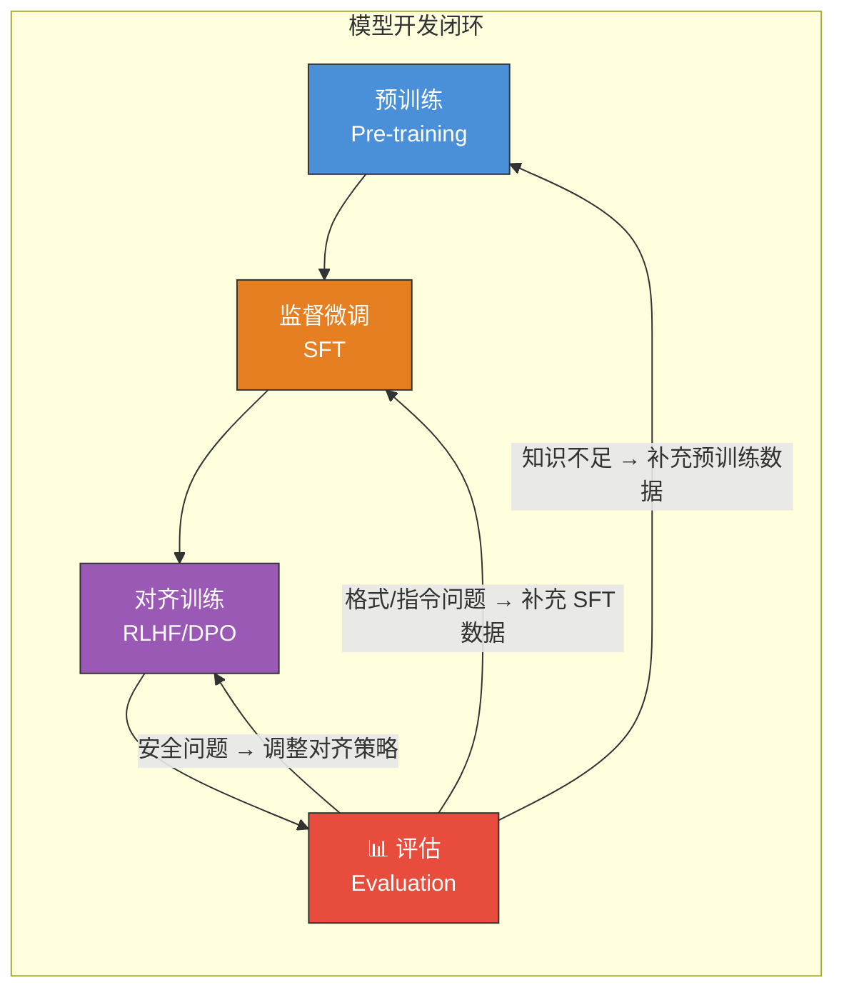
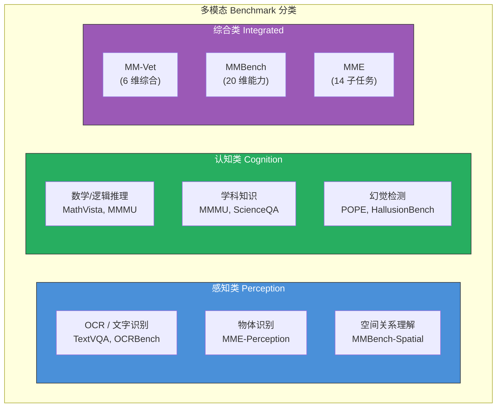
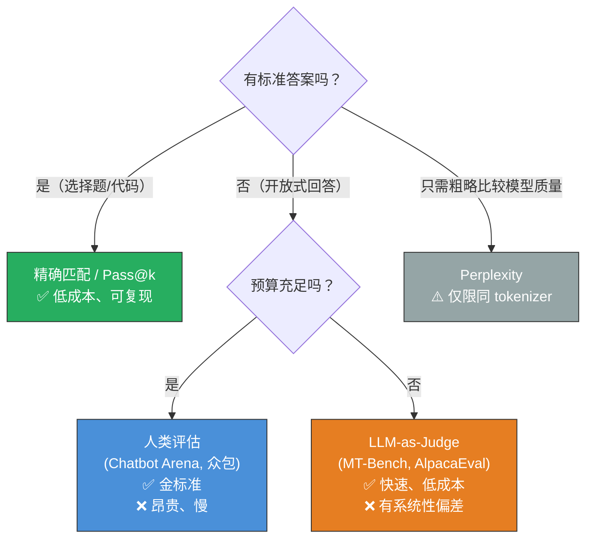
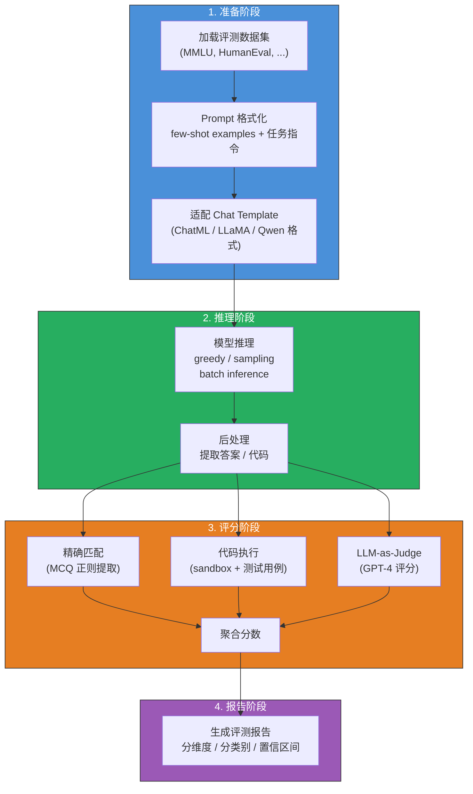

# 大模型评估（LLM/MLLM Evaluation）

> 评估是大模型研发闭环中最容易被低估却最不可或缺的环节——没有好的"考试系统"，你永远不知道模型是真正变强了，还是只是学会了"应试技巧"。

## 关键概念

| 概念 | 含义 |
|------|------|
| Benchmark（基准测试） | 标准化的测试集 + 评价指标的组合，用于衡量模型在特定能力维度上的表现 |
| Perplexity（困惑度） | 语言模型对测试文本的"惊讶程度"，值越低表示模型预测能力越强，数学定义为交叉熵的指数 |
| MMLU | Massive Multitask Language Understanding，57 个学科的多选题测试，衡量 LLM 的知识广度 |
| HumanEval | OpenAI 的代码生成基准，用 Pass@k 指标衡量模型生成功能正确代码的能力 |
| Pass@k | 生成 k 个候选代码样本中至少有一个通过所有测试用例的概率 |
| MMMU | Massive Multi-discipline Multimodal Understanding，需要大学水平学科知识的多模态选择题 |
| POPE（Polling-based Object Probing Evaluation） | 专门检测多模态 LLM 是否产生视觉幻觉的二元问答基准 |
| LLM-as-Judge | 用 GPT-4 等强 LLM 作为自动评委评价模型回复质量，替代昂贵的人类评估 |
| Elo Rating | 源自国际象棋的竞赛评分系统，通过模型之间的 pairwise 对决计算动态排名 |
| Chatbot Arena | LMSYS 开发的众包盲评平台，真实用户对两个匿名模型的回复做偏好投票，使用 Elo 评分 |
| 数据污染（Data Contamination） | 评测数据泄漏到训练集中，导致模型"背答案"而非真正理解，虚假抬高分数 |
| Benchmark Saturation（基准饱和） | 模型在某个基准上接近满分，使该基准失去区分能力 |
| Goodhart's Law | "当一个指标变成目标时，它就不再是好的指标"——对 benchmark gaming 的精确描述 |
| lm-evaluation-harness | EleutherAI 开发的标准化 LLM 评测框架，支持 200+ 任务，开源社区事实标准 |
| VLMEvalKit | OpenCompass 生态的多模态评测工具包，覆盖 70+ 多模态 benchmark |

## 详细笔记

### 一、直觉理解：为什么评估如此重要？

想象你是一位教育局长，需要设计一套"考试系统"来评估全国学生的能力。你面临的挑战和大模型评估惊人地相似：

- **考什么？** → 知识记忆、逻辑推理、编程能力、道德判断、创造力……每一个维度都需要不同的试卷（benchmark）
- **怎么判分？** → 多选题可以机器评分（exact match），但作文需要人工评阅（human evaluation），成本差异巨大
- **如何防作弊？** → 学生可能提前泄题（data contamination），导致分数虚高
- **考试饱和了怎么办？** → 当全班都考 100 分时，这张试卷就失去了区分能力（benchmark saturation）

大模型评估需要回答三个核心问题：
1. **"这个模型够聪明吗？"**（能力评估）→ MMLU、HumanEval、GSM8K
2. **"这个模型可信吗？"**（安全与对齐）→ TruthfulQA、POPE
3. **"哪个模型更好？"**（模型比较）→ Chatbot Arena、MT-Bench

#### 评估在训练闭环中的位置

评估不是一次性的"期末考试"，而是驱动模型迭代的**反馈信号**：



不同训练阶段需要不同的评估重点：

| 训练阶段 | 评估重点 | 典型基准 | 相关笔记 |
|:--------:|----------|----------|----------|
| 预训练 | 知识储备、语言建模能力 | Perplexity, MMLU, HellaSwag | [Transformer](transformer.md) |
| SFT | 指令遵循、对话质量 | MT-Bench, AlpacaEval | [SFT 笔记](../training/supervised-fine-tuning-sft.md) |
| RLHF/DPO | 人类偏好对齐、安全性 | Chatbot Arena, TruthfulQA | [RLHF 笔记](../training/rlhf.md) |
| 多模态 | 视觉理解、幻觉检测 | MMBench, POPE, MMMU | [MLLM 发展历程](../multimodal-arch/mllm-evolution.md) |

### 二、文本 LLM 基准测试

#### 主要 Benchmark 总览

| Benchmark | 任务类型 | 题量 | 评估方式 | 主要测试能力 | 饱和状态 |
|-----------|----------|:----:|----------|-------------|----------|
| **MMLU** | 4-choice QA | ~14K | Accuracy | 57 学科知识广度 | 接近饱和（GPT-4o >90%） |
| **HellaSwag** | 句子补全 | 10K | Accuracy | 常识推理 | 高度饱和（>95%） |
| **ARC-Challenge** | 科学选择题 | 1.2K | Accuracy | 科学推理 | 接近饱和（>96%） |
| **TruthfulQA** | 开放 QA | 817 | MC + 生成 | 事实准确性 / 抗幻觉 | 仍有区分度 |
| **GSM8K** | 数学应用题 | 8.5K | Exact Match | 链式数学推理 | 接近饱和（>95% CoT） |
| **HumanEval** | 代码生成 | 164 | Pass@k | 函数级代码能力 | 接近饱和（Pass@1 >90%） |
| **MBPP** | 代码生成 | 500 | Pass@k | 基础编程能力 | 接近饱和 |
| **WinoGrande** | 指代消解 | 1.7K | Accuracy | 常识理解 | 高度饱和 |
| **BBH** | 推理（23 子任务） | ~6.5K | Exact Match | 多步推理 | 仍有区分度 |

#### 代表性 Benchmark 详解

**MMLU（Massive Multitask Language Understanding）**

覆盖 57 个学科——从高中数学、大学物理到法律、医学、哲学。标准评估使用 5-shot（提供 5 个示例再作答），评估 4 选 1 的 Accuracy。

MMLU 的核心价值在于它是一张"知识广度考卷"。但需注意：
- 4 选 1 有 **25% 的随机基线**
- 多选格式**无法测试开放式生成**能力
- 已有 MMLU-Pro（10 选 1，更多推理题）作为升级版

**HumanEval / MBPP**

HumanEval 包含 164 个 Python 编程题，给出函数签名和 docstring，模型需要生成函数体。使用 **Pass@k** 指标：生成 k 个候选方案，至少有一个通过全部测试用例即算通过。

**GSM8K（Grade School Math 8K）**

8,500 道小学/初中数学应用题，需要多步推理。评估方式为提取最终数字答案做 exact match。此基准是 **Chain-of-Thought** 推理的试金石——使用 CoT 提示可将准确率提升 30-40 个百分点。

**TruthfulQA**

专门设计的 817 个"陷阱题"——这些问题的常见回答往往是**人们普遍相信但实际错误**的信息。例如"如果你吞了口香糖，它会在胃里停留 7 年吗？"——测试模型是否会跟风输出流行但错误的说法。

### 三、多模态基准测试

多模态评估需要同时考察模型的**视觉感知**和**认知推理**能力：



#### 主要多模态 Benchmark

| Benchmark | 类型 | 题量 | 评估方式 | 主要测试能力 | 饱和状态 |
|-----------|------|:----:|----------|-------------|----------|
| **MMBench** | MCQ | 3K+ | Accuracy（20 维） | 多维综合能力 | 仍有区分度 |
| **MMMU** | MCQ | 11.5K | Accuracy | 大学水平学科知识 + 图像理解 | 仍有区分度（最佳 ~70%） |
| **MathVista** | 混合 | 6K+ | Exact Match + GPT-4 | 图表/几何/函数的数学推理 | 仍有区分度 |
| **POPE** | 二元 Yes/No | 3K | Accuracy + F1 | 视觉幻觉检测 | 仍有区分度 |
| **MM-Vet** | 开放式 | 218 | GPT-4 评分 | 6 维综合（OCR+识别+空间+推理+知识+生成） | 仍有区分度 |
| **TextVQA** | 开放式 | 5K | Exact Match | 图像中文字识别与理解 | 接近饱和 |
| **MME** | 二元 Yes/No | 2.4K | Accuracy (分数制) | 14 子任务（感知 + 认知） | 部分饱和 |
| **HallusionBench** | 混合 | 1.1K | Accuracy | 视觉错觉与幻觉诊断 | 仍有区分度 |

#### POPE：幻觉检测的标准方法

POPE 通过简单的二元问答来检测多模态 LLM 是否会"看到"实际不存在的物体：

**问题格式**："Is there a [object] in the image?" → 回答 Yes 或 No

三种采样策略递增难度：
- **Random**：随机选择不在图中的物体 → 基础检测
- **Popular**：选择 COCO 中高频出现的物体 → 测试频率偏差
- **Adversarial**：选择与图中已有物体**高共现率**的物体（如图中有"人"则问"滑板"）→ 最具挑战性

$$\text{Accuracy}_{\text{POPE}} = \frac{TP + TN}{TP + TN + FP + FN}$$

$$F1 = 2 \cdot \frac{\text{Precision} \cdot \text{Recall}}{\text{Precision} + \text{Recall}}$$

其中 FP（False Positive）对应模型**幻觉出不存在的物体**——这是多模态 LLM 最关键的失败模式。

### 四、开放式评估：当没有标准答案时

对于"写一首关于秋天的诗"或"解释量子纠缠"这类开放式任务，不存在唯一正确答案，需要不同的评估范式。

#### 三大开放式评估方法

| 方法 | 评估方式 | 评委 | 成本 | 与人类偏好相关性 | 主要局限 |
|------|----------|------|------|:----------------:|----------|
| **Chatbot Arena** | 众包盲评 pairwise | 真实用户 | 高（需大量投票） | **最高** | 收敛慢，用户群体偏差 |
| **MT-Bench** | 80 题多轮对话 | GPT-4 打分 1-10 | 低 | 高 | 题目固定，易过拟合 |
| **AlpacaEval 2.0** | 805 条指令 | GPT-4/Claude | 极低（<$10） | 0.98 (Spearman) | 依赖自动评委偏好 |

#### Chatbot Arena 与 Elo Rating

Chatbot Arena 被视为当前 LLM 评估的"金标准"：用户提交问题，系统随机分配两个匿名模型回答，用户选择更好的那个。大量投票后通过 Elo 评分系统计算排名。

**Elo 评分更新规则**：

模型 A 对阵模型 B 时，A 的期望胜率为：

$$E_A = \frac{1}{1 + 10^{(R_B - R_A)/400}}$$

实际比赛后更新评分：

$$R_A' = R_A + K \cdot (S_A - E_A)$$

其中：
- $R_A, R_B$：A 和 B 的当前 Elo 评分
- $E_A$：A 的期望胜率（由评分差决定）
- $S_A \in \{0, 0.5, 1\}$：实际结果（输、平、赢）
- $K$：更新系数（控制灵敏度，通常 $K=32$）

**Elo 差值的直觉解读**：

| Elo 差值 | 期望胜率 |
|:--------:|:--------:|
| 0 | 50% |
| 100 | ~64% |
| 200 | ~76% |
| 400 | ~91% |

这与 RLHF 中的 **Bradley-Terry 模型**同根同源——$P(A \succ B) = \sigma(r_A - r_B)$，其中 $\sigma$ 是 sigmoid 函数。Elo 系统本质上就是 Bradley-Terry 模型的在线更新版本。

#### MT-Bench

MT-Bench 包含 8 个类别（写作、角色扮演、推理、数学、编程、提取、STEM、人文）各 10 道多轮对话题（共 80 题）。GPT-4 作为评委对回复打 1-10 分。

**优势**：成本低、可复现、多维度分析
**局限**：题目固定 → 模型可以被针对性优化

#### AlpacaEval 2.0

805 条指令，计算模型回复相对于参考模型（GPT-4 Turbo）的**长度控制胜率（Length-Controlled Win Rate, LC）**。引入长度控制是因为早期版本发现 LLM 评委系统性地偏好更长的回复。

### 五、评估方法论深度解析



#### 5.1 Perplexity（困惑度）

$$\text{PPL}(W) = \exp\left(-\frac{1}{N}\sum_{i=1}^{N} \log P_\theta(w_i \mid w_{<i})\right)$$

PPL 是语言模型对一段文本"困惑程度"的度量。直觉上：如果模型认为"今天天气很好"的概率很高，PPL 就低；如果模型认为这段话"出乎意料"，PPL 就高。

**什么时候有用**：
- 比较**同一 tokenizer** 下不同 checkpoint 的预训练质量
- 快速筛选预训练实验中的超参数

**什么时候会误导**：
- **不同 tokenizer 的 PPL 不可比较**——分词粒度不同，$N$ 的含义就不同
- PPL 低不代表下游任务好——模型可能过拟合训练集
- PPL 无法评估生成质量、安全性、指令遵循等高层能力

#### 5.2 多选题与精确匹配

两种常见实现方式：

**方式一：Log-Probability 法**
- 分别计算模型对 "A"、"B"、"C"、"D" 四个 token 的 log-prob
- 选择 log-prob 最高的选项作为答案
- 优势：确定性、不受格式干扰
- 局限：只适用于可访问 logits 的开源模型

**方式二：生成 + 正则提取**
- 让模型自由生成回答，用正则表达式提取答案字母
- 优势：适用于 API 模型（如 GPT-4）
- 局限：模型可能不按格式回答，提取失败

**Few-shot 的影响**：5-shot MMLU（提供 5 个示例）与 0-shot MMLU（直接作答）测试的能力维度不同——前者额外考察 **in-context learning** 能力。

#### 5.3 LLM-as-Judge

用一个强 LLM（通常是 GPT-4）来评判其他模型的回复质量。两种模式：

1. **单回复评分**（MT-Bench）：给定问题和回答，打 1-10 分
2. **Pairwise 比较**（AlpacaEval）：给定问题和两个回答，选择更好的

**LLM 评委的系统性偏差**：

| 偏差类型 | 表现 | 缓解策略 |
|----------|------|----------|
| **位置偏差（Position Bias）** | 倾向于选择 pairwise 中排在前面的回复 | 交换位置两次评分取平均 |
| **长度偏差（Verbosity Bias）** | 倾向于选择更长的回复 | 长度控制胜率（LC-AlpacaEval） |
| **自我增强偏差（Self-Enhancement）** | GPT-4 倾向于给 GPT-4 自己的回复更高分 | 使用多个不同 LLM 交叉评分 |
| **事实性盲区** | 无法可靠检测事实错误（因为评委自己也可能犯同样的错） | 结合事实性专用工具 |

#### 5.4 人类评估

人类评估是评估的"金标准"，但昂贵且难以标准化。

**Pairwise 比较 vs 绝对评分**：研究表明，让评注员在两个回复中选择更好的那个（pairwise），比让他们给单个回复打 1-10 分（absolute），**一致性显著更高**。这与 RLHF 中偏好数据收集的原理一致——人类更擅长做相对判断而非绝对评分。

**Bradley-Terry 模型**将 pairwise 偏好转化为模型能力值：

$$P(A \succ B) = \sigma(r_A - r_B) = \frac{1}{1 + e^{-(r_A - r_B)}}$$

这正是 RLHF 奖励模型的数学基础（详见 [RLHF 笔记](../training/rlhf.md)）。

#### 5.5 数据污染（Data Contamination）

当 benchmark 数据泄漏到模型的预训练语料中时，模型实际上是在"背答案"而非真正理解——这是大模型评估中最严重的系统性风险。

**检测方法**：
- **n-gram 重叠分析**：检查训练集与测试集之间的 n-gram 重叠率
- **困惑度异常检测**：如果模型对 benchmark 数据的 PPL 异常低（远低于同分布数据），可能存在污染
- **Canary string 插入**：在发布 benchmark 时嵌入特殊标记，事后检查模型是否能"回忆"这些标记

**案例**：已有研究发现多个知名模型在 GSM8K 上存在明显污染痕迹——当题目被改写（保持数学逻辑不变但改变表述）后，模型准确率显著下降，说明模型记忆了题目表面形式而非真正学会了数学推理。

### 六、核心指标深度解析

#### 6.1 分类指标：Accuracy、Precision、Recall、F1

$$\text{Accuracy} = \frac{TP + TN}{TP + TN + FP + FN}$$

$$\text{Precision} = \frac{TP}{TP + FP}, \quad \text{Recall} = \frac{TP}{TP + FN}$$

$$F1 = 2 \cdot \frac{\text{Precision} \cdot \text{Recall}}{\text{Precision} + \text{Recall}}$$

在 POPE 幻觉检测中，F1 比 Accuracy 更重要——因为数据集是平衡的（50% Yes / 50% No），一个总是回答 "Yes" 的模型也能拿到 50% Accuracy，但 Precision 会很低（幻觉严重），F1 能更好地反映这一问题。

#### 6.2 生成指标：BLEU、ROUGE、CIDEr

**BLEU（Bilingual Evaluation Understudy）**——基于 n-gram 精确率：

$$\text{BLEU} = BP \cdot \exp\left(\sum_{n=1}^{N} w_n \log p_n\right)$$

$$BP = \begin{cases} 1 & \text{if } c > r \\ e^{1 - r/c} & \text{if } c \le r \end{cases}$$

其中：
- $p_n$：n-gram 精确率（生成文本中有多少 n-gram 出现在参考文本中）
- $w_n = 1/N$：各阶 n-gram 的权重（通常 $N=4$）
- $BP$：长度惩罚因子（brevity penalty），防止模型通过生成极短文本来刷高精确率
- $c$：生成文本长度，$r$：参考文本长度

**ROUGE（Recall-Oriented Understudy for Gisting Evaluation）**——侧重**召回率**：
- **ROUGE-N**：n-gram 召回率（参考文本中的 n-gram 有多少被生成文本覆盖）
- **ROUGE-L**：基于最长公共子序列（LCS）的 F-score

两者的核心区别：**BLEU 关注生成质量（精确率），ROUGE 关注覆盖完整性（召回率）**。

**CIDEr（Consensus-based Image Description Evaluation）**——用于图像描述评估：
- 使用 TF-IDF 加权的 n-gram 相似度
- 对多个参考描述取共识（consensus），奖励能反映多数参考的核心内容
- 在多模态描述任务中常用

#### 6.3 代码生成指标：Pass@k

$$\text{Pass@}k = \mathbb{E}_{\text{problems}} \left[1 - \frac{\binom{n-c}{k}}{\binom{n}{k}}\right]$$

其中 $n$ = 总生成样本数，$c$ = 通过所有测试用例的正确样本数。

这是 Chen et al. (HumanEval) 提出的**无偏估计器**——直接从 $n$ 个样本中估计"从 $k$ 个样本中至少有一个正确"的概率，避免了朴素估计的偏差。

**Pass@1 vs Pass@k 的区别**：
- **Pass@1** 衡量模型的**可靠性**——一次就对的概率
- **Pass@100** 衡量模型的**潜力**——多次尝试能否覆盖正确解

一个 Pass@1=30% 但 Pass@100=90% 的模型说明：它"知道"正确答案（潜力大），但"说不准确"（可靠性低）。此时可以通过更好的 sampling 策略或 reranking 来提升 Pass@1。

#### 指标总览表

| 指标 | 公式/定义 | 适用场景 | 值域 | 越高/低越好 |
|------|----------|----------|:----:|:----------:|
| Accuracy | 正确数 / 总数 | MCQ（MMLU、ARC） | [0, 1] | 越高越好 |
| F1 | 2PR/(P+R) | 幻觉检测（POPE） | [0, 1] | 越高越好 |
| BLEU | n-gram precision + BP | 翻译、描述 | [0, 1] | 越高越好 |
| ROUGE-L | LCS recall/F1 | 摘要、问答 | [0, 1] | 越高越好 |
| CIDEr | TF-IDF n-gram consensus | 图像描述 | [0, 10] | 越高越好 |
| Pass@k | 功能正确率（无偏估计） | 代码生成 | [0, 1] | 越高越好 |
| Perplexity | exp(-avg log prob) | 语言建模 | [1, +∞) | 越低越好 |
| Elo Rating | 竞赛评分系统 | 开放式对比 | (~800, ~1400) | 越高越好 |

### 七、评估流水线：实际如何运行？

一个完整的评估流程远比"跑一下模型看结果"复杂得多：



#### 关键细节

**Prompt 格式化**：同一个模型在不同 prompt 格式下分数可能差 5-10%。常见变量包括：
- Few-shot 数量（0-shot vs 5-shot vs CoT）
- 指令措辞（"Answer the following question" vs "Please select the correct option"）
- Chat template（`<|im_start|>user` vs `[INST]`）——错误的 template 会导致灾难性的性能下降

**Chain-of-Thought 的影响**：CoT 提示对推理型 benchmark 影响巨大。以 GSM8K 为例，GPT-4 从 ~50%（直接回答）提升到 ~95%（CoT），提升幅度超过 40 个百分点。

**推理配置**：
- **Greedy decoding**（temperature=0）：用于需要确定性的评估（MMLU、GSM8K）
- **Sampling**（temperature>0）：用于 Pass@k 计算，需要多样性
- **Batch inference**：高效评估需要 KV Cache、Flash Attention 等优化技术（详见[大模型优化技术](../training/llm-optimization-techniques.md)）

### 八、多模态评估的特有挑战

#### 8.1 视觉幻觉（Visual Hallucination）

多模态 LLM 最普遍也最危险的问题：模型描述图像中**不存在的物体、属性或关系**。

产生原因：
- **语言先验过强**：LLM backbone 的语言知识"覆盖"了视觉输入——当语言概率足够高时，模型可能无视图像
- **视觉编码器信息损失**：CLIP 等编码器将图像压缩到少量 token，空间细节丢失
- **训练数据偏差**：训练数据中的高频共现模式被模型记忆

缓解方法：
- **RLHF-V / LLaVA-RLHF**：用 RLHF 训练减少幻觉（详见 [RLHF 笔记](../training/rlhf.md)的多模态 RLHF 部分）
- **更强的视觉编码器**：DINOv2 提供的空间特征可补充 CLIP 的语义特征（详见 [DINO 笔记](../vision-language/dino.md)）
- **高分辨率输入**：动态分辨率策略提升细节感知

#### 8.2 空间推理（Spatial Reasoning）

理解"左边"、"上方"、"后面"等空间关系——对当前多模态 LLM 仍是重大挑战。

这与视觉编码器的选择密切相关：
- **CLIP/SigLIP**：擅长"这是什么"（语义分类），弱于"在哪里"（空间位置）
- **DINOv2**：patch 特征保留精确空间信息，空间推理能力更强
- **DINOv2 + SigLIP 融合**（如 Cambrian-1）在空间推理 benchmark 上表现最优

#### 8.3 OCR 与文字理解

图像中的文字识别（TextVQA、OCRBench）是实际应用中的高频需求（文档理解、表格提取等）。

关键挑战：
- **分辨率瓶颈**：低分辨率输入无法清晰呈现小字体
- **多语言支持**：非英语文字识别能力普遍较弱
- **版面理解**：不仅要识别文字，还要理解文档的空间布局

#### 8.4 多模态 Benchmark 的"文本捷径"问题

一个值得警惕的现象：许多多模态 benchmark 的题目，即使**不看图片**也能答对。例如：
- "Is this image taken indoors or outdoors?" → 某些图像描述已经暗示了答案
- 数学推理题目可能只依赖文本中的数字而非图表

这意味着 benchmark 高分可能反映的是**语言推理能力**而非**视觉理解能力**。验证方法：对比"有图"和"无图"两种设置下的分数——如果差异不大，说明 benchmark 的"视觉含金量"不高。

### 九、基准饱和与局限：Goodhart's Law 在 AI 评估中的体现

#### Goodhart's Law

> "When a measure becomes a target, it ceases to be a good measure."
> 当一个指标变成目标时，它就不再是好的指标。

这在 LLM 评估中表现得淋漓尽致：

1. **学术界发布 benchmark** → 社区以此排名
2. **模型团队针对性优化** → 训练数据、prompt、checkpoint 选择都朝 benchmark 倾斜
3. **Benchmark 分数持续上升** → 但实际使用体验不一定同步提升
4. **Benchmark 饱和** → 失去区分能力，社区设计新 benchmark
5. **循环重复**


#### 主要 Benchmark 饱和时间线

| Benchmark | 发布年份 | 人类水平 | 当前最佳（截至 2025） | 状态 |
|-----------|:-------:|:--------:|:-------------------:|------|
| HellaSwag | 2019 | ~95% | >98% | 完全饱和 |
| ARC-Challenge | 2018 | ~80% | >96% | 接近饱和 |
| MMLU | 2020 | ~89.8% (专家) | >90% | 接近饱和 |
| GSM8K | 2021 | ~100% | >95% (CoT) | 接近饱和 |
| HumanEval | 2021 | N/A | >90% (Pass@1) | 接近饱和 |
| MMMU | 2023 | ~88.6% | ~70% | **仍有区分度** |
| POPE | 2023 | ~100% | ~88% | **仍有区分度** |
| MathVista | 2023 | N/A | ~65% | **仍有区分度** |

#### 进化方案：下一代 Benchmark

- **MMLU-Pro**：从 4 选 1 升级到 **10 选 1**，加入更多推理密集型题目，降低猜对概率（10% vs 25%）
- **LiveBench**：自动更新的 benchmark，题目来源于最新数据，**天然避免污染**
- **GPQA（Graduate-Level Google-Proof QA）**：博士水平的专家级问题，设计为搜索引擎不可解决
- **SWE-bench**：真实 GitHub issue 修复，评估端到端的软件工程能力，最接近实际使用场景
- **Chatbot Arena**：由真实用户查询驱动，**天然不可被 gaming**——因为题目来自真实用户，不可预测

### 十、实用评测工具

| 工具 | 文本 LLM | 多模态 LLM | 支持任务数 | 特点 |
|------|:--------:|:----------:|:----------:|------|
| **lm-evaluation-harness** | ✅ | 有限 | 200+ | EleutherAI 开源，社区事实标准 |
| **VLMEvalKit** | ❌ | ✅ | 70+ | OpenCompass 生态，多模态专用 |
| **OpenCompass** | ✅ | ✅ | 100+ | 综合平台，含排行榜 |
| **simple-evals** | ✅ | 部分 | ~10 | OpenAI 维护，轻量级 |
| **bigcode-evaluation-harness** | 代码专用 | ❌ | 10+ | HuggingFace BigCode，代码评测专用 |

#### lm-evaluation-harness（EleutherAI）

开源社区中最广泛使用的 LLM 评测框架。统一接口支持 200+ 任务，使用示例：

```bash
lm_eval --model hf \
    --model_args pretrained=meta-llama/Llama-3-8B \
    --tasks mmlu \
    --num_fewshot 5 \
    --batch_size 8
```

核心优势：
- **标准化**：同一框架下的结果可直接比较
- **全面**：覆盖 MMLU、HellaSwag、ARC、TruthfulQA、GSM8K 等主流 benchmark
- **灵活**：支持 HuggingFace 模型、API 模型、自定义任务

#### VLMEvalKit（OpenCompass）

多模态 LLM 的标准评测工具包，覆盖 70+ 多模态 benchmark，支持 LLaVA、Qwen-VL、InternVL 等主流架构。特别适合需要系统性评估视觉语言模型的场景。

## 个人理解与思考

### 评估比训练更难

训练有明确的损失函数可以优化；评估则需要捕捉"质量"这个**内在多维且主观**的概念。一个模型可以在 MMLU 上 90 分但对话体验很差，也可以在对话中表现出色但数学推理一塌糊涂。

更深层的困境是**自动评估的循环依赖**：我们用 LLM（GPT-4）来评判 LLM——但谁来评判评委本身？Chatbot Arena 用真实人类投票避免了这个问题，但代价是巨大的成本和缓慢的收敛。

### "应试教育"的类比

当前 LLM 评估面临的困境和教育领域惊人地相似：
- **标准化考试**（MMLU、HumanEval）= 高考，规模化、可比较，但容易"应试"
- **Chatbot Arena** = 课堂讨论/答辩，最接近真实能力，但无法标准化
- **MT-Bench** = 模拟考试，固定题目，快速低成本，但可以被"押题"

正如教育界的共识——不应只看考试分数，LLM 评估也需要多维度综合考量。

### 多模态评估仍处初级阶段

当前大多数多模态 benchmark 本质上还是"图片版文字题"——它们测试的更多是模型从图像中提取文字信息然后用语言模型推理的能力，而非深层的视觉理解。真正考验视觉能力的评估（如"这座桥的结构是否安全？"或"这幅画的构图有什么问题？"）还极度缺乏。

DINOv2 的涌现分割能力（详见 [DINO 笔记](../vision-language/dino.md)）暗示着视觉模型实际上具备比 benchmark 所测量的更丰富的空间理解能力——只是我们的评估工具还没跟上。

### 与已有笔记的关联

- **Transformer 架构** → [notes/fundamentals/transformer.md](transformer.md)：自回归生成机制决定了 PPL 的定义；KV Cache 影响评估效率；prompt 处理方式影响 few-shot 评估
- **对比学习** → [notes/fundamentals/contrastive-learning.md](contrastive-learning.md)：CLIP 的对比训练创造了视觉编码器，其质量直接影响多模态 benchmark 分数；Recall@k 是对比模型自身的评估指标
- **SFT** → [notes/training/supervised-fine-tuning-sft.md](../training/supervised-fine-tuning-sft.md)：SFT 模型的评估方法（MT-Bench、AlpacaEval、Chatbot Arena）是本篇讨论的核心内容；Chat Template 正确性对评估分数有直接影响
- **RLHF** → [notes/training/rlhf.md](../training/rlhf.md)：Bradley-Terry 模型是 Elo 评分的数学基础；奖励模型本身就是一个评估器；RLHF-V 用幻觉检测（POPE 风格）来指导训练
- **大模型优化技术** → [notes/training/llm-optimization-techniques.md](../training/llm-optimization-techniques.md)：高效评估依赖 KV Cache、Flash Attention、量化等推理优化技术
- **DINO** → [notes/vision-language/dino.md](../vision-language/dino.md)：视觉编码器选择影响多模态 benchmark 的不同维度——DINOv2 强空间推理，CLIP 强语义分类
- **MLLM 发展历程** → [notes/multimodal-arch/mllm-evolution.md](../multimodal-arch/mllm-evolution.md)：每代多模态模型的进步都由新 benchmark 来衡量和驱动

### 常见误区

| 误区 | 纠正 |
|------|------|
| "MMLU 分数高就是好模型" | MMLU 只测知识广度和多选题能力，不测开放式生成、推理深度和安全性。一个模型 MMLU 90 分但对话体验可能很差 |
| "Chatbot Arena 是完美的评估" | Arena 存在用户群体偏差（技术人员为主）、投票质量参差不齐、对非英语能力测试不足 |
| "Perplexity 低 = 模型更好" | PPL 只衡量语言建模能力，不同 tokenizer 的 PPL 不可比较；PPL 低的模型可能过拟合训练集 |
| "Benchmark 分数可以直接跨论文比较" | 不同论文的 few-shot 数量、prompt 格式、后处理方式都可能不同，同一模型在不同评测中分数差异可达 5-10% |
| "多模态 benchmark 测的是视觉能力" | 很多多模态 benchmark 的题目不看图也能答对（text-only baseline 出奇地高），说明测的更多是语言推理而非视觉理解 |
| "LLM-as-Judge 完全客观" | LLM 评委有长度偏好、位置偏好和自我偏好，且无法可靠评估事实性错误——因为它自己也可能犯同样的错 |
| "Pass@1 和 Pass@100 衡量的是同一回事" | Pass@1 衡量"可靠性"（一次就对），Pass@100 衡量"潜力"（多次尝试能否覆盖正确解），两者反映不同能力 |
| "数据污染只是理论担忧" | 已有研究发现多个知名模型在 GSM8K 等 benchmark 上存在明显污染痕迹，导致分数虚高 |

### 面试/口述版

> 大模型评估是模型开发闭环中不可或缺的反馈信号，需要解决三个核心问题：模型够聪明吗（能力评估）、可信吗（安全对齐）、哪个更好（模型比较）。评估方法分为三大范式：**自动化基准测试**（MMLU 测知识、HumanEval 测代码、GSM8K 测数学推理、POPE 测多模态幻觉）使用 Accuracy/Pass@k 等精确指标；**LLM-as-Judge**（MT-Bench、AlpacaEval）用 GPT-4 作为评委评价开放式回复，成本低但存在长度偏好和位置偏差；**人类评估**（Chatbot Arena）通过真实用户的 pairwise 盲评和 Elo 评分系统产生排名，被视为金标准但成本高且收敛慢。多模态评估面临独特挑战——视觉幻觉检测（POPE）、空间推理、OCR 能力——且许多 benchmark 存在"文本捷径"问题。当前评估生态面临 Goodhart's Law 困境：当 benchmark 变成优化目标时就失去了度量意义，解决方案包括持续更新的 LiveBench、真人驱动的 Chatbot Arena、以及更贴近真实使用的 SWE-bench 等新一代基准。实用工具方面，lm-evaluation-harness 是文本 LLM 的社区标准（200+ 任务），VLMEvalKit 是多模态评测的首选（70+ benchmark）。

## 相关链接

- [MMLU (Hendrycks et al., 2020)](https://arxiv.org/abs/2009.03300) — 57 学科多选题知识基准
- [HumanEval (Chen et al., 2021)](https://arxiv.org/abs/2107.03374) — 代码生成评测与 Pass@k 指标
- [GSM8K (Cobbe et al., 2021)](https://arxiv.org/abs/2110.14168) — 数学推理基准
- [TruthfulQA (Lin et al., 2021)](https://arxiv.org/abs/2109.07958) — 事实准确性与抗幻觉评测
- [POPE (Li et al., 2023)](https://arxiv.org/abs/2305.10355) — 多模态幻觉检测基准
- [MMMU (Yue et al., 2023)](https://arxiv.org/abs/2311.16502) — 大学水平多模态理解评测
- [MMBench (Liu et al., 2023)](https://arxiv.org/abs/2307.06281) — 多维度多模态评测
- [MathVista (Lu et al., 2023)](https://arxiv.org/abs/2310.02255) — 数学视觉推理基准
- [Judging LLM-as-a-Judge / MT-Bench / Chatbot Arena (Zheng et al., 2023)](https://arxiv.org/abs/2306.05685) — LLM-as-Judge 方法论与开放式评测
- [AlpacaEval (Dubois et al., 2024)](https://arxiv.org/abs/2404.04475) — 长度控制的自动评测
- [HELM (Liang et al., 2022)](https://arxiv.org/abs/2211.09110) — Stanford 全面语言模型评测框架
- [lm-evaluation-harness (EleutherAI)](https://github.com/EleutherAI/lm-evaluation-harness) — 标准 LLM 评测框架
- [VLMEvalKit (OpenCompass)](https://github.com/open-compass/VLMEvalKit) — 多模态评测工具包
- [OpenCompass](https://github.com/open-compass/opencompass) — 综合评测平台与排行榜
- [Chatbot Arena Leaderboard](https://huggingface.co/spaces/lmsys/chatbot-arena-leaderboard) — LMSYS 实时排行榜

## 更新日志

- 2026-02-21: 初始创建
