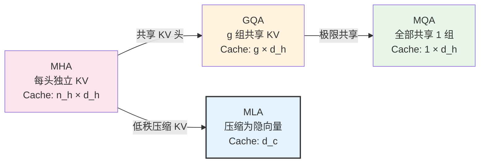
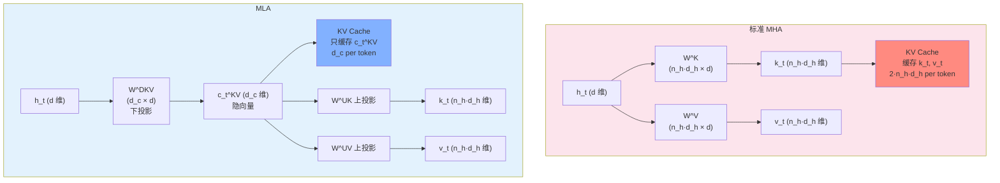
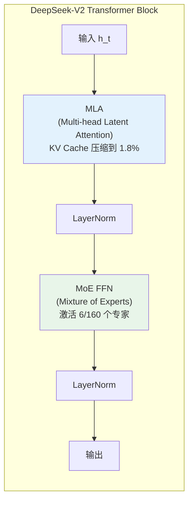

# Multi-head Latent Attention（MLA）

> MLA 是 DeepSeek-V2 提出的注意力机制——它的核心思路是：与其像 GQA 那样"减少 KV 头数"来压缩 KV Cache，不如**用低秩压缩把整个 KV 联合压缩成一个很小的隐向量**，推理时再解压还原。这样既保留了完整 Multi-Head Attention 的表达力，又把 KV Cache 压缩到极致——DeepSeek-V2 的 KV Cache 仅为标准 MHA 的 **5-13%**。

## 关键概念

| 概念 | 含义 |
|------|------|
| MLA（Multi-head Latent Attention） | DeepSeek-V2 提出的注意力机制，通过低秩联合压缩 KV 来极致减少 KV Cache |
| KV Cache | 自回归推理时缓存历史 token 的 Key 和 Value，避免重复计算（详见 [transformer.md](./transformer.md)） |
| MHA（Multi-Head Attention） | 标准多头注意力，每个头独立的 Q、K、V（KV Cache 最大） |
| MQA（Multi-Query Attention） | 所有头共享一组 K、V（KV Cache 最小但表达力受限） |
| GQA（Grouped-Query Attention） | 多个头共享一组 K、V（MHA 和 MQA 的折中） |
| 低秩压缩（Low-rank Compression） | 用低维隐向量表示高维 KV，通过下投影和上投影实现 |
| 隐向量 $c_t^{KV}$ | KV 的联合压缩表征，维度 $d_c \ll n_h d_h$，是 MLA 实际缓存的内容 |
| 下投影（Down-projection） | $W^{DKV}$：将隐藏状态压缩为低维隐向量 |
| 上投影（Up-projection） | $W^{UK}$, $W^{UV}$：从隐向量还原完整的 K 和 V |
| 解耦 RoPE（Decoupled RoPE） | MLA 中单独处理位置编码的技巧，因为旋转操作会破坏低秩压缩结构 |
| MoE（Mixture of Experts） | DeepSeek-V2/V3 使用的稀疏专家架构，与 MLA 配合使用 |

## 详细笔记

### 一、从 MHA 到 MLA：KV Cache 压缩的演进

#### KV Cache 是推理的显存瓶颈

自回归推理时，每生成一个 token 都需要用到所有历史 token 的 Key 和 Value（详见 [transformer.md](./transformer.md)）。KV Cache 的大小：

$$M_{\text{KV}} = 2 \times L \times n_h \times d_h \times s \times b \times \text{bytes}$$

其中 $L$ 是层数，$n_h$ 是 KV 头数，$d_h$ 是头维度，$s$ 是序列长度，$b$ 是 batch size。

对于长序列和大 batch，KV Cache 成为显存的主要瓶颈。

#### 压缩路线一览



| 方法 | KV Cache 大小（每层每 token） | 表达力 | 代表模型 |
|------|:---:|:---:|---------|
| MHA | $2 n_h d_h$ | 最强 | GPT-3, BERT |
| GQA | $2 g d_h$（$g < n_h$） | 强 | LLaMA-2/3, Qwen2 |
| MQA | $2 d_h$ | 较弱 | PaLM, Falcon |
| **MLA** | $d_c$（$d_c \ll 2 n_h d_h$） | **与 MHA 相当** | **DeepSeek-V2/V3** |

**MLA 的独特之处**：GQA/MQA 通过**减少头数**来压缩，牺牲了表达力。MLA 通过**低秩压缩**，在不减少头数的前提下实现更极致的压缩——Cache 只有一个 $d_c$ 维隐向量，但解压后可以还原出所有头的完整 KV。

### 二、MLA 的数学原理

#### 2.1 标准 MHA 回顾

标准 Multi-Head Attention（详见 [transformer.md](./transformer.md)）中，对于输入 $h_t \in \mathbb{R}^d$：

$$q_t = W^Q h_t, \quad k_t = W^K h_t, \quad v_t = W^V h_t$$

其中 $W^Q, W^K, W^V \in \mathbb{R}^{(n_h d_h) \times d}$。

推理时需要缓存所有历史 token 的 $k_t$ 和 $v_t$，每个维度为 $n_h d_h$，总 Cache 大小为 $2 n_h d_h$ per token per layer。

#### 2.2 MLA 的 KV 联合压缩

MLA 的核心洞察：**K 和 V 不需要独立存储，可以联合压缩成一个低维隐向量**。

**步骤一：下投影（压缩）**

$$c_t^{KV} = W^{DKV} h_t$$

其中 $W^{DKV} \in \mathbb{R}^{d_c \times d}$，$d_c \ll n_h d_h$。

$c_t^{KV}$ 就是 KV 的**联合压缩表征**——只有 $d_c$ 维，这是 MLA 实际缓存的内容。

**步骤二：上投影（解压）**

推理时从 $c_t^{KV}$ 还原完整的 K 和 V：

$$k_t = W^{UK} c_t^{KV}, \quad v_t = W^{UV} c_t^{KV}$$

其中 $W^{UK}, W^{UV} \in \mathbb{R}^{(n_h d_h) \times d_c}$。

**等价理解**：

$$k_t = W^{UK} W^{DKV} h_t = \underbrace{W^{UK} W^{DKV}}_{\text{低秩矩阵}} h_t$$

MLA 实际上将标准 MHA 的 $W^K$ 分解为两个低秩矩阵的乘积 $W^{UK} W^{DKV}$。这就是"低秩压缩"的含义。



#### 2.3 Query 的类似压缩

MLA 对 Query 也做了类似的低秩压缩（虽然 Query 不需要缓存，但压缩可以减少计算量）：

$$c_t^Q = W^{DQ} h_t, \quad q_t = W^{UQ} c_t^Q$$

其中 $c_t^Q \in \mathbb{R}^{d_c'}$ 是 Query 的压缩表征。

#### 2.4 压缩比分析

以 DeepSeek-V2 的实际配置为例：

| 参数 | 值 |
|------|:---:|
| 隐藏维度 $d$ | 5120 |
| 注意力头数 $n_h$ | 128 |
| 头维度 $d_h$ | 128 |
| KV 压缩维度 $d_c$ | 512 |
| Q 压缩维度 $d_c'$ | 1536 |

KV Cache 压缩比：

$$\text{压缩比} = \frac{d_c}{2 \times n_h \times d_h} = \frac{512}{2 \times 128 \times 128} = \frac{512}{32768} \approx \mathbf{1.6\%}$$

即 MLA 的 KV Cache 只有标准 MHA 的 **1.6%**！

与 GQA 对比（假设 LLaMA-3 的 8 组 GQA，$d_h=128$）：

$$\text{GQA Cache} = 2 \times 8 \times 128 = 2048 \quad \text{vs} \quad \text{MLA Cache} = 512$$

MLA 的 Cache 只有 GQA 的 **25%**。

### 三、解耦 RoPE：MLA 的关键技巧

#### 3.1 问题：RoPE 破坏低秩结构

RoPE（详见 [positional-encoding.md](./positional-encoding.md)）在 Q 和 K 上应用旋转：

$$\tilde{q}_t = R_t q_t, \quad \tilde{k}_s = R_s k_s$$

注意力得分：

$$\tilde{q}_t^\top \tilde{k}_s = q_t^\top R_t^\top R_s k_s = q_t^\top R_{s-t} k_s$$

如果直接将 RoPE 应用于 MLA 还原出的 K：

$$\tilde{k}_s = R_s \cdot W^{UK} c_s^{KV}$$

那么缓存 $c_s^{KV}$ 就不够了——还需要知道位置 $s$ 才能在推理时还原出正确的 $\tilde{k}_s$。但 $R_s$ 作用在 $W^{UK} c_s^{KV}$ 上，**无法被吸收进 $c_s^{KV}$**（因为旋转矩阵 $R_s$ 随位置变化）。

#### 3.2 解决方案：解耦位置编码

MLA 的解决方案非常巧妙——**将注意力 Key 拆成两部分**：

$$k_t = \begin{bmatrix} k_t^C \\ k_t^R \end{bmatrix}, \quad q_t = \begin{bmatrix} q_t^C \\ q_t^R \end{bmatrix}$$

- **$k_t^C$（Content Key）**：从 $c_t^{KV}$ 还原，**不加 RoPE**。可以被吸收进隐向量的缓存
- **$k_t^R$（Rotary Key）**：单独计算并**加上 RoPE**。需要额外缓存（但维度很小，$d_h^R$）

注意力得分变为：

$$(q_t^C)^\top k_s^C + (R_t q_t^R)^\top (R_s k_s^R) = (q_t^C)^\top k_s^C + (q_t^R)^\top R_{s-t} k_s^R$$

第一项编码**内容相关性**（无位置信息），第二项编码**相对位置信息**。

#### 3.3 MLA 实际缓存内容

因此，MLA 每个 token 实际缓存的是：

$$\text{Cache}_t = \left[ c_t^{KV} \;;\; k_t^R \right] \in \mathbb{R}^{d_c + d_h^R}$$

其中 $d_h^R$ 是 RoPE Key 的维度（DeepSeek-V2 中为 64），远小于完整 KV。

**完整 Cache 大小**：

$$\text{MLA Cache per token} = d_c + d_h^R = 512 + 64 = 576$$

对比标准 MHA：$2 \times 128 \times 128 = 32768$。压缩比约 **1.8%**。

### 四、MLA 的计算流程

#### 4.1 训练时

训练时不需要 KV Cache，MLA 等价于一个低秩分解的 MHA：

```
输入 h_t
├── KV 路径: h_t → W^DKV → c_t^KV → W^UK, W^UV → k_t^C, v_t
├── RoPE Key: h_t → W^KR → k_t^R → apply_rope → k_t^R_rope
├── Q 路径:  h_t → W^DQ → c_t^Q → W^UQ → q_t^C
├── RoPE Query: h_t → W^QR → q_t^R → apply_rope → q_t^R_rope
└── Attention:
    k_t = concat(k_t^C, k_t^R_rope)
    q_t = concat(q_t^C, q_t^R_rope)
    output = softmax(q_t @ k_t^T / sqrt(d)) @ v_t
```

**训练时的优化**：由于 $k_t^C = W^{UK} W^{DKV} h_t$，可以将两个矩阵合并为 $W^K = W^{UK} W^{DKV}$ 直接计算，避免实际构造中间的隐向量。训练效率与标准 MHA 几乎相同。

#### 4.2 推理时

推理时利用 KV Cache，MLA 的显存优势才体现出来：

```
=== Prefill 阶段（处理 prompt）===
for each token t in prompt:
    c_t^KV = W^DKV @ h_t          # 计算隐向量
    k_t^R = apply_rope(W^KR @ h_t) # 计算 RoPE Key
    cache[t] = concat(c_t^KV, k_t^R) # 缓存（只有 d_c + d_h^R 维）

=== Decode 阶段（逐 token 生成）===
for each new token t:
    # 计算 Q
    q_t^C = W^UQ @ (W^DQ @ h_t)
    q_t^R = apply_rope(W^QR @ h_t)
    q_t = concat(q_t^C, q_t^R)

    # 从 cache 还原所有历史 K, V
    for each cached token s:
        c_s^KV, k_s^R = split(cache[s])
        k_s = concat(W^UK @ c_s^KV, k_s^R)  # 上投影还原 K
        v_s = W^UV @ c_s^KV                   # 上投影还原 V

    # 计算注意力
    output = attention(q_t, all_k, all_v)

    # 缓存当前 token
    cache[t] = concat(W^DKV @ h_t, apply_rope(W^KR @ h_t))
```

#### 4.3 推理优化：吸收上投影

实际推理中可以进一步优化——将上投影矩阵吸收进注意力计算：

$$\text{attn}(q, k, v) = \text{softmax}\left(\frac{q^\top k}{\sqrt{d}}\right) v$$

其中 $k_s^C = W^{UK} c_s^{KV}$。注意力得分中的 $(q_t^C)^\top k_s^C = (q_t^C)^\top W^{UK} c_s^{KV}$，可以改写为：

$$\underbrace{((W^{UK})^\top q_t^C)}_{\text{预计算一次}} ^\top c_s^{KV}$$

即先将 $W^{UK}$ 作用于 Q（只计算一次），然后直接与缓存的 $c_s^{KV}$ 做内积——**不需要显式还原 K**。同理 V 的上投影也可以吸收到输出投影中。

### 五、MLA 与 GQA/MQA 的深度对比

| 维度 | MHA | GQA | MQA | MLA |
|------|:---:|:---:|:---:|:---:|
| KV 头数 | $n_h$ | $g$ | 1 | $n_h$（逻辑上） |
| Cache per token | $2 n_h d_h$ | $2 g d_h$ | $2 d_h$ | $d_c + d_h^R$ |
| 7B 模型估算 | 8192 | 2048 | 256 | ~576 |
| 压缩方式 | 无 | 减少头数 | 极限减少头数 | **低秩联合压缩** |
| 表达力损失 | 无 | 轻微 | 明显 | **几乎无** |
| 训练效率 | 基准 | 相同 | 相同 | 相同 |
| 推理额外计算 | 无 | 无 | 无 | 上投影（可吸收） |

**MLA 的优势总结**：

1. **Cache 更小**：即使比 MQA 还小（576 vs 256 取决于具体配置，但 MLA 保留了完整多头）
2. **表达力更强**：每个头仍有独立的 Q、K、V 投影（通过上投影矩阵），不像 GQA/MQA 强迫多个头共享
3. **训练无开销**：低秩分解可以合并，训练时与 MHA 等价

### 六、DeepSeek-V2/V3 中的 MLA 实践

#### 6.1 DeepSeek-V2 的配置

| 参数 | 值 |
|------|:---:|
| 总参数量 | 236B（MoE，激活 21B） |
| 注意力头数 $n_h$ | 128 |
| 头维度 $d_h$ | 128 |
| KV 压缩维度 $d_c$ | 512 |
| Q 压缩维度 $d_c'$ | 1536 |
| RoPE 维度 $d_h^R$ | 64 |
| KV Cache 压缩比 | ~1.8% vs MHA |

#### 6.2 MLA + MoE 的协同

DeepSeek-V2/V3 将 MLA 与 MoE（Mixture of Experts）结合：



- **MLA** 解决注意力层的 KV Cache 问题（推理显存）
- **MoE** 解决 FFN 层的计算效率问题（训练 FLOPs）
- 两者协同使 DeepSeek-V2 在 236B 总参数下只激活 21B，同时 KV Cache 极小

#### 6.3 实际效果

DeepSeek-V2 论文报告：
- KV Cache 减少到 MHA 的 **5.1%**（包括 RoPE 部分）
- 推理吞吐量相比同规模 MHA 模型提升 **5.76x**
- 模型质量与全尺寸 MHA 几乎持平（Benchmark 差异 < 1%）

### 七、MLA 的局限与思考

#### 局限

1. **推理时的上投影开销**：虽然可以吸收，但在某些实现中仍然引入额外的矩阵乘法
2. **与 Flash Attention 的兼容性**：标准 Flash Attention 假设 K/V 已经展开。MLA 的压缩-解压流程需要定制化的 Kernel
3. **训练时无显存优势**：MLA 的低秩分解在训练时会合并，与标准 MHA 的显存占用相同
4. **压缩维度 $d_c$ 的选择**：$d_c$ 太小会损失表达力，太大会丧失压缩优势。需要仔细调参

#### 与其他技术的结合

| 技术组合 | 效果 |
|---------|------|
| MLA + MoE | DeepSeek-V2/V3 的核心架构 |
| MLA + Flash Attention | 需要定制 Kernel，但可以实现 |
| MLA + KV Cache 量化 | 在 MLA 压缩基础上再做 INT8/INT4 量化，进一步减少 Cache |
| MLA + 投机解码 | MLA 的小 Cache 使得投机解码时的显存管理更容易 |

### 八、MLA 的实现要点

#### 伪代码

```python
class MultiHeadLatentAttention(nn.Module):
    def __init__(self, d_model, n_heads, d_c, d_c_q, d_rope):
        super().__init__()
        self.n_heads = n_heads
        self.d_head = d_model // n_heads
        self.d_c = d_c          # KV 压缩维度
        self.d_rope = d_rope    # RoPE 维度

        # KV 压缩
        self.W_DKV = nn.Linear(d_model, d_c, bias=False)       # 下投影
        self.W_UK = nn.Linear(d_c, n_heads * self.d_head, bias=False)  # K 上投影
        self.W_UV = nn.Linear(d_c, n_heads * self.d_head, bias=False)  # V 上投影

        # Q 压缩
        self.W_DQ = nn.Linear(d_model, d_c_q, bias=False)
        self.W_UQ = nn.Linear(d_c_q, n_heads * self.d_head, bias=False)

        # 解耦 RoPE
        self.W_QR = nn.Linear(d_model, d_rope, bias=False)     # Q 的 RoPE 部分
        self.W_KR = nn.Linear(d_model, d_rope, bias=False)     # K 的 RoPE 部分

        # 输出投影
        self.W_O = nn.Linear(n_heads * self.d_head, d_model, bias=False)

    def forward(self, h, rope_cos, rope_sin, kv_cache=None):
        B, T, D = h.shape

        # KV 压缩与还原
        c_kv = self.W_DKV(h)                    # [B, T, d_c]
        k_content = self.W_UK(c_kv)             # [B, T, n_h * d_h]
        v = self.W_UV(c_kv)                     # [B, T, n_h * d_h]

        # Q 压缩与还原
        c_q = self.W_DQ(h)
        q_content = self.W_UQ(c_q)              # [B, T, n_h * d_h]

        # 解耦 RoPE
        q_rope = apply_rope(self.W_QR(h), rope_cos, rope_sin)
        k_rope = apply_rope(self.W_KR(h), rope_cos, rope_sin)

        # 拼接 content + rope
        q = concat_heads(q_content, q_rope)     # 每头: d_h + d_rope
        k = concat_heads(k_content, k_rope)

        # 标准注意力计算
        attn_out = scaled_dot_product_attention(q, k, v)
        return self.W_O(attn_out)

    def get_cache(self, h, rope_cos, rope_sin):
        """推理时只缓存压缩后的内容"""
        c_kv = self.W_DKV(h)                           # [B, 1, d_c]
        k_rope = apply_rope(self.W_KR(h), rope_cos, rope_sin)  # [B, 1, d_rope]
        return torch.cat([c_kv, k_rope], dim=-1)       # [B, 1, d_c + d_rope]
```

## 个人理解与思考

### 交叉引用

1. **[transformer.md](./transformer.md)** — MHA、GQA、MQA 的原理和 KV Cache 机制，是理解 MLA 的直接前置知识
2. **[positional-encoding.md](./positional-encoding.md)** — RoPE 的数学原理，解释了为什么 MLA 需要"解耦 RoPE"
3. **[llm-optimization-techniques.md](../training/llm-optimization-techniques.md)** — KV Cache 显存分析公式、混合精度训练
4. **[grpo.md](../training/grpo.md)** — DeepSeek-R1 基于 DeepSeek-V3 架构（使用 MLA + MoE）
5. **[fsdp.md](../training/fsdp.md)** — MLA 减少的是推理显存（KV Cache），FSDP 减少的是训练显存（模型状态分片），两者互补

### 常见误区

| 误区 | 纠正 |
|------|------|
| "MLA 是另一种 GQA" | GQA 通过减少头数压缩，MLA 通过低秩压缩 KV 联合表征。MLA 保留了完整的多头注意力表达力 |
| "MLA 在训练时也能节省显存" | MLA 的低秩分解在训练时会合并为完整矩阵，显存与 MHA 相同。MLA 的优势在**推理**时的 KV Cache 压缩 |
| "MLA 的隐向量 $c_t^{KV}$ 分别编码 K 和 V" | $c_t^{KV}$ 是 K 和 V 的**联合**压缩表征，通过不同的上投影矩阵还原出 K 和 V |
| "MLA 不需要 RoPE" | MLA 仍然使用 RoPE 编码位置信息，只是用"解耦"的方式处理——Content Key 不加 RoPE，额外的 Rotary Key 单独处理 |
| "压缩一定会损失精度" | MLA 的实验显示模型质量与全尺寸 MHA 几乎持平（差异 < 1%），因为注意力的有效秩通常远低于维度 |
| "MLA 只能用在 DeepSeek 中" | MLA 是通用的注意力机制，可以应用于任何 Transformer 架构。目前 DeepSeek 是最主要的使用者 |

### 面试/口述版

MLA（Multi-head Latent Attention）是 DeepSeek-V2 提出的注意力机制，核心思想是**用低秩压缩替代 GQA 的头数削减**来压缩 KV Cache。具体做法是：将隐藏状态 $h_t$ 通过下投影矩阵 $W^{DKV}$ 压缩为一个低维隐向量 $c_t^{KV}$（维度 $d_c \ll n_h d_h$），推理时再通过上投影矩阵 $W^{UK}$、$W^{UV}$ 还原出完整的多头 K 和 V。KV Cache 只需存储 $c_t^{KV}$ 而非完整的 K 和 V，DeepSeek-V2 中压缩到 MHA 的约 1.8%，比 GQA 还小一个数量级。一个关键技巧是"解耦 RoPE"——因为旋转操作无法被吸收进压缩的隐向量，MLA 将 Key 拆成 Content Key（不加 RoPE，可压缩）和 Rotary Key（加 RoPE，单独缓存一个小维度 $d_h^R$），既保留位置编码又不破坏压缩结构。

## 相关链接

### 核心论文
- [DeepSeek-V2: A Strong, Economical, and Efficient Mixture-of-Experts Language Model (2024)](https://arxiv.org/abs/2405.04434) — MLA 首次提出
- [DeepSeek-V3 Technical Report (2024)](https://arxiv.org/abs/2412.19437) — MLA + MoE 的大规模应用

### 相关技术
- [GQA: Training Generalized Multi-Query Transformer Models from Multi-Head Checkpoints (Ainslie et al., 2023)](https://arxiv.org/abs/2305.13245) — GQA 原始论文
- [Fast Transformer Decoding: One Write-Head is All You Need (Shazeer, 2019)](https://arxiv.org/abs/1911.02150) — MQA 原始论文
- [RoFormer / RoPE (Su et al., 2021)](https://arxiv.org/abs/2104.09864) — 旋转位置编码

### 本仓库相关笔记
- [Transformer 详解](./transformer.md) — MHA/GQA/MQA 和 KV Cache 原理
- [位置编码](./positional-encoding.md) — RoPE 数学推导，解释解耦 RoPE 的必要性
- [GRPO](../training/grpo.md) — DeepSeek-R1 基于 MLA + MoE 架构

## 更新日志

- 2026-03-23: 初始创建，覆盖 MLA 数学原理、解耦 RoPE、KV Cache 压缩比分析、DeepSeek-V2 实践、与 GQA/MQA 对比
