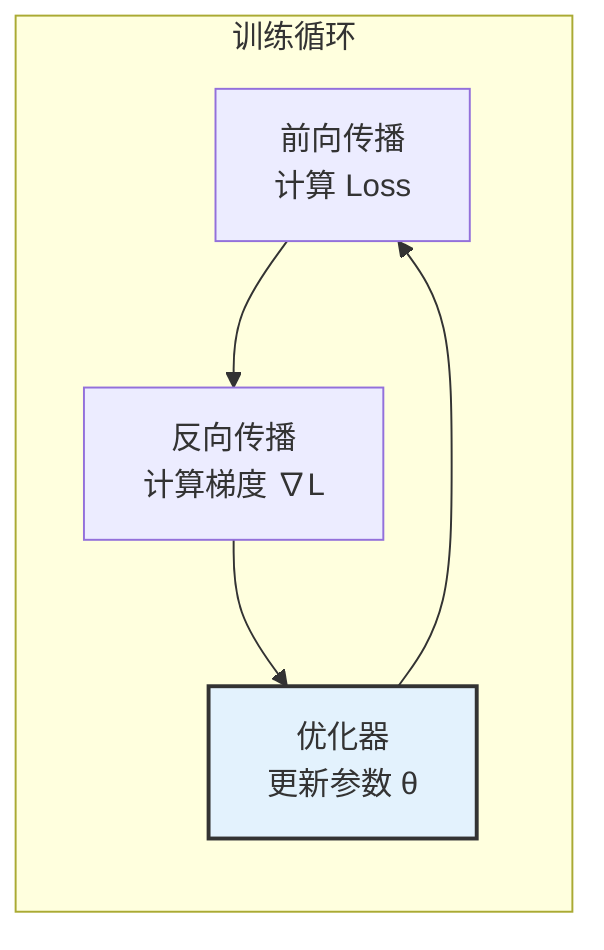
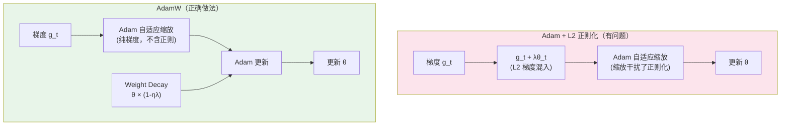
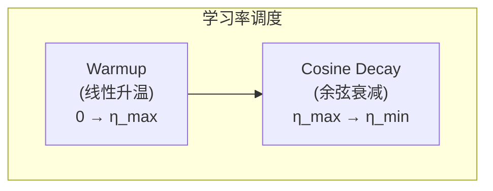
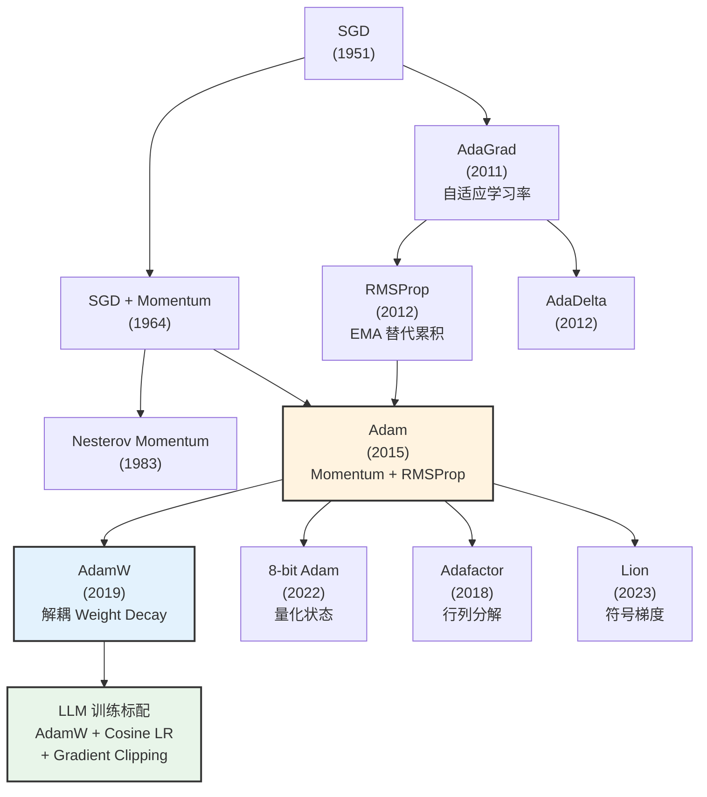

# 优化器：从 SGD 到 AdamW

> 优化器是深度学习的"方向盘"——模型通过损失函数知道"自己错了多少"，而优化器决定"每一步该往哪走、走多远"。从最朴素的梯度下降到现代 LLM 标配的 AdamW，优化器的演进史就是一部"如何更快、更稳地找到好参数"的历史。

## 关键概念

| 概念 | 含义 |
|------|------|
| SGD（Stochastic Gradient Descent） | 随机梯度下降，最基础的优化器 |
| Momentum（动量） | 累积历史梯度方向，加速收敛并减少震荡 |
| Adaptive Learning Rate（自适应学习率） | 根据参数的历史梯度自动调节每个参数的学习率（AdaGrad/RMSProp/Adam） |
| Adam（Adaptive Moment Estimation） | 结合 Momentum（一阶矩）和 RMSProp（二阶矩）的自适应优化器 |
| AdamW | 修正了 Adam 的 Weight Decay 实现，LLM 训练的事实标准 |
| Weight Decay（权重衰减） | 正则化手段，每步将参数乘以 $(1 - \lambda)$ 防止过拟合 |
| Learning Rate Schedule（学习率调度） | 训练过程中动态调整学习率的策略（warmup、cosine decay 等） |
| Warmup | 训练初期从零线性增加学习率到目标值，避免初期不稳定 |
| Cosine Annealing | 学习率按余弦曲线从峰值衰减到最小值 |
| Gradient Clipping（梯度裁剪） | 限制梯度范数上界，防止梯度爆炸 |
| 8-bit Adam | 将优化器状态量化为 INT8 存储，节省 75% 显存 |
| Adafactor | 用行列分解近似二阶矩矩阵，节省显存 |

## 详细笔记

### 一、优化器在训练中的角色

#### 直觉理解

训练神经网络 = 在一个极高维的"山地"中找最低点。

- **损失函数**：告诉你"当前海拔"（Loss 有多大）
- **梯度**：告诉你"最陡的下坡方向"
- **优化器**：决定"往哪走、走多远"——简单地顺着梯度走（SGD），还是参考之前走过的路（Momentum），还是根据地形调整步幅（Adam）



#### 统一数学框架

所有优化器都可以写成：

$$\theta_{t+1} = \theta_t - \eta_t \cdot \Delta_t$$

其中 $\eta_t$ 是学习率，$\Delta_t$ 是**更新方向**。不同优化器的区别在于如何计算 $\Delta_t$。

### 二、SGD：最基础的起点

#### 2.1 Vanilla SGD

$$\theta_{t+1} = \theta_t - \eta \cdot g_t$$

其中 $g_t = \nabla_\theta \mathcal{L}(\theta_t)$ 是当前 mini-batch 的梯度。

**问题**：
- 容易在"峡谷"地形中来回震荡（梯度方向在两壁之间反复横跳）
- 所有参数共用同一个学习率（稀疏特征和稠密特征同等对待）
- 收敛慢

#### 2.2 SGD + Momentum

引入"惯性"——像一个有质量的球在山坡上滚，不会轻易改变方向：

$$m_t = \beta m_{t-1} + g_t$$

$$\theta_{t+1} = \theta_t - \eta \cdot m_t$$

其中 $\beta$（通常 0.9）是动量系数。$m_t$ 是梯度的**指数移动平均**（EMA），累积了历史方向。

**效果**：
- 在一致的方向上加速（多步梯度方向相同 → 动量累积 → 步子越迈越大）
- 在震荡方向上抑制（梯度正负交替 → 动量相消 → 步子变小）

#### 2.3 Nesterov Momentum（NAG）

"先走一步再看梯度"——在动量方向上先走一步，再计算梯度做修正：

$$m_t = \beta m_{t-1} + \nabla_\theta \mathcal{L}(\theta_t - \eta \beta m_{t-1})$$

$$\theta_{t+1} = \theta_t - \eta \cdot m_t$$

Nesterov 的"前瞻"性质让它在接近最优解时减速更快，收敛更稳定。

### 三、自适应学习率：让每个参数有自己的步幅

#### 3.1 AdaGrad（2011）

核心思想：**对频繁更新的参数降低学习率，对稀疏更新的参数提高学习率**。

$$v_t = v_{t-1} + g_t^2$$

$$\theta_{t+1} = \theta_t - \frac{\eta}{\sqrt{v_t} + \epsilon} \cdot g_t$$

$v_t$ 累积了历史梯度的平方和。梯度大的参数 → $v_t$ 大 → 有效学习率 $\eta / \sqrt{v_t}$ 小。

**问题**：$v_t$ 只增不减，学习率**单调递减**，后期可能降到接近零，导致训练过早停止。

#### 3.2 RMSProp（2012, Hinton）

修复 AdaGrad 的学习率单调衰减问题——用**指数移动平均**替代累积和：

$$v_t = \beta v_{t-1} + (1-\beta) g_t^2$$

$$\theta_{t+1} = \theta_t - \frac{\eta}{\sqrt{v_t} + \epsilon} \cdot g_t$$

$\beta$（通常 0.99）控制遗忘速度。旧梯度的影响逐渐衰减 → 学习率不会降到零。

### 四、Adam：深度学习的默认优化器

#### 4.1 核心思想

Adam = **Momentum（一阶矩）+ RMSProp（二阶矩）+ 偏差修正**

$$m_t = \beta_1 m_{t-1} + (1-\beta_1) g_t \quad \text{(一阶矩：梯度的 EMA，即 Momentum)}$$

$$v_t = \beta_2 v_{t-1} + (1-\beta_2) g_t^2 \quad \text{(二阶矩：梯度平方的 EMA，即 RMSProp)}$$

**偏差修正**（训练初期 $m_t$ 和 $v_t$ 偏向零，需要修正）：

$$\hat{m}_t = \frac{m_t}{1 - \beta_1^t}, \quad \hat{v}_t = \frac{v_t}{1 - \beta_2^t}$$

**参数更新**：

$$\theta_{t+1} = \theta_t - \eta \cdot \frac{\hat{m}_t}{\sqrt{\hat{v}_t} + \epsilon}$$

#### 4.2 各项的直觉

| 组件 | 作用 | 类比 |
|------|------|------|
| $\hat{m}_t$（一阶矩） | 平滑的梯度方向 | "往哪走"（带惯性的方向） |
| $\hat{v}_t$（二阶矩） | 梯度幅度的历史统计 | "这个方向有多颠簸" |
| $\hat{m}_t / \sqrt{\hat{v}_t}$ | 自适应调整 | 颠簸的方向迈小步，平坦的方向迈大步 |

#### 4.3 默认超参数

| 参数 | 默认值 | 含义 |
|------|:------:|------|
| $\eta$（学习率） | 1e-3（小模型）/ 3e-4（LLM） | 基础步长 |
| $\beta_1$ | 0.9 | 一阶矩衰减率（Momentum 强度） |
| $\beta_2$ | 0.999（小模型）/ 0.95（LLM） | 二阶矩衰减率 |
| $\epsilon$ | 1e-8 | 防止除零的小常数 |

**LLM 中 $\beta_2 = 0.95$ 的原因**：LLM 训练的梯度分布变化快（不同 batch 的数据差异大），更小的 $\beta_2$ 让二阶矩更快适应最新的梯度分布。

#### 4.4 Adam 的显存开销

Adam 需要为每个参数维护两个额外状态（$m_t$ 和 $v_t$），这在大模型训练中是**显存的最大来源**：

| 存储内容 | 精度 | 每参数字节 | 7B 模型 |
|---------|:----:|:---------:|:-------:|
| FP16 参数 | FP16 | 2 | 14 GB |
| FP16 梯度 | FP16 | 2 | 14 GB |
| FP32 参数副本 | FP32 | 4 | 28 GB |
| FP32 $m_t$（momentum） | FP32 | 4 | 28 GB |
| FP32 $v_t$（variance） | FP32 | 4 | 28 GB |
| **总计** | | **16** | **112 GB** |

优化器状态占了 75%！这就是 ZeRO 首先分片优化器状态的原因（详见 [deepspeed.md](../training/deepspeed.md) 和 [fsdp.md](../training/fsdp.md)）。

### 五、AdamW：LLM 的事实标准

#### 5.1 Adam 的 Weight Decay 问题

L2 正则化在标准 SGD 中等价于 Weight Decay：

$$\mathcal{L}_{\text{reg}} = \mathcal{L} + \frac{\lambda}{2}\|\theta\|^2 \implies g_t^{\text{reg}} = g_t + \lambda\theta_t$$

$$\theta_{t+1} = \theta_t - \eta(g_t + \lambda\theta_t) = (1 - \eta\lambda)\theta_t - \eta g_t$$

但在 Adam 中，L2 正则项的梯度 $\lambda\theta_t$ 也会被自适应学习率缩放：

$$\Delta_t = \frac{\hat{m}_t}{\sqrt{\hat{v}_t} + \epsilon}, \quad \text{其中 } m_t \text{ 和 } v_t \text{ 包含了 } \lambda\theta_t$$

这意味着**大权重被"缩放"后的衰减效果不一致**——Adam 的自适应机制"干扰"了正则化。

#### 5.2 AdamW 的修正

AdamW（Loshchilov & Hutter, 2019）将 Weight Decay **从梯度计算中解耦出来**，直接作用于参数更新：

$$m_t = \beta_1 m_{t-1} + (1-\beta_1) g_t \quad \text{(不包含正则项)}$$

$$v_t = \beta_2 v_{t-1} + (1-\beta_2) g_t^2$$

$$\theta_{t+1} = (1 - \eta\lambda)\theta_t - \eta \cdot \frac{\hat{m}_t}{\sqrt{\hat{v}_t} + \epsilon}$$

Weight Decay $(1 - \eta\lambda)$ **直接乘在参数上**，不经过 Adam 的自适应机制。



#### 5.3 LLM 训练中的 AdamW 配置

现代 LLM 训练的典型 AdamW 配置（详见 [llm-pretraining.md](../training/llm-pretraining.md)）：

| 参数 | 典型值 | 说明 |
|------|:------:|------|
| 学习率 $\eta$ | 3e-4 ~ 1e-4 | 模型越大，学习率越小 |
| $\beta_1$ | 0.9 | 标准值 |
| $\beta_2$ | 0.95 | LLM 通常用 0.95 而非 0.999 |
| Weight Decay $\lambda$ | 0.1 | 常见值 |
| $\epsilon$ | 1e-8 | 标准值 |
| Gradient Clipping | 1.0 | 最大梯度范数 |

### 六、学习率调度

优化器的学习率通常不是固定的，而是按照精心设计的**调度策略**变化。

#### 6.1 Warmup + Cosine Decay（LLM 标配）



$$\eta_t = \begin{cases} \eta_{\max} \cdot \frac{t}{T_{\text{warmup}}} & t \le T_{\text{warmup}} \\ \eta_{\min} + \frac{1}{2}(\eta_{\max} - \eta_{\min})\left(1 + \cos\left(\frac{t - T_{\text{warmup}}}{T_{\text{total}} - T_{\text{warmup}}} \cdot \pi\right)\right) & t > T_{\text{warmup}} \end{cases}$$

**Warmup 的必要性**：
- 训练初期参数随机，梯度方向不可靠
- 大学习率 + 随机梯度 → 参数剧烈震荡 → 可能发散
- 先用小学习率"热身"，等梯度方向稳定后再加大步伐

**Cosine Decay 的优势**：
- 前期衰减慢（大学习率探索广阔区域），后期衰减快（小学习率精细调整）
- 比阶梯式衰减更平滑，避免学习率突变导致的训练不稳定

#### 6.2 原始 Transformer 的学习率调度

$$\eta_t = d_{\text{model}}^{-0.5} \cdot \min(t^{-0.5}, \; t \cdot T_{\text{warmup}}^{-1.5})$$

先线性 warmup，再按 $t^{-0.5}$ 衰减。现代 LLM 基本都改用 Cosine Decay。

#### 6.3 常见调度策略对比

| 策略 | 特点 | 使用场景 |
|------|------|---------|
| Constant | 固定学习率 | 快速实验、微调 |
| Step Decay | 每 N 步乘以 $\gamma$ | 传统 CV 训练 |
| Cosine Annealing | 余弦曲线衰减 | **LLM 预训练标配** |
| Linear Decay | 线性降到零 | 微调（BERT fine-tuning） |
| WSD（Warmup-Stable-Decay） | warmup → 稳定 → 衰减 | LLaMA-3 预训练 |

### 七、梯度裁剪

大模型训练容易出现**梯度爆炸**（某个 batch 的梯度异常大），导致参数更新过猛甚至 NaN。

#### 7.1 范数裁剪（Norm Clipping）

$$g_t \leftarrow \begin{cases} g_t & \text{if } \|g_t\| \le C \\ C \cdot \frac{g_t}{\|g_t\|} & \text{if } \|g_t\| > C \end{cases}$$

当梯度范数超过阈值 $C$（通常 1.0），将梯度等比缩放到范数恰好等于 $C$。**方向不变，只缩小步长**。

```python
# PyTorch 实现
torch.nn.utils.clip_grad_norm_(model.parameters(), max_norm=1.0)
```

#### 7.2 为什么几乎所有 LLM 都用梯度裁剪

- LLM 的序列很长，梯度方差大
- 混合精度训练中 FP16 的数值范围有限（详见 [llm-optimization-techniques.md](../training/llm-optimization-techniques.md)）
- 一次梯度爆炸就可能让训练崩溃，裁剪是"安全网"

### 八、优化器的显存优化

#### 8.1 8-bit Adam（bitsandbytes）

将 Adam 的 $m_t$ 和 $v_t$ 从 FP32 量化为 INT8 存储，显存减少 75%：

| 存储 | 标准 Adam | 8-bit Adam |
|------|:---------:|:----------:|
| $m_t$ per param | 4 bytes (FP32) | 1 byte (INT8) |
| $v_t$ per param | 4 bytes (FP32) | 1 byte (INT8) |
| 7B 模型优化器总计 | 56 GB | **14 GB** |

通过**分块量化**（block-wise quantization）+ 动态缩放因子保持精度。实际训练质量与 FP32 Adam 几乎无差异。

```python
import bitsandbytes as bnb

optimizer = bnb.optim.Adam8bit(
    model.parameters(), lr=3e-4, betas=(0.9, 0.95)
)
```

#### 8.2 Adafactor

用**行列分解**近似二阶矩矩阵，进一步减少显存：

标准 Adam 对权重矩阵 $W \in \mathbb{R}^{m \times n}$ 存储完整的 $v \in \mathbb{R}^{m \times n}$。

Adafactor 将 $v$ 分解为行因子 $r \in \mathbb{R}^m$ 和列因子 $c \in \mathbb{R}^n$：

$$\hat{v}_{ij} \approx \frac{r_i \cdot c_j}{\text{mean}(r) \cdot \text{mean}(c)}$$

显存从 $O(mn)$ 降到 $O(m + n)$。T5 使用 Adafactor 作为默认优化器。

#### 8.3 显存对比

| 优化器 | 每参数额外字节 | 7B 模型优化器显存 | 训练质量 |
|--------|:-----------:|:---------------:|:--------:|
| Adam (FP32) | 8 | 56 GB | 最佳 |
| 8-bit Adam | 2 | 14 GB | 几乎无损 |
| Adafactor | ~2 | ~14 GB | 轻微下降 |
| SGD+Momentum | 4 | 28 GB | 明显下降（LLM 不推荐） |
| SGD | 0 | 0 | 极差（LLM 不可用） |

### 九、优化器演化全景图



### 十、实战配置总结

#### LLM 预训练的标准配置

```python
# PyTorch 实现
optimizer = torch.optim.AdamW(
    model.parameters(),
    lr=3e-4,
    betas=(0.9, 0.95),
    weight_decay=0.1,
    eps=1e-8,
)

scheduler = torch.optim.lr_scheduler.CosineAnnealingLR(
    optimizer, T_max=total_steps, eta_min=1e-5
)

# 训练循环
for step, batch in enumerate(dataloader):
    optimizer.zero_grad()
    loss = model(batch)
    loss.backward()
    torch.nn.utils.clip_grad_norm_(model.parameters(), max_norm=1.0)
    optimizer.step()
    scheduler.step()
```

#### 微调的典型配置

| 参数 | 全参数微调 | LoRA 微调 |
|------|:---------:|:--------:|
| 优化器 | AdamW | AdamW |
| 学习率 | 1e-5 ~ 5e-5 | 1e-4 ~ 3e-4 |
| Weight Decay | 0.01 | 0.0 |
| $\beta_1, \beta_2$ | 0.9, 0.999 | 0.9, 0.999 |
| 调度 | Linear Decay | Cosine / Linear |
| 梯度裁剪 | 1.0 | 1.0 |

## 个人理解与思考

### 交叉引用

1. **[llm-optimization-techniques.md](../training/llm-optimization-techniques.md)** — Adam 显存分析、8-bit Adam 和 Adafactor 的实现细节、混合精度训练
2. **[llm-pretraining.md](../training/llm-pretraining.md)** — AdamW + Cosine LR 在 LLM 预训练中的典型配置
3. **[deepspeed.md](../training/deepspeed.md)** — ZeRO 分片首先分片的就是优化器状态（占显存 75%）
4. **[fsdp.md](../training/fsdp.md)** — FSDP 的显存节省同样依赖分片优化器状态
5. **[transformer.md](./transformer.md)** — 原始 Transformer 的 warmup + inverse sqrt 学习率调度
6. **[supervised-fine-tuning-sft.md](../training/supervised-fine-tuning-sft.md)** — 微调阶段的优化器配置（更小学习率）
7. **[reinforcement-learning.md](./reinforcement-learning.md)** — PPO 的策略优化也使用 Adam 系列优化器

### 常见误区

| 误区 | 纠正 |
|------|------|
| "Adam 和 AdamW 差不多" | AdamW 修正了 Adam 中 Weight Decay 被自适应学习率"干扰"的问题。在有正则化的训练中两者差异显著，LLM 应始终使用 AdamW |
| "学习率越大训练越快" | 学习率过大会导致训练不稳定甚至发散。LLM 训练中学习率和模型大小反相关——模型越大学习率越小 |
| "Warmup 不重要" | 训练初期参数随机、梯度不可靠，大学习率会导致灾难性更新。Warmup 是 LLM 训练不可省略的步骤 |
| "SGD 不如 Adam" | SGD+Momentum 在 CV 任务（如 ImageNet）中的泛化能力可能优于 Adam。"Adam 更好"主要在 NLP/LLM 领域成立 |
| "优化器状态不占多少显存" | Adam 的两个状态 ($m_t$, $v_t$) 占训练总显存的 **75%**。这是 ZeRO/FSDP 首先分片优化器的原因 |
| "Cosine Decay 到零最好" | 通常设 `eta_min` 为峰值的 1-10%（如 3e-4 → 1e-5），完全衰减到零后期训练几乎停滞 |
| "$\beta_2$ 用默认 0.999 就行" | LLM 训练中 $\beta_2 = 0.95$ 是常见选择。0.999 的二阶矩更新太慢，跟不上 LLM 梯度分布的快速变化 |

### 面试/口述版

优化器的演进从 SGD 出发，经历了两条路线的融合：**Momentum**（一阶矩 $m_t$，累积梯度方向提供惯性）和**自适应学习率**（二阶矩 $v_t$，根据梯度幅度自动调节每个参数的步长）。**Adam** 将两者结合——用 $\hat{m}_t / \sqrt{\hat{v}_t}$ 做更新，既有惯性又有自适应性，并加入偏差修正解决初期估计偏差。**AdamW** 进一步修正了 Weight Decay 的实现，将其从梯度计算中解耦出来直接作用于参数（$\theta \leftarrow (1-\eta\lambda)\theta$），成为 LLM 训练的事实标准。现代 LLM 训练的标配是 AdamW + Cosine LR（Warmup → 余弦衰减）+ Gradient Clipping，但 Adam 的优化器状态（$m_t$, $v_t$）占训练显存的 75%——这正是 ZeRO/FSDP 首先分片优化器状态的原因，也催生了 8-bit Adam 和 Adafactor 等显存优化方案。

## 相关链接

### 核心论文
- [Adam: A Method for Stochastic Optimization (Kingma & Ba, 2015)](https://arxiv.org/abs/1412.6980) — Adam 原始论文
- [Decoupled Weight Decay Regularization (Loshchilov & Hutter, 2019)](https://arxiv.org/abs/1711.05101) — AdamW
- [8-bit Optimizers via Block-wise Quantization (Dettmers et al., 2022)](https://arxiv.org/abs/2110.02861) — 8-bit Adam
- [Adafactor: Adaptive Learning Rates with Sublinear Memory Cost (Shazeer & Stern, 2018)](https://arxiv.org/abs/1804.04235) — Adafactor
- [Symbolic Discovery of Optimization Algorithms (Chen et al., 2023)](https://arxiv.org/abs/2302.06675) — Lion 优化器

### 经典参考
- [An Overview of Gradient Descent Optimization Algorithms (Ruder, 2016)](https://arxiv.org/abs/1609.04747) — 优化器综述
- [On the Variance of the Adaptive Learning Rate and Beyond (Liu et al., 2020)](https://arxiv.org/abs/1908.03265) — RAdam

### 本仓库相关笔记
- [LLM 优化技术](../training/llm-optimization-techniques.md) — 优化器显存分析和分布式训练中的优化器分片
- [LLM 预训练](../training/llm-pretraining.md) — AdamW 在预训练中的具体配置
- [DeepSpeed](../training/deepspeed.md) — ZeRO 分片优化器状态
- [FSDP](../training/fsdp.md) — PyTorch 原生优化器状态分片

## 更新日志

- 2026-03-23: 初始创建，覆盖 SGD → Momentum → AdaGrad → RMSProp → Adam → AdamW 演进、学习率调度、梯度裁剪、显存优化（8-bit Adam/Adafactor）
