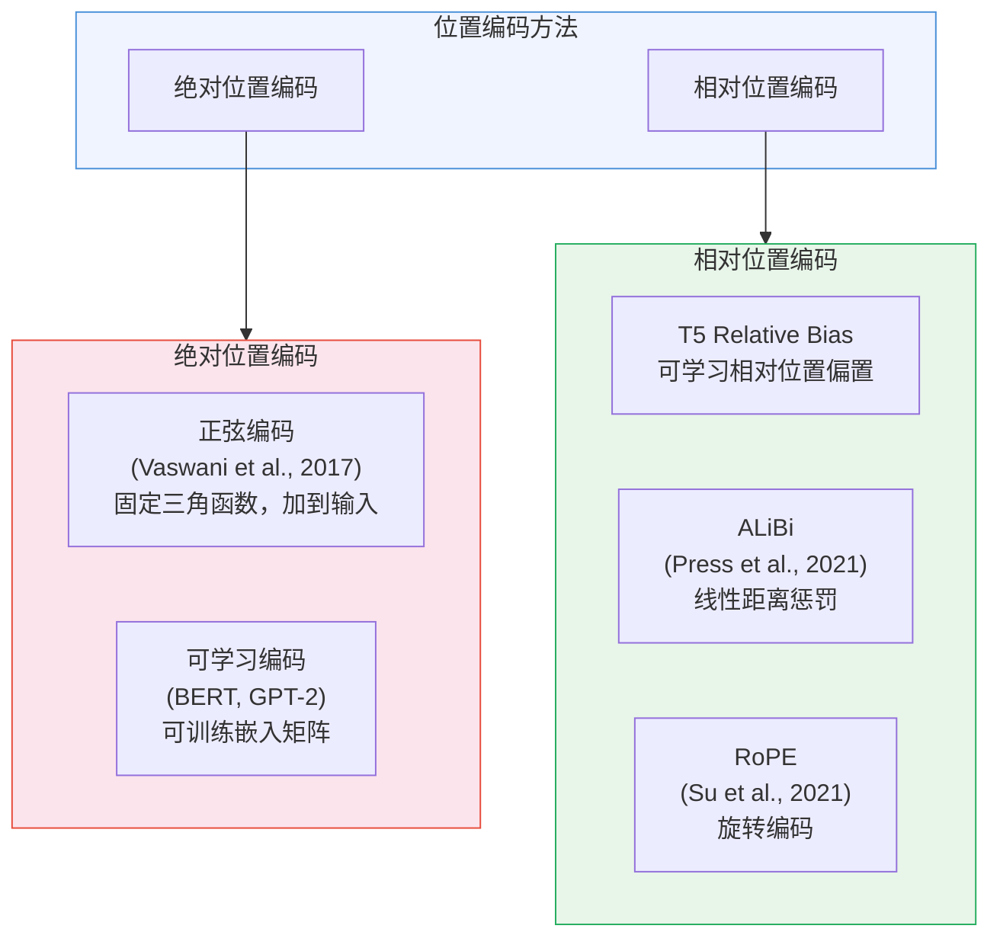
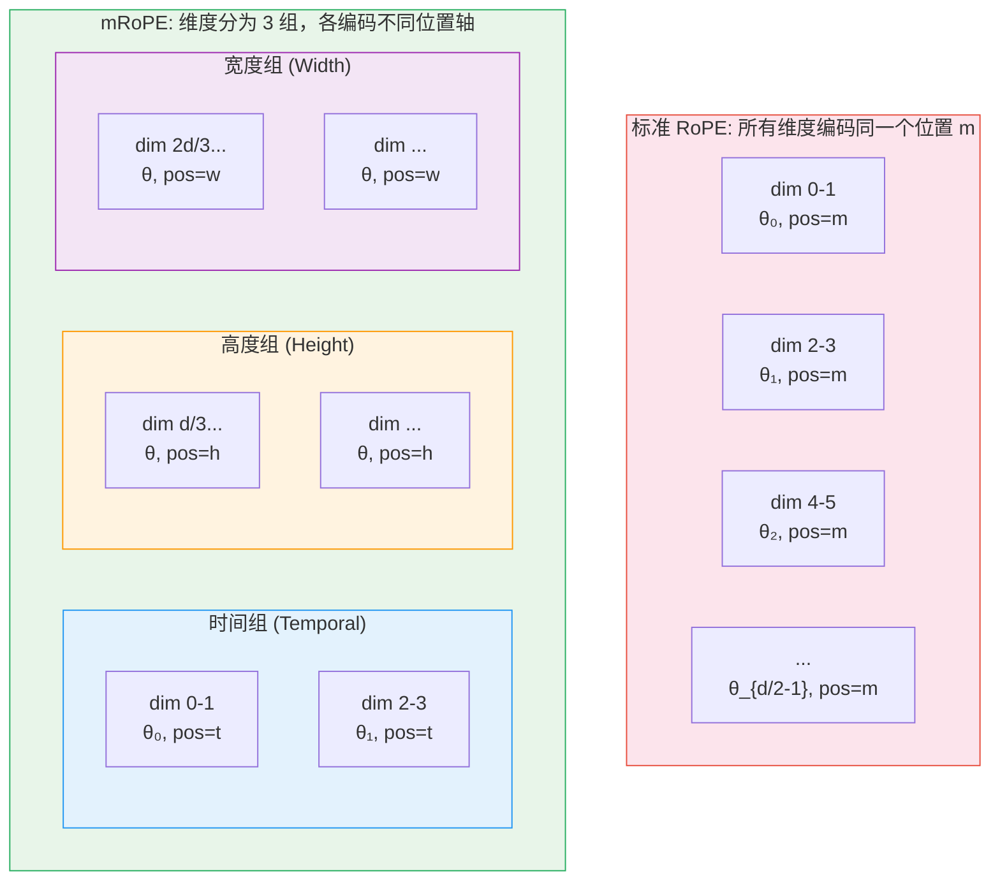

# 位置编码详解：从正弦编码到 RoPE 与 mRoPE

> 位置编码是 Transformer 架构中最关键的"隐形组件"——没有它，Transformer 连"猫追狗"和"狗追猫"都分不清。本篇从基础出发，深入推导 RoPE 的数学原理，并延伸到多模态场景下的 mRoPE。

## 关键概念

| 概念 | 含义 |
|------|------|
| Positional Encoding（位置编码） | 为无序的 Transformer 注入位置信息，使模型能区分 token 顺序 |
| Absolute PE（绝对位置编码） | 为每个位置分配固定编码向量，直接加到输入 embedding 上（正弦编码、可学习编码） |
| Relative PE（相对位置编码） | 编码 token 之间的相对距离而非绝对位置（T5 bias、ALiBi、RoPE） |
| RoPE（Rotary Position Embedding） | 通过复数空间旋转编码位置，使注意力得分天然只依赖相对位置 |
| mRoPE（Multi-dimensional RoPE） | 将 RoPE 维度分组，分别编码时间/高度/宽度，适配多模态输入 |
| Position Interpolation（PI） | 通过位置缩放将长序列压缩到训练长度范围内，实现上下文扩展 |
| NTK-aware Scaling | 替换 RoPE 基础频率实现非均匀频率缩放，无需微调 |
| YaRN | 结合 NTK-by-parts 插值和注意力温度缩放的 SOTA 长上下文方法 |
| ALiBi（Attention with Linear Biases） | 不使用位置编码，而在注意力分数上加线性距离惩罚 |

## 详细笔记

### 一、为什么需要位置编码？

#### Transformer 的置换不变性

Transformer 的核心运算是 Self-Attention：

$$\text{Attention}(Q, K, V) = \text{softmax}\left(\frac{QK^\top}{\sqrt{d_k}}\right)V$$

这个运算对输入序列的**顺序完全不敏感**——数学上称为"置换不变性"（permutation invariant）。如果交换两个输入 token 的位置，Q、K、V 矩阵的行也只是对应交换，最终 Attention 输出的行也只是交换位置，但**每一行的内容完全不变**。

这意味着以下两个句子对 Transformer 来说完全相同：

```
"The cat sat on the mat"  →  token 集合 {The, cat, sat, on, the, mat}
"The mat sat on the cat"  →  token 集合 {The, mat, sat, on, the, cat}
```

没有位置信息，模型无法区分"猫坐在垫子上"和"垫子坐在猫上"！

**直觉理解**：RNN 通过"逐步处理"天然拥有位置感知——先读到的就是靠前的。但 Transformer 一次看到所有 token，就像把一整副扑克牌铺在桌上而非按顺序翻开——你需要额外给每张牌标上编号。

#### 位置编码的必要性

位置编码为 Transformer 注入两类关键信息：
1. **绝对位置**：token 在序列中的具体位置（第 1 个、第 2 个...）
2. **相对位置**：两个 token 之间的距离（间隔 3 个位置、相邻...）

现代研究发现，对语言建模而言**相对位置比绝对位置更重要**——因为语法和语义关系（主谓关系、修饰关系）通常取决于词的相对距离，而非它们在整个文档中的绝对位置。

### 二、位置编码分类法



| 对比维度 | 绝对位置编码 | 相对位置编码 |
|----------|:----------:|:----------:|
| 编码内容 | token 的绝对位置 $m$ | token 对之间的距离 $m - n$ |
| 注入方式 | 加到输入 embedding | 作用在注意力计算中 |
| 长度泛化 | 差（超出训练长度性能骤降） | 好（相对距离可泛化） |
| 代表方法 | 正弦编码、可学习编码 | RoPE、ALiBi、T5 bias |
| 现代 LLM | 基本不用 | RoPE 是事实标准 |

**为什么相对位置编码更适合长度泛化？** 绝对编码直接记忆"第 1024 个位置长什么样"，从未见过第 2048 个位置就无法处理。而相对编码只记忆"距离 5 意味着什么"——这种知识在任何长度的序列中都适用。

### 三、正弦位置编码（Original Transformer）

原始 Transformer（Vaswani et al., 2017）使用固定的三角函数生成位置编码：

$$PE_{(pos, 2i)} = \sin\left(\frac{pos}{10000^{2i/d_{\text{model}}}}\right)$$

$$PE_{(pos, 2i+1)} = \cos\left(\frac{pos}{10000^{2i/d_{\text{model}}}}\right)$$

其中 $pos$ 是 token 位置（0, 1, 2, ...），$i$ 是维度索引（$0 \le i < d_{\text{model}}/2$）。

**使用方式**：直接**加到**输入 embedding 上：

$$\text{input}_m = \text{Embedding}(x_m) + PE_{m}$$

#### 关键性质：可表达相对位置

对于固定偏移 $k$，$PE_{pos+k}$ 可以表示为 $PE_{pos}$ 的**线性变换**：

$$\begin{bmatrix} \sin((pos+k)\theta_i) \\ \cos((pos+k)\theta_i) \end{bmatrix} = \begin{bmatrix} \cos(k\theta_i) & \sin(k\theta_i) \\ -\sin(k\theta_i) & \cos(k\theta_i) \end{bmatrix} \begin{bmatrix} \sin(pos \cdot \theta_i) \\ \cos(pos \cdot \theta_i) \end{bmatrix}$$

变换矩阵**只依赖偏移量 $k$，不依赖绝对位置 $pos$**。这意味着模型理论上可以通过线性操作学习相对位置关系。

#### 多频率设计

不同维度使用不同的频率 $\theta_i = 10000^{-2i/d_{\text{model}}}$：
- **低维度**（$i$ 小）：频率高、波长短 → 编码细粒度位置差异
- **高维度**（$i$ 大）：频率低、波长长 → 编码粗粒度位置结构

#### 局限性

1. **加到输入上**：位置信息在深层逐渐被稀释
2. **长度泛化差**：虽然理论上可以生成任意长度的编码，但模型未在长序列上训练过，实际效果显著下降
3. **相对位置是间接的**：需要模型自己学习从绝对位置中提取相对关系

### 四、可学习位置编码（BERT, GPT-2）

可学习位置编码直接维护一个可训练的嵌入矩阵：

$$E_{\text{pos}} \in \mathbb{R}^{L_{\max} \times d_{\text{model}}}$$

使用方式与正弦编码相同——加到输入 embedding 上：

$$\text{input}_m = \text{Embedding}(x_m) + E_{\text{pos}}[m]$$

**优点**：
- 实现极其简单（就是一个 `nn.Embedding`）
- 位置表示完全由数据驱动，灵活性高

**缺点**：
- **硬性长度上限**：$L_{\max}$ 是超参数，无法处理超出 $L_{\max}$ 的序列
- **完全无法外推**：BERT 的 $L_{\max} = 512$，输入第 513 个 token 直接报错
- **位置间无结构**：位置 100 和 101 的嵌入之间没有内在关联——模型必须从数据中学习"相邻"的概念

| 方法 | BERT | GPT-2 |
|------|:----:|:-----:|
| $L_{\max}$ | 512 | 1024 |
| 嵌入维度 | 768 | 768/1024/1280 |
| 参数量（位置部分） | 512 × 768 ≈ 393K | 1024 × 768 ≈ 786K |

### 五、RoPE（旋转位置编码）—— 深度解析

#### 5.1 动机与直觉

理想的位置编码应该满足三个条件：
1. **注意力得分只依赖相对位置**：$q_m^\top k_n$ 应该只依赖 $(m - n)$，而非 $m$ 和 $n$ 的绝对值
2. **随距离自然衰减**：距离越远的 token，注意力越弱
3. **计算高效**：不引入额外参数，不需要改变模型结构

RoPE 的核心洞察：**在复数空间中的旋转天然编码相对位置**。两个复数的内积只取决于它们之间的角度差，而角度差就是位置差！

**直觉比喻**：想象时钟的时针和分针。两根针各自以不同速度旋转（绝对位置），但我们关心的是它们之间的**夹角**（相对位置）。夹角不取决于"现在几点"，只取决于两根针旋转速度的差异。RoPE 就是让 Q 和 K 像时钟指针一样旋转，通过夹角编码相对位置。

#### 5.2 数学推导（完整版）

##### 第一步：定义目标

我们需要找到一个函数 $f(\mathbf{x}, m)$，将 token 向量 $\mathbf{x}$ 和位置 $m$ 映射为带位置信息的表示，使得：

$$\langle f(\mathbf{q}, m), f(\mathbf{k}, n) \rangle = g(\mathbf{q}, \mathbf{k}, m - n)$$

即**内积只依赖 $\mathbf{q}$、$\mathbf{k}$ 的内容和相对位置 $(m - n)$**，不依赖 $m$ 和 $n$ 的绝对值。

同时需要满足初始条件：$f(\mathbf{x}, 0) = \mathbf{x}$（位置 0 不做任何变换）。

##### 第二步：在二维空间中求解

先从最简单的二维情况出发。将 $\mathbf{q} = (q_0, q_1)$ 和 $\mathbf{k} = (k_0, k_1)$ 视为复数：

$$\mathbf{q} = q_0 + i q_1 \in \mathbb{C}, \quad \mathbf{k} = k_0 + i k_1 \in \mathbb{C}$$

将 $f$ 写成极坐标形式：

$$f(\mathbf{q}, m) = R_f(\mathbf{q}, m) \cdot e^{i\Theta_f(\mathbf{q}, m)}$$

其中 $R_f$ 是模长，$\Theta_f$ 是角度。

**利用内积条件**：复数内积（Real 部分）为 $\text{Re}[f(\mathbf{q}, m) \cdot \overline{f(\mathbf{k}, n)}]$，要求只依赖 $(m-n)$，这分解为两个约束：

**模长约束**：$R_f(\mathbf{q}, m) \cdot R_f(\mathbf{k}, n) = R_g(\mathbf{q}, \mathbf{k}, m - n)$

令 $m = n$，得 $R_f(\mathbf{q}, m) \cdot R_f(\mathbf{k}, m) = R_g(\mathbf{q}, \mathbf{k}, 0)$。由初始条件 $f(\mathbf{x}, 0) = \mathbf{x}$，得 $R_g(\mathbf{q}, \mathbf{k}, 0) = |\mathbf{q}||\mathbf{k}|$。因为这对所有 $m$ 都成立，所以**模长与位置无关**：

$$R_f(\mathbf{x}, m) = |\mathbf{x}|$$

**角度约束**：$\Theta_f(\mathbf{q}, m) - \Theta_f(\mathbf{k}, n) = \Theta_g(\mathbf{q}, \mathbf{k}, m - n)$

令 $\Theta(\mathbf{x})$ 为 $\mathbf{x}$ 的初始角度（即 $\Theta_f(\mathbf{x}, 0) = \Theta(\mathbf{x})$）。对约束取 $n = m$：

$$\Theta_f(\mathbf{q}, m) - \Theta_f(\mathbf{k}, m) = \Theta(\mathbf{q}) - \Theta(\mathbf{k})$$

这说明位置 $m$ 对所有向量施加**相同的角度增量**，因此可以分解为：

$$\Theta_f(\mathbf{x}, m) = \Theta(\mathbf{x}) + \varphi(m)$$

其中 $\varphi(m)$ 是只依赖位置的函数。

**确定 $\varphi$ 的形式**：考虑相邻位置 $m$ 和 $m+1$：

$$\varphi(m+1) - \varphi(m) = \Theta_g(\mathbf{q}, \mathbf{k}, 1) - \Theta_g(\mathbf{q}, \mathbf{k}, 0)$$

右侧是常数（与 $m$ 无关），所以 $\varphi$ 是**等差数列**：

$$\varphi(m) = m\theta$$

其中 $\theta$ 是每个位置的角度增量。

##### 第三步：得出二维 RoPE 公式

综合以上推导，二维情况下的 RoPE 为：

$$f(\mathbf{q}, m) = \mathbf{q} \cdot e^{im\theta} = (q_0 + iq_1) \cdot (\cos m\theta + i\sin m\theta)$$

展开为实数运算：

$$f(\mathbf{q}, m) = \begin{bmatrix} \cos m\theta & -\sin m\theta \\ \sin m\theta & \cos m\theta \end{bmatrix} \begin{bmatrix} q_0 \\ q_1 \end{bmatrix}$$

这就是一个标准的**二维旋转矩阵**！位置 $m$ 对应旋转角度 $m\theta$。

##### 第四步：扩展到 $d$ 维

对于 $d$ 维向量，将维度两两配对形成 $d/2$ 个二维子空间，每个子空间独立旋转，使用不同的频率 $\theta_i$：

$$R_m = \begin{pmatrix} \cos m\theta_0 & -\sin m\theta_0 & & & & \\ \sin m\theta_0 & \cos m\theta_0 & & & & \\ & & \cos m\theta_1 & -\sin m\theta_1 & & \\ & & \sin m\theta_1 & \cos m\theta_1 & & \\ & & & & \ddots & \\ & & & & \cos m\theta_{d/2-1} & -\sin m\theta_{d/2-1} \\ & & & & \sin m\theta_{d/2-1} & \cos m\theta_{d/2-1} \end{pmatrix}$$

这是一个**分块对角矩阵**，由 $d/2$ 个 $2 \times 2$ 旋转矩阵组成。

应用到 Query 和 Key：

$$\mathbf{q}_m = R_m \mathbf{q}, \quad \mathbf{k}_n = R_n \mathbf{k}$$

#### 5.3 复数形式（核心洞察）

将 $d$ 维实向量重新解释为 $d/2$ 维复向量：

$$\mathbf{q} = (q_0 + iq_1, \; q_2 + iq_3, \; \ldots, \; q_{d-2} + iq_{d-1}) \in \mathbb{C}^{d/2}$$

RoPE 就是逐分量乘以复数旋转因子：

$$\text{RoPE}(\mathbf{q}, m) = \left(q_0' \cdot e^{im\theta_0}, \; q_1' \cdot e^{im\theta_1}, \; \ldots, \; q_{d/2-1}' \cdot e^{im\theta_{d/2-1}}\right)$$

其中 $q_j' = q_{2j} + iq_{2j+1}$ 是第 $j$ 个复数分量。

**验证相对位置性质**：

$$\langle \text{RoPE}(\mathbf{q}, m), \text{RoPE}(\mathbf{k}, n) \rangle = \text{Re}\left[\sum_{j=0}^{d/2-1} q_j' \cdot e^{im\theta_j} \cdot \overline{k_j' \cdot e^{in\theta_j}}\right]$$

$$= \text{Re}\left[\sum_{j=0}^{d/2-1} q_j' \cdot \overline{k_j'} \cdot e^{i(m-n)\theta_j}\right]$$

结果**只依赖 $(m-n)$**，不依赖 $m$ 和 $n$ 的绝对值。这就是 RoPE 的核心数学保证。

#### 5.4 高效实现

**关键：不需要真正构造旋转矩阵！**

##### 方法一：rotate_half 实现（HuggingFace 风格）

定义 `rotate_half` 操作：将向量的前后两半交换并取反：

$$\text{rotate\_half}(\mathbf{q}) = (-q_{d/2}, \ldots, -q_{d-1}, q_0, \ldots, q_{d/2-1})$$

则 RoPE 可以表示为：

$$\text{RoPE}(\mathbf{q}, m) = \mathbf{q} \odot \cos(m\boldsymbol{\theta}) + \text{rotate\_half}(\mathbf{q}) \odot \sin(m\boldsymbol{\theta})$$

其中 $\odot$ 是逐元素乘法，$\boldsymbol{\theta} = (\theta_0, \theta_0, \theta_1, \theta_1, \ldots)$ 是频率向量（每个频率重复一次）。

```python
def rotate_half(x):
    """将向量的前后两半旋转"""
    x1 = x[..., :x.shape[-1] // 2]
    x2 = x[..., x.shape[-1] // 2:]
    return torch.cat((-x2, x1), dim=-1)

def apply_rotary_pos_emb(q, k, cos, sin):
    """应用 RoPE 到 Q 和 K"""
    q_embed = (q * cos) + (rotate_half(q) * sin)
    k_embed = (k * cos) + (rotate_half(k) * sin)
    return q_embed, k_embed
```

##### 方法二：复数乘法实现（Meta LLaMA 风格）

```python
def precompute_freqs_cis(dim: int, end: int, theta: float = 10000.0):
    """预计算复数旋转因子"""
    # 计算频率：theta_i = 10000^{-2i/d}
    freqs = 1.0 / (theta ** (torch.arange(0, dim, 2).float() / dim))
    # 外积得到 [seq_len, dim/2] 的角度矩阵
    t = torch.arange(end)
    freqs = torch.outer(t, freqs)  # shape: [end, dim/2]
    # 转为复指数：e^{im*theta}
    freqs_cis = torch.polar(torch.ones_like(freqs), freqs)  # cos + i*sin
    return freqs_cis

def apply_rotary_emb(xq, xk, freqs_cis):
    """用复数乘法应用 RoPE"""
    # 将实数张量视为复数：[..., d] -> [..., d/2] (complex)
    xq_complex = torch.view_as_complex(xq.float().reshape(*xq.shape[:-1], -1, 2))
    xk_complex = torch.view_as_complex(xk.float().reshape(*xk.shape[:-1], -1, 2))
    # 复数乘法 = 旋转
    xq_out = torch.view_as_real(xq_complex * freqs_cis).flatten(-2)
    xk_out = torch.view_as_real(xk_complex * freqs_cis).flatten(-2)
    return xq_out.type_as(xq), xk_out.type_as(xk)
```

**两种实现的等价性**：

复数乘法 $(q_0 + iq_1) \cdot (\cos m\theta + i\sin m\theta)$ 展开后得到：

$$\text{Real} = q_0 \cos m\theta - q_1 \sin m\theta$$
$$\text{Imag} = q_0 \sin m\theta + q_1 \cos m\theta$$

这恰好是 $2 \times 2$ 旋转矩阵作用于 $(q_0, q_1)$ 的结果。

#### 5.5 RoPE 的性质

##### 性质一：相对位置编码

如 5.3 节所证，注意力得分 $\mathbf{q}_m^\top \mathbf{k}_n$ 只依赖相对位置 $(m - n)$：

$$\mathbf{q}_m^\top \mathbf{k}_n = (R_m \mathbf{q})^\top (R_n \mathbf{k}) = \mathbf{q}^\top R_m^\top R_n \mathbf{k} = \mathbf{q}^\top R_{n-m} \mathbf{k}$$

最后一步利用了旋转矩阵的性质：$R_m^\top R_n = R_{n-m}$（旋转差等于相对旋转）。

##### 性质二：长距离自然衰减

当相对距离 $|m - n|$ 增大时，高频分量 $e^{i(m-n)\theta_j}$（$\theta_j$ 大的分量）快速振荡。这些振荡的分量在求和时相互抵消，导致总注意力得分**随距离自然衰减**。

更具体地说，注意力得分中的每一项包含 $\cos((m-n)\theta_j)$ 因子。当 $|m-n|$ 很大且 $\theta_j$ 很大时：
- 不同的 $(m-n)$ 值对应完全不同的相位
- 跨多个维度求和时，这些不对齐的相位趋向于相互抵消
- 效果类似于信号处理中的"带通滤波"——只有低频（编码远距离关系的维度）对远距离 token 仍有显著贡献

##### 性质三：无额外参数

$\theta_i = 10000^{-2i/d}$ 是**固定值**，不是可学习参数。RoPE 不引入任何新参数——这是它相比可学习位置编码的重要优势。

##### 性质四：只作用于 Q 和 K

RoPE **只应用于 Query 和 Key**，不应用于 Value：

$$\mathbf{q}_m = R_m W_Q \mathbf{x}_m, \quad \mathbf{k}_n = R_n W_K \mathbf{x}_n, \quad \mathbf{v}_n = W_V \mathbf{x}_n$$

原因：位置编码的目的是影响**注意力权重**（由 $QK^\top$ 决定），而非信息内容（由 $V$ 传递）。对 V 不加旋转，可以保持 Value 的原始信息不受位置编码干扰。

**注意**：RoPE 是在线性投影**之后**应用（即先算 $W_Q \mathbf{x}$，再旋转），而非加到输入 embedding 上。这是与正弦编码的关键区别。

#### 5.6 频率设计：为什么 $\theta_i = 10000^{-2i/d}$？

$$\theta_i = 10000^{-2i/d} = \frac{1}{10000^{2i/d}}, \quad i = 0, 1, \ldots, d/2 - 1$$

这是一个**几何级数**，从 $\theta_0 = 1$（最高频率）到 $\theta_{d/2-1} = 10000^{-1} \approx 0.0001$（最低频率）。

每个频率对应一个"波长" $\lambda_i = 2\pi / \theta_i$：
- **$i = 0$**：$\lambda_0 = 2\pi$，约 6 个位置一个周期 → **精确编码近距离位置差异**
- **$i = d/4$**：$\lambda \approx 2\pi \cdot 100$，约 628 个位置一个周期 → **编码中等距离关系**
- **$i = d/2 - 1$**：$\lambda \approx 2\pi \cdot 10000$，约 62832 个位置一个周期 → **编码远距离粗粒度结构**

**频谱分析视角**：RoPE 的频率设计类似于傅里叶变换中的频率选择——低维度（高频）捕捉局部特征，高维度（低频）捕捉全局结构。几何级数保证频率在对数尺度上均匀分布，覆盖从"相邻位置"到"千位级距离"的完整范围。

**LLaMA-3 的改进**：LLaMA-3 将基础频率从 10000 提升到 **500000**：

$$\theta_i = 500000^{-2i/d}$$

这使最低频率的波长更长，为支持 128K 上下文窗口提供更好的远距离位置分辨率。

### 六、RoPE 长上下文扩展方法

当模型在上下文长度 $L_{\text{train}}$ 上训练后，如何在推理时支持更长的上下文 $L_{\text{target}} > L_{\text{train}}$？直接使用原始 RoPE 会导致模型遇到训练时从未见过的位置角度，性能急剧下降。

#### 6.1 Position Interpolation (PI) — Chen et al., 2023

**核心思想**：将长序列的位置"压缩"到训练范围内。

$$m' = m \cdot \frac{L_{\text{train}}}{L_{\text{target}}}$$

等价于修改频率：

$$\theta_i' = \theta_i \cdot \frac{L_{\text{train}}}{L_{\text{target}}} = \theta_i / s$$

其中 $s = L_{\text{target}} / L_{\text{train}}$ 是缩放因子。

**直觉**：如果训练长度是 4096、目标长度是 8192，就把所有位置索引除以 2——位置 8192 变成位置 4096，所有位置都落在训练范围内。

**优缺点**：
- 需要少量微调（约 1000 步）
- 实现简单、效果稳定
- 缺点：所有频率被均匀缩放，高频分量（编码精细位置差异的）也被压缩了，可能损害短距离分辨率

#### 6.2 NTK-aware Scaling — bloc97 (2023)

**核心思想**：不均匀地缩放频率——高频分量少缩放、低频分量多缩放。

方法是**替换基础频率**：

$$\text{base}' = \text{base} \cdot \alpha^{d/(d-2)}$$

其中 $\alpha = L_{\text{target}} / L_{\text{train}}$ 是扩展比。

则新频率为：

$$\theta_i' = (\text{base}')^{-2i/d}$$

**直觉来源（Neural Tangent Kernel 理论）**：
- 高频分量（$\theta_i$ 大的维度）已经在训练范围内覆盖了多个周期，具有很好的泛化性 → **不需要太多缩放**
- 低频分量（$\theta_i$ 小的维度）可能只覆盖不到一个周期 → **需要大幅缩放（增大波长）**
- 通过修改 base，不同维度自然获得不同程度的缩放

**优缺点**：
- **无需微调**（training-free）
- 零样本效果优于 PI
- 但在有微调的情况下，效果不如微调后的 PI

#### 6.3 YaRN (Yet another RoPE extensioN) — Peng et al., 2023

YaRN 是目前**最先进**的 RoPE 扩展方法，结合了两个关键组件。

##### 组件一：NTK-by-parts 插值

将维度分成三组，使用不同的插值策略：

$$\theta_i' = (1 - \gamma(r_i)) \cdot \frac{\theta_i}{s} + \gamma(r_i) \cdot \theta_i$$

其中 $r_i$ 是维度 $i$ 的"波长比"（波长相对于训练长度的比值），$\gamma$ 是一个分段线性函数：

$$\gamma(r) = \begin{cases} 0 & \text{if } r < \alpha \quad (\text{全插值——低频维度}) \\ \frac{r - \alpha}{\beta - \alpha} & \text{if } \alpha \le r \le \beta \quad (\text{部分插值——中频维度}) \\ 1 & \text{if } r > \beta \quad (\text{不插值——高频维度}) \end{cases}$$

推荐参数：$\alpha = 1, \beta = 32$（LLaMA 系列）。

**三组维度的含义**：
- **高频维度（$\gamma = 1$）**：波长远小于训练长度，已经覆盖多个周期 → 完全不需要缩放
- **中频维度（$0 < \gamma < 1$）**：部分缩放，平滑过渡
- **低频维度（$\gamma = 0$）**：波长接近或超过训练长度 → 完全按 PI 方式缩放

##### 组件二：注意力温度缩放

YaRN 发现仅做频率插值还不够——还需要调整注意力的"温度"。

将注意力计算从：

$$\frac{\mathbf{q}_m^\top \mathbf{k}_n}{\sqrt{d}}$$

修改为：

$$\frac{\mathbf{q}_m^\top \mathbf{k}_n}{t \cdot \sqrt{d}}$$

温度因子 $t$ 的计算：

$$\sqrt{\frac{1}{t}} = 0.1 \cdot \ln(s) + 1$$

其中 $s$ 是缩放因子。这个温度调整补偿了频率插值后注意力分布的改变。

**YaRN 的优势**：
- 有微调时达到 SOTA
- 无微调时也优于 NTK-aware
- 所需微调步数仅为 PI 的 40%（约 400 步）
- LLaMA-3 使用了类似 YaRN 的方法

#### 6.4 Dynamic NTK

**核心思想**：根据当前序列长度**动态调整**缩放因子。

$$s = \begin{cases} 1 & \text{if } l \le L_{\text{train}} \quad (\text{短序列，使用原始 RoPE}) \\ l / L_{\text{train}} & \text{if } l > L_{\text{train}} \quad (\text{长序列，按当前长度缩放}) \end{cases}$$

其中 $l$ 是当前序列长度。

**优点**：短序列完全不受影响（$s=1$ 时等于原始 RoPE），只有超长序列才触发缩放。

**应用**：Qwen、Code Llama 使用了 Dynamic NTK 方案。

#### 6.5 方法对比表

| 方法 | 是否需要微调 | 短序列影响 | 最大扩展比 | 核心思路 | 应用模型 |
|------|:----------:|:---------:|:---------:|----------|----------|
| Position Interpolation | 需要（~1000 步） | 轻微性能下降 | ~8x | 均匀压缩所有位置 | LLaMA-2 Long |
| NTK-aware Scaling | 不需要 | 几乎无影响 | ~4x | 替换基础频率 | — |
| YaRN | 可选（效果更好） | 几乎无影响 | ~16x+ | 分组插值 + 温度缩放 | LLaMA-3（类似） |
| Dynamic NTK | 不需要 | 完全无影响 | ~8x | 动态调整缩放因子 | Qwen, Code Llama |

### 七、mRoPE（多维旋转位置编码）—— Qwen2-VL

#### 7.1 动机

标准 RoPE 编码的是**一维序列位置**——非常适合纯文本。但多模态输入具有**多维空间结构**：

| 模态 | 自然维度 | 位置结构 |
|------|:-------:|----------|
| 文本 | 1D | token 序列位置 |
| 图像 | 2D | 高度 × 宽度 |
| 视频 | 3D | 时间 × 高度 × 宽度 |

如果将图像 token 展平为一维序列（例如按行扫描），相邻行的 token 在一维位置上相距很远，但在空间上是相邻的。标准 RoPE 无法捕捉这种空间邻近关系。

**核心问题**：如何让位置编码尊重多模态输入的**原生空间/时间结构**？

#### 7.2 核心思想

mRoPE 将 RoPE 的维度**分组**，每组编码一个独立的位置轴：



#### 7.3 数学表述

##### 标准 RoPE 回顾

标准 RoPE 中，第 $j$ 个维度对（2j, 2j+1）使用频率 $\theta_j$ 和**同一个位置** $m$：

$$R_m^{(j)} = \begin{bmatrix} \cos(m\theta_j) & -\sin(m\theta_j) \\ \sin(m\theta_j) & \cos(m\theta_j) \end{bmatrix}$$

##### mRoPE 的维度分组

将 $d/2$ 个维度对均匀分成 $D$ 组（Qwen2-VL 使用 $D = 3$）：

- **组 1（Temporal）**：维度对 $j = 0, 1, \ldots, d/6 - 1$，使用位置索引 $t$
- **组 2（Height）**：维度对 $j = d/6, \ldots, 2d/6 - 1$，使用位置索引 $h$
- **组 3（Width）**：维度对 $j = 2d/6, \ldots, d/2 - 1$，使用位置索引 $w$

第 $j$ 个维度对的旋转矩阵变为：

$$R_{(t,h,w)}^{(j)} = \begin{cases} \begin{bmatrix} \cos(t \cdot \theta_j) & -\sin(t \cdot \theta_j) \\ \sin(t \cdot \theta_j) & \cos(t \cdot \theta_j) \end{bmatrix} & \text{if } j < d/6 \\ \begin{bmatrix} \cos(h \cdot \theta_j) & -\sin(h \cdot \theta_j) \\ \sin(h \cdot \theta_j) & \cos(h \cdot \theta_j) \end{bmatrix} & \text{if } d/6 \le j < 2d/6 \\ \begin{bmatrix} \cos(w \cdot \theta_j) & -\sin(w \cdot \theta_j) \\ \sin(w \cdot \theta_j) & \cos(w \cdot \theta_j) \end{bmatrix} & \text{if } j \ge 2d/6 \end{cases}$$

用复数形式更简洁地表示：

$$\text{mRoPE}(\mathbf{q}, t, h, w)_j = q_j' \cdot \begin{cases} e^{it\theta_j} & j \in \text{Temporal group} \\ e^{ih\theta_j} & j \in \text{Height group} \\ e^{iw\theta_j} & j \in \text{Width group} \end{cases}$$

##### 注意力得分的分解

两个 token 分别在位置 $(t_1, h_1, w_1)$ 和 $(t_2, h_2, w_2)$，它们的注意力得分可以分解为三个独立的贡献：

$$\mathbf{q}_{(t_1,h_1,w_1)}^\top \mathbf{k}_{(t_2,h_2,w_2)} = \underbrace{\sum_{j \in \text{Temporal}} q_j' \overline{k_j'} \cdot e^{i(t_1 - t_2)\theta_j}}_{f_T(t_1 - t_2)} + \underbrace{\sum_{j \in \text{Height}} q_j' \overline{k_j'} \cdot e^{i(h_1 - h_2)\theta_j}}_{f_H(h_1 - h_2)} + \underbrace{\sum_{j \in \text{Width}} q_j' \overline{k_j'} \cdot e^{i(w_1 - w_2)\theta_j}}_{f_W(w_1 - w_2)}$$

每个分量只依赖**对应轴上的相对距离**，天然保持了多维相对位置的编码。

#### 7.4 mRoPE 在 Qwen2-VL 中的实现

##### 不同模态的位置索引分配

**纯文本 token**：三个位置轴使用**相同的值**：

$$t = h = w = \text{text\_position}$$

此时 mRoPE 完全等价于标准 1D RoPE——三组维度都使用同一个位置索引，相当于所有维度编码同一个位置。

**图像 token**：

对于一张 $H \times W$ 的图像，经过视觉编码器后得到 $H' \times W'$ 个视觉 token：
- 时间轴 $t$：所有视觉 token 共享同一个值（图像没有时间维度）
- 高度轴 $h$：取值为 $0, 1, \ldots, H' - 1$
- 宽度轴 $w$：取值为 $0, 1, \ldots, W' - 1$

**视频 token**：

对于 $T$ 帧 $H \times W$ 的视频：
- 时间轴 $t$：每帧递增（第 0 帧 $t=0$，第 1 帧 $t=1$，...）
- 高度轴 $h$：帧内按高度分配
- 宽度轴 $w$：帧内按宽度分配

##### 跨模态位置衔接

在混合模态输入中（如"文本 + 图像 + 文本"），**下一个模态的起始位置 = 上一个模态的最大位置 ID + 1**。

```
输入: [文本 token_0..token_3] [图像 2×3] [文本 token_4..token_6]

文本部分 (位置 0-3):
  token_0: (t=0, h=0, w=0)
  token_1: (t=1, h=1, w=1)
  token_2: (t=2, h=2, w=2)
  token_3: (t=3, h=3, w=3)

图像部分 (位置从 4 开始):
  pixel(0,0): (t=4, h=4, w=4)    ← 时间轴固定
  pixel(0,1): (t=4, h=4, w=5)
  pixel(0,2): (t=4, h=4, w=6)
  pixel(1,0): (t=4, h=5, w=4)
  pixel(1,1): (t=4, h=5, w=5)
  pixel(1,2): (t=4, h=5, w=6)

文本部分 (位置从 max(t,h,w)+1 = 7 开始):
  token_4: (t=7, h=7, w=7)
  token_5: (t=8, h=8, w=8)
  token_6: (t=9, h=9, w=9)
```

#### 7.5 mRoPE 的优势

1. **保持空间局域性**：同一图像区域内空间相邻的 token，其高度/宽度位置差异很小 → 注意力更强。这让模型天然"知道"哪些视觉 token 是空间邻居
2. **支持动态分辨率**：不同图像可以有不同的 $H' \times W'$，位置索引自然适配——无需固定分辨率网格
3. **时间建模**：视频的时间维度通过独立的 temporal 轴编码，帧间时间关系不会与空间关系混淆
4. **向后兼容**：对纯文本输入，$t = h = w$ 使 mRoPE 退化为标准 RoPE，不影响文本理解能力
5. **长视频支持**：时间轴的位置外推能力使模型可以处理超出训练长度的长视频序列

### 八、ALiBi（简要对比）

ALiBi（Attention with Linear Biases, Press et al., 2021）提出了一种完全不同的位置编码策略——**不在 embedding 上添加位置编码**，而是直接在注意力得分上加线性距离惩罚。

#### 核心公式

$$a_i = \text{softmax}\left(\frac{q_i K^\top}{\sqrt{d_k}} + m \cdot \begin{bmatrix} -(i-1) & \cdots & -1 & 0 \end{bmatrix}\right)$$

其中 $m$ 是每个注意力头特有的斜率（slope），$|i - j|$ 是两个 token 之间的距离。

距离越远，惩罚越大（更负） → 注意力权重越小。

#### 头特有斜率的设计

对于 $n$ 个注意力头，斜率遵循**几何级数**：

$$m_k = \frac{1}{2^{k \cdot 8/n}}, \quad k = 1, 2, \ldots, n$$

例如 $n = 8$ 个头的斜率为：

$$m = \left[\frac{1}{2^1}, \frac{1}{2^2}, \frac{1}{2^3}, \frac{1}{2^4}, \frac{1}{2^5}, \frac{1}{2^6}, \frac{1}{2^7}, \frac{1}{2^8}\right]$$

$$= \left[\frac{1}{2}, \frac{1}{4}, \frac{1}{8}, \frac{1}{16}, \frac{1}{32}, \frac{1}{64}, \frac{1}{128}, \frac{1}{256}\right]$$

不同的斜率让不同的头关注不同范围：
- **大斜率的头**：距离惩罚强 → 主要关注近距离 token（局部注意力）
- **小斜率的头**：距离惩罚弱 → 能关注远距离 token（全局注意力）

#### ALiBi vs RoPE 对比

| 对比维度 | ALiBi | RoPE |
|----------|:-----:|:----:|
| 编码位置 | 注意力得分上加偏置 | Q、K 做旋转 |
| 额外参数 | 无（斜率固定） | 无（频率固定） |
| 长度外推 | 优秀（线性偏置天然外推） | 需要扩展方法（PI/YaRN） |
| 注意力衰减 | 确定性线性衰减 | 概率性振荡衰减 |
| 模型采用度 | 较少（BLOOM 等） | 极广（LLaMA、Qwen、Mistral 等） |
| 多模态扩展 | 困难（只适合 1D 距离） | 容易（mRoPE） |

ALiBi 在长度外推方面有先天优势（线性偏置对任意长度都有意义），但在现代 LLM 中的采用率远低于 RoPE——主要原因是 RoPE 在实际性能上更优，且通过 YaRN 等方法已经很好地解决了长度扩展问题。此外，RoPE 更容易扩展到多维位置编码（mRoPE），这在多模态时代尤为重要。

### 九、实际模型中的位置编码选择

| 模型 | 位置编码方法 | 基础频率 | 上下文长度 | 备注 |
|------|:-----------:|:--------:|:---------:|------|
| 原始 Transformer | 正弦编码 | — | 512 | 加到输入 embedding |
| BERT | 可学习编码 | — | 512 | $L_{\max} = 512$ |
| GPT-2 | 可学习编码 | — | 1024 | $L_{\max} = 1024$ |
| GPT-3 | 可学习编码 | — | 2048 | — |
| LLaMA-1 | RoPE | 10000 | 2048 | — |
| LLaMA-2 | RoPE | 10000 | 4096 | — |
| LLaMA-3 | RoPE | 500000 | 128K | 高基础频率 + 类 YaRN |
| Qwen | RoPE + Dynamic NTK | 10000 | 32K | 动态扩展 |
| Qwen2-VL | mRoPE | 10000 | — | 三维位置编码 |
| BLOOM | ALiBi | — | 2048 | — |
| Mistral | RoPE | 10000 | 8K~128K | Sliding Window + RoPE |
| Code Llama | RoPE + Dynamic NTK | 1000000 | 100K | 超高基础频率 |

## 个人理解与思考

### RoPE 的数学之美

RoPE 的推导过程是一个教科书级的"从需求出发推导解决方案"的范例：
1. 先明确需求：内积只依赖相对位置
2. 在复数空间中求解，发现**旋转**是唯一满足条件的变换
3. 推广到高维：分块对角旋转矩阵
4. 利用复数乘法实现高效计算

特别值得注意的是**旋转矩阵的正交性**——正交变换不改变向量的模长，这意味着 RoPE 不会影响 Q 和 K 的表示能力（信息不丢失，只是"旋转"了一下）。这比将位置编码加到输入上（会干扰原始 embedding 的语义信息）更加优雅。

### 频率设计的深层含义

$\theta_i = 10000^{-2i/d}$ 的几何级数设计与人类感知有惊人的相似：
- 人类对近处事物的位置感知精确（高频），对远处事物只有粗略感知（低频）
- 这种"多尺度"编码也类似于 CNN 中不同层感受野的递增——低层捕捉细节，高层捕捉结构

### mRoPE 的多模态启示

mRoPE 的设计理念揭示了一个深刻的洞察：**位置编码应该尊重数据的原生结构**。文本是一维的、图像是二维的、视频是三维的——强行将多维数据展平为一维序列会丢失宝贵的空间信息。mRoPE 通过维度分组优雅地解决了这个问题，且完全向后兼容一维文本。

这也解释了为什么 Qwen2-VL 在视觉理解任务上表现出色——当模型"知道"两个视觉 token 在空间上是相邻的（高度差 1、宽度差 0），它就能更好地理解局部视觉特征。

### 长上下文扩展的发展脉络

RoPE 长上下文扩展方法的演进展示了一个清晰的技术进步脉络：

1. **PI**（2023 年初）：简单粗暴但有效——均匀压缩
2. **NTK-aware**（2023 年中）：借鉴信号处理理论——非均匀缩放
3. **YaRN**（2023 年底）：集大成者——分组 + 温度校正
4. **LLaMA-3 的做法**（2024）：直接提高 base frequency 到 500000 + 类 YaRN 微调

这个发展过程的本质是：从"对所有频率一视同仁"到"理解不同频率的不同角色并分别处理"。

### 与已有笔记的关联

- **Transformer 详解** → [notes/fundamentals/transformer.md](./transformer.md)：本篇是 Transformer 笔记中"位置编码"部分的深度展开。Transformer 笔记已介绍了 RoPE 的基本公式，本篇给出了完整推导
- **对比学习笔记** → [notes/fundamentals/contrastive-learning.md](./contrastive-learning.md)：CLIP 的 ViT 编码器使用 RoPE/可学习位置编码处理图像 patch 序列
- **多模态模型发展历程** → [notes/multimodal-arch/mllm-evolution.md](../multimodal-arch/mllm-evolution.md)：mRoPE 是 Qwen2-VL 处理多模态位置信息的核心技术
- **大模型优化技术** → [notes/training/llm-optimization-techniques.md](../training/llm-optimization-techniques.md)：KV Cache 的大小与位置编码方法直接相关；Flash Attention 需要适配 RoPE 的旋转操作
- **SFT 学习笔记** → [notes/training/supervised-fine-tuning-sft.md](../training/supervised-fine-tuning-sft.md)：长上下文扩展方法直接影响 SFT 的上下文窗口能力
- **FSDP 预训练实验** → [experiments/scripts/fsdp_pretrain.py](../../experiments/scripts/fsdp_pretrain.py)：实验代码中的 TransformerBlock 使用了位置编码

### 常见误区

| 误区 | 纠正 |
|------|------|
| "RoPE 是加到输入上的" | RoPE 是在 Q 和 K 的线性投影**之后**做旋转，不是加到输入 embedding 上。这是与正弦编码的关键区别 |
| "RoPE 引入了额外参数" | RoPE 的频率 $\theta_i$ 是固定值（由公式确定），不是可学习参数。RoPE 零额外参数 |
| "RoPE 也应用到 Value 上" | RoPE 只作用于 Q 和 K（影响注意力权重），不作用于 V（保持信息内容不变） |
| "长上下文就是简单增大 $L_{\max}$" | 直接在超出训练长度的位置使用 RoPE 会遇到从未见过的角度值，性能急剧下降。需要专门的扩展方法（PI/YaRN 等）|
| "ALiBi 比 RoPE 更好" | ALiBi 在外推方面有优势，但 RoPE 在实际性能和多模态扩展性上更胜一筹，已成为事实标准 |
| "mRoPE 只是 2D RoPE" | mRoPE 是 3D 位置编码（时间/高度/宽度），且对纯文本向后兼容退化为 1D RoPE |
| "NTK-aware 就是 YaRN" | NTK-aware 只做频率缩放；YaRN 在此基础上增加了分组插值策略和注意力温度校正 |

### 面试/口述版

> 位置编码解决 Transformer 的核心问题——置换不变性，让模型能区分 token 顺序。早期方法分为正弦编码（固定函数加到输入上）和可学习编码（BERT/GPT-2 的嵌入矩阵），但都是绝对位置编码，长度泛化能力差。RoPE 是现代 LLM 的标准选择，它的核心数学洞察是：在复数空间中将 Q 和 K 按位置做旋转，两个旋转后向量的内积只取决于旋转角度差——即相对位置 $(m-n)$。具体实现是将 $d$ 维向量的维度两两配对，每对使用不同频率 $\theta_i = 10000^{-2i/d}$ 做 2D 旋转，形成分块对角旋转矩阵。RoPE 的长上下文扩展从 PI（均匀位置压缩）发展到 NTK-aware（非均匀频率缩放）再到 YaRN（分组插值 + 温度校正），LLaMA-3 通过提高基础频率到 500000 配合类 YaRN 方法支持 128K 上下文。在多模态领域，Qwen2-VL 提出的 mRoPE 将维度分为三组分别编码时间/高度/宽度，使位置编码能尊重图像的二维空间结构和视频的三维时空结构，同时对纯文本完全向后兼容。

## 相关链接

- [Attention Is All You Need (Vaswani et al., 2017)](https://arxiv.org/abs/1706.03762) — 正弦位置编码
- [BERT (Devlin et al., 2018)](https://arxiv.org/abs/1810.04805) — 可学习位置编码
- [RoFormer / RoPE (Su et al., 2021)](https://arxiv.org/abs/2104.09864) — 旋转位置编码
- [ALiBi (Press et al., 2021)](https://arxiv.org/abs/2108.12409) — 注意力线性偏置
- [Position Interpolation (Chen et al., 2023)](https://arxiv.org/abs/2306.15595) — PI 长上下文扩展
- [YaRN (Peng et al., 2023)](https://arxiv.org/abs/2309.00071) — SOTA 长上下文扩展
- [NTK-aware Scaling (bloc97, 2023)](https://www.reddit.com/r/LocalLLaMA/comments/14lz7j5/) — 无需微调的频率缩放
- [Qwen2-VL (Wang et al., 2024)](https://arxiv.org/abs/2409.12191) — mRoPE 多维位置编码
- [LLaMA-3 (Meta, 2024)](https://arxiv.org/abs/2407.21783) — 高基础频率 RoPE
- [Rotary Embeddings: A Relative Revolution — EleutherAI Blog](https://blog.eleuther.ai/rotary-embeddings/) — RoPE 详解
- [Extending the RoPE — EleutherAI Blog](https://blog.eleuther.ai/yarn/) — YaRN 与长上下文扩展方法详解

## 更新日志

- 2026-02-21: 初始创建
