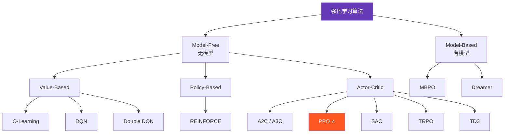
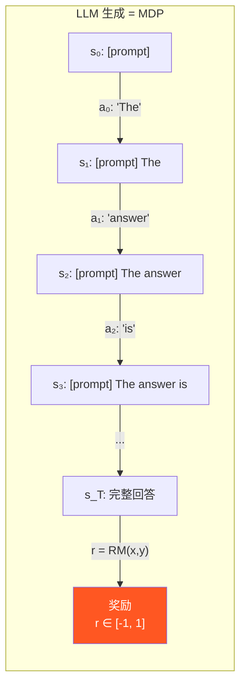

# 强化学习基础：从 MDP 到策略梯度

> 强化学习是一种通过"试错 + 奖励信号"学习最优序列决策的框架——它不告诉 agent "正确答案是什么"，而是让 agent 自己探索，通过环境反馈逐步学会什么行为能获得最大长期收益。理解 RL 的基础理论是理解 RLHF、PPO、DPO 等 LLM 对齐技术的前提。

## 关键概念

| 概念 | 英文 | 核心要点 |
|------|------|----------|
| 强化学习 | Reinforcement Learning (RL) | 通过与环境交互、基于奖励信号学习最优策略的框架 |
| 马尔可夫决策过程 | MDP | RL 的数学框架：(S, A, P, R, γ) 五元组 |
| 策略 | Policy π(a\mid s) | Agent 的行为规则：在状态 s 下选择动作 a 的概率分布 |
| 状态价值函数 | V^π(s) | 从状态 s 出发，遵循策略 π 能获得的期望累积回报 |
| 动作价值函数 | Q^π(s,a) | 在状态 s 做动作 a，之后遵循 π 的期望累积回报 |
| 优势函数 | A^π(s,a) | Q^π(s,a) - V^π(s)，衡量动作比"平均水平"好多少 |
| Bellman 方程 | Bellman Equation | 价值函数的递归分解：当前奖励 + 折扣后的未来价值 |
| 策略梯度 | Policy Gradient | 直接优化策略参数 θ，通过梯度上升最大化期望回报 |
| REINFORCE | — | 最基本的策略梯度算法，用蒙特卡洛回报估计梯度 |
| Actor-Critic | — | Actor（策略）+ Critic（价值函数），结合两类方法的优点 |
| PPO | Proximal Policy Optimization | 通过裁剪机制限制策略更新幅度，防止性能崩溃 |
| 折扣因子 | Discount Factor γ | 控制 agent 的"远见程度"，γ 越大越重视长期回报 |
| 探索-利用 | Exploration-Exploitation | 尝试新动作（探索）vs 重复已知好动作（利用）的权衡 |
| 奖励塑形 | Reward Shaping | 设计中间奖励引导 agent 学习，但可能引入偏差 |
| 时序差分 | Temporal Difference (TD) | 用当前奖励 + 下一状态估计值更新价值，不需要等待完整轨迹 |

## 详细笔记

### 1. 直觉理解——强化学习是什么

**类比：教小狗学握手**

想象你在训练一只小狗学"握手"这个动作：
- 你不能直接"告诉"小狗怎么做（这不是监督学习——没有标签）
- 小狗会尝试各种动作（摇尾巴、趴下、伸爪子...）
- 当它碰巧伸出爪子时，你给它一块零食（**奖励信号**）
- 小狗逐渐学会：伸爪子 → 有零食 → 以后多伸爪子

这就是强化学习的核心思想：**通过试错和奖励信号，学习什么行为能带来最好的结果。**

**RL vs 监督学习 vs 无监督学习**

| 特征 | 监督学习 | 无监督学习 | 强化学习 |
|------|---------|-----------|---------|
| 反馈信号 | 正确标签 (y) | 无反馈 | 奖励信号 (r) |
| 数据来源 | 静态数据集 | 静态数据集 | 与环境交互生成 |
| 目标 | 最小化预测误差 | 发现数据结构 | 最大化累积奖励 |
| 决策模式 | 一次性预测 | 一次性聚类/生成 | **序列决策** |
| 延迟反馈 | 无 | 无 | **有**（动作的后果可能很久后才显现） |

**RL 的三大核心特征：**
1. **试错学习**（Trial and Error）：没有"老师"告诉正确答案
2. **延迟奖励**（Delayed Reward）：一步棋的好坏可能要很多步后才知道
3. **探索-利用权衡**（Exploration-Exploitation）：该尝试新策略还是坚持已知好策略？

### 2. 马尔可夫决策过程（MDP）

MDP 是 RL 的**数学基础**，它将"agent 与环境交互"的过程形式化。

**MDP 五元组** $(S, A, P, R, \gamma)$：

| 元素 | 符号 | 含义 | 例子（走迷宫） |
|------|------|------|---------------|
| 状态空间 | $S$ | 环境可能处于的所有状态集合 | 迷宫中所有格子的位置 |
| 动作空间 | $A$ | agent 可以执行的所有动作集合 | {上, 下, 左, 右} |
| 转移概率 | $P(s'\mid s,a)$ | 在状态 s 做动作 a 后转移到 s' 的概率 | 向右走有 90% 概率成功 |
| 奖励函数 | $R(s,a,s')$ | 执行动作后获得的即时奖励 | 到达终点 +10，每步 -0.1 |
| 折扣因子 | $\gamma \in [0,1)$ | 未来奖励的衰减系数 | 0.99（重视长远） |

```mermaid
graph LR
    A[Agent<br>策略 π] -->|动作 a_t| E[Environment<br>环境]
    E -->|状态 s_{t+1}| A
    E -->|奖励 r_{t+1}| A

    style A fill:#4CAF50,color:#fff
    style E fill:#2196F3,color:#fff
```

**马尔可夫性质**（Markov Property）：未来只取决于当前状态，与历史无关。

$$P(s_{t+1} | s_t, a_t, s_{t-1}, a_{t-1}, \ldots) = P(s_{t+1} | s_t, a_t)$$

这个假设大大简化了问题——我们只需要关注"当前在哪"，不需要记住"怎么来的"。

**轨迹**（Trajectory）：一次完整的交互序列

$$\tau = (s_0, a_0, r_1, s_1, a_1, r_2, s_2, a_2, r_3, \ldots)$$

**累积回报**（Return）：从时刻 t 开始的折扣累积奖励

$$G_t = r_{t+1} + \gamma r_{t+2} + \gamma^2 r_{t+3} + \cdots = \sum_{k=0}^{\infty} \gamma^k r_{t+k+1}$$

**折扣因子 γ 的直觉**：
- $\gamma = 0$：完全短视，只看眼前奖励
- $\gamma = 0.99$：远见，重视未来（大多数 RL 任务的选择）
- $\gamma = 1$：不衰减，但可能导致 $G_t = \infty$（仅适用于有限长度任务）

### 3. 价值函数与 Bellman 方程

价值函数回答一个核心问题：**"这个状态/动作有多好？"**

**状态价值函数**（State Value Function）：

$$V^\pi(s) = \mathbb{E}_\pi[G_t | S_t = s] = \mathbb{E}_\pi\left[\sum_{k=0}^{\infty} \gamma^k r_{t+k+1} \bigg| S_t = s\right]$$

直觉：从状态 $s$ 出发，按策略 $\pi$ 行动，**平均能拿到多少总奖励**。

**动作价值函数**（Action Value Function / Q-Function）：

$$Q^\pi(s, a) = \mathbb{E}_\pi[G_t | S_t = s, A_t = a]$$

直觉：在状态 $s$ 先做动作 $a$，之后按策略 $\pi$ 行动，**平均能拿到多少总奖励**。

**优势函数**（Advantage Function）：

$$A^\pi(s, a) = Q^\pi(s, a) - V^\pi(s)$$

直觉：动作 $a$ 比"在状态 $s$ 下的平均表现"**好多少**。$A > 0$ 说明这个动作超出平均水平。

> 优势函数是 PPO、A2C 等算法的核心——我们不需要知道绝对好坏，只需要知道"比平均好还是差"。

**Bellman 期望方程**——价值函数的递归分解：

$$V^\pi(s) = \sum_a \pi(a|s) \left[ R(s,a) + \gamma \sum_{s'} P(s'|s,a) V^\pi(s') \right]$$

直觉：当前状态的价值 = 即时奖励 + 折扣后的下一状态价值（的期望）。

这就像"递归思考"：**这个位置有多好 = 我现在能拿到的 + 我接下来能到多好的位置**。

**Bellman 最优方程**：

$$V^*(s) = \max_a \left[ R(s,a) + \gamma \sum_{s'} P(s'|s,a) V^*(s') \right]$$

$$Q^*(s,a) = R(s,a) + \gamma \sum_{s'} P(s'|s,a) \max_{a'} Q^*(s',a')$$

如果我们知道 $Q^*$，最优策略就是：$\pi^*(a|s) = \arg\max_a Q^*(s,a)$。

### 4. Value-Based 方法：Q-Learning 与 DQN

Value-Based 方法的核心思想：**先学好 Q 函数，再从 Q 函数导出最优策略。**

**Q-Learning**（Watkins, 1989）——经典的无模型 RL 算法：

$$Q(s,a) \leftarrow Q(s,a) + \alpha \left[ r + \gamma \max_{a'} Q(s',a') - Q(s,a) \right]$$

其中 $\alpha$ 是学习率，$r + \gamma \max_{a'} Q(s',a')$ 是 **TD Target**。

关键特性：**Off-Policy**——更新时用的是 $\max_{a'} Q(s',a')$（最优动作），而不是实际采取的动作。这意味着 agent 可以一边探索（随机动作），一边学习最优策略。

**DQN**（Mnih et al., 2015）——用深度神经网络近似 Q 函数：

当状态空间很大（如 Atari 游戏的像素输入）时，无法用表格存储 Q 值。DQN 用 CNN 拟合 $Q_\theta(s, a)$。

DQN 的三个关键技巧：

| 技巧 | 问题 | 解决方案 |
|------|------|---------|
| Experience Replay | 连续样本高度相关 | 存储 (s,a,r,s') 到缓冲区，随机采样训练 |
| Target Network | 训练目标不稳定 | 用延迟更新的目标网络计算 TD Target |
| ε-greedy | 需要平衡探索和利用 | 以概率 ε 随机动作，1-ε 贪心动作 |

**DQN 的局限性**：
- 只能处理**离散且有限**的动作空间（需要对每个动作计算 Q 值）
- 无法直接用于 LLM（词表 32K-128K，无法枚举所有 token 的 Q 值）
- 这就是为什么 LLM 对齐使用 **Policy-Based 方法**（PPO）而非 Q-Learning

### 5. Policy-Based 方法：策略梯度

Policy-Based 方法不学 Q 函数，而是**直接优化策略参数**。

**策略参数化**：用神经网络 $\pi_\theta(a|s)$ 表示策略（输出动作的概率分布）。

**优化目标**：最大化期望回报

$$J(\theta) = \mathbb{E}_{\tau \sim \pi_\theta} \left[ \sum_{t=0}^{T} \gamma^t r_{t+1} \right]$$

**策略梯度定理**（Policy Gradient Theorem）——RL 中最重要的理论之一：

$$\nabla_\theta J(\theta) = \mathbb{E}_{\pi_\theta} \left[ \sum_{t=0}^{T} \nabla_\theta \log \pi_\theta(a_t|s_t) \cdot G_t \right]$$

直觉：
- $\nabla_\theta \log \pi_\theta(a_t|s_t)$：增大选择动作 $a_t$ 的概率的方向
- $G_t$：这个动作带来的总回报
- 如果 $G_t > 0$（好结果），增大 $a_t$ 的概率
- 如果 $G_t < 0$（坏结果），减小 $a_t$ 的概率

**REINFORCE 算法**（Williams, 1992）：

```
for each episode:
    生成轨迹 τ = (s₀, a₀, r₁, ..., s_T)
    for t = 0, 1, ..., T:
        计算回报 G_t = Σ γ^k r_{t+k+1}
        θ ← θ + α · ∇log π_θ(a_t|s_t) · G_t
```

REINFORCE 的问题：**方差很大**。因为 $G_t$ 是蒙特卡洛估计，随机性很强。

**Baseline 技巧**——引入 baseline $b(s_t)$ 减少方差而不引入偏差：

$$\nabla_\theta J(\theta) = \mathbb{E}\left[ \sum_t \nabla_\theta \log \pi_\theta(a_t|s_t) \cdot (G_t - b(s_t)) \right]$$

最自然的 baseline 就是状态价值函数 $V(s_t)$，这样 $G_t - V(s_t)$ 就近似于优势函数 $A(s_t, a_t)$。

**Actor-Critic 架构**：

```mermaid
graph TB
    S[状态 s] --> A[Actor 网络<br>π_θ(a|s)]
    S --> C[Critic 网络<br>V_ψ(s)]
    A -->|动作 a| ENV[环境]
    ENV -->|奖励 r, 新状态 s'| UPDATE[更新]
    C -->|优势估计<br>A = r + γV(s') - V(s)| UPDATE
    UPDATE -->|策略梯度| A
    UPDATE -->|TD 误差| C

    style A fill:#4CAF50,color:#fff
    style C fill:#FF9800,color:#fff
```

- **Actor**（演员）：策略网络 $\pi_\theta$，决定做什么动作
- **Critic**（评论家）：价值网络 $V_\psi$，评价当前状态有多好
- Actor 用 Critic 的评价（优势函数）来更新策略
- Critic 用 TD 误差来更新自己

这种分工让策略梯度的方差大大降低。

### 6. PPO——现代 RL 的标准算法

PPO（Proximal Policy Optimization, Schulman et al., 2017）是目前最常用的策略梯度算法，也是 RLHF 的核心。

**核心问题**：策略梯度的步长太大怎么办？

在普通策略梯度中，一次大的参数更新可能让策略"跳"到一个很差的区域，导致性能崩溃且无法恢复。

**TRPO 的思路**（Trust Region Policy Optimization）：

$$\max_\theta \quad \mathbb{E}\left[\frac{\pi_\theta(a|s)}{\pi_{\theta_{\text{old}}}(a|s)} A^{\pi_{\text{old}}}(s,a)\right] \quad \text{s.t.} \quad D_{KL}(\pi_{\theta_{\text{old}}} \| \pi_\theta) \leq \delta$$

理论优雅但实现复杂（需要计算二阶导数/共轭梯度）。

**PPO-Clip 的解决方案**——用裁剪代替 KL 约束：

$$L^{\text{CLIP}}(\theta) = \mathbb{E}\left[\min\left(r_t(\theta) \hat{A}_t, \; \text{clip}(r_t(\theta), 1-\epsilon, 1+\epsilon) \hat{A}_t\right)\right]$$

其中**概率比** $r_t(\theta) = \frac{\pi_\theta(a_t|s_t)}{\pi_{\theta_{\text{old}}}(a_t|s_t)}$。

| 情况 | $r_t$ 范围 | 效果 |
|------|-----------|------|
| $\hat{A}_t > 0$（好动作） | $r_t > 1+\epsilon$ 时被裁剪 | 限制"好动作"的概率增幅上限 |
| $\hat{A}_t < 0$（坏动作） | $r_t < 1-\epsilon$ 时被裁剪 | 限制"坏动作"的概率减幅上限 |

直觉：**"好消息不要太兴奋，坏消息不要太悲观"**——每次更新都保持在"信任区域"内。

**PPO 为什么特别适合 LLM 训练？**
1. **稳定**：裁剪机制天然防止策略崩溃
2. **简单**：不需要 TRPO 的二阶优化
3. **可并行**：多个 worker 可以同时收集经验
4. **离散动作空间友好**：LLM 的"动作"就是选择下一个 token

> PPO 在 RLHF 中的完整应用（四个模型、KL 约束、GAE 估计）详见 [RLHF 笔记](../training/rlhf.md)。

### 7. 探索与利用

**Exploration-Exploitation Dilemma** 是 RL 的核心难题之一。

| 策略 | 机制 | 特点 |
|------|------|------|
| ε-greedy | 以概率 ε 随机，1-ε 贪心 | 简单但不聪明（随机探索不考虑信息增益） |
| UCB | $a = \arg\max Q(a) + c\sqrt{\frac{\ln t}{N(a)}}$ | 优先尝试"不确定性大"的动作 |
| Boltzmann | $\pi(a) \propto \exp(Q(a)/\tau)$ | 用温度 τ 控制随机性（类似 LLM 的温度采样！） |
| 熵正则化 | $J' = J + \alpha H(\pi)$ | 在目标函数中加入策略熵，鼓励多样性 |

**熵正则化在 LLM 中的应用**：

PPO 训练 LLM 时常加入熵 bonus $H(\pi_\theta) = -\sum_a \pi_\theta(a|s) \log \pi_\theta(a|s)$。

这防止模型过早收敛到一个"安全但无聊"的回答模式（如总是说"我不知道"来避免惩罚）。

### 8. 奖励函数设计

奖励函数是 RL 的"灵魂"——它定义了 agent 应该优化什么。

**稀疏奖励 vs 密集奖励**：

| 类型 | 例子 | 优点 | 缺点 |
|------|------|------|------|
| 稀疏 | 赢棋 +1，输棋 -1，其他 0 | 目标明确，不引入偏差 | 信号太少，学习极慢 |
| 密集 | 每步根据棋盘形势给分 | 学习快，信号丰富 | 可能引入设计者偏差 |

**Reward Shaping**（奖励塑形）：在原始稀疏奖励基础上添加中间引导信号。

$$R'(s, a, s') = R(s, a, s') + F(s, s')$$

其中 $F(s, s') = \gamma \Phi(s') - \Phi(s)$（基于势函数的塑形可以保证最优策略不变）。

**Reward Hacking**（奖励 Hacking）：agent 找到"钻空子"的方式获得高奖励，但并没有完成真正的任务。

经典例子：
- 赛车 AI 学会了在原地转圈收集加速道具（奖励 = 速度），而不是完成赛道
- 清洁机器人学会了把垃圾藏在沙发下面（奖励 = 可见垃圾数量减少）

**与 RLHF 的联系**：RLHF 中的奖励模型也会被 hack——模型可能学会生成"让奖励模型打高分但实际质量不高"的回答。这就是为什么 RLHF 需要 KL 约束来限制策略偏离。

### 9. RL 算法全景图



**核心分类维度：**

| 维度 | 分类 | 说明 |
|------|------|------|
| 有无模型 | Model-Free / Model-Based | 是否学习环境的转移模型 $P(s'\mid s,a)$ |
| 优化对象 | Value-Based / Policy-Based | 学 Q 值还是直接学策略 |
| 数据使用 | On-Policy / Off-Policy | 是否只用当前策略生成的数据 |

**算法对比表：**

| 算法 | 类别 | On/Off | 动作空间 | 稳定性 | 样本效率 | LLM 适用 |
|------|------|--------|---------|--------|---------|---------|
| Q-Learning | Value | Off | 离散 | 中 | 高 | ✗（词表太大） |
| DQN | Value | Off | 离散 | 中 | 高 | ✗ |
| REINFORCE | Policy | On | 连续/离散 | 低 | 低 | ✗（方差太大） |
| A2C | Actor-Critic | On | 连续/离散 | 中 | 中 | △ |
| PPO | Actor-Critic | On | 连续/离散 | **高** | 中 | **✓（RLHF 标准）** |
| SAC | Actor-Critic | Off | 连续 | 高 | 高 | ✗（连续空间） |
| TD3 | Actor-Critic | Off | 连续 | 高 | 高 | ✗（连续空间） |

### 10. RL 与 LLM 的桥接

**LLM 生成 = 序列决策问题**

自回归语言模型的生成过程天然可以映射为 MDP：

| MDP 元素 | LLM 对应 | 说明 |
|----------|---------|------|
| 状态 $s_t$ | 已生成的 token 序列 $(x, y_{<t})$ | prompt + 已生成部分 |
| 动作 $a_t$ | 选择下一个 token $y_t$ | 从词表 V 中选择 |
| 策略 $\pi(a_t\mid s_t)$ | 语言模型 $p_\theta(y_t\mid x, y_{<t})$ | 条件概率分布 |
| 奖励 $r_t$ | 奖励模型评分 $r_\phi(x, y)$ | 通常只在序列末尾给出 |
| 折扣因子 $\gamma$ | 通常 $\gamma = 1$ | 有限长度序列，不需要折扣 |



**RLHF 的 RL 本质**：

RLHF 的优化目标可以看作一个带 KL 约束的 RL 问题：

$$\max_{\pi_\theta} \mathbb{E}_{x \sim \mathcal{D}, y \sim \pi_\theta(\cdot|x)} \left[ r_\phi(x, y) \right] - \beta \cdot D_{KL}(\pi_\theta \| \pi_{\text{ref}})$$

- **策略** $\pi_\theta$：正在被优化的 LLM
- **奖励** $r_\phi(x, y)$：学习到的奖励模型（从人类偏好数据训练）
- **KL 约束**：防止 LLM 偏离 SFT 模型太远（避免 reward hacking）

> 关于 RLHF 的完整流程（奖励模型训练、PPO 四模型架构、DPO 替代方案）详见 [RLHF 详解](../training/rlhf.md)。

**RLHF 之外的 LLM + RL 应用**：

| 应用 | 方法 | RL 角色 |
|------|------|--------|
| 代码生成 | CodeRL (Le et al., 2022) | 用单元测试通过率作为奖励 |
| 数学推理 | Process Reward Model | 给推理过程的每一步打分（密集奖励） |
| 搜索增强 | WebGPT (Nakano et al., 2022) | 学习何时搜索、搜索什么 |
| 工具使用 | Toolformer | 学习何时调用外部 API |
| 树搜索推理 | MCTS + LLM | 蒙特卡洛树搜索指导 LLM 推理路径 |

### 11. 多模态 RL 应用

RL 在多模态领域有独特的应用场景：

**视觉-语言导航（VLN）**：agent 在 3D 环境中根据自然语言指令导航。
- 状态：当前视觉观察（全景图像）
- 动作：移动方向
- 奖励：到达目标位置的距离变化

**多模态奖励模型**：LLaVA-RLHF 等工作将 RLHF 扩展到视觉-语言模型，奖励模型需要同时理解图像和文本。

**机器人控制**：视觉输入 + 连续动作空间的典型 RL 场景。
- 使用 DINO/DINOv2 等预训练视觉特征作为状态表示
- 大幅提升样本效率（无需从像素重新学习视觉特征）

### 12. RL 的挑战与前沿

| 挑战 | 描述 | 前沿方向 |
|------|------|---------|
| 样本效率 | RL 需要大量交互数据 | Model-Based RL、迁移学习 |
| 奖励稀疏 | 仅在任务完成时有奖励 | Hindsight Experience Replay、好奇心驱动 |
| Sim-to-Real | 仿真训练迁移到真实环境 | Domain Randomization、自适应 |
| 多目标优化 | 多个可能冲突的奖励 | Pareto 优化、约束 RL |
| 安全性 | 探索时避免危险动作 | Safe RL、约束 MDP |

**离线 RL（Offline RL）的兴起**：

传统 RL 需要与环境在线交互（成本高、风险大）。离线 RL 直接从历史数据学习策略，非常适合 LLM 场景——我们有大量人类反馈数据，但在线生成的成本很高。

DPO 可以看作一种离线 RL 方法：它直接从离线偏好数据 $(x, y_w, y_l)$ 学习策略，不需要在线采样。

## 个人理解与思考

### 与已有笔记的关联

1. **[RLHF 详解](../training/rlhf.md)**：本笔记提供的 MDP、策略梯度、PPO 理论是理解 RLHF 的直接前提。RLHF 笔记中 PPO 的四模型架构（Actor、Critic、Reward、Reference）直接对应本笔记 Actor-Critic 框架的扩展
2. **[SFT 详解](../training/supervised-fine-tuning-sft.md)**：SFT 模型既是 RLHF 的初始策略 $\pi_{\text{init}}$，又是 KL 约束的参考策略 $\pi_{\text{ref}}$。理解 RL 的策略概念有助于理解为什么 SFT 在流水线中不可或缺
3. **[LLM 预训练](../training/llm-pretraining.md)**：预训练提供的知识是 RL 微调的"起点"——RL 不教模型新知识，而是调整其行为偏好
4. **[对比学习](contrastive-learning.md)**：对比学习的 InfoNCE 损失和奖励模型的 Bradley-Terry 损失有理论联系——都在学习"偏好/相似度"的排序关系
5. **[Transformer](transformer.md)**：Transformer 在 RL 中扮演策略网络和价值网络的角色。Decision Transformer 更进一步将 RL 问题重新表述为序列建模问题
6. **[LLM 优化技术](../training/llm-optimization-techniques.md)**：PPO 训练涉及的显存优化（四模型并行加载）、梯度累积等工程技巧
7. **[LLM 评估](llm-evaluation.md)**：奖励模型本质上是一个评估器——如何训练好的 RM 与如何设计好的评估方法有深层联系
8. **[多模态模型演进](../multimodal-arch/mllm-evolution.md)**：多模态 RLHF（LLaVA-RLHF、RLHF-V）是 RL + 多模态的交叉应用

### 常见误区

1. **"RL 就是 RLHF"** → RL 是一个远比 RLHF 广泛的框架。RLHF 只是 RL 在 LLM 对齐中的一种特定应用。RL 还包括游戏 AI（AlphaGo）、机器人控制、自动驾驶等
2. **"策略梯度只能处理离散动作空间"** → 恰恰相反，策略梯度的一大优势是可以处理连续动作空间（如机器人关节角度）。输出高斯分布 $\pi(a|s) = \mathcal{N}(\mu_\theta(s), \sigma_\theta(s))$ 即可
3. **"折扣因子 γ 越接近 1 越好"** → $\gamma = 1$ 在无限长度任务中会导致回报 $G_t = \infty$。而且 $\gamma$ 接近 1 会让价值估计的方差增大，训练更不稳定
4. **"DQN 可以直接用于 LLM"** → LLM 的词表有 32K-128K 个 token，需要为每个 token 计算一个 Q 值——这和直接计算 logits 没有区别。策略梯度方法（如 PPO）更自然
5. **"PPO 是唯一好用的策略梯度算法"** → PPO 是最常用的，但 A2C、SAC、TD3 在各自的场景中也很有效。PPO 胜出主要因为它在稳定性和实现简洁性上的平衡
6. **"奖励函数设计得越精细越好"** → 过度设计的奖励函数容易被 agent exploit（reward hacking）。简单、直接的奖励信号 + 适当约束往往比复杂的奖励工程更有效
7. **"RL 必须在线交互才能学习"** → Offline RL 直接从历史数据学习。DPO 就是一种离线 RL 方法——直接从偏好数据集学习最优策略，不需要在线采样
8. **"Actor-Critic 中的 Actor 和 Critic 是完全独立的"** → 它们通过优势估计 $\hat{A}$ 紧密耦合——Critic 的估计质量直接影响 Actor 的梯度方向。实际实现中它们常共享底层特征提取器

### 面试/口述版

> 强化学习是一种让 agent 通过与环境交互、基于奖励信号学习最优序列决策的框架。它的核心抽象是 MDP——agent 在状态 s 下选择动作 a，获得奖励 r 并转移到新状态 s'，目标是最大化长期累积奖励。解决 MDP 有两类主流方法：Value-Based（如 DQN，学习 Q 函数）和 Policy-Based（如 PPO，直接优化策略参数）。在 LLM 领域，PPO 是 RLHF 的核心算法——将语言生成建模为 MDP，用奖励模型替代环境奖励，通过 KL 约束防止策略偏离。近年来 DPO 等离线 RL 方法因其简洁性而流行，但理解 RL 基础仍是理解整个 LLM 训练流水线的关键。

## 相关链接

### 经典教材
- [Reinforcement Learning: An Introduction (Sutton & Barto)](http://incompleteideas.net/book/the-book.html) — RL 圣经，免费在线阅读
- [Spinning Up in Deep RL (OpenAI)](https://spinningup.openai.com/) — 从零开始的 Deep RL 教程

### 关键论文
- [Playing Atari with Deep Reinforcement Learning (DQN, 2013)](https://arxiv.org/abs/1312.5602) — Deep RL 的开山之作
- [Asynchronous Methods for Deep Reinforcement Learning (A3C, 2016)](https://arxiv.org/abs/1602.01783) — 异步 Actor-Critic
- [Proximal Policy Optimization Algorithms (PPO, 2017)](https://arxiv.org/abs/1707.06347) — RLHF 的核心算法
- [Soft Actor-Critic (SAC, 2018)](https://arxiv.org/abs/1801.01290) — 最大熵 RL 框架
- [Decision Transformer (2021)](https://arxiv.org/abs/2106.01345) — 将 RL 转化为序列建模问题
- [Training Language Models to Follow Instructions with Human Feedback (InstructGPT/RLHF, 2022)](https://arxiv.org/abs/2203.02155) — RLHF 在 LLM 中的里程碑应用

### 本仓库相关笔记
- [RLHF 详解](../training/rlhf.md) — PPO 在 LLM 对齐中的完整应用
- [SFT 详解](../training/supervised-fine-tuning-sft.md) — RL 微调的前置步骤
- [LLM 预训练](../training/llm-pretraining.md) — RL 微调的知识基础
- [对比学习](contrastive-learning.md) — 奖励学习的理论联系
- [Transformer 架构](transformer.md) — RL 中的策略/价值网络基础

## 更新日志

- 2026-03-04: 初始创建，覆盖 RL 基础理论（MDP、价值函数、策略梯度、PPO）+ LLM 桥接
