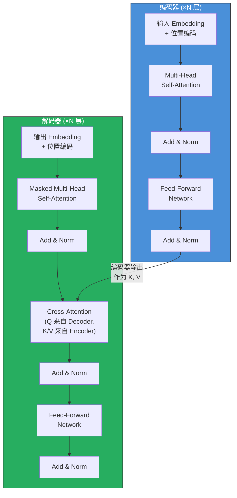
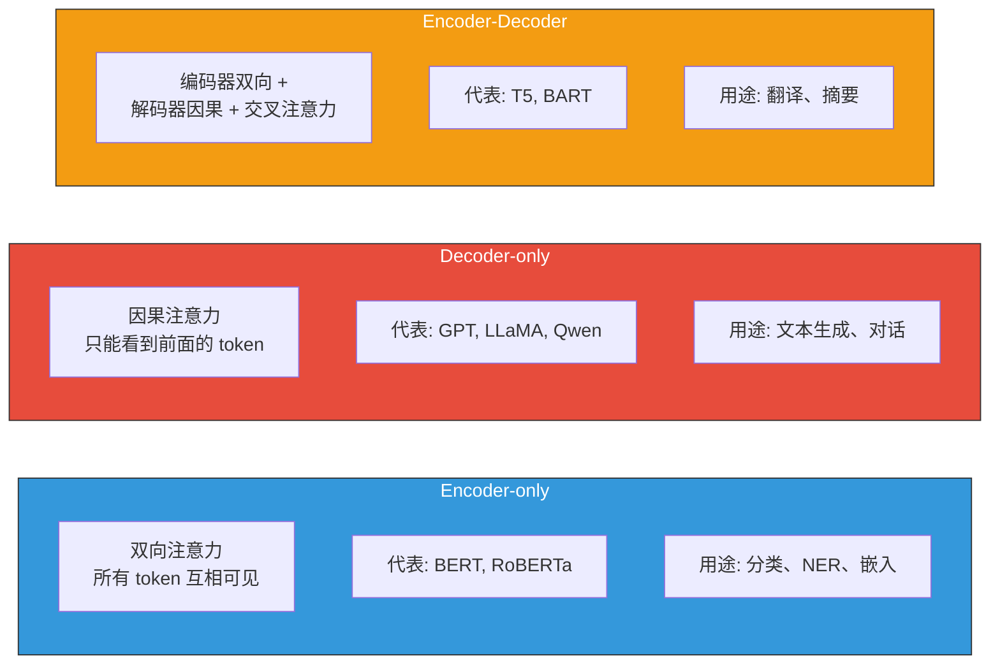
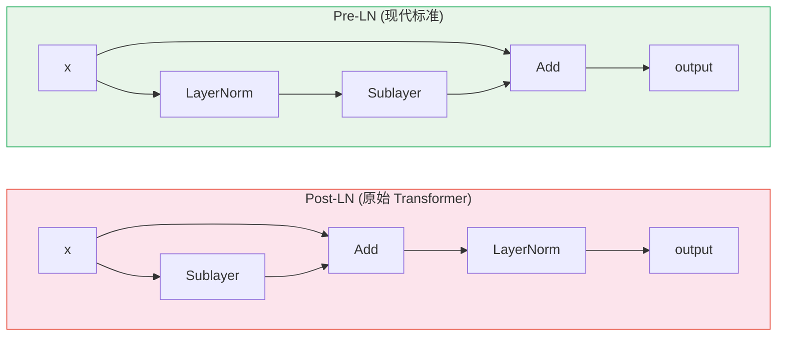
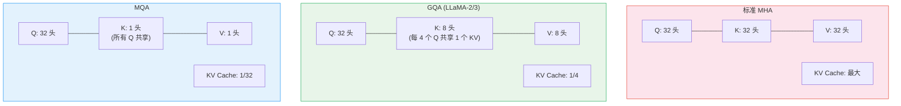
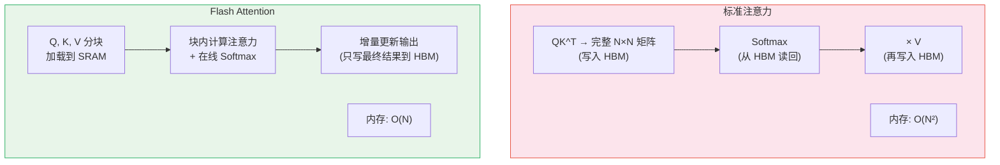
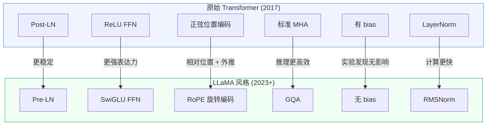

# Transformer 架构详解

> Transformer 是现代所有大语言模型和多模态模型的基石——它用纯注意力机制取代了 RNN 的递归结构，让模型第一次能够真正"并行地理解整个句子"。

## 关键概念

| 概念 | 含义 |
|------|------|
| Self-Attention（自注意力） | 序列中每个位置都能直接关注所有其他位置，通过 Q·K 相似度加权求和 V 来提取上下文信息 |
| Multi-Head Attention（多头注意力） | 将注意力拆分为 h 个子空间并行计算，不同头捕捉不同类型的关系（语法、语义、位置等） |
| Positional Encoding（位置编码） | 为没有顺序概念的 Transformer 注入位置信息，原始版用正弦函数，现代用 RoPE 旋转编码 |
| Feed-Forward Network（FFN） | 每层中的逐位置全连接网络，充当"知识记忆库"，通常做 4 倍维度扩展后再投影回来 |
| Residual Connection（残差连接） | $x + \text{Sublayer}(x)$，保证梯度能直接流过整个网络深度 |
| Causal Mask（因果掩码） | Decoder 中阻止当前位置看到未来 token 的掩码机制，是自回归生成的基础 |
| KV Cache | 推理时缓存已计算的 K、V 矩阵，避免重复计算，是 LLM 高效推理的关键 |
| Flash Attention | IO 感知的精确注意力算法，通过分块计算和在线 Softmax 将内存从 $O(N^2)$ 降到 $O(N)$ |
| Pre-LN vs Post-LN | 层归一化的放置位置：Pre-LN（现代标准）放在子层之前，训练更稳定 |
| GQA（Grouped-Query Attention） | 多个 Q 头共享 K/V 头，在推理效率和模型质量之间取得平衡 |

## 详细笔记

### 直觉理解：Transformer 为什么革命性？

想象你在读一段长文章，遇到代词"它"。要理解"它"指代什么，你会**回头扫视**前文，找到最相关的名词。如果文章很长，这个"回头扫视"过程会很耗时——这正是 RNN/LSTM 的困境。

RNN 像一个**只能顺序阅读的人**：他必须从第一个字开始一个字一个字地读，每读一个字就更新自己的"记忆"（隐状态）。问题是：
- **记忆瓶颈**：所有历史信息压缩到一个固定大小的向量里，长句后面的内容很难记住开头
- **无法并行**：必须读完第 $n$ 个字才能读第 $n+1$ 个字，GPU 的并行算力被浪费
- **梯度消失**：信号从句末传回句首要经过几百步，梯度在途中消失殆尽

**Transformer 的做法完全不同**：它像一个**能同时看到整篇文章的人**。每个词都能直接"看到"所有其他词，通过 Attention 机制计算与每个词的相关性，然后加权汇总信息。这意味着：
- **无距离限制**：第 1 个词和第 1000 个词之间只有 $O(1)$ 的连接路径
- **完全并行**：所有位置同时计算，GPU 利用率拉满
- **信息不压缩**：每一层都能访问完整的上下文

| 对比 | RNN/LSTM | Transformer |
|------|:--------:|:-----------:|
| 计算方式 | 顺序处理 $O(n)$ 步 | 全并行 $O(1)$ 步 |
| 长距离依赖 | 困难（梯度消失） | 容易（直接注意力） |
| 信息瓶颈 | 固定大小隐状态 | 无压缩，全上下文可用 |
| GPU 利用率 | 低（顺序计算） | 高（矩阵乘法并行化） |
| 训练速度 | 慢 | 快 3-10 倍 |

### 架构全景

#### 原始 Encoder-Decoder 结构

原始 Transformer（Vaswani et al., 2017）用于机器翻译，由编码器和解码器组成：



#### 三大变体



**现代 LLM 几乎全部采用 Decoder-only 架构**，原因有三：
1. 统一的自回归目标（Next-Token Prediction）使预训练和生成使用同一框架
2. Scaling Laws 表明更大的 Decoder-only 模型性能更优
3. In-Context Learning（上下文学习）在 Decoder-only 架构中自然涌现

### 核心机制一：Self-Attention（自注意力）

#### 直觉：图书馆的比喻

Self-Attention 就像一个图书馆检索系统：
- **Query（查询）**：你的检索需求——"我在找什么？"
- **Key（键）**：每本书的标签/索引——"我这本书包含什么？"
- **Value（值）**：每本书的实际内容——"我能提供的信息是什么"

检索过程：用你的 Query 与每本书的 Key 做匹配（点积），算出相关度分数，然后按分数加权取出各本书的 Value，综合成你的"检索结果"。

#### 数学定义

给定输入序列 $X \in \mathbb{R}^{n \times d_{\text{model}}}$（$n$ 个 token，每个维度 $d_{\text{model}}$），先通过线性投影得到 Q、K、V：

$$Q = XW_Q, \quad K = XW_K, \quad V = XW_V$$

其中 $W_Q, W_K \in \mathbb{R}^{d_{\text{model}} \times d_k}$，$W_V \in \mathbb{R}^{d_{\text{model}} \times d_v}$。

**Scaled Dot-Product Attention**：

$$\text{Attention}(Q, K, V) = \text{softmax}\left(\frac{QK^\top}{\sqrt{d_k}}\right)V$$

逐步拆解：

1. **计算注意力分数**：$S = QK^\top \in \mathbb{R}^{n \times n}$，其中 $S_{ij} = q_i^\top k_j$ 衡量 token $i$ 对 token $j$ 的关注程度
2. **缩放**：$S' = S / \sqrt{d_k}$
3. **Softmax 归一化**：$A = \text{softmax}(S')$，每行归一化为概率分布：$A_{ij} = \frac{\exp(S'_{ij})}{\sum_{l=1}^{n}\exp(S'_{il})}$
4. **加权求和**：$\text{output} = AV \in \mathbb{R}^{n \times d_v}$

#### 为什么要除以 $\sqrt{d_k}$？

当 $d_k$ 较大时，假设 $q$ 和 $k$ 的各分量独立且均值为 0、方差为 1，则：

$$\text{Var}(q^\top k) = \text{Var}\left(\sum_{i=1}^{d_k} q_i k_i\right) = d_k$$

点积的方差随 $d_k$ 线性增长。大方差意味着部分点积值的绝对值很大，Softmax 会进入**饱和区**（梯度接近 0），导致训练困难。除以 $\sqrt{d_k}$ 将方差归一化为 1：

$$\text{Var}\left(\frac{q^\top k}{\sqrt{d_k}}\right) = 1$$

**具体例子**：假设 $d_k = 64$，两个随机向量的点积标准差为 $\sqrt{64} = 8$。不缩放时，Softmax 的输入可能达到 ±24（3σ），此时 $\text{softmax}(24) \approx 1.0$，梯度消失。缩放后标准差变为 1，Softmax 输入在 ±3 范围内，梯度正常。

### 核心机制二：Multi-Head Attention（多头注意力）

#### 动机

单头注意力的问题：$n \times n$ 的注意力权重矩阵被求平均后，模型难以同时关注多个不同位置。例如，"小猫坐在垫子上因为它很舒服"——"它"可能需要同时关注"小猫"（语法关系）和"垫子"（语义关系），但单头注意力倾向于只关注一个。

#### 数学定义

$$\text{MultiHead}(Q, K, V) = \text{Concat}(\text{head}_1, \dots, \text{head}_h) W_O$$

$$\text{head}_i = \text{Attention}(QW_Q^i, KW_K^i, VW_V^i)$$

其中：
- $W_Q^i, W_K^i \in \mathbb{R}^{d_{\text{model}} \times d_k}$，$W_V^i \in \mathbb{R}^{d_{\text{model}} \times d_v}$
- $W_O \in \mathbb{R}^{hd_v \times d_{\text{model}}}$
- $d_k = d_v = d_{\text{model}} / h$（每个头的维度 = 模型维度 / 头数）

**关键洞察**：$h$ 个头各自在 $d_k$ 维子空间中计算注意力，总参数量与单头 $d_{\text{model}}$ 维注意力**完全相同**（因为 $h \times d_k = d_{\text{model}}$）。

**不同头学到的东西**（可视化研究发现）：
- 某些头专注于**相邻位置**（局部模式）
- 某些头专注于**语法结构**（主谓一致、修饰关系）
- 某些头专注于**指代消解**（代词与先行词的关系）
- 某些头专注于**稀有词或特殊 token**

#### 参数量分析

以原始 Transformer base 为例（$d_{\text{model}} = 512, h = 8, d_k = 64$）：

| 组件 | 形状 | 参数量 |
|------|------|:------:|
| 所有头的 $W_Q$ | 等价于 $512 \times 512$ | 262,144 |
| 所有头的 $W_K$ | 等价于 $512 \times 512$ | 262,144 |
| 所有头的 $W_V$ | 等价于 $512 \times 512$ | 262,144 |
| 输出投影 $W_O$ | $512 \times 512$ | 262,144 |
| **单层 MHA 总计** | | **~1M** |

### 核心机制三：位置编码

Transformer 没有递归结构，输入序列是一个**无序集合**。如果不注入位置信息，"猫追狗"和"狗追猫"对模型来说完全一样！

#### 原始正弦位置编码

$$PE_{(pos, 2i)} = \sin\left(\frac{pos}{10000^{2i/d_{\text{model}}}}\right)$$

$$PE_{(pos, 2i+1)} = \cos\left(\frac{pos}{10000^{2i/d_{\text{model}}}}\right)$$

其中 $pos$ 是 token 位置（0, 1, 2, ...），$i$ 是维度索引（$0 \le i < d_{\text{model}}/2$）。

**为什么用正弦？** 对于固定偏移 $k$，$PE_{pos+k}$ 可以表示为 $PE_{pos}$ 的**线性变换**：

$$\begin{bmatrix} \sin((pos+k)\theta) \\ \cos((pos+k)\theta) \end{bmatrix} = \begin{bmatrix} \cos(k\theta) & \sin(k\theta) \\ -\sin(k\theta) & \cos(k\theta) \end{bmatrix} \begin{bmatrix} \sin(pos \cdot \theta) \\ \cos(pos \cdot \theta) \end{bmatrix}$$

这意味着模型可以通过线性操作学习**相对位置**关系。

#### RoPE（旋转位置编码）—— 现代 LLM 的标准选择

RoPE（Su et al., 2021）不将位置编码加到输入上，而是对 Q 和 K 做**位置相关的旋转**：

对位置 $m$ 处的二维子空间 $(q_{2i}, q_{2i+1})$：

$$\begin{bmatrix} q_{2i}^{(m)} \\ q_{2i+1}^{(m)} \end{bmatrix} = \begin{bmatrix} \cos(m\theta_i) & -\sin(m\theta_i) \\ \sin(m\theta_i) & \cos(m\theta_i) \end{bmatrix} \begin{bmatrix} q_{2i} \\ q_{2i+1} \end{bmatrix}$$

其中 $\theta_i = 10000^{-2i/d}$（与正弦编码相同的频率调度）。

**核心性质**：旋转后的 Q 和 K 做点积时：

$$q_m^\top k_n = (R_m q)^\top (R_n k) = q^\top R_{n-m} k$$

结果只依赖**相对位置** $(n - m)$，而非绝对位置！这使 RoPE 天然具备相对位置感知能力。

**RoPE 的优势**：
1. 天然编码相对位置
2. 注意力随距离自然衰减
3. 可通过频率缩放（NTK-aware、YaRN）外推到更长序列
4. 实现高效（利用复数乘法技巧）

#### ALiBi（注意力线性偏置）

ALiBi（Press et al., 2021）完全不使用位置编码，而是在注意力分数上直接加**距离惩罚**：

$$\text{softmax}\left(\frac{QK^\top}{\sqrt{d_k}} + m \cdot [-|i-j|]\right)$$

其中 $m$ 是每个头的固定斜率（几何级数分布，不可学习），$|i-j|$ 是位置距离。距离越远，惩罚越大，注意力越低。

### 核心机制四：Feed-Forward Network（FFN）

#### 原始 FFN

$$\text{FFN}(x) = \max(0,\; xW_1 + b_1)W_2 + b_2$$

- $W_1 \in \mathbb{R}^{d_{\text{model}} \times d_{ff}}$（扩展，通常 $d_{ff} = 4 \times d_{\text{model}}$）
- $W_2 \in \mathbb{R}^{d_{ff} \times d_{\text{model}}}$（压缩回原始维度）

**FFN 的角色**：研究表明 FFN 充当"键值记忆库"（Geva et al., 2021），中间维度 $d_{ff}$ 的每个神经元对应一种"知识模式"。$4\times$ 扩展提供了充足的记忆容量。

#### SwiGLU（现代 LLM 标准）

LLaMA 等现代模型使用 SwiGLU（Shazeer, 2020）：

$$\text{FFN}_{\text{SwiGLU}}(x) = \left(\text{Swish}(xW_{\text{gate}}) \odot xW_{\text{up}}\right) W_{\text{down}}$$

其中：
- $\text{Swish}(x) = x \cdot \sigma(x)$（也叫 SiLU）
- $\odot$ 是逐元素乘法（门控机制）
- 有 3 个权重矩阵而非 2 个，因此中间维度调整为 $d_{ff} = \frac{8}{3} d_{\text{model}}$（通常取 256 的倍数）

**为什么 SwiGLU 更好？** 门控机制让网络能选择性地激活或抑制信息流，比 ReLU 的"硬截断"更平滑，实验表明在相同参数量下性能更优。

### 核心机制五：残差连接与层归一化

#### 残差连接

每个子层都有残差连接：$\text{output} = x + \text{Sublayer}(x)$

残差连接是训练深层网络的关键——它在网络中创建了一条"梯度高速公路"，梯度可以直接从输出层流回输入层，不经过任何非线性变换。LLaMA-70B 有 80 层，没有残差连接根本无法训练。

#### LayerNorm vs RMSNorm

**LayerNorm**（原始 Transformer）：

$$\text{LayerNorm}(x) = \frac{x - \mu}{\sqrt{\sigma^2 + \epsilon}} \cdot \gamma + \beta$$

其中 $\mu = \frac{1}{n}\sum x_i$，$\sigma^2 = \frac{1}{n}\sum(x_i - \mu)^2$，$\gamma$ 和 $\beta$ 是可学习参数。

**RMSNorm**（现代 LLM 标准）：

$$\text{RMSNorm}(x) = \frac{x}{\text{RMS}(x)} \cdot \gamma, \quad \text{RMS}(x) = \sqrt{\frac{1}{n}\sum_{i=1}^{n} x_i^2}$$

RMSNorm 去掉了均值中心化和偏置 $\beta$，**计算更快**且效果相当甚至更好。

#### Pre-LN vs Post-LN



**Post-LN**：$\text{output} = \text{LayerNorm}(x + \text{Sublayer}(x))$ — LayerNorm 在残差路径上，梯度必须经过 LN，初始化时易导致梯度爆炸，**必须用 Learning Rate Warmup**。

**Pre-LN**：$\text{output} = x + \text{Sublayer}(\text{LayerNorm}(x))$ — 残差路径完全"干净"，梯度直通，训练更稳定，无需 warmup 即可收敛。

### 核心机制六：Causal Mask（因果掩码）

Decoder-only 模型（GPT、LLaMA）中，生成第 $t$ 个 token 时**不能看到未来的 token**。实现方式：

$$\text{Attention}(Q, K, V) = \text{softmax}\left(\frac{QK^\top}{\sqrt{d_k}} + M\right)V$$

其中因果掩码 $M$：

$$M_{ij} = \begin{cases} 0 & \text{if } i \geq j \quad (\text{可以看到}) \\ -\infty & \text{if } i < j \quad (\text{未来 token，不可见}) \end{cases}$$

由于 $\text{softmax}(-\infty) = 0$，未来 token 的注意力权重被强制为零。

```python
# PyTorch 实现
mask = torch.triu(torch.ones(seq_len, seq_len), diagonal=1).bool()
scores = scores.masked_fill(mask, float('-inf'))
attn_weights = torch.softmax(scores, dim=-1)
```

### 推理优化一：KV Cache

#### 问题

自回归生成时，模型逐 token 生成。在第 $t$ 步，新 token 的 Query $q_t$ 需要与**所有**已有 token 的 Key 和 Value 做注意力计算。

如果不缓存，第 $t$ 步需要重新计算 $k_1, \dots, k_t$ 和 $v_1, \dots, v_t$——前 $t-1$ 个 token 的 K、V 被重复计算了！

**KV Cache**：把每一步计算好的 K、V 缓存起来，下一步只需为新 token 算一组 $k_t, v_t$ 并追加到缓存中。

#### 内存分析

每个 token 每层的 KV Cache 大小：$2 \times d_{\text{model}} \times \text{字节数}$

总 KV Cache：

$$\text{Total} = 2 \times n_{\text{layers}} \times \text{batch} \times \text{seq\_len} \times d_{\text{model}} \times \text{bytes}$$

以 LLaMA-70B 为例（$n_{\text{layers}}=80$，$d_{\text{model}}=8192$，seq_len=4096，batch=1，FP16）：

$$2 \times 80 \times 1 \times 4096 \times 8192 \times 2 \text{ bytes} \approx 10.7 \text{ GB}$$

KV Cache 是长序列推理的**显存瓶颈**。

#### MQA → GQA：压缩 KV Cache



- **MQA**（Multi-Query Attention）：所有 Q 头共享 **1 组** K/V → KV Cache 缩小 $h$ 倍，但质量可能下降
- **GQA**（Grouped-Query Attention）：将 Q 头分成 $g$ 组，每组共享 1 组 K/V → KV Cache 缩小 $h/g$ 倍，质量接近 MHA
- LLaMA-2 70B 和 LLaMA-3 全系列都使用 GQA（$g=8$）

### 推理优化二：Flash Attention

#### 问题

标准注意力需要在 GPU 显存（HBM）中存储完整的 $N \times N$ 注意力矩阵，内存 $O(N^2)$，且频繁在 HBM 和片上 SRAM 之间搬运数据。

#### Flash Attention 的解决方案



三个关键技术：
1. **分块（Tiling）**：将 Q、K、V 切成小块，逐块加载到 SRAM 计算
2. **在线 Softmax**：增量计算 Softmax，无需一次看到整行：
   $$m^{(\text{new})} = \max(m^{(\text{old})}, m^{(\text{block})}), \quad \ell^{(\text{new})} = e^{m^{(\text{old})} - m^{(\text{new})}} \ell^{(\text{old})} + e^{m^{(\text{block})} - m^{(\text{new})}} \ell^{(\text{block})}$$
3. **反向传播时重算**：不存 $N \times N$ 中间矩阵，反向传播时从 Q、K、V 重新算（SRAM 重算比 HBM 读取更快）

**Flash Attention 是精确的**——它不是近似算法，结果与标准注意力完全一致，只是计算顺序不同。

Flash Attention 2 在此基础上进一步优化并行度和 warp 级调度，速度提升 ~2 倍，在 A100 上达到 50-73% 理论峰值性能。

### 现代 LLM 的 Transformer 配方



**LLaMA 系列模型参数配置**：

| 模型 | 层数 | $d_{\text{model}}$ | Q 头数 | KV 头数 | $d_{ff}$ | 词表大小 | 参数量 |
|------|:----:|:-------------------:|:------:|:-------:|:--------:|:--------:|:------:|
| LLaMA-1 7B | 32 | 4096 | 32 | 32 (MHA) | 11008 | 32K | 6.7B |
| LLaMA-2 70B | 80 | 8192 | 64 | 8 (GQA) | 28672 | 32K | 70B |
| LLaMA-3 8B | 32 | 4096 | 32 | 8 (GQA) | 14336 | 128K | 8B |
| LLaMA-3 70B | 80 | 8192 | 64 | 8 (GQA) | 28672 | 128K | 70.6B |
| LLaMA-3 405B | 126 | 16384 | 128 | 8 (GQA) | 53248 | 128K | 405B |

LLaMA-3 相比 LLaMA-2 的变化：词表从 32K 扩大到 128K、所有尺寸都用 GQA、上下文扩展到 128K tokens、RoPE 基础频率提升到 500,000。

### 原始论文的训练细节

**原始 Transformer base 模型**：$d_{\text{model}}=512$，$h=8$，$d_k=d_v=64$，$d_{ff}=2048$，$N=6$ 层，~65M 参数

**学习率调度**（warmup + 逆平方根衰减）：

$$lr = d_{\text{model}}^{-0.5} \cdot \min\left(\text{step}^{-0.5},\; \text{step} \cdot \text{warmup\_steps}^{-1.5}\right)$$

前 4000 步线性升温，之后按步数的逆平方根衰减。后来的 GPT、LLaMA 改用 Cosine Annealing 衰减。

**正则化**：
- Dropout $P_{\text{drop}} = 0.1$
- Label Smoothing $\epsilon_{ls} = 0.1$（将 0.1 的概率质量均匀分给所有 token，防止过度自信）

## 个人理解与思考

### Transformer 的本质：全局信息路由器

如果用一句话概括 Transformer 的核心创新，那就是：**它把序列建模从"逐步传递信息"变成了"全局路由信息"**。RNN 就像接力赛，信息必须逐棒传递，任何一棒失误就断了；Transformer 像一个所有人都能直接对话的会议，任何两个参与者之间都有直接的信息通道。

这种全局路由的代价是 $O(N^2)$ 的计算复杂度——但 Flash Attention 和各种稀疏注意力方法正在持续缓解这个瓶颈。从架构角度看，Transformer 的简洁和可扩展性使其成为了"深度学习的通用基础设施"。

### FFN 是被低估的组件

大部分注意力（双关）都集中在 Self-Attention 上，但 FFN 占据了 Transformer 约 2/3 的参数量。Geva et al. (2021) 的研究表明，FFN 的第一层权重充当"键"（检测特定模式），第二层权重充当"值"（存储对应的输出分布）。这意味着**大模型的"知识记忆"主要存储在 FFN 中，而非注意力层**。

### 与已有笔记的关联

- **CLIP 论文笔记** → [papers/clip.md](../../papers/clip.md)：CLIP 的文本编码器和视觉编码器（ViT）都是 Transformer。ViT 的 Patch Embedding 本质上是将图片切块后作为 Transformer 的输入"token"
- **多模态模型发展历程** → [notes/multimodal-arch/mllm-evolution.md](../multimodal-arch/mllm-evolution.md)：Transformer 是第三代（BERT 风格 VLP）到第七代（前沿统一模型）所有多模态模型的底层架构
- **SFT 学习笔记** → [notes/training/supervised-fine-tuning-sft.md](../training/supervised-fine-tuning-sft.md)：SFT 的 Next-Token Prediction 和 Loss Masking 直接依赖于 Transformer Decoder 的 Causal Attention 机制
- **RLHF 学习笔记** → [notes/training/rlhf.md](../training/rlhf.md)：RLHF 中的策略模型、参考模型、奖励模型、价值模型全部基于 Transformer 架构
- **FSDP 预训练实验** → [experiments/notebooks/multimodal_pretrain_fsdp.ipynb](../../experiments/notebooks/multimodal_pretrain_fsdp.ipynb)：实验中的 TransformerBlock 实现了本笔记描述的 Self-Attention + FFN + 残差连接结构

### 常见误区

| 误区 | 纠正 |
|------|------|
| "Attention 是近似计算" | Self-Attention 是**精确**的加权求和，Flash Attention 也是精确算法——只改变计算顺序，不改变结果 |
| "多头注意力的参数比单头多" | 多头将 $d_{\text{model}}$ 拆分到 $h$ 个头，每头 $d_k = d_{\text{model}}/h$，总参数量与单头**完全相同** |
| "位置编码可以省略" | 没有位置编码，Transformer 是置换不变的（permutation invariant），"猫追狗"和"狗追猫"无法区分 |
| "Transformer 的参数主要在注意力层" | FFN 占 ~2/3 参数（两个 $d_{\text{model}} \times 4d_{\text{model}}$ 矩阵），注意力层只占 ~1/3 |
| "KV Cache 是可选优化" | 没有 KV Cache，自回归生成的计算量是 $O(n^3)$（每步重算所有 K/V）；有 KV Cache 是 $O(n^2)$——对于长序列这是实用性的根本区别 |
| "Pre-LN 和 Post-LN 只是细节差异" | Post-LN 在深层模型中几乎无法训练（梯度爆炸），Pre-LN 是所有现代 LLM 能训练成功的**前提条件** |
| "Flash Attention 是近似/有损的" | Flash Attention 是数学上完全等价的精确算法，它优化的是 IO 而非计算逻辑 |
| "GQA 会显著降低模型质量" | LLaMA-3 全系列使用 GQA（8 个 KV 头），质量与 MHA 版本几乎无差异，但推理效率提升数倍 |

### 面试/口述版

> Transformer 是 2017 年由 Google 提出的序列建模架构，核心创新是用 Self-Attention 机制完全取代了 RNN 的递归结构——每个 token 通过 Q·K 点积计算与所有其他 token 的相关度，再用这个相关度对 V 做加权求和，从而在 $O(1)$ 路径长度内实现全局信息交互和完全并行计算。Multi-Head Attention 将注意力拆分到多个子空间，让不同的头捕捉不同类型的关系（语法、语义、位置等），且总参数量不变。现代 LLM（GPT、LLaMA）都用 Decoder-only 架构加 Causal Mask 做自回归生成，并引入 RoPE（旋转位置编码）、SwiGLU（门控 FFN）、RMSNorm（简化层归一化）、Pre-LN 和 GQA（分组查询注意力）等改进。推理时通过 KV Cache 缓存已计算的 Key/Value 避免重复计算，训练时通过 Flash Attention 用 IO 感知的分块算法将注意力内存从 $O(N^2)$ 降到 $O(N)$，两者是 Transformer 在工程实践中能高效运行的关键。

## 相关链接

- [Attention Is All You Need (Vaswani et al., 2017)](https://arxiv.org/abs/1706.03762) — Transformer 原始论文
- [BERT (Devlin et al., 2018)](https://arxiv.org/abs/1810.04805) — Encoder-only 预训练范式
- [GPT-2 (Radford et al., 2019)](https://cdn.openai.com/better-language-models/language_models_are_unsupervised_multitask_learners.pdf) — Decoder-only 缩放与 Pre-LN
- [RoFormer / RoPE (Su et al., 2021)](https://arxiv.org/abs/2104.09864) — 旋转位置编码
- [Flash Attention (Dao et al., 2022)](https://arxiv.org/abs/2205.14135) — IO 感知精确注意力
- [Flash Attention 2 (Dao, 2023)](https://arxiv.org/abs/2307.08691) — 2 倍加速
- [LLaMA (Touvron et al., 2023)](https://arxiv.org/abs/2302.13971) — 现代开源 LLM 的标准配方
- [GQA (Ainslie et al., 2023)](https://arxiv.org/abs/2305.13245) — 分组查询注意力
- [GLU Variants (Shazeer, 2020)](https://arxiv.org/abs/2002.05202) — SwiGLU 等门控 FFN 变体
- [RMSNorm (Zhang & Sennrich, 2019)](https://arxiv.org/abs/1910.07467) — 简化层归一化
- [The Illustrated Transformer — Jay Alammar](https://jalammar.github.io/illustrated-transformer/) — 经典可视化教程

## 更新日志

- 2026-02-21: 初始创建
