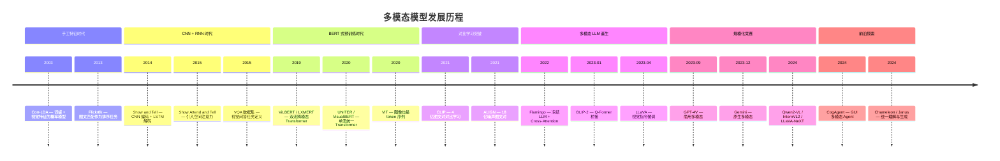
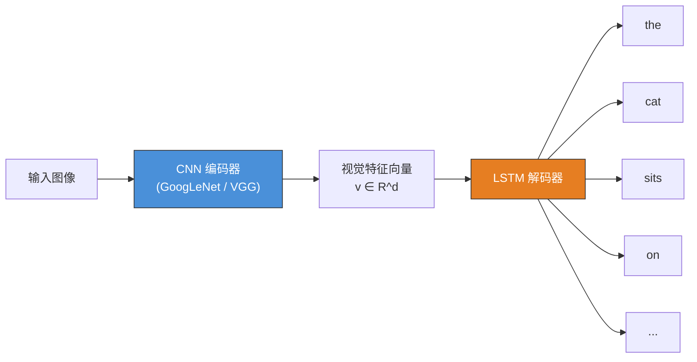
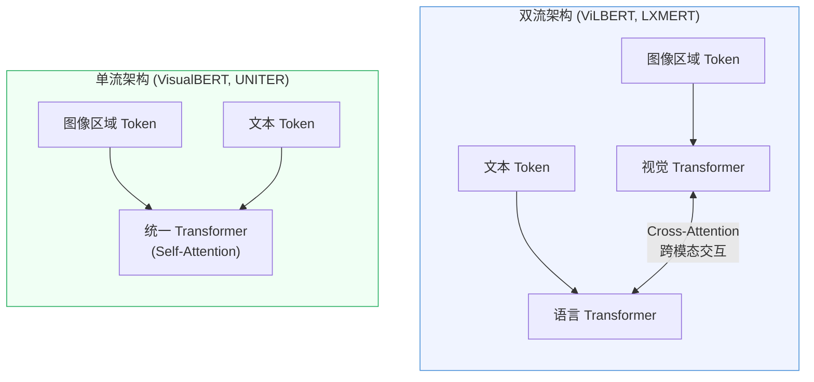
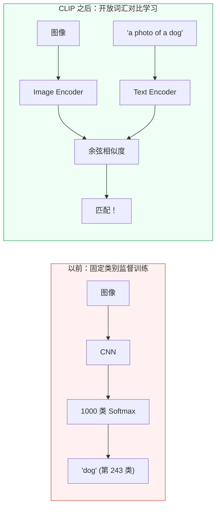
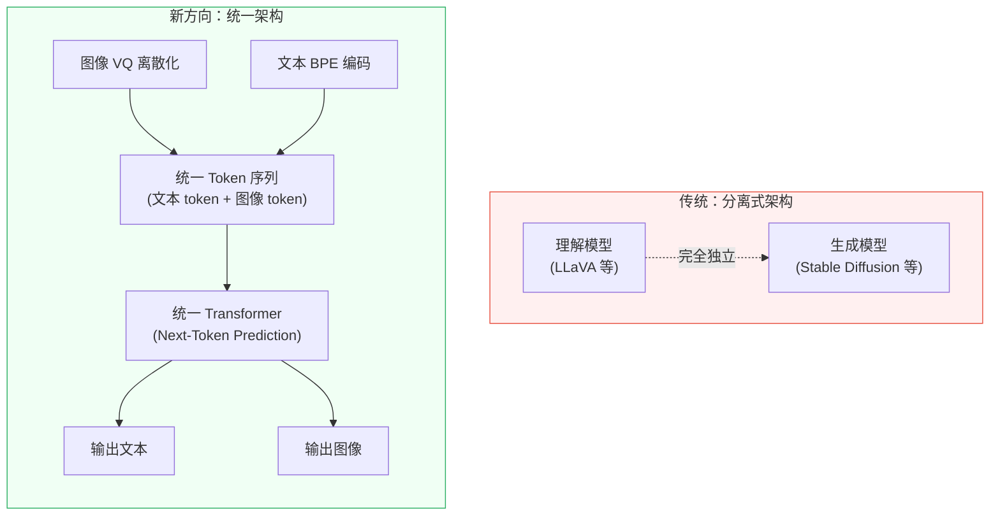
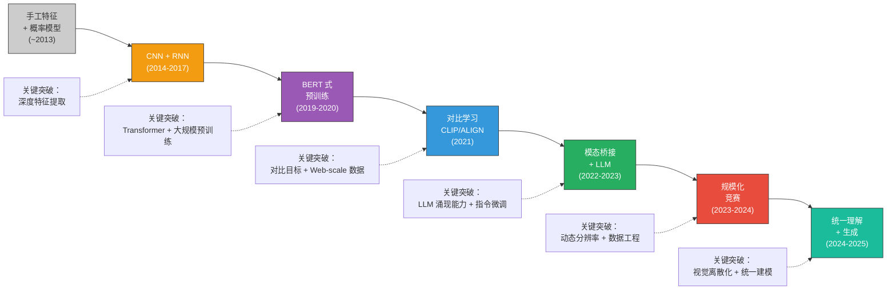

# 多模态模型的发展历程

> 从手工特征到端到端 Transformer，从任务专用模型到通用多模态大语言模型——一部视觉与语言走向融合的技术演进史。

## 关键概念

| 概念 | 含义 | 代表工作 |
|------|------|----------|
| 多模态（Multimodal） | 同时处理和理解两种及以上信息模态（如文本、图像、音频、视频） | 所有本文涉及的工作 |
| 编码器-解码器范式 | 用编码器提取视觉特征，解码器生成文本序列 | Show and Tell (2014) |
| 注意力机制（Attention） | 让模型在生成每个词时动态关注图像的不同区域 | Show, Attend and Tell (2015) |
| 视觉-语言预训练（VLP, Vision-Language Pre-training） | 在大规模图文数据上预训练模型，学习通用的多模态表征 | ViLBERT (2019), UNITER (2020) |
| 对比学习（Contrastive Learning） | 拉近匹配的图文对、推远不匹配的图文对在嵌入空间中的距离 | CLIP (2021), ALIGN (2021) |
| 视觉指令微调（Visual Instruction Tuning） | 用自然语言指令格式的数据对多模态模型做监督微调 | LLaVA (2023) |
| 模态桥接（Modality Bridging） | 将视觉编码器的输出转换为 LLM 能理解的"视觉 token" | Q-Former (BLIP-2), Linear Projection (LLaVA) |

## 详细笔记

### 直觉理解：为什么需要多模态？

想象一个只能通过文字交流的人——他能读书、写文章，但看不到图片、听不到声音。即使他的语言能力极强，依然无法回答"这张照片里有几只猫？"这样的问题。

大语言模型（LLM）面临的正是同样的困境：它们拥有强大的语言推理能力，但**天生只能处理文本**。多模态模型的目标就是给 LLM 装上"眼睛"（视觉）甚至"耳朵"（听觉），让它像人一样同时理解多种信息。

这不是一个简单的拼接问题。核心挑战在于：**图像的像素和文本的 token 生活在完全不同的"语义空间"里**。就像一个说中文的人和一个说英文的人要合作，需要一个翻译机制——多模态模型的核心技术演进，本质上就是在寻找更好的"跨模态翻译方案"。

### 技术演进全景：七个时代

---

### 第一阶段：手工特征时代（~2013）

**时代特征**：视觉特征靠手工设计（颜色直方图、SIFT、HOG），语言用词袋模型（Bag-of-Words），两者通过概率模型松散关联。

| 工作 | 年份 | 核心方法 |
|------|:----:|----------|
| Barnard et al. | 2003 | Corr-LDA：在潜在主题空间中联合建模图像区域和关键词 |
| Flickr8k (Hodosh et al.) | 2013 | 用核典型相关分析（KCCA）做图文排序匹配 |

**局限性**：手工特征的表达能力极其有限，模型只能处理简单的关键词级别的对应关系，无法理解复杂的视觉语义。

---

### 第二阶段：CNN + RNN 时代（2014-2017）

**范式转变**：深度学习的引入带来了质的飞跃。视觉端用 CNN（如 VGGNet、GoogLeNet）自动提取特征，语言端用 RNN/LSTM 生成文本序列。

**代表工作**：

**Show and Tell**（Vinyals et al., Google, CVPR 2015）
- 经典的编码器-解码器架构：GoogLeNet 将图像编码为一个固定维度的向量，作为 LSTM 的初始隐状态，LSTM 逐词生成描述
- 问题：**整张图像被压缩成一个向量**，信息损失严重——就像让你用一句话概括一幅复杂的画，再让另一个人根据这句话去描述原画

**Show, Attend and Tell**（Xu et al., ICML 2015）
- 关键创新：引入**空间注意力机制**——LSTM 在生成每个词时，动态地"看"图像的不同区域
- 例如生成"cat"时注意力集中在猫所在的区域，生成"mat"时注意力转向垫子
- 这是**注意力机制在视觉-语言领域的首次成功应用**，直接启发了后来 Transformer 中的 Attention

**VQA 数据集**（Antol et al., ICCV 2015）
- 定义了视觉问答（Visual Question Answering）任务：给定图像和自然语言问题，模型输出答案
- 25 万张图像，76 万个问题，1000 万个答案
- 将多模态从"描述"任务扩展到了"推理"任务

**时代局限**：
- CNN 提取的是**网格特征**（grid features），缺乏对物体级语义的显式建模
- RNN/LSTM 在长序列上存在梯度消失问题，生成质量有限
- 每个任务需要单独设计模型，缺乏通用性

---

### 第三阶段：BERT 式预训练时代（2019-2020）

**范式转变**：受 BERT 在 NLP 领域成功的启发，研究者开始用 Transformer 架构做视觉-语言预训练。核心思想：**先在大量图文数据上预训练一个通用表征，再微调到各个下游任务**。

这个时代的视觉输入通常依赖 **Faster R-CNN** 提取的**区域特征**（Region Features）——先用目标检测器找出图中的物体区域，每个区域用一个向量表示。

**代表工作**：

| 模型 | 年份 | 架构 | 预训练任务 |
|------|:----:|------|------------|
| ViLBERT | 2019 | 双流 + Co-Attention | MLM（Masked Language Modeling）+ ITM（Image-Text Matching） |
| LXMERT | 2019 | 三编码器（语言 / 视觉 / 跨模态） | MLM + MRC（Masked Region Classification）+ VQA 预训练 |
| VisualBERT | 2019 | 单流（图文共享 Self-Attention） | MLM + ITM |
| UNITER | 2020 | 单流 + 最优传输对齐 | MLM + MRC + ITM + WRA（Word-Region Alignment） |

**同期里程碑——ViT**（Dosovitskiy et al., Google Brain, ICLR 2021）：
- 将图像分割为 16×16 的 patch，每个 patch 作为一个 token，输入标准 Transformer
- 证明了 Transformer 在视觉领域同样有效，为后续统一视觉和语言的架构奠定基础
- ViT 后来成为几乎所有多模态大模型的默认视觉编码器

**时代局限**：
- 依赖 Faster R-CNN 提取区域特征，推理速度慢且引入了目标检测器的误差
- 预训练任务（MLM、ITM）偏向理解，不擅长生成
- 模型规模受限于当时的算力（通常 < 1B 参数）

---

### 第四阶段：对比学习突破（2021）

**范式转变**：CLIP 和 ALIGN 证明了一个震撼性的结论——**只需简单的对比学习目标，配合足够大的数据规模，就能学到强大的视觉-语言表征，实现零样本迁移**。

**代表工作**：

**CLIP**（Radford et al., OpenAI, ICML 2021）
- 在 4 亿个互联网图文对上做对比学习，零样本 ImageNet Top-1 达到 **76.2%**
- 核心公式——对称 InfoNCE 损失：

$$\mathcal{L} = \frac{1}{2}\left(\mathcal{L}_{i \to t} + \mathcal{L}_{t \to i}\right)$$

其中 $\mathcal{L}_{i \to t} = -\frac{1}{N}\sum_{i}\log\frac{\exp(I_i^\top T_i / \tau)}{\sum_j \exp(I_i^\top T_j / \tau)}$

- $I_i, T_j$：第 $i$ 张图像和第 $j$ 段文本的 L2 归一化嵌入向量
- $\tau$：可学习的温度参数，控制相似度分布的尖锐程度
- $N$：batch 中正确配对数量
- 详细分析见 → [论文笔记：CLIP](../../papers/clip.md)

**ALIGN**（Jia et al., Google, ICML 2021）
- 更大的数据规模：**18 亿**个噪声图文对（未经精细过滤）
- 证明了数据规模可以弥补数据质量的不足
- EfficientNet + BERT 架构

**为什么对比学习是范式转变？**

| 维度 | 之前（有监督分类） | CLIP 之后（对比学习） |
|------|:------------------:|:---------------------:|
| 类别集合 | 固定（如 1000 类） | 开放（自然语言定义） |
| 标注需求 | 人工标注 | 互联网天然图文对 |
| 迁移方式 | 微调或线性探针 | 零样本（改变 Prompt 即可） |
| 视觉编码器 | 为分类优化 | 为语义对齐优化 |

这个阶段的 CLIP 视觉编码器（特别是 ViT-L/14）成为后续几乎所有多模态大模型的**标准视觉骨干**。

---

### 第五阶段：多模态 LLM 诞生（2022-2023）

**范式转变**：当 LLM（如 GPT-3、LLaMA）展现出强大的语言推理能力后，核心问题变成——**如何将视觉信息"注入"到已经训练好的 LLM 中？** 这催生了三种经典的模态桥接方案。

```mermaid
graph TB
    subgraph Flamingo方案["方案一：Cross-Attention 插入<br/>(Flamingo)"]
        V1["视觉特征"] --> PR["Perceiver<br/>Resampler"]
        PR --> |"64 个固定<br/>视觉 token"| XA["Cross-Attention<br/>层 (新增)"]
        XA --> LLM1["冻结的<br/>LLM 层"]
    end

    subgraph BLIP2方案["方案二：Q-Former 桥接<br/>(BLIP-2)"]
        V2["冻结的 ViT"] --> QF["Q-Former<br/>(32 个 Query)"]
        QF --> LP1["线性投影"]
        LP1 --> LLM2["冻结的 LLM<br/>(OPT / FlanT5)"]
    end

    subgraph LLaVA方案["方案三：线性投影<br/>(LLaVA)"]
        V3["冻结的<br/>CLIP ViT"] --> LP2["线性投影层<br/>(或 MLP)"]
        LP2 --> LLM3["LLaMA<br/>(微调)"]
    end

    style Flamingo方案 fill:#fef9e7,stroke:#F39C12
    style BLIP2方案 fill:#f0f4ff,stroke:#4A90D9
    style LLaVA方案 fill:#f0fff4,stroke:#27AE60
```

**代表工作**：

**Flamingo**（Alayrac et al., DeepMind, NeurIPS 2022）
- 800 亿参数（基于 Chinchilla 70B LLM）
- 三大创新：
  1. **Perceiver Resampler**：将变长视觉特征压缩为固定的 64 个 token
  2. **交叉注意力层插入**：在冻结的 LLM 层之间插入可训练的 Cross-Attention 层
  3. **Tanh 门控**：用 $\tanh$ 门控机制保证训练稳定性
- 支持交错（interleaved）的图文序列输入，实现 few-shot 多模态学习

**BLIP-2**（Li et al., Salesforce, ICML 2023）
- 核心创新——**Q-Former**：32 个可学习的 query 向量通过 Cross-Attention 从冻结的 ViT 中提取视觉信息，再投影到冻结的 LLM 输入空间
- 仅需训练约 **1.88 亿参数**（不到总参数的 2%），极大降低训练成本
- 两阶段训练：
  1. 视觉-语言表征学习（Q-Former + ViT 对齐）
  2. 视觉到语言的生成学习（Q-Former + LLM 对齐）

**LLaVA**（Liu et al., NeurIPS 2023 Oral）
- 最简洁的方案：CLIP ViT-L/14 + **一个线性投影层** + LLaMA
- 关键创新不在架构，而在**数据**——用纯文本 GPT-4 生成了 15 万条多模态指令数据
- 开创了**视觉指令微调**（Visual Instruction Tuning）范式：
  - 将视觉理解任务统一为"给定图像，用自然语言回答问题"的对话格式
  - 模型不再为每个任务单独设计，而是通过指令区分不同任务
- LLaVA-1.5 将线性层升级为 2 层 MLP，性能大幅提升

**三种方案对比**：

| 方案 | 可训练参数量 | 训练复杂度 | 性能 | 直觉理解 |
|------|:-----------:|:----------:|:----:|----------|
| Cross-Attention (Flamingo) | 中等 | 高 | 强 | 在 LLM 内部"植入"视觉感知器官 |
| Q-Former (BLIP-2) | 少（~188M） | 中 | 中 | 训练一个"翻译官"在视觉和语言之间传话 |
| 线性投影 (LLaVA) | 最少 | 低 | 中→强 | 直接把视觉 token "翻译"成 LLM 的语言 |

---

### 第六阶段：规模化竞赛（2023-2024）

**时代特征**：多模态 LLM 进入工程竞赛阶段——更大的模型、更多的数据、更高的分辨率、更长的上下文。

**闭源前沿**：

| 模型 | 机构 | 时间 | 关键能力 |
|------|------|:----:|----------|
| GPT-4V | OpenAI | 2023.09 | 首个广泛部署的商用多模态模型 |
| Gemini 1.0 | Google DeepMind | 2023.12 | 从头训练的原生多模态模型 |
| GPT-4o | OpenAI | 2024.05 | 端到端多模态（文本/图像/音频），音频延迟低至 232ms |
| Gemini 1.5 Pro | Google DeepMind | 2024.03 | 100 万 token 上下文窗口，支持 1 小时视频 |

**开源主力**：

| 模型 | 机构 | 关键创新 |
|------|------|----------|
| Qwen-VL | 阿里云 | 双语（中英文）、视觉定位、OCR |
| Qwen2-VL | 阿里云 | Naive Dynamic Resolution + M-RoPE |
| InternVL | 上海 AI Lab | 将视觉编码器扩展到 60 亿参数（InternViT-6B） |
| LLaVA-NeXT | LLaVA Team | AnyRes 动态分辨率：高分辨率图像切分为网格 + 缩略图 |
| DeepSeek-VL | DeepSeek | 混合编码器（低分辨率 SigLIP + 高分辨率 SAM） |
| MiniCPM-V | 清华/面壁 | 端侧部署，8B 参数，可在手机运行 |

**这个阶段的核心技术趋势**：

1. **动态分辨率**：不再将所有图像缩放到固定尺寸（如 224×224），而是根据图像原始分辨率灵活处理
2. **视觉 token 压缩**：高分辨率带来大量视觉 token，需要高效的 token 压缩方案
3. **数据质量至上**：模型性能越来越取决于训练数据的质量，而非单纯的规模
4. **视频理解**：从静态图像扩展到视频流的时序推理

---

### 第七阶段：前沿探索（2024-2025）

**时代特征**：多模态模型从"理解"走向"理解 + 生成 + 行动"。

**多模态 Agent**：
- **CogAgent**（智谱/清华, CVPR 2024）：180 亿参数，双分辨率视觉编码器（224×224 全局 + 1120×1120 高分辨率），仅通过截图即可操控 GUI，超越了依赖 HTML 源码的方案

**统一理解与生成**：

传统 MLLM 只能"看图说话"但不能"画图"。新的方向是将理解和生成统一到一个模型中：

| 模型 | 机构 | 年份 | 核心思路 |
|------|------|:----:|----------|
| Emu | BAAI | 2023 | 多模态生成预训练，交替预测图文 token |
| Chameleon | Meta FAIR | 2024 | Early-Fusion：图像 VQ 离散化后与文本 token 共享词表，单一 Transformer 处理一切 |
| Janus | DeepSeek | 2024 | 解耦视觉编码——理解用 SigLIP 语义特征，生成用 VQ 离散 token，共享自回归 Transformer |
| Emu3 | BAAI | 2024 | 纯 Next-Token Prediction，无需扩散模型即可生成高质量图像 |

---

### 技术演进的主线总结

**三条贯穿全程的技术主线**：

1. **视觉表征的进化**：手工特征 → CNN 网格特征 → Region Features (Faster R-CNN) → ViT Patch Features → 动态分辨率多尺度特征
2. **跨模态交互的进化**：概率模型 → 注意力机制 → Cross-Attention / Self-Attention → 对比对齐 → 共享 Transformer 直接融合
3. **训练范式的进化**：任务专用训练 → 预训练 + 微调 → 对比预训练 + 零样本 → 指令微调 + 对话格式 → 统一 Next-Token Prediction

## 个人理解与思考

### 几个值得深思的问题

**1. 为什么是 CLIP 而不是更早的工作成为转折点？**

在 CLIP 之前，已有多项工作（VirTex、ConVIRT、ICMLM）探索了用自然语言监督训练视觉模型。CLIP 的成功并非方法的原创性，而在于三个因素的叠加：（1）足够大的数据规模（4 亿 vs. 百万级）；（2）正确的训练目标（对比 vs. 生成，前者效率高 4-12 倍）；（3）足够大的模型容量（ViT-L/14）。这说明在深度学习中，**Scaling 本身就是一种创新**。

**2. "桥接"方案的哲学差异**

BLIP-2 的 Q-Former 和 LLaVA 的线性投影代表了两种不同的哲学：
- Q-Former：信息先经过"压缩翻译"再交给 LLM → 信息有损，但 LLM 不需要改变
- 线性投影 + LLM 微调：信息几乎原样传递，让 LLM 自己学会"看"→ 信息保真，但需要微调 LLM

后来的发展表明，**简单的线性/MLP 投影 + LLM 微调**（LLaVA 路线）往往更优。这暗示 LLM 的适应能力比我们预想的更强——它们可以学会直接"理解"视觉 token，不需要过多的中间翻译。

**3. 统一架构是终局吗？**

Chameleon 和 Janus 代表的"统一理解与生成"方向非常诱人——一个模型既能看图说话，又能根据文字画图。但 Janus 的论文指出，理解和生成可能需要**不同粒度的视觉表征**（语义级 vs. 像素级），强行统一编码器反而会互相拖累。这意味着"统一"的最终形态可能不是完全共享，而是**共享推理引擎，解耦感知模块**。

### 与已有笔记的关联

- **CLIP 论文笔记** → [papers/clip.md](../../papers/clip.md)：本笔记第四阶段的核心内容，CLIP 的详细技术方案和消融实验分析
- **论文阅读清单** → [papers/README.md](../../papers/README.md)：本笔记涉及的所有论文均可在阅读清单中找到追踪状态
- **后续建议**：阅读 BLIP-2 和 LLaVA 论文，深入理解第五阶段的模态桥接方案

### 常见误区

| 误区 | 纠正 |
|------|------|
| "多模态模型就是把图像和文本拼在一起" | 核心挑战不是拼接，而是**对齐**——让两种模态的表征处于同一语义空间，使得"一只猫的图像"和"a cat"对应到相似的向量 |
| "CLIP 是第一个做图文对比学习的" | 之前有 ConVIRT（2020）等工作，CLIP 的突破在于数据规模（4 亿 vs. 数百万）和模型规模的 Scaling |
| "多模态 LLM 需要从头训练" | 主流方案（BLIP-2、LLaVA）都是冻结预训练好的视觉编码器和/或 LLM，只训练轻量的桥接模块，成本远低于从头训练 |
| "ViLBERT 时代的模型和现在的 MLLM 是一回事" | ViLBERT 等是用 BERT 级别的模型（~100M 参数）做预训练+微调，缺乏生成和对话能力；现在的 MLLM 基于 LLM（7B~70B+），具备强大的语言推理和指令遵循能力 |
| "Gemini 和 GPT-4V 的架构是公开的" | 这些都是闭源模型，架构细节未完全公开。开源社区主要通过 LLaVA、InternVL、Qwen-VL 等模型推动研究进展 |

### 面试/口述版

> 多模态大模型的发展经历了七个阶段。早期用 CNN+RNN 做图像描述（2014-2017），然后 BERT 式预训练将 Transformer 引入视觉-语言领域（2019-2020）。2021 年 CLIP 通过对比学习在 4 亿图文对上实现了零样本迁移，成为真正的范式转变。此后，Flamingo、BLIP-2、LLaVA 分别提出了 Cross-Attention、Q-Former 和线性投影三种方案，将视觉能力接入大语言模型，开启了多模态 LLM 时代。当前前沿正在从单一理解走向统一的理解+生成架构，同时探索多模态 Agent 等应用方向。

## 相关链接

- [A Survey on Multimodal Large Language Models](https://arxiv.org/abs/2306.13549) — 2023 年 MLLM 综述，适合入门全景了解
- [MM-LLMs: Recent Advances in MultiModal Large Language Models](https://arxiv.org/abs/2401.13601) — 2024 年 MLLM 全景综述，覆盖最新进展
- [A Dive into Vision-Language Models (Hugging Face)](https://huggingface.co/blog/vision_language_pretraining) — 视觉-语言模型技术博客
- [Awesome Multimodal LLM 资源汇总](../../resources/awesome-mllm.md) — 本仓库的学习资源集合

## 更新日志

- 2026-02-21: 初始创建
