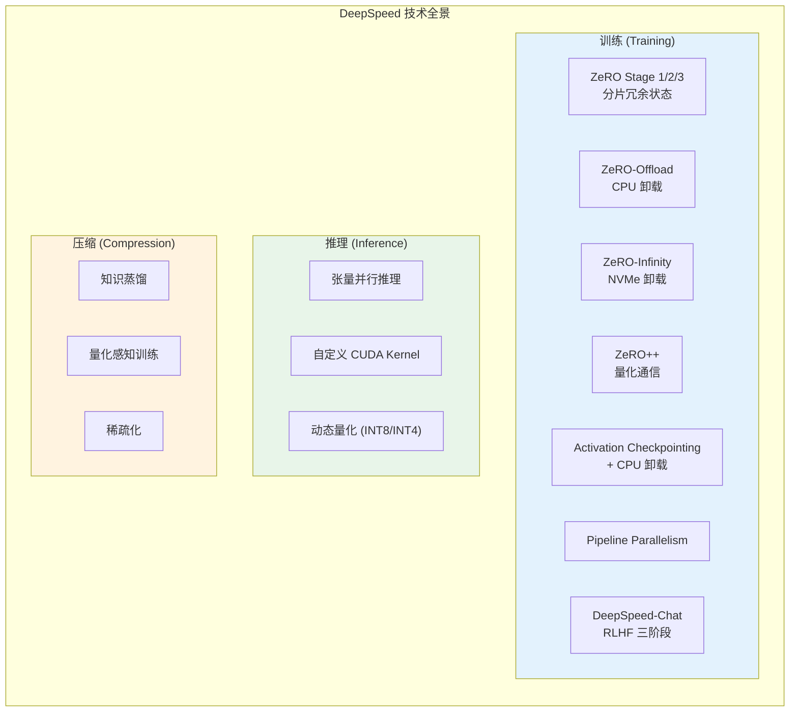
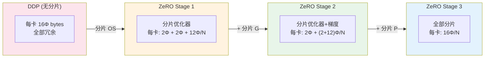
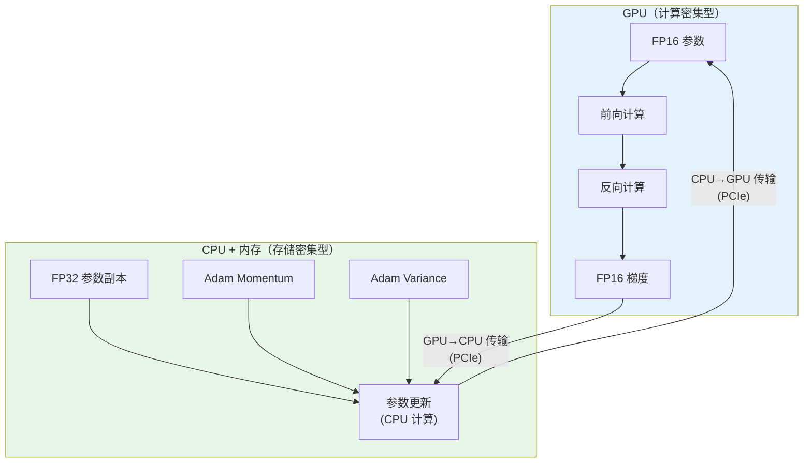
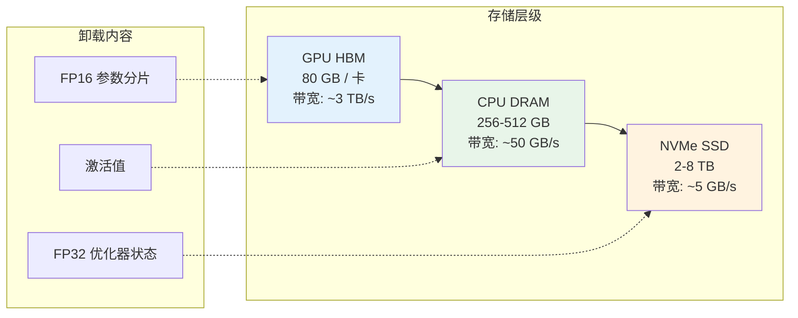
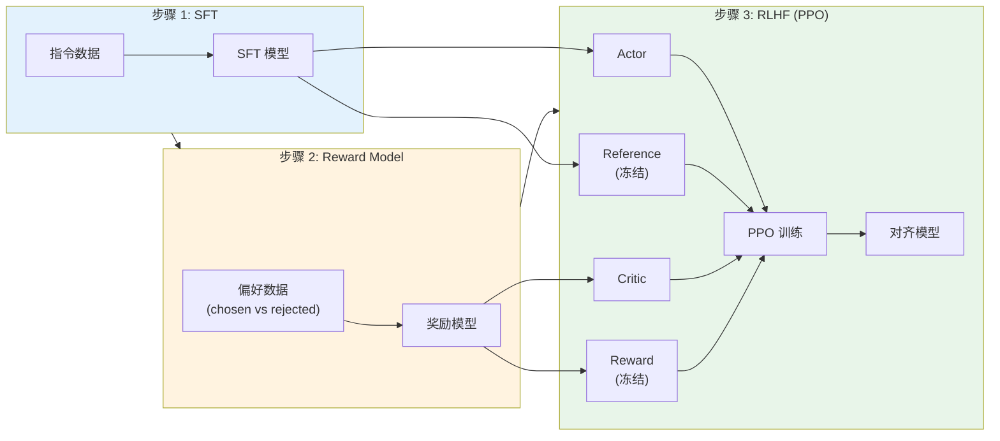
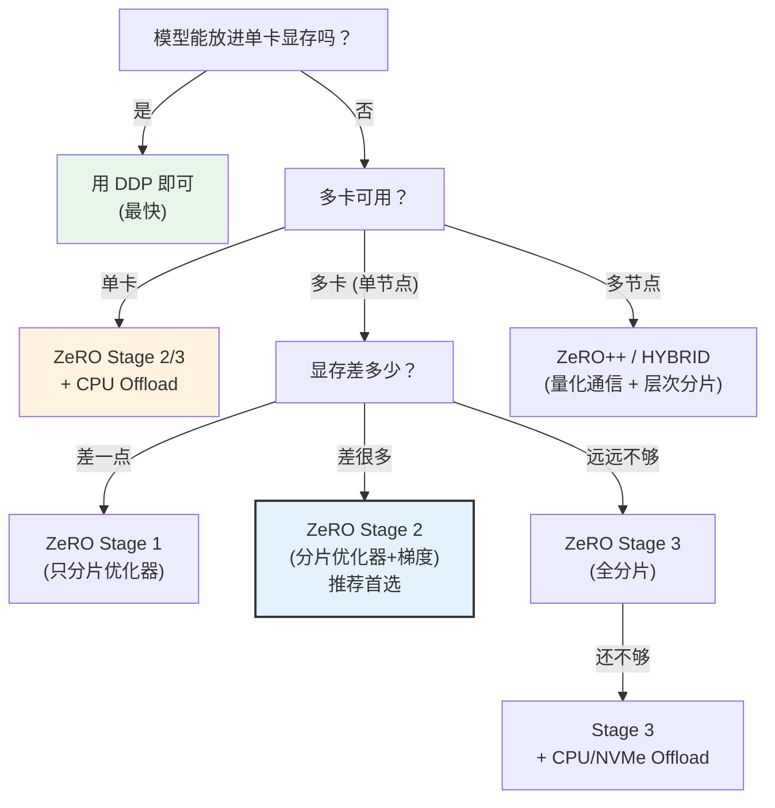

# DeepSpeed：从 ZeRO 到万亿参数训练

> DeepSpeed 是微软开源的大模型训练与推理优化库——其核心是 ZeRO（Zero Redundancy Optimizer）系列技术，通过分片、卸载和量化通信三板斧，让普通集群也能训练千亿级模型。与 PyTorch FSDP 共享"分片冗余"的理论基础（详见 [fsdp.md](./fsdp.md)），但 DeepSpeed 在 CPU/NVMe 卸载、推理优化和 RLHF 工具链方面走得更远。

## 关键概念

| 概念 | 含义 |
|------|------|
| DeepSpeed | 微软开源的深度学习优化库，涵盖训练、推理和压缩 |
| ZeRO（Zero Redundancy Optimizer） | DeepSpeed 的核心技术，通过分片消除数据并行中的冗余存储 |
| ZeRO Stage 1 | 只分片优化器状态（Adam 的 momentum + variance） |
| ZeRO Stage 2 | 分片优化器状态 + 梯度 |
| ZeRO Stage 3 | 分片优化器状态 + 梯度 + 模型参数 |
| ZeRO-Offload | 将优化器状态和梯度卸载到 CPU 内存，单卡训练大模型 |
| ZeRO-Infinity | 将所有模型状态卸载到 NVMe SSD，突破 CPU 内存限制 |
| ZeRO++ | 通信优化：量化权重通信 + 层次化分区，减少跨节点通信 |
| DeepSpeed-Chat | 基于 DeepSpeed 的 RLHF 训练框架（SFT → Reward → PPO 三阶段） |
| DeepSpeed-Inference | 推理优化引擎：张量并行 + 自定义 CUDA Kernel + 量化 |
| ds\_config | DeepSpeed 的 JSON 配置文件，声明式定义所有训练优化策略 |
| Activation Checkpointing | DeepSpeed 内置的激活检查点，支持分区和 CPU 卸载 |

## 详细笔记

### 一、DeepSpeed 的定位与全景

#### 不只是分布式训练框架

DeepSpeed 经常被拿来与 FSDP 对比（详见 [fsdp.md](./fsdp.md)），但 DeepSpeed 的覆盖范围远不止分布式训练：



#### DeepSpeed vs FSDP 的定位差异

| 维度 | DeepSpeed | FSDP |
|------|-----------|------|
| 本质 | **独立的优化库**（全栈） | **PyTorch 原生 API**（专注分布式） |
| 配置方式 | JSON 配置文件（声明式） | Python API（编程式） |
| 训练优化 | ZeRO 1/2/3 + Offload + Infinity | 分片策略 + Mixed Precision |
| 推理优化 | ✅ DeepSpeed-Inference | ❌ |
| RLHF 支持 | ✅ DeepSpeed-Chat | ❌ |
| CPU/NVMe 卸载 | ✅ ZeRO-Offload / Infinity | ⚠️ 有限支持 |
| HuggingFace 集成 | Trainer 原生支持 | Accelerate 支持 |
| 调试透明度 | 较低（封装较深） | 较高（标准 PyTorch） |

### 二、ZeRO 三阶段详解

ZeRO 的核心理论与 FSDP 共通（详见 [fsdp.md](./fsdp.md) 第二章），这里聚焦 DeepSpeed 特有的实现细节和阶段差异。

#### 2.1 显存组成分析

训练一个参数量为 $\Phi$ 的模型，使用 Adam 优化器 + FP16 混合精度训练时的显存分布：

| 组件 | 精度 | 每参数字节 | $\Phi = 7B$ |
|------|------|:---------:|:-----------:|
| 模型参数 (FP16) | FP16 | 2 | 14 GB |
| 梯度 (FP16) | FP16 | 2 | 14 GB |
| FP32 参数副本 | FP32 | 4 | 28 GB |
| Adam momentum | FP32 | 4 | 28 GB |
| Adam variance | FP32 | 4 | 28 GB |
| **总计** | | **16** | **112 GB** |

优化器状态（FP32 副本 + momentum + variance）占了 **75%** 的显存。

#### 2.2 三阶段的渐进式分片



每阶段的显存与通信开销（$N$ 张 GPU）：

| 阶段 | 每卡显存 | 7B x 8 卡 | 额外通信 vs DDP |
|------|---------|:---------:|:---------:|
| DDP | $16\Phi$ | 112 GB | 0（基准） |
| Stage 1 | $4\Phi + \frac{12\Phi}{N}$ | 38.5 GB | 0（与 DDP 相同） |
| Stage 2 | $2\Phi + \frac{14\Phi}{N}$ | 26.25 GB | 0（与 DDP 相同） |
| Stage 3 | $\frac{16\Phi}{N}$ | **14 GB** | +50%（额外 All-Gather） |

**关键洞察**：
- Stage 1 和 Stage 2 的**通信量与 DDP 完全相同**（只有梯度的 All-Reduce），但显存大幅减少
- 只有 Stage 3 引入额外通信（参数的 All-Gather），与 FSDP FULL\_SHARD 等价
- 实践中 **Stage 2 是性能最优的甜蜜点**——显存减少 76% 而通信不增加

#### 2.3 DeepSpeed 的 JSON 配置

DeepSpeed 使用**声明式 JSON 配置**，这是它与 FSDP 最显著的使用体验差异：

```json
{
    "bf16": {
        "enabled": true
    },
    "zero_optimization": {
        "stage": 2,
        "offload_optimizer": {
            "device": "cpu",
            "pin_memory": true
        },
        "allgather_partitions": true,
        "allgather_bucket_size": 2e8,
        "reduce_scatter": true,
        "reduce_bucket_size": 2e8,
        "overlap_comm": true,
        "contiguous_gradients": true
    },
    "gradient_accumulation_steps": 4,
    "gradient_clipping": 1.0,
    "train_batch_size": "auto",
    "train_micro_batch_size_per_gpu": "auto",
    "wall_clock_breakdown": false
}
```

**配置 vs 编程的权衡**：
- **优势**：不修改训练代码即可切换优化策略（改 JSON 就行）
- **优势**：与 HuggingFace Trainer 深度集成（传入 JSON 路径即可）
- **劣势**：调试困难（配置项多，错误信息不直观）
- **劣势**：灵活性不如编程式 API

### 三、ZeRO-Offload：突破 GPU 显存限制

#### 3.1 核心思想

当 GPU 显存不够时，把一部分计算和存储**卸载到 CPU**：



**卸载策略**：
- **FP32 优化器状态** → CPU 内存（占 75% 显存的大头）
- **参数更新计算** → CPU 上执行（Adam 更新计算量不大）
- **前向/反向传播** → 仍在 GPU 上（计算密集）
- **通信** → GPU ↔ CPU 通过 PCIe 传输

#### 3.2 性能影响

| 指标 | 无 Offload | ZeRO-Offload |
|------|:---------:|:------------:|
| GPU 显存 | $16\Phi / N$ | ~$4\Phi / N$（仅 FP16 参数+梯度） |
| CPU 内存需求 | 极低 | $12\Phi / N$（优化器状态） |
| 训练速度 | 基准 | 降低 30-60% |
| 瓶颈 | GPU 计算 | PCIe 带宽（~32 GB/s for PCIe 4.0 x16） |

**适用场景**：GPU 显存不足但有充足 CPU 内存（如单卡 A100 40GB 训练 13B 模型）。

#### 3.3 配置示例

```json
{
    "zero_optimization": {
        "stage": 2,
        "offload_optimizer": {
            "device": "cpu",
            "pin_memory": true
        },
        "offload_param": {
            "device": "cpu",
            "pin_memory": true
        }
    }
}
```

`pin_memory: true` 使用页锁定内存（pinned memory），避免 CPU→GPU 传输时的额外拷贝，显著提升传输速度。

### 四、ZeRO-Infinity：NVMe 卸载

#### 4.1 突破 CPU 内存瓶颈

ZeRO-Offload 把优化器卸载到 CPU 内存，但 CPU 内存也有限（通常 256-512 GB）。对于万亿参数模型，即使 CPU 内存也不够。

ZeRO-Infinity 更进一步——**卸载到 NVMe SSD**：



#### 4.2 存储层级对比

| 层级 | 容量 | 带宽 | 适合存放 |
|------|:---:|:---:|---------|
| GPU HBM | 80 GB | ~3 TB/s | 当前计算的参数和激活 |
| CPU DRAM | 256-512 GB | ~50 GB/s | 优化器状态（ZeRO-Offload） |
| NVMe SSD | 2-8 TB | ~5 GB/s | 全部模型状态（ZeRO-Infinity） |

**关键技术**：DeepSpeed 使用**异步预取**和**分块传输**来隐藏 NVMe 的读写延迟——在 GPU 计算当前层时，同时从 NVMe 加载下一层的参数。

#### 4.3 支持的模型规模

| 配置 | 可训练参数量 |
|------|:---------:|
| 8x A100 80GB（无 Offload） | ~70B |
| 8x A100 + CPU Offload | ~200B |
| 8x A100 + NVMe Infinity | ~1T+ |

### 五、ZeRO++：跨节点通信优化

#### 5.1 多节点训练的通信瓶颈

ZeRO Stage 3 的 All-Gather 和 Reduce-Scatter 在多节点场景下成为瓶颈——节点间带宽（InfiniBand ~400 Gbps）远低于节点内（NVLink ~900 GB/s）。

ZeRO++ 通过三项技术减少跨节点通信：

#### 5.2 三项优化

**优化一：量化权重通信（qwZ）**

All-Gather 传输 FP16 参数时，先量化为 INT8（甚至 INT4），接收端再反量化：

$$\text{通信量减少} = 1 - \frac{\text{INT8}}{\text{FP16}} = 50\%$$

量化引入的精度损失对前向传播影响很小（权重的绝对值范围有限），反向传播仍使用全精度。

**优化二：层次化分区（hpZ）**

不再跨所有节点分片参数，而是**节点内保留完整副本**：
- 节点内：每卡保存完整参数（免去节点内 All-Gather）
- 节点间：参数分片（跨节点通信量减少 $N_{\text{intra}}$ 倍）

这与 FSDP 的 `HYBRID_SHARD` 思想一致（详见 [fsdp.md](./fsdp.md) 第四章）。

**优化三：量化梯度通信（qgZ）**

Reduce-Scatter 传输梯度时也做量化压缩，配合误差补偿保证收敛性。

#### 5.3 ZeRO++ 效果

| 指标 | ZeRO-3 | ZeRO++ |
|------|:------:|:------:|
| 跨节点通信量 | 基准 | **减少 ~4x** |
| 训练吞吐量 | 基准 | **提升 28-36%** |
| 收敛精度 | 基准 | 几乎无损 |

### 六、DeepSpeed 与 HuggingFace 集成

#### 6.1 Trainer 集成

HuggingFace Trainer 原生支持 DeepSpeed，只需传入配置文件：

```python
from transformers import TrainingArguments, Trainer

training_args = TrainingArguments(
    output_dir="./output",
    per_device_train_batch_size=4,
    gradient_accumulation_steps=4,
    bf16=True,
    deepspeed="ds_config.json",  # 传入 DeepSpeed 配置
)

trainer = Trainer(
    model=model,
    args=training_args,
    train_dataset=train_dataset,
)
trainer.train()
```

#### 6.2 常用配置模板

**ZeRO Stage 2（推荐起点）**：

```json
{
    "bf16": { "enabled": true },
    "zero_optimization": {
        "stage": 2,
        "allgather_partitions": true,
        "allgather_bucket_size": 5e8,
        "overlap_comm": true,
        "reduce_scatter": true,
        "reduce_bucket_size": 5e8,
        "contiguous_gradients": true
    },
    "gradient_accumulation_steps": "auto",
    "gradient_clipping": 1.0,
    "train_batch_size": "auto",
    "train_micro_batch_size_per_gpu": "auto"
}
```

**ZeRO Stage 3 + CPU Offload（大模型）**：

```json
{
    "bf16": { "enabled": true },
    "zero_optimization": {
        "stage": 3,
        "offload_optimizer": { "device": "cpu", "pin_memory": true },
        "offload_param": { "device": "cpu", "pin_memory": true },
        "overlap_comm": true,
        "contiguous_gradients": true,
        "sub_group_size": 1e9,
        "reduce_bucket_size": "auto",
        "stage3_prefetch_bucket_size": "auto",
        "stage3_param_persistence_threshold": "auto",
        "stage3_max_live_parameters": 1e9,
        "stage3_max_reuse_distance": 1e9,
        "stage3_gather_16bit_weights_on_model_save": true
    },
    "gradient_accumulation_steps": "auto",
    "gradient_clipping": 1.0,
    "train_batch_size": "auto",
    "train_micro_batch_size_per_gpu": "auto"
}
```

**关键参数说明**：

| 参数 | 含义 | 推荐值 |
|------|------|--------|
| `stage` | ZeRO 阶段 | 2（默认） / 3（大模型） |
| `overlap_comm` | 通信-计算重叠 | `true` |
| `allgather_bucket_size` | All-Gather 通信桶大小 | 5e8 |
| `reduce_bucket_size` | Reduce 通信桶大小 | 5e8 |
| `offload_optimizer.device` | 优化器卸载目标 | "cpu" / "nvme" |
| `pin_memory` | 页锁定内存 | `true`（加速 CPU↔GPU） |
| `stage3_gather_16bit_weights_on_model_save` | 保存时收集完整权重 | `true` |

#### 6.3 "auto" 魔法

DeepSpeed 配置中大量使用 `"auto"`——让 HuggingFace Trainer 自动填充与 `TrainingArguments` 一致的值，避免两处配置不一致：

```json
{
    "train_batch_size": "auto",           // 自动从 Trainer 获取
    "train_micro_batch_size_per_gpu": "auto",
    "gradient_accumulation_steps": "auto"
}
```

### 七、DeepSpeed-Chat：RLHF 训练流水线

DeepSpeed-Chat 是目前最完整的开源 RLHF 训练框架之一（详见 [rlhf.md](./rlhf.md) 和 [grpo.md](./grpo.md)）：



**DeepSpeed-Chat 的独特价值**：
- PPO 阶段需要同时运行 4 个模型（Actor + Critic + Reference + Reward），显存压力极大
- DeepSpeed 可以对 4 个模型分别配置不同的 ZeRO 阶段和 Offload 策略
- 例如：Actor 用 ZeRO-3（需要训练），Reference 用 ZeRO-3 + CPU Offload（冻结，省显存）

### 八、DeepSpeed-Inference：推理优化

DeepSpeed 不只做训练，也提供推理优化：

| 优化技术 | 效果 |
|---------|------|
| 张量并行推理 | 将大模型切分到多卡做推理 |
| 自定义 CUDA Kernel | 替换标准 Attention/FFN 的低效实现 |
| 动态量化 | INT8/INT4 量化减少显存和加速推理 |
| Kernel Injection | 自动替换 HuggingFace 模型的标准模块为优化 Kernel |

```python
import deepspeed

# 一行代码启用推理优化
model = deepspeed.init_inference(
    model,
    tensor_parallel={"tp_size": 4},  # 4 卡张量并行
    dtype=torch.float16,
    replace_with_kernel_inject=True,  # 自动注入优化 Kernel
)
```

### 九、策略选择决策树



**经验法则**：
1. 能用 DDP 就不用 ZeRO（速度最快）
2. 首选 **ZeRO Stage 2**（显存减少 76%，通信不增加）
3. 只有 Stage 2 不够时才用 Stage 3（通信增加 50%）
4. Offload 是最后手段（速度下降 30-60%）

### 十、DeepSpeed 的局限与替代

#### 局限

1. **调试不透明**：DeepSpeed 封装层较深，报错信息不够直观，排查问题比 FSDP 困难
2. **依赖独立库**：需要额外安装 `deepspeed` 包，有时与特定 PyTorch/CUDA 版本不兼容
3. **编译问题**：部分优化 Kernel 需要 CUDA 编译，在某些环境下可能编译失败
4. **ZeRO Stage 3 的动态图限制**：Stage 3 对动态计算图的支持不如 FSDP 灵活

#### 替代方案

| 工具 | 特点 | 适用场景 |
|------|------|---------|
| PyTorch FSDP | 原生、透明、易调试 | 纯 PyTorch 项目 |
| Megatron-LM | 极致优化的 3D 并行 | 超大规模预训练 |
| ColossalAI | 自动并行 + 异构训练 | 快速原型 |
| Accelerate | HuggingFace 的轻量封装 | 简单分布式需求 |

## 个人理解与思考

### 交叉引用

1. **[fsdp.md](./fsdp.md)** — FSDP 是 DeepSpeed ZeRO 的 PyTorch 原生等价实现，两者共享理论基础但使用体验不同
2. **[llm-optimization-techniques.md](./llm-optimization-techniques.md)** — ZeRO 显存分析、混合精度、梯度累积等前置知识的详细展开
3. **[rlhf.md](./rlhf.md)** — DeepSpeed-Chat 实现了 RLHF 三阶段流水线（SFT → RM → PPO）
4. **[grpo.md](./grpo.md)** — GRPO 训练也可以使用 DeepSpeed 的分布式基础设施
5. **[llm-pretraining.md](./llm-pretraining.md)** — 大模型预训练的分布式配置，引用了 ZeRO/FSDP
6. **[transformer.md](../fundamentals/transformer.md)** — Transformer Block 是分片和并行的基本单元

### 常见误区

| 误区 | 纠正 |
|------|------|
| "DeepSpeed 和 ZeRO 是两个东西" | ZeRO 是 DeepSpeed 的核心算法。DeepSpeed 是库，ZeRO 是库中的技术 |
| "ZeRO Stage 3 总是最好的" | Stage 3 通信量比 Stage 2 多 50%。Stage 2 是**速度最优的甜蜜点**——显存减少 76% 而通信不增加 |
| "CPU Offload 没有代价" | Offload 会导致 30-60% 的训练速度下降，因为 PCIe 带宽（~32 GB/s）远低于 GPU HBM 带宽（~3 TB/s）|
| "DeepSpeed 只用于训练" | DeepSpeed-Inference 提供推理优化（张量并行、Kernel 注入、动态量化），不只是训练工具 |
| "配置文件的 batch\_size 和 Trainer 的要一致" | 使用 `"auto"` 让 DeepSpeed 自动从 HuggingFace Trainer 获取，避免配置冲突 |
| "FSDP 和 DeepSpeed 不能混用" | 确实不能在同一个模型上同时使用两者，但一个项目中不同模型可以分别使用（如 DeepSpeed-Chat 中不同角色用不同策略）|
| "ZeRO-Infinity 适合日常训练" | NVMe 带宽只有 ~5 GB/s，训练极慢。Infinity 是为万亿参数规模的研究性训练设计的，日常训练用 Stage 2/3 + CPU Offload 足够 |

### 面试/口述版

DeepSpeed 是微软开源的大模型训练与推理优化库，其核心是 **ZeRO**（Zero Redundancy Optimizer）技术。ZeRO 通过渐进式分片消除数据并行中的冗余存储：Stage 1 分片优化器状态，Stage 2 加上梯度分片，Stage 3 连参数也分片——以 7B 模型 8 卡为例，每卡显存从 112GB 降到 14GB。关键的是，Stage 1 和 Stage 2 的通信量与 DDP 完全相同，只有 Stage 3 增加 50% 通信（额外 All-Gather），所以 **Stage 2 是速度和显存的最佳平衡点**。在此基础上，DeepSpeed 还提供 ZeRO-Offload（卸载到 CPU）和 ZeRO-Infinity（卸载到 NVMe SSD）突破硬件限制，ZeRO++ 通过量化通信和层次化分区减少多节点开销。与 PyTorch 原生的 FSDP 相比，DeepSpeed 的优势在于更完整的工具链——包括 DeepSpeed-Chat（RLHF 训练）、DeepSpeed-Inference（推理优化）以及与 HuggingFace Trainer 的深度集成。

## 相关链接

### 核心论文
- [ZeRO: Memory Optimizations Toward Training Trillion Parameter Models (Rajbhandari et al., 2020)](https://arxiv.org/abs/1910.02054) — ZeRO 三阶段分片原始论文
- [ZeRO-Offload: Democratizing Billion-Scale Model Training (Ren et al., 2021)](https://arxiv.org/abs/2101.06840) — CPU 卸载
- [ZeRO-Infinity: Breaking the GPU Memory Wall (Rajbhandari et al., 2021)](https://arxiv.org/abs/2104.07857) — NVMe 卸载
- [ZeRO++: Extremely Efficient Collective Communication for Giant Model Training (Wang et al., 2023)](https://arxiv.org/abs/2306.10209) — 量化通信优化
- [DeepSpeed-Chat (Yao et al., 2023)](https://arxiv.org/abs/2308.01320) — RLHF 训练框架

### 官方资源
- [DeepSpeed GitHub](https://github.com/microsoft/DeepSpeed) — 源代码
- [DeepSpeed 官方文档](https://www.deepspeed.ai/) — 使用指南
- [HuggingFace DeepSpeed 集成文档](https://huggingface.co/docs/transformers/main/deepspeed) — Trainer 集成指南

### 本仓库相关
- [FSDP 笔记](./fsdp.md) — PyTorch 原生等价方案的详细分析
- [LLM 优化技术](./llm-optimization-techniques.md) — 混合精度、梯度累积等前置知识
- [RLHF 笔记](./rlhf.md) — DeepSpeed-Chat 实现的 RLHF 流水线

## 更新日志

- 2026-03-21: 初始创建，覆盖 ZeRO 三阶段详解、Offload/Infinity/ZeRO++、HuggingFace 集成、DeepSpeed-Chat、推理优化、策略决策树
