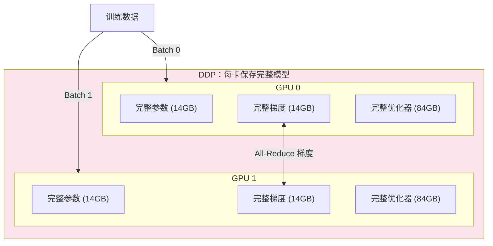
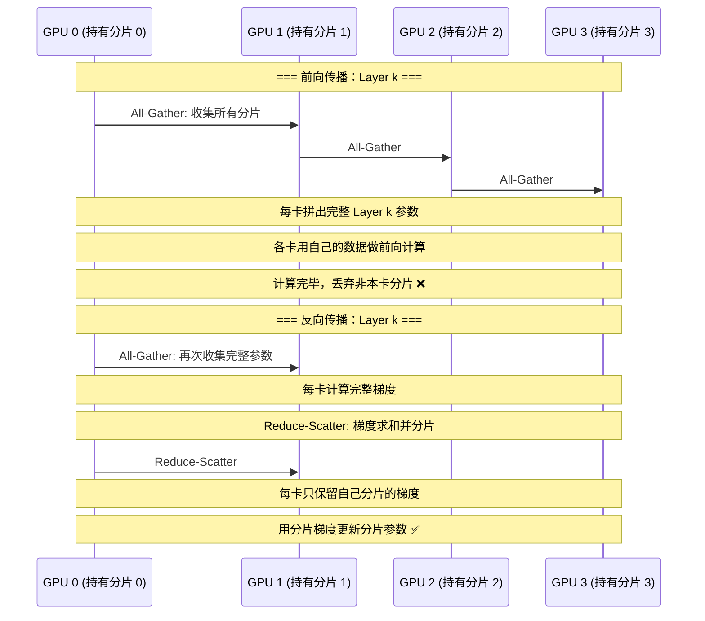
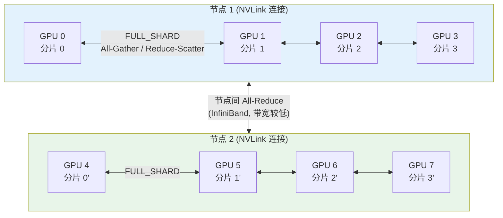
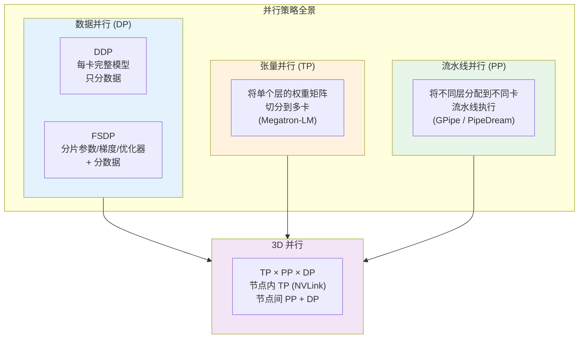

# FSDP（Fully Sharded Data Parallel）

> FSDP 是 PyTorch 原生的分布式训练框架——它把模型的参数、梯度和优化器状态"打碎"分散到多张 GPU 上，每张卡只保存自己负责的那一片，需要计算时再临时拼回完整的层，计算完立刻丢弃。这种"用时拼、用完拆"的策略让单卡显存从"装下整个模型"降低到"只装 1/N"，是训练大模型的核心基础设施。

## 关键概念

| 概念 | 含义 |
|------|------|
| FSDP（Fully Sharded Data Parallel） | PyTorch 原生的全分片数据并行，将参数/梯度/优化器状态分片到多卡，等价于 DeepSpeed ZeRO-3 |
| DDP（Distributed Data Parallel） | 传统数据并行，每卡保存完整模型副本，只分数据 |
| ZeRO（Zero Redundancy Optimizer） | DeepSpeed 提出的冗余消除策略，分为 Stage 1/2/3 |
| All-Gather | 集合通信操作：每张卡广播自己的分片，所有卡拼成完整张量 |
| Reduce-Scatter | 集合通信操作：对所有卡的张量求和后，将结果分片分发回各卡 |
| Sharding Strategy | FSDP 的分片策略：FULL\_SHARD / SHARD\_GRAD\_OP / NO\_SHARD / HYBRID\_SHARD |
| Auto Wrap Policy | 自动决定哪些子模块用 FSDP 包装的策略 |
| Mixed Precision | FSDP 的混合精度支持，分别控制参数/梯度/通信的精度 |
| Backward Prefetch | 在反向传播时预取下一层参数，用通信-计算重叠隐藏延迟 |
| Activation Checkpointing | 牺牲计算换显存：前向时不保存中间激活，反向时重算 |
| 通信-计算重叠（Overlap） | 在 GPU 计算的同时进行网络通信，隐藏通信延迟 |
| 3D 并行 | DP x TP x PP 三种并行方式的组合，用于超大规模训练 |

## 详细笔记

### 一、为什么需要 FSDP？

#### 大模型训练的显存困境

训练一个 LLM 时，GPU 显存需要存储四类数据：

| 显存占用项 | 以 7B 模型为例（FP16 + Adam） | 占比 |
|-----------|:---:|:---:|
| 模型参数（FP16） | 14 GB | 12.5% |
| 梯度（FP16） | 14 GB | 12.5% |
| 优化器状态（FP32 参数 + momentum + variance） | 84 GB | 75% |
| **总计** | **112 GB** | **100%** |

一张 A100 80GB 连 7B 模型都放不下！更不用说 70B 或 175B 了。

**直觉比喻**：假设你要搬一座图书馆（模型），传统 DDP 的做法是给每个搬运工人复印一整套书（每卡一份完整模型），他们各自搬不同批次的书架（不同数据）。但当书太多时，没有一个人能背得动全部书。

FSDP 的做法是：**把书分成 N 份，每人只背 1/N**。当某人需要看完整一本时，大家临时把自己那几页拼起来（All-Gather），看完后各自只保留自己那几页（分片回收）。

### 二、从 DDP 到 FSDP 的演进

#### 2.1 DDP：传统数据并行



DDP 的问题：
- 每卡 112 GB → 单卡放不下
- N 张卡总共存了 N 份相同的参数和优化器状态 → **巨大的内存冗余**
- 唯一的通信：梯度的 All-Reduce

#### 2.2 ZeRO / FSDP：分片消除冗余

ZeRO（DeepSpeed）和 FSDP（PyTorch）的核心思想相同——**消除跨卡的冗余存储**：

| 阶段 | 分片内容 | 等价关系 | 每卡显存（7B, 8卡） |
|------|---------|---------|:---:|
| DDP | 不分片 | — | 112 GB |
| ZeRO Stage 1 | 优化器状态 | FSDP 无直接等价 | 38.5 GB |
| ZeRO Stage 2 | 优化器 + 梯度 | `SHARD_GRAD_OP` | 26.25 GB |
| ZeRO Stage 3 | 优化器 + 梯度 + 参数 | `FULL_SHARD` | **14 GB** |

$$M_{\text{per-gpu}} = \frac{16\Phi}{N} \quad \text{(ZeRO-3 / FULL-SHARD)}$$

其中 $\Phi$ 是参数量（单位：参数个数），$N$ 是 GPU 数量，16 是 FP16 参数(2) + FP16 梯度(2) + FP32 优化器(12) 的总字节倍数。

### 三、FSDP 的工作机制

#### 3.1 FULL\_SHARD 的生命周期

FSDP 的核心是一个"拼-算-拆"的循环：



**关键操作**：

| 操作 | 时机 | 作用 | 通信量 |
|------|------|------|--------|
| All-Gather | 前向/反向计算前 | 从各卡收集分片，拼成完整参数 | $\Phi$ |
| Reduce-Scatter | 反向计算后 | 梯度求和并分片回各卡 | $\Phi$ |

**显存变化时间线**：

```
前向 Layer k:
  [分片参数] → All-Gather → [完整参数] → 前向计算 → [丢弃非本卡分片] → [分片参数]

反向 Layer k:
  [分片参数] → All-Gather → [完整参数] → 反向计算 → [完整梯度]
  → Reduce-Scatter → [分片梯度] → 更新分片参数 → [丢弃完整参数]
```

#### 3.2 通信量分析

| 方案 | 前向通信 | 反向通信 | 总通信量 |
|------|---------|---------|---------|
| DDP | 0 | All-Reduce: $2\Phi$ | $2\Phi$ |
| FSDP (FULL\_SHARD) | All-Gather: $\Phi$ | All-Gather: $\Phi$ + Reduce-Scatter: $\Phi$ | $3\Phi$ |

FSDP 的通信量是 DDP 的 **1.5 倍**。这是用**通信换显存**的权衡——多 50% 的通信开销，换来 $1/N$ 的显存占用。

#### 3.3 通信-计算重叠

FSDP 通过**流水线化**来隐藏额外通信开销：

```mermaid
gantt
    title FSDP 通信-计算重叠（前向传播）
    dateFormat X
    axisFormat %s

    section GPU 通信
    All-Gather Layer 1    :ag1, 0, 2
    All-Gather Layer 2    :ag2, 2, 4
    All-Gather Layer 3    :ag3, 5, 7

    section GPU 计算
    等待 Layer 1          :wait1, 0, 2
    计算 Layer 1          :comp1, 2, 5
    计算 Layer 2          :comp2, 4, 7
    计算 Layer 3          :comp3, 7, 10
```



- 在计算 Layer $k$ 的同时，预取（All-Gather）Layer $k+1$ 的参数
- 理想情况下，通信延迟完全被计算时间隐藏
- PyTorch FSDP 通过 `backward_prefetch` 参数控制预取策略

### 四、FSDP 的四种分片策略

```python
from torch.distributed.fsdp import ShardingStrategy

# 策略映射（来自本仓库 fsdp_pretrain.py）
STRATEGY_MAP = {
    'full_shard':    ShardingStrategy.FULL_SHARD,     # ZeRO-3
    'shard_grad_op': ShardingStrategy.SHARD_GRAD_OP,  # ZeRO-2
    'no_shard':      ShardingStrategy.NO_SHARD,       # DDP
    'hybrid_shard':  ShardingStrategy.HYBRID_SHARD,   # 节点内全分片 + 节点间复制
}
```

| 策略 | 分片内容 | 显存节省 | 通信开销 | 等价 | 适用场景 |
|------|---------|:---:|:---:|------|---------|
| `NO_SHARD` | 不分片 | 无 | 最低 | DDP | 小模型，显存充足 |
| `SHARD_GRAD_OP` | 梯度 + 优化器 | 中等 | 低 | ZeRO-2 | 中等模型 |
| `FULL_SHARD` | 参数 + 梯度 + 优化器 | **最大** | 最高 | ZeRO-3 | 大模型（推荐默认） |
| `HYBRID_SHARD` | 节点内全分片 | 大 | 中 | ZeRO-3 + DDP | 多节点训练 |

#### HYBRID\_SHARD：多节点训练的最佳实践

在多节点场景下，节点间通信（InfiniBand/RoCE）远慢于节点内通信（NVLink/NVSwitch）。HYBRID\_SHARD 利用这一点：



- **节点内**：FULL\_SHARD（全分片，利用 NVLink 高带宽）
- **节点间**：DDP 式 All-Reduce（只传梯度，减少跨节点通信）
- 效果：接近 FULL\_SHARD 的显存节省 + 接近 DDP 的跨节点通信效率

### 五、FSDP 的关键配置

#### 5.1 Auto Wrap Policy

FSDP 需要决定哪些子模块作为独立的 FSDP Unit（分片单元）。粒度选择很重要：

| 粒度 | 示例 | 显存效率 | 通信次数 | 推荐度 |
|------|------|---------|---------|-------|
| 整个模型 | 整个 Transformer | 最低（一次 All-Gather 全部参数） | 最少 | 不推荐 |
| 每个 Transformer Block | `TransformerBlock` | **最佳** | 适中 | **推荐** |
| 每个线性层 | `nn.Linear` | 高 | 过多 | 不推荐 |

```python
from torch.distributed.fsdp.wrap import transformer_auto_wrap_policy
import functools

# 推荐：以 Transformer Block 为单位包装
auto_wrap_policy = functools.partial(
    transformer_auto_wrap_policy,
    transformer_layer_cls={TransformerBlock},  # 指定要包装的层类
)

model = FSDP(
    model,
    sharding_strategy=ShardingStrategy.FULL_SHARD,
    auto_wrap_policy=auto_wrap_policy,
)
```

**为什么以 Transformer Block 为单位？**
- 每个 Block 包含完整的 Attention + FFN，是计算的自然单元
- 前向时只需 All-Gather 当前 Block 的参数（而非全部），显存峰值低
- 通信次数 = Block 数量，在通信频率和通信量之间取得平衡

#### 5.2 Mixed Precision

FSDP 提供三级精度控制（详见 [llm-optimization-techniques.md](./llm-optimization-techniques.md) 的混合精度章节）：

```python
from torch.distributed.fsdp import MixedPrecision

mp_policy = MixedPrecision(
    param_dtype=torch.bfloat16,     # 参数存储精度
    reduce_dtype=torch.bfloat16,    # 梯度通信精度
    buffer_dtype=torch.bfloat16,    # Buffer 精度
)

model = FSDP(model, mixed_precision=mp_policy)
```

| 精度设置 | 显存 | 精度 | 推荐场景 |
|---------|------|------|---------|
| 全 FP32 | 最高 | 最高 | 调试 |
| BF16 参数 + FP32 梯度通信 | 中 | 高 | 精度敏感任务 |
| **全 BF16** | **最低** | 中 | **大模型训练（推荐）** |

BF16 vs FP16：BF16 保留了 FP32 的指数范围（8 位指数），不容易 overflow/underflow，**通常不需要 Loss Scaling**。详见 [llm-optimization-techniques.md](./llm-optimization-techniques.md) 的混合精度章节。

#### 5.3 Backward Prefetch

```python
from torch.distributed.fsdp import BackwardPrefetch

model = FSDP(
    model,
    backward_prefetch=BackwardPrefetch.BACKWARD_PRE,  # 提前预取下一层
    # BackwardPrefetch.BACKWARD_POST  # 当前层计算完后再预取（节省显存）
    # None  # 不预取（最省显存但最慢）
)
```

| 预取策略 | 通信重叠 | 显存开销 | 速度 |
|---------|---------|---------|------|
| `BACKWARD_PRE` | **最大**（提前预取） | 略高（同时存两层参数） | **最快** |
| `BACKWARD_POST` | 部分（计算完再预取） | 中 | 中 |
| `None` | 无（串行） | **最低** | 最慢 |

#### 5.4 Activation Checkpointing

激活检查点（梯度检查点）与 FSDP 配合使用，进一步节省显存：

```python
from torch.distributed.fsdp.wrap import transformer_auto_wrap_policy
from torch.utils.checkpoint import checkpoint

# 方法：对每个 FSDP Unit 启用 activation checkpointing
from torch.distributed.algorithms._checkpoint.checkpoint_wrapper import (
    checkpoint_wrapper,
    apply_activation_checkpointing,
    CheckpointImpl,
)

apply_activation_checkpointing(
    model,
    check_fn=lambda submodule: isinstance(submodule, TransformerBlock),
)
```

**显存节省叠加效果**（7B 模型，8 卡）：

| 优化组合 | 每卡显存 |
|---------|:---:|
| DDP（无优化） | 112 GB |
| FSDP FULL\_SHARD | 14 GB |
| FSDP + BF16 | ~8 GB |
| FSDP + BF16 + Activation Checkpointing | ~5-6 GB |

### 六、FSDP 的 Checkpoint 保存与加载

分布式训练的检查点保存比单卡复杂——参数分散在多张卡上：

```python
from torch.distributed.fsdp import (
    FullStateDictConfig,
    StateDictType,
)

# 方式 1: 收集完整状态字典（保存到单个文件）
full_state_config = FullStateDictConfig(
    offload_to_cpu=True,  # 收集到 CPU，避免 GPU OOM
    rank0_only=True,       # 只在 rank 0 保存
)

with FSDP.state_dict_type(model, StateDictType.FULL_STATE_DICT, full_state_config):
    state_dict = model.state_dict()
    if dist.get_rank() == 0:
        torch.save(state_dict, "checkpoint.pt")
```

| 保存方式 | 文件数 | 保存速度 | 加载灵活性 | 适用场景 |
|---------|:---:|:---:|:---:|---------|
| `FULL_STATE_DICT` | 1 | 慢（需收集） | 高（可单卡加载） | 最终模型保存 |
| `SHARDED_STATE_DICT` | N | **快**（各卡独立保存） | 低（需相同 GPU 数） | 训练中检查点 |
| `LOCAL_STATE_DICT` | N | 最快 | 最低 | 调试 |

### 七、FSDP vs DeepSpeed ZeRO

两者的核心思想相同（分片冗余状态），但实现和生态不同：

| 维度 | FSDP (PyTorch) | DeepSpeed ZeRO |
|------|:---:|:---:|
| 框架 | PyTorch 原生 | 微软独立库 |
| API 风格 | `nn.Module` 包装 | 配置文件驱动 |
| ZeRO Stage 1 | ❌ 无直接等价 | ✅ 支持 |
| ZeRO Stage 2 | `SHARD_GRAD_OP` | ✅ 支持 |
| ZeRO Stage 3 | `FULL_SHARD` | ✅ 支持 |
| 混合分片 | `HYBRID_SHARD` | ZeRO++ |
| CPU Offload | ✅ 支持 | ZeRO-Offload |
| NVMe Offload | ❌ | ZeRO-Infinity |
| 与 PyTorch 生态集成 | **原生** | 需要适配 |
| 与 HuggingFace 集成 | Accelerate 支持 | Trainer 原生支持 |
| 调试难度 | 较低（标准 PyTorch） | 较高（独立运行时） |

**选择建议**：
- 纯 PyTorch 项目 → **FSDP**（原生集成，代码清晰）
- HuggingFace 项目 → 两者都行（Trainer 和 Accelerate 都支持）
- 需要 NVMe Offload / 万亿参数 → **DeepSpeed**
- 多节点大规模训练 → 两者都成熟

### 八、FSDP 与其他并行策略的关系

FSDP 是数据并行（DP）的扩展。大规模训练通常组合使用多种并行策略（详见 [llm-optimization-techniques.md](./llm-optimization-techniques.md)）：



| 并行方式 | 切分对象 | 通信模式 | 适合场景 |
|---------|---------|---------|---------|
| DP / FSDP | 数据（+ 模型状态） | All-Gather / Reduce-Scatter | **通用**，首选方案 |
| TP（张量并行） | 单层的权重矩阵 | All-Reduce（每层两次） | 单节点内（需 NVLink） |
| PP（流水线并行） | 不同层 | 点对点（前一阶段 → 后一阶段） | 多节点（层间通信少） |

**典型组合**（训练 175B 模型，4096 张 GPU）：

$$\text{Total GPUs} = N_{\text{TP}} \times N_{\text{PP}} \times N_{\text{DP}} = 8 \times 8 \times 64 = 4096$$

- TP=8：节点内 8 卡 NVLink 互联，切分大层的权重矩阵
- PP=8：8 个节点串成一个流水线，每节点负责 ~10 层
- DP=64：64 组流水线处理不同数据批次

### 九、实战：FSDP 训练代码模板

本仓库的 [fsdp\_pretrain.py](../../experiments/scripts/fsdp_pretrain.py) 展示了完整的 FSDP 训练流程：

```python
# 1. 初始化分布式环境
dist.init_process_group(backend="nccl")
local_rank = int(os.environ["LOCAL_RANK"])
torch.cuda.set_device(local_rank)

# 2. 创建模型（先在 CPU 上）
model = MiniCLIP(...)

# 3. 配置 FSDP
auto_wrap_policy = functools.partial(
    transformer_auto_wrap_policy,
    transformer_layer_cls={TransformerBlock},
)

mp_policy = MixedPrecision(
    param_dtype=torch.bfloat16,
    reduce_dtype=torch.bfloat16,
    buffer_dtype=torch.bfloat16,
)

model = FSDP(
    model,
    sharding_strategy=ShardingStrategy.FULL_SHARD,
    auto_wrap_policy=auto_wrap_policy,
    mixed_precision=mp_policy,
    backward_prefetch=BackwardPrefetch.BACKWARD_PRE,
    device_id=local_rank,
)

# 4. 优化器（在 FSDP 包装后创建）
optimizer = torch.optim.AdamW(model.parameters(), lr=3e-4)

# 5. 数据加载（DistributedSampler 保证各卡数据不重叠）
sampler = DistributedSampler(dataset, shuffle=True)
dataloader = DataLoader(dataset, batch_size=64, sampler=sampler)

# 6. 训练循环
for epoch in range(num_epochs):
    sampler.set_epoch(epoch)  # 重要：每 epoch 重新 shuffle
    for batch in dataloader:
        optimizer.zero_grad()
        loss = model(batch)
        loss.backward()        # FSDP 自动处理 All-Gather + Reduce-Scatter
        torch.nn.utils.clip_grad_norm_(model.parameters(), max_norm=1.0)
        optimizer.step()

# 启动命令
# torchrun --nproc_per_node=4 fsdp_pretrain.py --strategy full_shard
```

### 十、FSDP 常见问题与调优

#### 显存不足时的排查清单

```
1. ✅ 使用 FULL_SHARD 策略了吗？
2. ✅ 开启了 Mixed Precision (BF16) 吗？
3. ✅ 启用了 Activation Checkpointing 吗？
4. ✅ Auto Wrap Policy 设置合理吗？（以 TransformerBlock 为单位）
5. ✅ Batch Size 是否过大？尝试减小并增加 Gradient Accumulation Steps
6. ✅ Backward Prefetch 设为 BACKWARD_POST 或 None 可节省显存
7. ✅ 是否有不必要的中间变量未释放？
```

#### 训练速度慢的排查清单

```
1. ✅ Backward Prefetch 设为 BACKWARD_PRE 了吗？（通信-计算重叠）
2. ✅ NCCL 通信是否走了正确的网络？（检查 NCCL_SOCKET_IFNAME）
3. ✅ 多节点时是否使用了 HYBRID_SHARD？
4. ✅ Auto Wrap 粒度是否太细？（每个 Linear 都包装会导致过多通信）
5. ✅ DataLoader 的 num_workers 是否足够？
6. ✅ 是否启用了 pin_memory=True？
```

## 个人理解与思考

### 交叉引用

1. **[llm-optimization-techniques.md](./llm-optimization-techniques.md)** — ZeRO 三阶段显存分析、3D 并行概览、混合精度训练（本笔记的前置知识）
2. **[llm-pretraining.md](./llm-pretraining.md)** — 预训练阶段的分布式训练配置，引用了 FSDP 实验代码
3. **[transformer.md](../fundamentals/transformer.md)** — Transformer Block 是 FSDP Auto Wrap 的自然分片单元，KV Cache 显存分析
4. **[contrastive-learning.md](../fundamentals/contrastive-learning.md)** — 对比学习（CLIP）训练中 FSDP 的应用
5. **[blip.md](../vision-language/blip.md)** — BLIP-2 冻结策略与 FSDP 的配合（冻结模块不需要分片梯度/优化器）
6. **[fsdp\_pretrain.py](../../experiments/scripts/fsdp_pretrain.py)** — 本仓库的 FSDP 实验代码，实现了 MiniCLIP 的分布式训练

### 常见误区

| 误区 | 纠正 |
|------|------|
| "FSDP 和 DeepSpeed ZeRO 是完全不同的技术" | 两者的核心思想完全相同（分片冗余状态），只是实现框架不同。FSDP 是 PyTorch 原生，DeepSpeed 是微软的独立库 |
| "FSDP 比 DDP 更快" | FSDP 的通信量是 DDP 的 1.5 倍。FSDP 的优势是**显存**而非速度。在显存充足时，DDP 实际更快 |
| "用了 FSDP 就不需要混合精度了" | FSDP 和混合精度解决不同问题：FSDP 减少冗余存储，混合精度减少每个参数的字节数。两者应该**同时使用** |
| "FULL\_SHARD 总是最优选择" | FULL\_SHARD 通信最多。如果显存足够，`SHARD_GRAD_OP`（ZeRO-2）通信更少、速度更快 |
| "FSDP 自动处理所有分布式问题" | DataLoader 仍需 `DistributedSampler`，每个 epoch 需要 `sampler.set_epoch()`，检查点保存需要特殊处理 |
| "Activation Checkpointing 是 FSDP 的功能" | Activation Checkpointing 是独立的显存优化技术（用重算换存储），可以和 FSDP 组合使用但不是 FSDP 的一部分 |
| "多节点训练用 FULL\_SHARD 就行" | 多节点应优先考虑 `HYBRID_SHARD`——节点内全分片利用 NVLink 高带宽，节点间只做 All-Reduce 减少跨网络通信 |

### 面试/口述版

FSDP（Fully Sharded Data Parallel）是 PyTorch 原生的大模型分布式训练框架，核心思想等同于 DeepSpeed ZeRO-3：将模型参数、梯度和优化器状态**分片**到 N 张 GPU 上，每张卡只存储 1/N 的模型状态。训练时通过 **All-Gather** 临时收集完整参数做前向/反向计算，计算完后通过 **Reduce-Scatter** 将梯度求和并分片回各卡，随后各卡独立更新自己的参数分片。这种"用时拼、用完拆"的策略将每卡显存从 $16\Phi$ 降到 $16\Phi/N$（7B 模型从 112GB 降到 14GB/8卡），代价是通信量从 DDP 的 $2\Phi$ 增加到 $3\Phi$，但通过 Backward Prefetch 实现的通信-计算重叠可以大幅隐藏这一开销。实践中通常组合使用 FSDP + BF16 混合精度 + Activation Checkpointing，以 Transformer Block 为 Auto Wrap 单元进行分片。

## 相关链接

### 核心论文与文档
- [ZeRO: Memory Optimizations Toward Training Trillion Parameter Models (Rajbhandari et al., 2020)](https://arxiv.org/abs/1910.02054) — FSDP 的理论基础
- [PyTorch FSDP: Experiences on Scaling Fully Sharded Data Parallel (Zhao et al., 2023)](https://arxiv.org/abs/2304.11277) — PyTorch FSDP 的工程实践论文
- [PyTorch FSDP 官方文档](https://pytorch.org/docs/stable/fsdp.html) — API 参考
- [PyTorch FSDP Tutorial](https://pytorch.org/tutorials/intermediate/FSDP_tutorial.html) — 官方教程

### 相关技术
- [Megatron-LM (Shoeybi et al., 2019)](https://arxiv.org/abs/1909.08053) — 张量并行
- [GPipe (Huang et al., 2019)](https://arxiv.org/abs/1811.06965) — 流水线并行
- [DeepSpeed](https://github.com/microsoft/DeepSpeed) — 微软分布式训练框架

### 本仓库相关
- [FSDP 预训练实验](../../experiments/scripts/fsdp_pretrain.py) — MiniCLIP 的 FSDP 分布式训练完整实现
- [多模态预训练 Notebook](../../experiments/notebooks/multimodal_pretrain_fsdp.ipynb) — FSDP 实验笔记本
- [LLM 优化技术](./llm-optimization-techniques.md) — ZeRO 显存分析、3D 并行、混合精度等前置知识

## 更新日志

- 2026-03-21: 初始创建，覆盖 FSDP 工作机制、四种分片策略、关键配置、与 DeepSpeed 对比、3D 并行关系、实战代码模板
