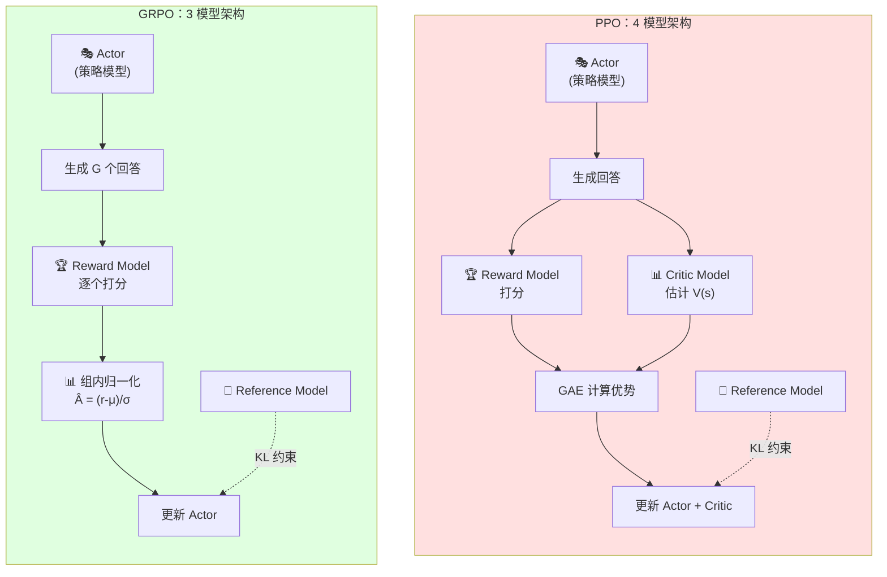
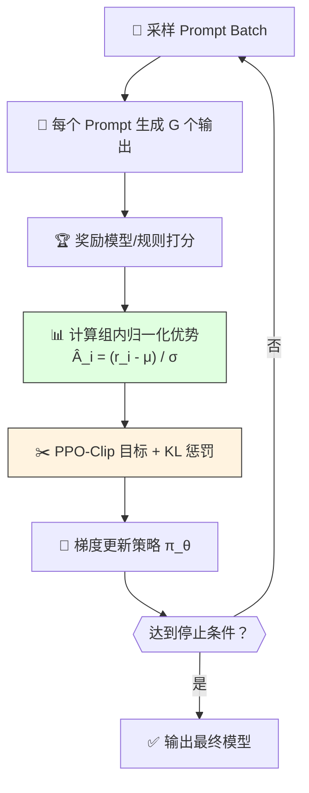
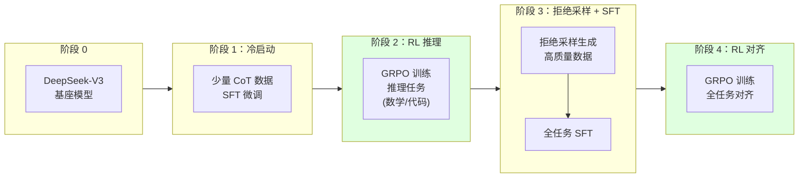
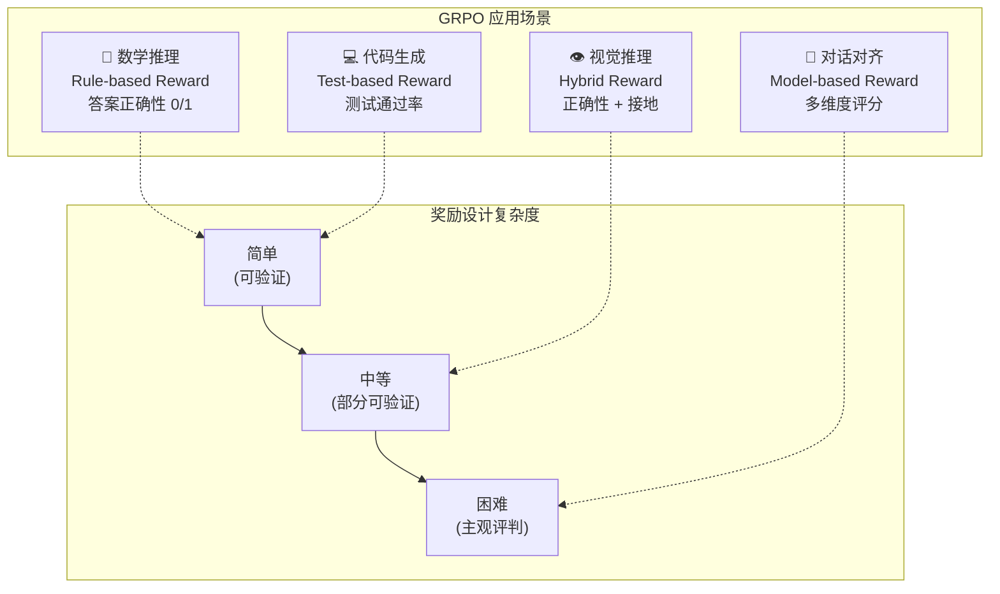
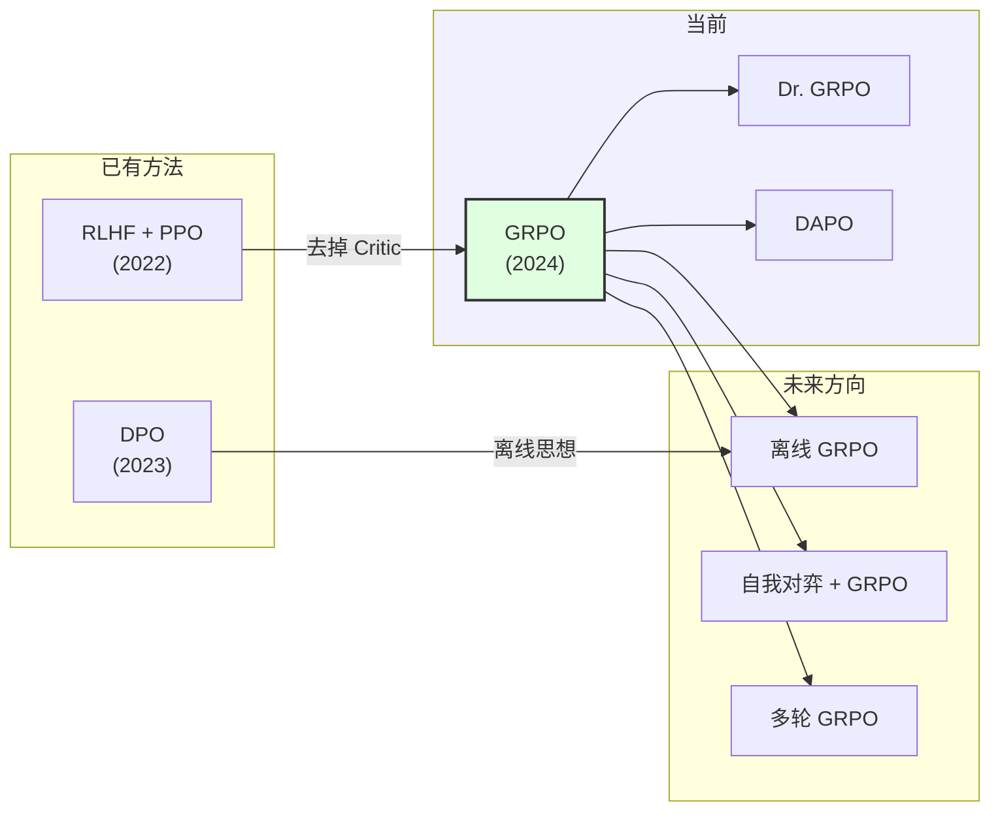

# Group Relative Policy Optimization（GRPO）

> GRPO 是 PPO 的轻量化替代方案——通过"让模型生成一组回答，然后从中学习哪些更好"的方式，用组内相对优势估计取代了昂贵的 Critic 模型，在 DeepSeek-R1 中成功激发了大模型的推理能力。

## 关键概念

| 概念 | 含义 |
|------|------|
| GRPO（Group Relative Policy Optimization） | 一种无需 Critic 模型的策略优化算法，通过组采样和组内相对排名来估计优势函数 |
| 组采样（Group Sampling） | 对每个 prompt 生成 G 个候选输出，形成一个"对比组" |
| 组内相对优势（Group Relative Advantage） | Â_i = (r_i - μ) / σ，用组内奖励的统计归一化替代 Critic 的优势估计 |
| Critic 模型（Value Model） | PPO 中用于估计状态价值 V(s) 的网络，GRPO 将其移除 |
| GAE（Generalized Advantage Estimation） | PPO 中基于 Critic 的优势估计方法，结合 TD 误差和折扣因子 |
| 裁剪目标（Clipped Objective） | PPO/GRPO 共用的策略更新机制，限制新旧策略的比值在 [1-ε, 1+ε] 内 |
| KL 散度惩罚 | 约束训练策略不偏离参考模型太远，防止模型退化 |
| ORM（Outcome Reward Model） | 基于最终结果打分的奖励模型，常用于 GRPO 训练 |
| PRM（Process Reward Model） | 基于推理过程中间步骤打分的奖励模型 |
| Rule-based Reward | 基于规则的奖励函数（如数学题答案正确性），DeepSeek-R1 的核心做法 |
| Dr. GRPO | GRPO 的去偏差变体，修正了长度偏差和 KL 估计偏差 |
| DAPO（Decoupled Alignment Policy Optimization） | GRPO 的改进变体，解耦正负优势的裁剪范围 |

## 详细笔记

### 第 1 章：从 PPO 到 GRPO——为什么需要新算法

#### RLHF 的标准 PPO 流程

在传统 RLHF 中，PPO 训练需要**同时维护 4 个模型**（详见 [rlhf.md](./rlhf.md)）：

| 模型 | 作用 | 参数量 | 是否更新 |
|------|------|--------|---------|
| Actor（策略模型） | 生成回答 | ~7B-70B | ✅ 训练目标 |
| Critic（价值模型） | 估计 V(s) 用于计算优势 | ~7B-70B | ✅ 同步训练 |
| Reference（参考模型） | 提供 KL 约束基准 | ~7B-70B | ❌ 冻结 |
| Reward（奖励模型） | 对输出打分 | ~7B-70B | ❌ 冻结 |

这意味着训练一个 7B 模型的 RLHF，需要在 GPU 上同时加载约 **4 × 7B = 28B** 参数。

#### PPO 在 LLM 训练中的三大痛点

**痛点一：Critic 模型的显存开销**

Critic 通常与 Actor 同架构、同规模。对于 70B 模型，仅 Critic 就需要额外 ~140GB 显存（fp16），这在硬件层面构成严重瓶颈。

**痛点二：GAE 的训练复杂性**

GAE 需要 Critic 提供准确的价值估计 V(s)，但 Critic 自身也在训练中，导致"用不准确的估计来指导策略更新"的递归问题。Critic 训练不稳定时，优势估计的噪声会传导到 Actor 更新中。

**痛点三：实现工程复杂度**

4 个模型需要仔细协调——同步更新节奏、管理不同学习率、处理分布式训练中的通信——工程复杂度远超普通微调。

#### GRPO 的核心思路

GRPO 的洞察非常直觉化：

> **与其训练一个 Critic 来猜"这个回答有多好"，不如让模型自己生成一组回答，直接比较谁更好。**

这类似于考试阅卷：
- PPO 的做法 = 先训练一个"预估分数"的 AI，然后用预估分数指导学生改进
- GRPO 的做法 = 让学生写 G 份答卷，用实际分数的**相对排名**指导改进



GRPO 移除了 Critic 模型，用**组采样 + 统计归一化**替代 GAE，将模型数量从 4 降到 3，显存节省约 25-50%。

### 第 2 章：GRPO 算法详解

#### 组采样与奖励计算

给定一个 prompt $q$，GRPO 使用当前策略 $\pi_{\theta_{old}}$ 生成一组 $G$ 个输出：

$$\{o_1, o_2, \ldots, o_G\} \sim \pi_{\theta_{old}}(\cdot | q)$$

然后用奖励模型（或规则）对每个输出打分：

$$r_i = R(q, o_i), \quad i = 1, 2, \ldots, G$$

#### 组内相对优势估计

GRPO 的核心创新在于优势函数的计算方式。不同于 PPO 使用 Critic 和 GAE：

$$\hat{A}_i = \frac{r_i - \text{mean}(\{r_1, \ldots, r_G\})}{\text{std}(\{r_1, \ldots, r_G\})}$$

即：**每个输出的优势 = 它的奖励相对于组内平均水平的标准化偏差**。

直觉理解：
- $\hat{A}_i > 0$：这个输出比组内平均水平好 → 增加其生成概率
- $\hat{A}_i < 0$：这个输出比组内平均水平差 → 降低其生成概率
- $\hat{A}_i \approx 0$：接近平均水平 → 几乎不调整

#### GRPO 目标函数

GRPO 的完整目标函数为：

$$J_{GRPO}(\theta) = \mathbb{E}_{q \sim P(Q)} \left[ \frac{1}{G} \sum_{i=1}^{G} \frac{1}{|o_i|} \sum_{t=1}^{|o_i|} \left( \min\left(r_{i,t}(\theta) \hat{A}_i, \; \text{clip}\left(r_{i,t}(\theta), 1-\varepsilon, 1+\varepsilon\right) \hat{A}_i \right) - \beta \, D_{KL}^{(t)} \right) \right]$$

其中：

- **重要性比率**：$r_{i,t}(\theta) = \frac{\pi_\theta(o_{i,t} | q, o_{i,<t})}{\pi_{\theta_{old}}(o_{i,t} | q, o_{i,<t})}$
- **裁剪机制**：与 PPO 相同，限制 $r_{i,t}$ 在 $[1-\varepsilon, 1+\varepsilon]$ 范围内
- **KL 惩罚**：$D_{KL}^{(t)} = \frac{\pi_\theta(o_{i,t} | q, o_{i,<t})}{\pi_{ref}(o_{i,t} | q, o_{i,<t})} - \log \frac{\pi_\theta(o_{i,t} | q, o_{i,<t})}{\pi_{ref}(o_{i,t} | q, o_{i,<t})} - 1$
- **长度归一化**：$\frac{1}{|o_i|}$ 对每个输出按 token 数归一化，避免长输出主导梯度

注意 GRPO 的 KL 惩罚是相对于**参考模型** $\pi_{ref}$（而非旧策略 $\pi_{\theta_{old}}$），这是与 PPO 的一个重要区别。

#### 关键设计选择

**Token 级 vs 序列级 KL**：GRPO 使用 token 级 KL 惩罚（逐 token 计算 KL 并求和），这比序列级 KL 更精细，能更好地控制每一步的策略偏移。

**优势共享**：同一个输出 $o_i$ 的所有 token 共享同一个优势值 $\hat{A}_i$。这是因为奖励是在序列级别给出的，无法分配到单个 token。

### 第 3 章：组内优势估计的数学直觉

#### 传统 GAE 的依赖链

PPO 中的 GAE（详见 [reinforcement-learning.md](../fundamentals/reinforcement-learning.md)）：

$$\hat{A}_t^{GAE} = \sum_{l=0}^{\infty} (\gamma \lambda)^l \delta_{t+l}, \quad \delta_t = r_t + \gamma V(s_{t+1}) - V(s_t)$$

GAE 的问题在于它**强依赖 Critic 的准确性**——如果 $V(s)$ 估计不准，TD 误差 $\delta_t$ 就会带有偏差，导致优势估计有偏。而 Critic 自身也在训练中，形成"用不准确的估计来指导策略优化"的循环。

#### GRPO 的替代方案

GRPO 完全绕过了这个问题。其优势估计不依赖任何学习到的价值函数，而是直接利用组内的**统计特性**：

$$\hat{A}_i = \frac{r_i - \mu_r}{\sigma_r}, \quad \mu_r = \frac{1}{G}\sum_{j=1}^{G} r_j, \quad \sigma_r = \sqrt{\frac{1}{G}\sum_{j=1}^{G}(r_j - \mu_r)^2}$$

#### 为什么组内归一化有效

**理由一：相对排名比绝对分数更鲁棒**

奖励模型的绝对分数可能校准不佳（如同一质量的回答，不同 prompt 得分差异很大）。但在同一组内，**相对排名**通常是可靠的——"这 G 个回答中哪个更好"比"这个回答值多少分"更容易判断。

**理由二：自适应 Baseline**

GRPO 的 $\mu_r$ 自动适配每个 prompt 的难度：
- 简单 prompt（所有输出都不错）：$\mu_r$ 高，优势 $|\hat{A}_i|$ 小 → 小幅更新
- 困难 prompt（输出质量参差不齐）：$\sigma_r$ 大，区分度明显 → 有效学习

这比 PPO 中 Critic 提供的全局 baseline 更加**局部自适应**。

**理由三：与 REINFORCE-baseline 的理论联系**

GRPO 的优势估计可以看作 REINFORCE with baseline 的一种特殊形式（详见 [reinforcement-learning.md](../fundamentals/reinforcement-learning.md) 第 5 章）：
- REINFORCE baseline：$b(s) = \mathbb{E}[G_t | s_t]$（需要估计）
- GRPO baseline：$b(q) = \mu_r$（直接从采样中计算）

区别在于 GRPO 的 baseline 是**采样估计**而非学习估计，避免了额外的训练过程。

#### 组大小 G 的影响

| 组大小 G | 优势估计质量 | 计算开销 | 适用场景 |
|----------|------------|---------|---------|
| G = 2 | 方差很大，接近随机 | 最低 | 不推荐 |
| G = 4-8 | 方差较大但可用 | 低 | 显存受限场景 |
| G = 16-32 | 方差适中，性能良好 | 中等 | **常用范围** |
| G = 64+ | 方差很小，估计精确 | 高 | 大规模训练 |

DeepSeek-R1 使用的组大小为 G = 64，在精确度和效率之间取得了良好平衡。

### 第 4 章：GRPO 的训练流程

#### 完整训练循环

```
Algorithm: GRPO Training Loop
─────────────────────────────────
Input:
  - 初始策略 π_θ (SFT 模型)
  - 参考模型 π_ref (SFT 模型的冻结副本)
  - 奖励函数 R(q, o)
  - 组大小 G, 裁剪范围 ε, KL 系数 β

for iteration = 1, 2, ... do
    1. 从 prompt 数据集采样一个 mini-batch {q_1, ..., q_B}

    2. for each prompt q_j do
         对每个 prompt 生成 G 个输出:
         {o_1, ..., o_G} ~ π_θ_old(· | q_j)
       end

    3. 计算奖励:
       r_i = R(q_j, o_i) for all i, j

    4. 计算组内归一化优势:
       对每个 prompt 的 G 个输出:
       Â_i = (r_i - mean(r)) / std(r)

    5. 计算 GRPO 损失并更新 θ:
       L = -J_GRPO(θ)  (含裁剪目标 + KL 惩罚)
       θ ← θ - α∇L

    6. 周期性更新 θ_old ← θ
end
```



#### 与 PPO 训练流程的关键差异

| 步骤 | PPO | GRPO |
|------|-----|------|
| 采样 | 每个 prompt 生成 1 个输出 | 每个 prompt 生成 G 个输出 |
| 优势估计 | Critic 前向传播 + GAE | 组内统计归一化 |
| 模型更新 | 更新 Actor + Critic | 只更新 Actor |
| KL 约束 | 可选（KL 惩罚或裁剪） | Token 级 KL 惩罚（相对 π_ref） |

### 第 5 章：DeepSeek-R1 中的 GRPO 实践

#### DeepSeek-R1 的训练流水线

DeepSeek-R1 展示了 GRPO 最成功的大规模应用，其训练分为多个阶段：



关键发现：
- **阶段 2 的 GRPO 训练中涌现了 CoT 推理能力**——模型自发学会了"先思考再回答"的模式
- 这种涌现依赖于足够大的模型规模（DeepSeek-V3 为 671B MoE）

#### 奖励函数设计

DeepSeek-R1 在推理任务中使用了**极简的 rule-based reward**，而非训练奖励模型：

| 奖励类型 | 定义 | 示例 |
|---------|------|------|
| 准确性奖励 | 答案是否正确 | 数学题：最终答案与标准答案完全匹配 → r=1，否则 r=0 |
| 格式奖励 | 是否遵循指定格式 | 推理过程是否包含 `<think>...</think>` 标签 |

这种设计的优势：
- 无需训练奖励模型 → 进一步减少模型数量（从 3 个降到 2 个）
- 避免奖励模型的泛化误差
- 二值奖励简单但有效（配合组归一化仍能提供有效梯度信号）

#### 冷启动的重要性

直接在基座模型上运行 GRPO 效果不佳，因为基座模型的输出几乎没有正确答案（奖励全为 0）。DeepSeek-R1 的解决方案：
1. 用少量高质量 CoT 数据做 SFT（冷启动）
2. 确保初始策略至少有一定概率生成正确答案
3. 然后 GRPO 才能通过组内对比学到"好回答 vs 坏回答"

这类似于"先教会基本技能，再通过比较来精进"。

#### 涌现现象

DeepSeek-R1 在 GRPO 训练过程中观察到的涌现行为：
- **自我验证（Self-verification）**：模型学会在回答后检查自己的推理
- **自我反思（Self-reflection）**：出现 "Wait, let me reconsider..." 等反思性语句
- **探索多条推理路径**：模型学会尝试不同的解题方法

这些行为**不是通过训练数据显式教授的**，而是在 GRPO 优化过程中自然涌现的。

### 第 6 章：GRPO 与 PPO 的深度对比

| 维度 | PPO | GRPO |
|------|-----|------|
| **模型数量** | 4（Actor + Critic + Ref + RM） | 3（Actor + Ref + RM）或 2（rule reward） |
| **显存占用** | ~4N 参数 | ~3N 或 ~2N 参数 |
| **优势估计** | GAE（依赖 Critic） | 组内归一化（无需 Critic） |
| **训练稳定性** | Critic 漂移可能导致不稳定 | 更稳定（统计归一化鲁棒） |
| **采样效率** | 每 prompt 1 次采样 | 每 prompt G 次采样 |
| **推理开销** | 低（单次生成） | 高（需要 G 次生成） |
| **Baseline 适应性** | 全局 Critic baseline | 局部自适应（每 prompt 不同） |
| **实现复杂度** | 高（4 模型协调） | 中等（更少模型交互） |
| **理论基础** | 策略梯度 + 价值函数 | 策略梯度 + 蒙特卡洛估计 |

#### 什么时候选 PPO vs GRPO

**选 GRPO**：
- 显存受限，无法容纳 Critic 模型
- 有可靠的规则奖励（数学、代码等可验证任务）
- 追求实现简洁性
- 大规模模型训练（节省成本更显著）

**选 PPO**：
- 需要精细的逐 token 信用分配（不只是序列级奖励）
- 采样成本很高（如需要昂贵的环境交互）
- 已有成熟的 PPO 训练基础设施

### 第 7 章：GRPO 的变体与改进

#### Dr. GRPO：去偏差 GRPO

Dr. GRPO（"Doctor GRPO"）发现并修正了原始 GRPO 的两个偏差：

**偏差一：长度偏差（Length Bias）**

原始 GRPO 的 $\frac{1}{|o_i|}$ 归一化导致模型倾向于生成更短的输出。原因：
- 短输出的 per-token loss 权重更大
- 同等奖励下，短回答对策略的影响更大

Dr. GRPO 的修正：移除 per-token 长度归一化，改用序列级别的 loss 聚合。

**偏差二：KL 估计偏差**

原始 GRPO 使用的 KL 近似 $D_{KL} \approx r - \log r - 1$（其中 $r = \pi_\theta / \pi_{ref}$）在 $\pi_\theta \neq \pi_{ref}$ 时是**有偏估计**，且总是非负的。

Dr. GRPO 的修正：使用无偏的 KL 估计量 $\log(\pi_\theta / \pi_{ref})$。

#### DAPO：解耦对齐策略优化

DAPO 在 GRPO 基础上做了多项改进：

**改进一：解耦裁剪（Decoupled Clipping）**

原始 PPO/GRPO 对正负优势使用相同的裁剪范围 $\varepsilon$。DAPO 发现这限制了探索：
- 正优势（好回答）：使用更大的 $\varepsilon_{high}$，允许大幅增加概率
- 负优势（差回答）：使用更小的 $\varepsilon_{low}$，避免过度惩罚

$$L_{DAPO} = \min\left(r_t \hat{A}, \; \text{clip}(r_t, 1-\varepsilon_{low}, 1+\varepsilon_{high}) \hat{A}\right)$$

**改进二：动态采样（Dynamic Sampling）**

过滤掉"无信息"的组：
- 如果一组 G 个输出全部正确（$\hat{A}_i \approx 0$ for all $i$）→ 跳过
- 如果全部错误 → 也跳过

只保留**有区分度**的组进行训练。

**改进三：Token 级 Loss 不归一化**

与 Dr. GRPO 类似，移除长度归一化以消除长度偏差。

#### 变体对比

| 特性 | GRPO | Dr. GRPO | DAPO |
|------|------|----------|------|
| 长度归一化 | ✅ 有 | ❌ 移除 | ❌ 移除 |
| KL 估计 | 有偏近似 | 无偏估计 | 无偏估计 |
| 裁剪范围 | 对称 ε | 对称 ε | 非对称 ε_low/ε_high |
| 动态采样 | ❌ | ❌ | ✅ 过滤无信息组 |
| 过采样 | ❌ | ❌ | ✅ 补充有效样本 |

### 第 8 章：奖励模型与 GRPO 的配合

#### ORM vs PRM

GRPO 的优势估计在序列级别，因此天然适配 **ORM**（结果奖励模型）：

| 奖励类型 | 粒度 | 与 GRPO 的兼容性 | 典型任务 |
|---------|------|-----------------|---------|
| ORM | 序列级 | ✅ 直接适配 | 数学、代码、对话 |
| PRM | 步骤级 | ⚠️ 需聚合为序列奖励 | 数学推理过程 |
| Rule-based | 序列级 | ✅ 直接适配 | 答案校验、格式检查 |

PRM 与 GRPO 配合时，通常将过程奖励聚合为序列级分数（如取最后一步的分数，或所有步骤的平均值）。

#### Rule-based Reward 的优势与局限

DeepSeek-R1 的实践证明，在可验证任务中，rule-based reward 可以非常有效：

**优势**：
- 零额外模型开销
- 无奖励模型泛化误差
- 信号精确（正确就是正确）

**局限**：
- 只适用于有明确正确答案的任务
- 无法处理开放式任务（如创意写作、对话质量）
- 二值奖励（0/1）的信息量有限

对于开放式任务，仍需要训练奖励模型。

#### 奖励 Hacking 在 GRPO 中的表现

GRPO 的组归一化提供了一定的抗 reward hacking 能力：
- 如果所有输出都通过同一种 "hack" 获得高分，归一化后优势 ≈ 0 → 无有效梯度
- 只有**差异化的奖励分布**才能驱动学习

但这不能完全防止 reward hacking——如果 hack 的程度有梯度（有些 hack 比另一些"更 hack"），模型仍会朝 hack 方向优化。

### 第 9 章：GRPO 在不同任务中的应用

#### 数学推理

GRPO 在数学推理中表现最为突出（DeepSeek-R1 的核心应用场景）：
- **奖励信号**：答案正确性（rule-based，0/1）
- **组大小**：G = 64
- **效果**：在 AIME 2024 等竞赛数学上达到接近人类水平

#### 代码生成

- **奖励信号**：测试用例通过率（0 到 1 的连续值）
- **优势**：测试驱动的奖励天然可靠，无需额外奖励模型
- **挑战**：代码执行需要沙箱环境，增加训练流水线复杂度

#### 通用对话对齐

- **奖励信号**：训练好的奖励模型（连续分数）
- **挑战**：开放式对话的奖励模型质量直接影响 GRPO 效果
- **实践**：通常配合多维度奖励（helpfulness + harmlessness + honesty）

#### 多模态任务

- **视觉推理**：GRPO 可用于优化视觉问答模型
- **奖励信号**：答案正确性 + 视觉接地准确性
- **挑战**：多模态输入增加了采样的计算成本



### 第 10 章：GRPO 的局限与未来方向

#### 当前局限

**1. 组采样的推理开销**

每个 prompt 需要生成 G 个完整输出（G 通常为 16-64），这在训练时的推理开销远高于 PPO（只需 1 个输出）。对于长输出任务（如写代码、写文章），这个开销可能很显著。

**2. 极端分布下的优势估计**

当组内所有输出的奖励相同时（如都正确或都错误），$\sigma_r = 0$，优势估计失效。DAPO 的动态采样部分缓解了这一问题，但并未完全解决。

**3. 序列级信用分配**

GRPO 的优势是在序列级别的——同一输出的所有 token 共享相同的优势值。这意味着即使一个回答只有最后一步出错，所有 token 都会被同等惩罚。PRM 可以部分缓解，但增加了复杂度。

**4. 对奖励质量的强依赖**

虽然 GRPO 移除了 Critic 模型，但对奖励信号的依赖并未减少。在奖励模型不准确的领域，GRPO 同样会受到 reward hacking 的困扰。

#### 未来方向

**离线 GRPO**：从历史数据中学习（不需要在线采样），结合 DPO 的离线优势和 GRPO 的组归一化思想。

**自我对弈 + GRPO**：模型自己生成 prompt 和回答，形成自我改进循环。AlphaGo 式的自我博弈与 GRPO 的组对比有天然的契合度。

**多轮对话 GRPO**：将 GRPO 扩展到多轮对话场景，在对话级别进行组采样和优势估计。

**与搜索方法的结合**：GRPO 的组采样与 Best-of-N / MCTS 等搜索方法有天然联系，未来可能出现更深度的融合。



## 个人理解与思考

### 交叉引用

1. **[rlhf.md](./rlhf.md)**：PPO 在 RLHF 中的完整实现——GRPO 是从 PPO 演化而来的，理解 PPO 的裁剪目标和 KL 约束是理解 GRPO 的前提
2. **[reinforcement-learning.md](../fundamentals/reinforcement-learning.md)**：策略梯度、优势函数、Actor-Critic 的理论基础——GRPO 的数学推导基于策略梯度定理
3. **[supervised-fine-tuning-sft.md](./supervised-fine-tuning-sft.md)**：SFT 是 GRPO 训练的起点和冷启动手段——没有 SFT 的初始化，GRPO 难以获得有效的奖励信号
4. **[llm-optimization-techniques.md](./llm-optimization-techniques.md)**：GRPO 大规模训练中的工程优化——组采样的并行化、混合精度训练等
5. **[llm-evaluation.md](../fundamentals/llm-evaluation.md)**：评估 GRPO 训练效果——推理任务用 pass@k 和准确率，对话任务用人类评估或 LLM-as-Judge
6. **[transformer.md](../fundamentals/transformer.md)**：Transformer 架构是 GRPO 中策略网络的基础——理解自回归生成才能理解 GRPO 的 token 级别目标

### 常见误区

1. **"GRPO 完全不需要价值函数"**
   ❌ 准确地说，GRPO 用**组内统计量**隐式地替代了价值函数的角色。组均值 $\mu_r$ 本质上是 baseline 的蒙特卡洛估计，只是不需要单独训练一个网络。

2. **"GRPO 只适用于推理任务"**
   ❌ DeepSeek-R1 最引人注目的结果确实在数学和代码推理上，但 GRPO 的算法框架是通用的。只要有合理的奖励信号，对话对齐、摘要生成等任务都可以使用。

3. **"组大小越大越好"**
   ❌ 增大 G 确实减小优势估计的方差，但存在**收益递减**。G 从 8 增加到 16 提升显著，但从 64 增加到 128 的边际收益很小，而计算成本翻倍。

4. **"GRPO 比 PPO 严格更优"**
   ❌ GRPO 在显存和实现复杂度上有优势，但 PPO 的 GAE 提供了更精细的信用分配（token 级别的优势估计，而非序列级别共享）。在某些需要精细控制的场景中，PPO 可能仍然更好。

5. **"GRPO 不需要参考模型"**
   ❌ GRPO 仍然需要参考模型 $\pi_{ref}$ 来计算 KL 惩罚。移除的是 Critic 模型，不是 Reference 模型。没有 KL 约束，模型可能退化为只输出高奖励的固定模板。

6. **"GRPO 是 DeepSeek 的专利"**
   ❌ GRPO 的思想源于更早的研究（如 REINFORCE-leave-one-out），DeepSeek 将其系统化并在大规模实践中验证。算法本身是通用的，多家机构和开源项目（如 OpenRLHF、TRL）已经实现了 GRPO。

### 面试版

GRPO（Group Relative Policy Optimization）是 DeepSeek 提出的 PPO 替代方案，核心创新是**去掉 Critic 模型**。具体做法是：对每个 prompt 生成一组 G 个输出，用奖励模型打分后，通过**组内归一化** $\hat{A}_i = (r_i - \mu) / \sigma$ 来估计优势函数，然后使用 PPO-Clip 风格的目标函数更新策略。相比 PPO 的 4 模型架构（Actor + Critic + Reference + Reward），GRPO 减少到 3 个模型（或配合 rule-based reward 仅需 2 个），显存节省 25-50%，训练更稳定。DeepSeek-R1 用 GRPO 在数学和代码推理任务上取得了突破性结果，甚至涌现出了自我验证和自我反思的推理行为。

## 相关链接

### 核心论文
- [DeepSeek-Math: Integrating Mathematical Reasoning with Language Models](https://arxiv.org/abs/2402.03300) — GRPO 最初提出的论文
- [DeepSeek-R1: Incentivizing Reasoning Capability in LLMs via Reinforcement Learning](https://arxiv.org/abs/2501.12948) — GRPO 大规模应用的标志性工作
- [Dr. GRPO: Removing Estimation Bias from Group Relative Policy Optimization](https://arxiv.org/abs/2503.02846) — GRPO 的去偏差改进
- [DAPO: An Open-Source LLM Reinforcement Learning System](https://arxiv.org/abs/2503.14476) — 解耦裁剪等改进

### 基础方法论文
- [Proximal Policy Optimization Algorithms (Schulman et al., 2017)](https://arxiv.org/abs/1707.06347) — PPO 原始论文
- [Direct Preference Optimization (Rafailov et al., 2023)](https://arxiv.org/abs/2305.18290) — DPO 作为对比方法

### 开源实现
- [OpenRLHF](https://github.com/OpenRLHF/OpenRLHF) — 支持 GRPO 的开源 RLHF 框架
- [TRL (Transformer Reinforcement Learning)](https://github.com/huggingface/trl) — HuggingFace 的 RL 训练库，支持 GRPO

### 本仓库相关笔记
- [RLHF 笔记](./rlhf.md) — PPO + DPO 在 LLM 对齐中的完整实现
- [强化学习基础](../fundamentals/reinforcement-learning.md) — RL 理论基础（MDP、策略梯度、PPO）
- [SFT 笔记](./supervised-fine-tuning-sft.md) — 监督微调作为 GRPO 的训练起点

## 更新日志

- 2025-03-05: 初始创建，覆盖 GRPO 算法详解、DeepSeek-R1 实践、PPO 对比、变体（Dr. GRPO/DAPO）、应用场景
