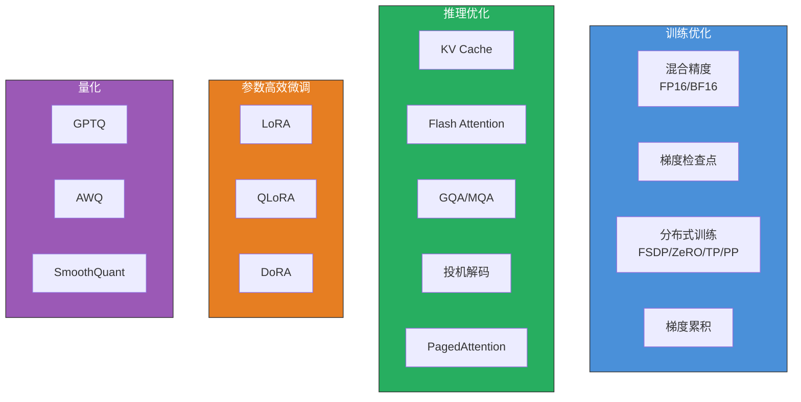
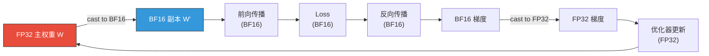
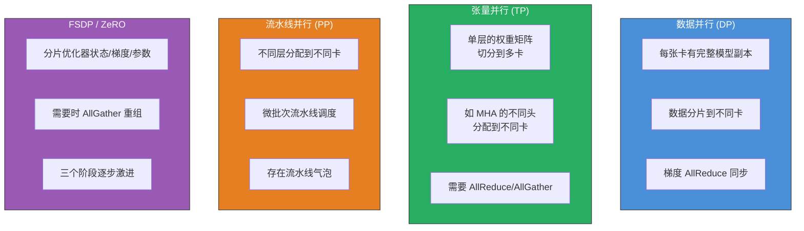
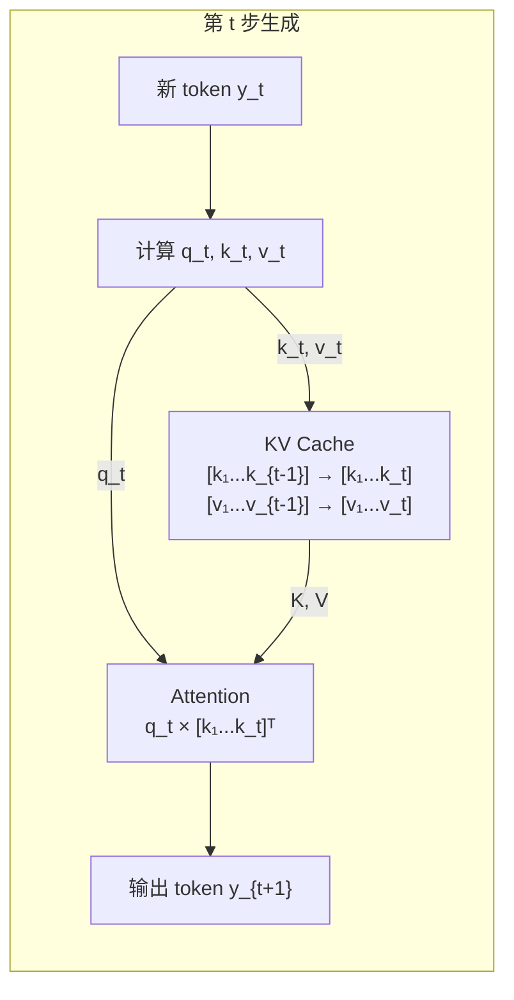
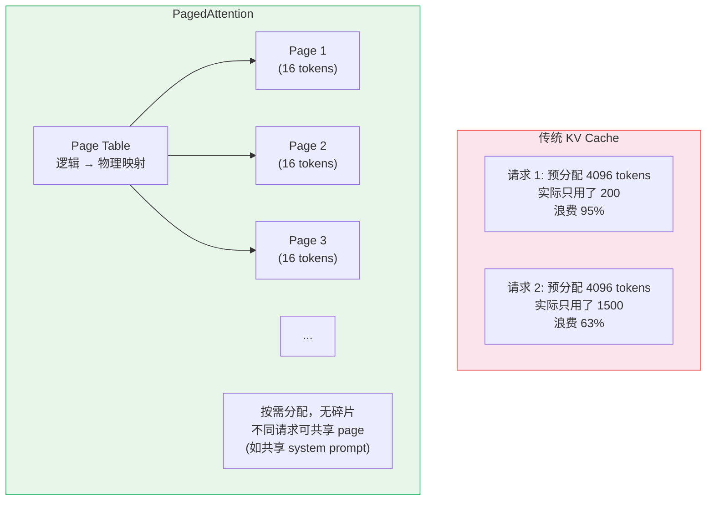
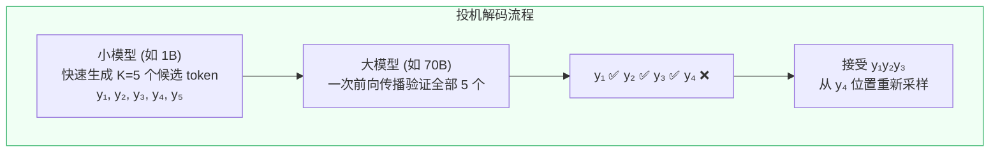
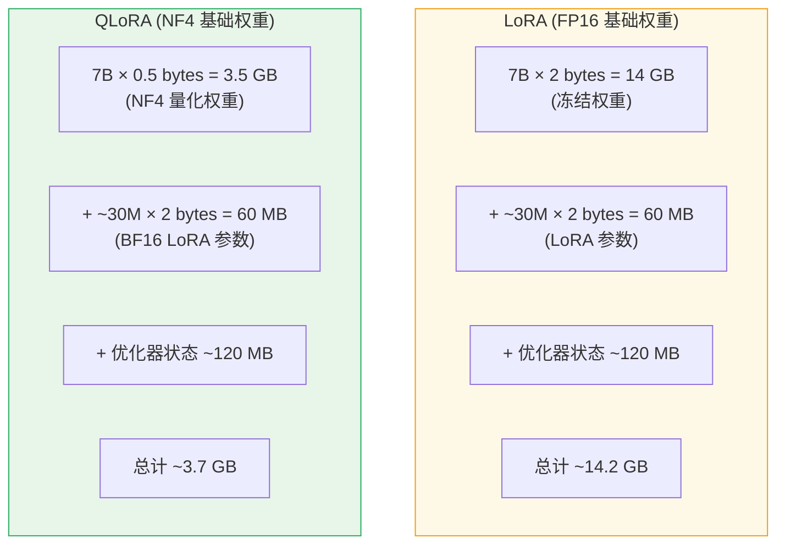
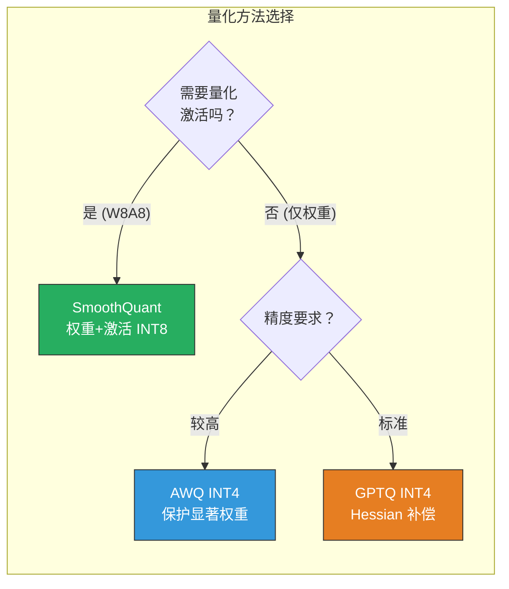
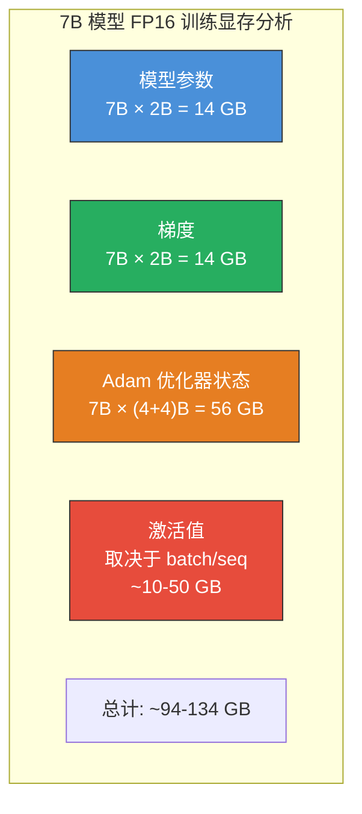
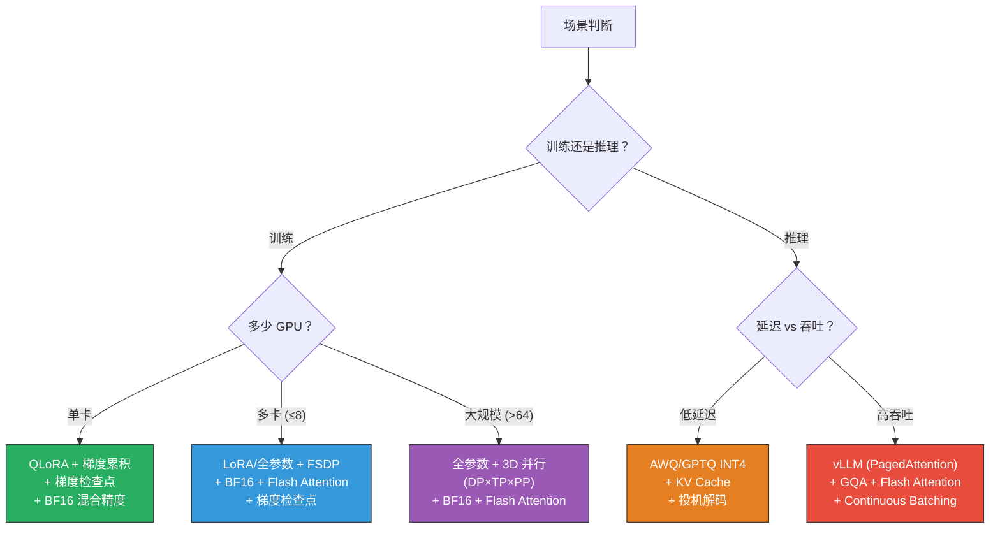

# 大模型优化技术全景

> 大模型优化是让"理论上可行"变为"工程上可用"的关键——没有这些技术，70B 模型无法训练、推理延迟无法接受、微调成本无法承受。

## 关键概念

| 概念 | 含义 |
|------|------|
| Mixed Precision（混合精度） | 用 FP16/BF16 做前向和反向计算，FP32 存储主权重，兼顾速度和精度 |
| Gradient Checkpointing（梯度检查点） | 不存所有中间激活值，反向传播时重新计算，用时间换显存 |
| Flash Attention | IO 感知的精确注意力算法，分块计算 + 在线 Softmax，内存 $O(N)$ 替代 $O(N^2)$ |
| KV Cache | 推理时缓存已计算的 Key/Value，避免每步重算，自回归生成的核心优化 |
| GQA（Grouped-Query Attention） | 多个 Q 头共享 K/V 头，压缩 KV Cache，LLaMA-3 标准配置 |
| Speculative Decoding（投机解码） | 小模型草稿 + 大模型验证，并行验证多个 token，加速 2-3 倍且无质量损失 |
| LoRA（Low-Rank Adaptation） | 冻结原始权重，只训练低秩矩阵 $BA$，可训练参数 < 1% |
| QLoRA | 4-bit NF4 量化基础权重 + LoRA，单卡 24GB 微调 70B 模型 |
| GPTQ / AWQ | 训练后权重量化（PTQ），将模型压缩到 INT4/INT8，加速推理 |
| PagedAttention | KV Cache 的虚拟内存管理，消除碎片化，vLLM 的核心技术 |
| FSDP / DeepSpeed ZeRO | 将优化器状态、梯度、参数分片到多卡，突破单卡显存限制 |

## 详细笔记

### 直觉理解：为什么需要这些优化？

想象你要搬一栋 100 层的大楼（训练/部署一个 70B 大模型）。直接搬？不可能——太重了（显存不够）、太慢了（计算耗时）、太贵了（需要上千张 GPU）。

大模型优化就是各种"搬楼技巧"：
- **混合精度**：把实心砖替换为空心砖——同样的结构，重量减半（显存减半、速度翻倍）
- **梯度检查点**：不一次性搬所有材料上楼，需要时再去拿（用时间换空间）
- **Flash Attention**：优化搬运路线，减少来回跑的次数（IO 优化）
- **KV Cache**：搬过的砖做好标记不重复搬（缓存已有计算结果）
- **LoRA**：不搬整栋楼，只改装几面墙（只训练 < 1% 的参数）
- **量化**：把高精度蓝图换成低精度但够用的版本（INT4 替代 FP16）
- **分布式训练**：多支施工队分工协作（多卡并行）



---

### 一、训练优化

#### 1.1 混合精度训练（Mixed Precision Training）

**问题**：FP32 训练 7B 模型，仅参数就需要 $7 \times 10^9 \times 4 = 28$ GB 显存，加上梯度和优化器状态总共约 $28 \times 4 = 112$ GB——单卡放不下。

**核心思想**：用低精度（FP16/BF16）做计算密集的前向和反向传播，用 FP32 存储主权重保证精度。

**数值格式对比**：

| 格式 | 位数 | 符号 | 指数 | 尾数 | 范围 | 精度 | 用途 |
|------|:----:|:----:|:----:|:----:|------|------|------|
| FP32 | 32 | 1 | 8 | 23 | $\pm 3.4 \times 10^{38}$ | ~7 位十进制 | 主权重存储 |
| FP16 | 16 | 1 | 5 | 10 | $\pm 6.5 \times 10^4$ | ~3 位十进制 | 计算（需 loss scaling） |
| BF16 | 16 | 1 | 8 | 7 | $\pm 3.4 \times 10^{38}$ | ~2 位十进制 | 计算（**LLM 首选**） |
| FP8 E4M3 | 8 | 1 | 4 | 3 | $\pm 448$ | ~1 位十进制 | 前向推理（Hopper GPU） |
| FP8 E5M2 | 8 | 1 | 5 | 2 | $\pm 57344$ | ~0.5 位 | 反向梯度 |

**为什么 BF16 是 LLM 训练的首选？**
- BF16 与 FP32 拥有**相同的指数位数**（8 位），因此数值范围一样，**不需要 Loss Scaling**
- FP16 指数只有 5 位，范围仅 $\pm 6.5 \times 10^4$，小梯度容易下溢（最小正数 $\approx 5.96 \times 10^{-8}$）
- BF16 精度略低（7 位 vs 10 位尾数），但实验证明对 LLM 训练影响可忽略

**混合精度流程**：



**Loss Scaling（FP16 专用）**：

FP16 的最小正规数为 $2^{-14} \approx 6.1 \times 10^{-5}$，许多梯度值小于此阈值会变成零。解决方案：

$$\text{scaled\_loss} = \text{loss} \times S$$

其中 $S$ 是缩放因子（通常初始化为 $2^{16} = 65536$）。**动态 Loss Scaling** 的策略：
- 如果连续 $N$ 步没有 overflow/NaN → $S \leftarrow 2S$（增大）
- 如果出现 overflow/NaN → $S \leftarrow S/2$，跳过该步更新

BF16 因为范围与 FP32 相同，**完全不需要 Loss Scaling**——这是它成为 LLM 标准的主要原因。

#### 1.2 梯度检查点（Gradient Checkpointing）

**问题**：前向传播时需要保存所有中间激活值用于反向传播。对于 $L$ 层 Transformer，激活值内存为 $O(L \times n \times d)$——LLaMA-70B 的 80 层可能需要上百 GB。

**核心思想**：只保存**少数检查点层**的激活值，其余在反向传播时从最近的检查点重新计算。

$$\text{显存} = O(L) \xrightarrow{\text{检查点}} O(\sqrt{L})$$

**为什么是 $\sqrt{L}$？** 设每隔 $k$ 层设一个检查点，则需要存 $L/k$ 个检查点 + 反向传播时最多重算 $k$ 层的激活。总显存正比于 $L/k + k$，对 $k$ 求导令其为零：

$$\frac{d}{dk}\left(\frac{L}{k} + k\right) = -\frac{L}{k^2} + 1 = 0 \implies k^* = \sqrt{L}$$

此时总显存 $\propto 2\sqrt{L}$。

**代价**：约 **25-33% 的训练时间增加**（因为部分前向传播计算了两次）。

```python
# PyTorch 实现
from torch.utils.checkpoint import checkpoint

class TransformerLayer(nn.Module):
    def forward(self, x):
        # 使用 checkpoint 包装，前向传播时不存激活值
        x = checkpoint(self.attention, x, use_reentrant=False)
        x = checkpoint(self.ffn, x, use_reentrant=False)
        return x
```

#### 1.3 分布式训练概览

当模型或数据大到单卡放不下时，需要多卡并行。



**ZeRO 三阶段的显存分析**（模型参数量 $\Phi$，$N$ 张卡）：

Adam 优化器在 FP32 下每个参数需要存储：FP32 权重(4B) + FP32 梯度(4B) + FP32 一阶矩(4B) + FP32 二阶矩(4B) = **16 字节/参数**。

| 阶段 | 分片内容 | 每卡显存 | 7B 模型 × 8 卡 |
|:----:|----------|:--------:|:--------------:|
| 无 ZeRO | 不分片 | $16\Phi$ | 112 GB/卡 |
| Stage 1 | 优化器状态 | $4\Phi + \frac{12\Phi}{N}$ | 38.5 GB/卡 |
| Stage 2 | + 梯度 | $4\Phi + \frac{12\Phi}{N}$ → $2\Phi + \frac{14\Phi}{N}$ | 26.25 GB/卡 |
| Stage 3 | + 参数 | $\frac{16\Phi}{N}$ | 14 GB/卡 |

**3D 并行**：大规模训练通常组合使用——DP × TP × PP。例如训练 175B 模型可能使用 TP=8（节点内 NVLink）× PP=8（节点间）× DP=64（数据并行），共 4096 张 GPU。

详见 → [FSDP 预训练实验](../../experiments/scripts/fsdp_pretrain.py)

#### 1.4 梯度累积（Gradient Accumulation）

**问题**：显存不够用大 batch size，但大 batch 对训练稳定性很重要。

**解决方案**：连续做多次前向+反向但不更新参数，累积梯度后再一次性更新：

$$\text{有效 batch} = \text{micro\_batch} \times \text{accumulation\_steps} \times \text{n\_gpus}$$

```python
for i, batch in enumerate(dataloader):
    loss = model(batch) / accumulation_steps  # 缩放 loss
    loss.backward()                            # 累积梯度
    if (i + 1) % accumulation_steps == 0:
        optimizer.step()                       # 累积够了才更新
        optimizer.zero_grad()
```

---

### 二、推理优化

#### 2.1 KV Cache（详解）

**问题本质**：自回归生成中，第 $t$ 步生成 token $y_t$ 时，Attention 需要计算 $q_t$ 与**所有**已有 token 的 $k_1, \dots, k_t$ 和 $v_1, \dots, v_t$ 的注意力。

如果不缓存，每步都重新算所有 K、V：
- 第 1 步：计算 1 个 K、V
- 第 2 步：计算 2 个 K、V（其中 1 个是重复的）
- 第 $t$ 步：计算 $t$ 个 K、V（其中 $t-1$ 个是重复的）
- 总计：$\sum_{t=1}^{T} t = O(T^2)$ 次 K、V 计算

**KV Cache**：缓存之前步骤的 K、V，每步只计算新 token 的 $k_t, v_t$ 并追加到缓存：



**两阶段推理**：

| 阶段 | Prefill（预填充） | Decode（解码） |
|------|:------------------:|:--------------:|
| 输入 | 整个 prompt（$n$ 个 token） | 单个新 token |
| 计算 | 一次性计算所有 K、V 并缓存 | 只计算 1 个 K、V 并追加 |
| 瓶颈 | **计算密集**（大矩阵乘法） | **内存带宽密集**（读 KV Cache） |
| 可并行 | 所有 token 并行处理 | 必须逐 token 顺序生成 |

**KV Cache 显存公式**：

$$M_{\text{KV}} = 2 \times n_{\text{layers}} \times n_{\text{kv\_heads}} \times d_{\text{head}} \times \text{seq\_len} \times \text{batch} \times \text{bytes}$$

实际例子——LLaMA-3 70B（$n_{\text{layers}}=80$，$n_{\text{kv\_heads}}=8$，$d_{\text{head}}=128$，FP16）：

| seq_len | batch=1 | batch=32 |
|:-------:|:-------:|:--------:|
| 4096 | 2.56 GB | 81.9 GB |
| 32768 | 20.5 GB | 655 GB |
| 131072 | 81.9 GB | 2.56 TB |

长序列 + 大 batch 下，KV Cache 远超模型参数本身的显存！

#### 2.2 PagedAttention（vLLM）

**问题**：传统 KV Cache 为每个请求预分配**最大长度**的连续显存块。实际生成长度通常远短于最大长度，导致 **60-80% 的显存浪费**。

**PagedAttention**（Kwon et al., 2023）借鉴操作系统的**虚拟内存**思想：



- KV Cache 被分成固定大小的 **page**（如 16 个 token）
- 用 **page table** 维护逻辑地址到物理地址的映射
- 按需分配，生成结束立即回收，**显存利用率接近 100%**
- 相同前缀的请求可以**共享 KV Cache page**（如共享 system prompt）

vLLM 基于 PagedAttention，吞吐量比 HuggingFace Transformers 高 **2-4 倍**。

#### 2.3 GQA / MQA：压缩 KV Cache

详见 → [Transformer 学习笔记：MQA → GQA 部分](../fundamentals/transformer.md)

| 注意力类型 | Q 头数 | KV 头数 | KV Cache 相对 MHA | 代表模型 |
|:----------:|:------:|:-------:|:------------------:|----------|
| MHA | $h$ | $h$ | $1\times$ | LLaMA-1, GPT-3 |
| GQA | $h$ | $g$ | $g/h$ | LLaMA-2 70B, LLaMA-3 全系列 |
| MQA | $h$ | $1$ | $1/h$ | PaLM, Falcon |

**Uptraining**：已有 MHA 模型转 GQA 不需要从头训练——将 KV 头做**均值池化**合并为 $g$ 组，然后用约 **5%** 的原始训练量继续训练即可恢复质量。

#### 2.4 投机解码（Speculative Decoding）

**问题**：自回归解码每步只生成 1 个 token，大模型的 Decode 阶段是**内存带宽瓶颈**——GPU 计算单元大部分时间在等数据。

**核心洞察**：大模型做 1 个 token 的 Decode 和做 K 个 token 的 Prefill **耗时几乎相同**（因为瓶颈是加载模型权重，而非计算）。



**数学保证**（拒绝采样）：

对于每个候选 token $y_i$，接受概率为：

$$P(\text{accept}) = \min\left(1, \frac{p(y_i)}{q(y_i)}\right)$$

其中 $p$ 是大模型分布，$q$ 是小模型分布。如果拒绝，从修正分布中重新采样：

$$p'(y) = \text{norm}\left(\max\left(0, p(y) - q(y)\right)\right)$$

**关键性质**：最终输出的分布**与直接用大模型解码完全相同**——这不是近似，是数学上严格等价的。

**加速效果**：通常 **2-3 倍**，取决于小模型与大模型分布的匹配程度（匹配越好，接受率越高）。

---

### 三、参数高效微调（PEFT）

#### 3.1 LoRA（Low-Rank Adaptation）

**直觉**：微调大模型就像装修房子——你不需要拆了重建（全参数微调），只需要换几面墙纸（低秩适配）。

**核心数学**：

冻结预训练权重 $W_0 \in \mathbb{R}^{d \times k}$，注入可训练的低秩增量：

$$W = W_0 + \Delta W = W_0 + \frac{\alpha}{r} BA$$

其中：
- $B \in \mathbb{R}^{d \times r}$：初始化为**零矩阵**
- $A \in \mathbb{R}^{r \times k}$：随机高斯初始化
- $r \ll \min(d, k)$：秩（rank），通常 8/16/32/64
- $\alpha$：缩放系数，控制 LoRA 更新的幅度
- $\frac{\alpha}{r}$：实际缩放因子，$\alpha$ 通常设为 $r$ 或 $2r$

**初始化**：$BA = 0$，因此训练开始时模型**完全等价于原始模型**。

**为什么低秩有效？** Aghajanyan et al. (2021) 提出**内在维度假说**（Intrinsic Dimensionality Hypothesis）：预训练模型的微调过程在一个**远低于参数总数的低维子空间**中进行。175B 参数的 GPT-3，其内在维度可能只有 ~5000。

**LoRA 应用位置与参数量**：

| 应用层 | 矩阵 | LoRA 参数量 ($r=16$, $d=4096$) |
|--------|------|:------------------------------:|
| Q 投影 | $W_Q$ | $2 \times 4096 \times 16 = 131K$ |
| K 投影 | $W_K$ | $131K$ |
| V 投影 | $W_V$ | $131K$ |
| O 投影 | $W_O$ | $131K$ |
| Gate 投影 | $W_{\text{gate}}$ | $2 \times 4096 \times 16 = 131K$ |
| Up 投影 | $W_{\text{up}}$ | $131K$ |
| Down 投影 | $W_{\text{down}}$ | $131K$ |
| **每层总计** | 7 个矩阵 | **~918K** |
| **32 层总计** | LLaMA-7B | **~29.4M（0.42%）** |

**部署时零额外开销**：训练完成后将 LoRA 权重**合并回原始权重**：

$$W_{\text{merged}} = W_0 + \frac{\alpha}{r}BA$$

合并后的模型与原始模型结构完全相同，推理时没有任何额外计算。

**Rank 选择指南**：

| Rank $r$ | 参数占比 (7B) | 适用场景 |
|:--------:|:------------:|----------|
| 8 | ~0.2% | 简单任务适配（风格、格式） |
| 16 | ~0.4% | 通用指令微调 |
| 32 | ~0.8% | 复杂领域适应 |
| 64 | ~1.6% | 接近全参数微调质量 |

**注意**：更高的 rank 不一定更好——过高会导致过拟合，尤其在小数据集上。

#### 3.2 QLoRA

**核心思想**：在 LoRA 基础上，将冻结的基础权重从 FP16 **量化到 4-bit NF4**，极大降低显存需求。



**NF4（Normal Float 4-bit）量化**：

基于观察：预训练模型的权重近似服从**正态分布** $\mathcal{N}(0, \sigma^2)$。NF4 将 16 个量化级别放在正态分布的**分位点**上，使每个区间的概率质量相等：

$$q_i = \Phi^{-1}\left(\frac{i + 0.5}{16}\right), \quad i = 0, 1, \dots, 15$$

其中 $\Phi^{-1}$ 是标准正态分布的逆 CDF。这比均匀 INT4 量化误差更小（因为权重集中在零附近，NF4 在零附近有更密的量化级别）。

**双重量化（Double Quantization）**：

量化需要为每组（通常 64 个权重）存储一个 FP32 的缩放因子，每个参数额外 $32/64 = 0.5$ bit。双重量化对这些缩放因子**再做一次 INT8 量化**，额外开销降至 $8/64 + 32/(64 \times 256) \approx 0.127$ bit/参数。

**显存对比**（微调 7B 模型）：

| 方法 | 基础权重 | LoRA | 优化器 | 总计 | 所需 GPU |
|------|:--------:|:----:|:------:|:----:|:--------:|
| 全参数微调 (FP16) | 14 GB | — | ~84 GB | ~100 GB | 2× A100 80GB |
| LoRA (FP16) | 14 GB | 60 MB | 120 MB | ~14.2 GB | 1× RTX 4090 |
| QLoRA (NF4) | 3.5 GB | 60 MB | 120 MB | ~3.7 GB | 1× RTX 3090 |

QLoRA 的质量与 LoRA 几乎无差异——Dettmers et al. (2023) 证明 NF4 量化引入的噪声对微调影响极小。

#### 3.3 DoRA（Weight-Decomposed Low-Rank Adaptation）

**动机**：分析发现 LoRA 和全参数微调的学习模式存在差异——全参数微调会同时调整权重的**大小（magnitude）**和**方向（direction）**，而 LoRA 难以有效分离这两者。

**核心数学**：

将权重分解为大小和方向：

$$W = m \cdot \frac{V}{\|V\|_c}$$

其中 $m \in \mathbb{R}^{1 \times k}$ 是每列的大小向量，$V$ 是方向矩阵，$\|\cdot\|_c$ 是列归一化。

DoRA 只对**方向**部分做 LoRA，大小部分独立学习：

$$W' = m' \cdot \frac{V + BA}{\|V + BA\|_c}$$

- $m'$：可训练的大小参数（初始化为 $\|W_0\|_c$）
- $V + BA$：方向部分用 LoRA 更新

实验表明 DoRA 在相同 rank 下质量优于 LoRA，**接近全参数微调**。

#### 3.4 PEFT 方法对比

| 方法 | 可训练参数 | 推理开销 | 质量 | 显存 |
|------|:----------:|:--------:|:----:|:----:|
| 全参数微调 | 100% | 无 | 最优 | 极高 |
| LoRA | 0.1-1% | **无**（可合并） | 接近最优 | 低 |
| QLoRA | 0.1-1% | 轻微（反量化） | 接近 LoRA | 极低 |
| DoRA | 0.1-1% | **无**（可合并） | 优于 LoRA | 低 |
| Adapter Layers | 0.5-5% | **有**（额外层） | 好 | 低 |
| Prefix Tuning | 0.1% | 轻微（占用上下文） | 中等 | 极低 |
| Prompt Tuning | < 0.01% | 轻微 | 较差 | 极低 |

---

### 四、量化（Quantization）

#### 4.1 量化基础数学

**线性量化**：将浮点值映射到低位整数：

$$x_q = \text{round}\left(\frac{x}{s} + z\right), \quad s = \frac{x_{\max} - x_{\min}}{2^b - 1}, \quad z = \text{round}\left(-\frac{x_{\min}}{s}\right)$$

**反量化**：

$$\hat{x} = (x_q - z) \times s$$

其中 $s$ 是缩放因子，$z$ 是零点，$b$ 是量化位宽。

**对称量化**（$z = 0$）：

$$x_q = \text{round}\left(\frac{x}{s}\right), \quad s = \frac{\max(|x|)}{2^{b-1} - 1}$$

对称量化更简单（没有零点偏移），但要求分布对称。

**量化粒度**：

| 粒度 | 做法 | 精度 | 额外开销 |
|------|------|:----:|:--------:|
| Per-tensor | 整个张量共享 1 组 $s, z$ | 低 | 最小 |
| Per-channel | 每个输出通道独立 $s, z$ | 中 | 中 |
| Per-group | 每 $g$ 个元素（如 128）共享 $s, z$ | 高 | 较大 |

现代 LLM 量化几乎都用 **per-group**（组大小 128），在精度和开销间取得平衡。

#### 4.2 训练后量化（PTQ）方法

**GPTQ**（Frantar et al., 2022）：

基于**近似二阶信息**（Hessian 矩阵）逐列量化权重，同时**补偿未量化列**以最小化整体输出误差：

$$\text{argmin}_{\hat{W}} \| WX - \hat{W}X \|^2$$

通过 Cholesky 分解高效求解，单次遍历即可完成。

- 速度快：7B 模型约 4 分钟
- 支持 INT4/INT3/INT2
- 通常在 INT4 per-group(128) 下精度损失很小

**AWQ**（Lin et al., 2023）—— Activation-Aware Weight Quantization：

**核心观察**：不是所有权重同等重要。1% 的"显著权重"（对应高激活值的通道）对模型输出影响极大。

$$s_j = \left(\frac{\max(|X_j|)}{1}\right)^\alpha, \quad \alpha \in [0, 1]$$

对显著通道的权重做放大（等效地对该通道激活做缩小），使其量化误差更小：

$$Y = XW = (X \cdot \text{diag}(s)^{-1}) \cdot (\text{diag}(s) \cdot W) = \hat{X} \hat{W}$$

$\hat{W}$ 中显著权重被放大，量化时相对误差更小。

**SmoothQuant**（Xiao et al., 2022）：

**问题**：激活值中有**离群值**（outlier）——某些通道的值比其他通道大 100 倍，导致激活量化极困难。

**解决方案**：通过数学等价变换，将量化难度从激活**迁移**到权重：

$$Y = XW = (X \text{diag}(s)^{-1})(\text{diag}(s) W)$$

选取平滑因子 $s_j$，使激活和权重的量化难度"平衡"：

$$s_j = \frac{\max(|X_j|)^\alpha}{\max(|W_j|)^{1-\alpha}}, \quad \alpha = 0.5$$

变换后激活的离群值被消除，INT8 量化即可获得接近 FP16 的精度。

#### 4.3 PTQ 方法对比

| 方法 | 量化对象 | 位宽 | 核心技术 | 速度 |
|------|:--------:|:----:|----------|:----:|
| GPTQ | 权重 | INT4/INT3 | Hessian 补偿 | 快 |
| AWQ | 权重 | INT4 | 激活感知保护显著权重 | 快 |
| SmoothQuant | 权重 + 激活 | INT8 | 等价变换平衡量化难度 | 快 |
| RTN | 权重 | INT8/INT4 | 直接四舍五入（基线） | 最快 |



---

### 五、注意力优化

#### 5.1 Flash Attention（详解）

详见 → [Transformer 笔记：Flash Attention 部分](../fundamentals/transformer.md)

**核心问题**：标准注意力的瓶颈不是计算（FLOPs），而是**内存读写（IO）**。GPU 的 HBM 带宽远低于计算吞吐量，大量时间花在搬运 $N \times N$ 注意力矩阵上。

**Flash Attention 的三个关键技术**：

1. **分块（Tiling）**：将 Q、K、V 切成适合 SRAM 大小的小块
2. **在线 Softmax**：增量计算 Softmax，无需一次看到完整的一行
3. **反向传播重计算**：不存 $N \times N$ 中间矩阵，反向时从 Q、K、V 重算

**在线 Softmax 的更新公式**：

$$m^{(j)} = \max\left(m^{(j-1)},\; \tilde{m}^{(j)}\right)$$

$$\ell^{(j)} = e^{m^{(j-1)} - m^{(j)}} \ell^{(j-1)} + e^{\tilde{m}^{(j)} - m^{(j)}} \tilde{\ell}^{(j)}$$

$$O^{(j)} = \frac{e^{m^{(j-1)} - m^{(j)}} \ell^{(j-1)} O^{(j-1)} + e^{\tilde{m}^{(j)} - m^{(j)}} \tilde{P}^{(j)} V^{(j)}}{\ell^{(j)}}$$

其中 $m$ 是运行最大值，$\ell$ 是运行求和，$O$ 是运行输出。

| 版本 | 发布 | 关键改进 | A100 利用率 |
|:----:|:----:|----------|:----------:|
| Flash Attention 1 | 2022 | 分块 + 在线 Softmax | 25-40% |
| Flash Attention 2 | 2023 | Q 维度并行 + 更好 warp 调度 | 50-73% |
| Flash Attention 3 | 2024 | Hopper 架构优化 + FP8 + 异步调度 | 75%+ |

#### 5.2 滑动窗口注意力（Sliding Window Attention）

**思想**：大部分注意力集中在**局部**。限制每个 token 只关注最近 $W$ 个 token，内存从 $O(N)$ 降为 $O(W)$。

但信息不会丢失！通过**层间传递**，$L$ 层的有效感受野为 $L \times W$。对于 Mistral（$W=4096, L=32$），有效感受野 $= 131072$ tokens。

#### 5.3 线性注意力与状态空间模型

| 方法 | 复杂度 | 核心思路 | 代表 |
|------|:------:|----------|------|
| 标准注意力 | $O(N^2d)$ | Softmax(QK^T)V | Transformer |
| 线性注意力 | $O(Nd^2)$ | $\phi(Q)(\phi(K)^TV)$，核近似 | Performer |
| RWKV | $O(Nd)$ | 线性递推 + Token Shift | RWKV-6 |
| Mamba (SSM) | $O(Nd)$ | 选择性状态空间，输入相关的 A, B | Mamba-2 |

当 $d < N$（长序列）时线性注意力更快；当 $d > N$（短序列）时标准注意力更快。

---

### 六、内存优化

#### 6.1 LLM 训练的显存构成



优化器状态占比最大！这就是 ZeRO Stage 1 首先分片优化器状态的原因。

#### 6.2 内存高效优化器

| 优化器 | 状态内存/参数 | 核心技术 | 适用场景 |
|--------|:------------:|----------|----------|
| Adam (FP32) | 12 字节 | 一阶矩 + 二阶矩 (FP32) | 标准基线 |
| 8-bit Adam | 4 字节 | 状态量化为 INT8（分块量化） | 节省 75% 优化器内存 |
| AdaFactor | ~4 字节 | 二阶矩分解为行/列因子 $O(m+n)$ | 极大模型 |
| SGD | 0 字节 | 无状态 | 简单任务 |

**8-bit Adam**（bitsandbytes）：

将 Adam 的一阶矩 $m$ 和二阶矩 $v$ 从 FP32 量化到 INT8，通过**分块量化**（每 2048 个值共享一组量化参数）保持精度。内存从 $12\Phi$ 降至 $\approx 4\Phi$（加上量化参数开销约 $6\Phi$）。

**AdaFactor**：

将二阶矩矩阵 $V \in \mathbb{R}^{m \times n}$ 分解为行因子 $r \in \mathbb{R}^m$ 和列因子 $c \in \mathbb{R}^n$，重构为 $\hat{V}_{ij} = r_i \cdot c_j / \text{mean}(r)$。

存储从 $O(mn)$ 降为 $O(m + n)$——对于 $4096 \times 11008$ 的 FFN 权重，节省 **99.96%**。

#### 6.3 CPU / NVMe 卸载

当 GPU 显存不够时，可以将数据卸载到 CPU 内存或 NVMe SSD：

| 级别 | 卸载目标 | 带宽 | 适用场景 |
|------|:--------:|:----:|----------|
| ZeRO-Offload | CPU RAM | ~50 GB/s (PCIe 4.0) | 单卡训练大模型 |
| ZeRO-Infinity | NVMe SSD | ~5 GB/s | 万亿参数模型 |

代价是通信开销增加，训练速度下降 30-60%。适合**只有少量 GPU 但需要训练大模型**的场景。

---

### 技术组合：实际场景的最优选择



## 个人理解与思考

### 优化技术的统一视角：在"不可能三角"中寻找平衡

所有大模型优化本质上都在**质量、速度、成本**三者之间做权衡：
- **量化**牺牲少量质量换取推理速度和成本
- **LoRA**牺牲少量质量换取训练成本
- **Flash Attention**不牺牲质量，通过算法优化同时改善速度和成本（免费午餐）
- **投机解码**不牺牲质量，通过额外计算换取延迟降低

认清每种技术在这个三角中的位置，是选择正确方案的关键。

### LoRA 的深层意义

LoRA 成功的背后是一个深刻的洞察：**大模型的能力空间远大于单个任务所需的空间**。微调只是在高维参数空间中做一个低秩方向的移动。这解释了为什么 rank=16 的 LoRA（仅 0.4% 参数）就能获得接近全参数微调的效果——因为任务相关的"信息量"本身就不大。

### Flash Attention 是"正确抽象层"的胜利

Flash Attention 的启示在于：**瓶颈不在你以为的地方**。大多数人以为注意力的瓶颈是 $O(N^2)$ 的浮点运算，实际上瓶颈是 GPU 的内存带宽。Tri Dao 通过把抽象层从"数学运算"切换到"硬件 IO"，找到了一个不牺牲任何精度的优化方案。

### 与已有笔记的关联

- **Transformer 学习笔记** → [notes/fundamentals/transformer.md](../fundamentals/transformer.md)：本笔记的 Flash Attention、KV Cache、GQA 是 Transformer 笔记中推理优化部分的深化扩展
- **SFT 学习笔记** → [notes/training/supervised-fine-tuning-sft.md](./supervised-fine-tuning-sft.md)：LoRA/QLoRA 是 SFT 中参数高效微调的核心方法，SFT 笔记中的 LoRA 数学部分可与本笔记对照阅读
- **RLHF 学习笔记** → [notes/training/rlhf.md](./rlhf.md)：RLHF-PPO 需要同时管理 4 个模型，这使得混合精度、梯度检查点、分布式训练等内存优化技术变得至关重要
- **CLIP 论文笔记** → [papers/clip.md](../../papers/clip.md)：CLIP 的对比预训练使用大 batch size（32768），梯度累积和分布式训练是实现的关键
- **FSDP 预训练实验** → [experiments/scripts/fsdp_pretrain.py](../../experiments/scripts/fsdp_pretrain.py)：实验代码实现了 FSDP 分片、混合精度、梯度裁剪等本笔记讨论的训练优化技术
- **多模态模型发展历程** → [notes/multimodal-arch/mllm-evolution.md](../multimodal-arch/mllm-evolution.md)：多模态模型的视觉编码器通常冻结，只对连接层和 LLM 做 LoRA/全参数微调

### 常见误区

| 误区 | 纠正 |
|------|------|
| "Flash Attention 是近似计算，会损失精度" | Flash Attention 是**数学上精确**的，它只改变计算顺序和 IO 模式，结果与标准注意力完全一致 |
| "量化后模型一定会变差很多" | INT4 per-group 量化（GPTQ/AWQ）在大多数任务上精度损失 < 1%。关键是选对方法和粒度 |
| "LoRA rank 越高越好" | 过高的 rank 在小数据集上反而导致过拟合。实验表明 rank=16-32 通常是最佳平衡点 |
| "KV Cache 是可选优化" | 没有 KV Cache，生成 1000 个 token 需要做约 500,000 次冗余的 K/V 计算——从几秒变成几分钟 |
| "BF16 和 FP16 只是精度不同" | 最关键的区别是**数值范围**：BF16 与 FP32 相同（$10^{38}$），FP16 只有 $6.5 \times 10^4$。这使得 BF16 无需 Loss Scaling |
| "投机解码会降低生成质量" | 投机解码通过拒绝采样**保证输出分布完全一致**——这是数学上严格证明的，不是近似 |
| "分布式训练只需要数据并行" | 数据并行要求每张卡能放下完整模型。70B+ 模型必须结合 ZeRO/FSDP 分片或 TP/PP 才能训练 |
| "QLoRA 质量远差于 LoRA" | Dettmers et al. 证明 QLoRA 在标准基准上与 16-bit LoRA 几乎无差异（NF4 量化误差极小） |
| "梯度检查点只用于大模型" | 即使是 7B 模型，长序列（32K+）时激活值显存也可能超过 40GB，梯度检查点几乎是标配 |

### 面试/口述版

> 大模型优化技术可以分为训练优化和推理优化两大类。训练侧，混合精度（BF16 计算 + FP32 权重）将显存需求减半且不需要 Loss Scaling，梯度检查点用 $O(\sqrt{L})$ 替代 $O(L)$ 的激活值存储，FSDP/ZeRO 将优化器状态、梯度和参数分片到多卡突破单卡限制。推理侧，KV Cache 缓存已计算的 Key/Value 避免重复计算，GQA 通过共享 KV 头将缓存压缩数倍，Flash Attention 通过 IO 感知的分块计算和在线 Softmax 将注意力内存从 $O(N^2)$ 降到 $O(N)$ 且无精度损失，投机解码用小模型生成草稿 + 大模型并行验证实现 2-3 倍加速且数学上保证输出分布不变。微调侧，LoRA 冻结原权重只训练低秩增量矩阵（< 1% 参数），QLoRA 进一步将基础权重量化到 4-bit NF4 使单卡微调 70B 成为可能。量化侧，GPTQ 和 AWQ 可以将推理模型压缩到 INT4 且精度损失极小，核心区别在于 GPTQ 用 Hessian 补偿而 AWQ 用激活感知保护显著权重。

## 相关链接

- [Flash Attention (Dao et al., 2022)](https://arxiv.org/abs/2205.14135) — IO 感知精确注意力
- [Flash Attention 2 (Dao, 2023)](https://arxiv.org/abs/2307.08691) — 2 倍加速
- [LoRA (Hu et al., 2021)](https://arxiv.org/abs/2106.09685) — 低秩自适应微调
- [QLoRA (Dettmers et al., 2023)](https://arxiv.org/abs/2305.14314) — 4-bit 量化 + LoRA
- [DoRA (Liu et al., 2024)](https://arxiv.org/abs/2402.09353) — 权重分解低秩适配
- [GPTQ (Frantar et al., 2022)](https://arxiv.org/abs/2210.17323) — 基于 Hessian 的训练后量化
- [AWQ (Lin et al., 2023)](https://arxiv.org/abs/2306.00978) — 激活感知权重量化
- [SmoothQuant (Xiao et al., 2022)](https://arxiv.org/abs/2211.10438) — 等价变换平滑量化
- [GQA (Ainslie et al., 2023)](https://arxiv.org/abs/2305.13245) — 分组查询注意力
- [PagedAttention / vLLM (Kwon et al., 2023)](https://arxiv.org/abs/2309.06180) — KV Cache 虚拟内存管理
- [Speculative Decoding (Leviathan et al., 2023)](https://arxiv.org/abs/2211.17192) — 投机解码
- [ZeRO (Rajbhandari et al., 2020)](https://arxiv.org/abs/1910.02054) — 分布式训练内存优化
- [Megatron-LM (Shoeybi et al., 2019)](https://arxiv.org/abs/1909.08053) — 张量并行
- [Mixed Precision Training (Micikevicius et al., 2017)](https://arxiv.org/abs/1710.03740) — 混合精度训练
- [Intrinsic Dimensionality (Aghajanyan et al., 2021)](https://arxiv.org/abs/2012.13255) — LoRA 的理论基础

## 更新日志

- 2026-02-21: 初始创建
