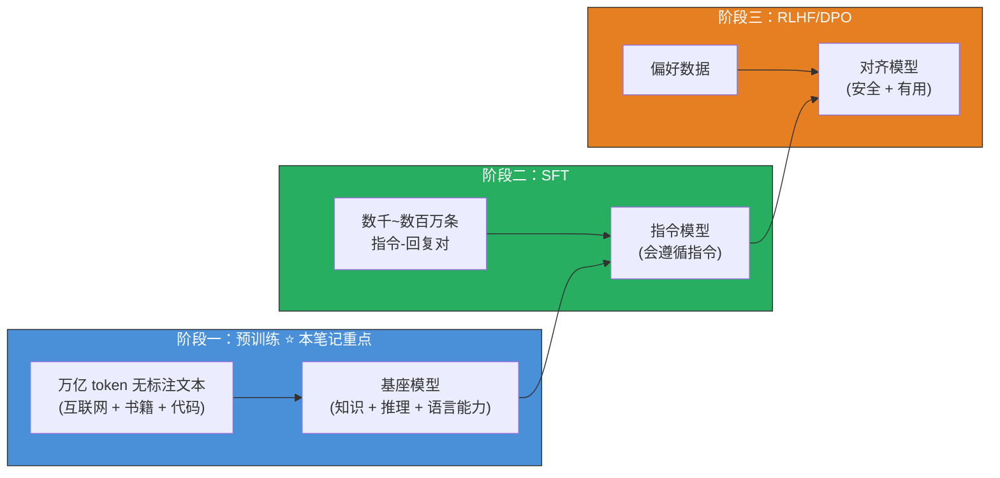
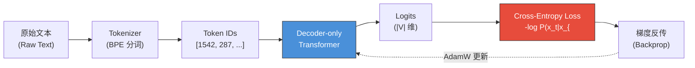
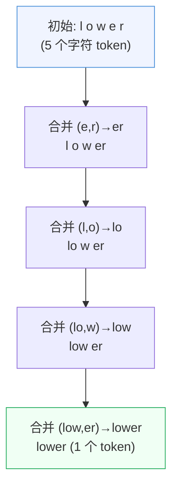
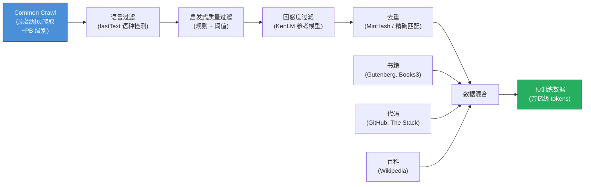
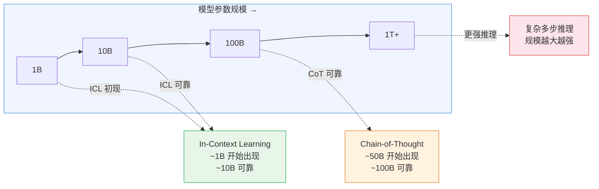

# 大模型预训练（LLM Pre-training）

> 预训练是大语言模型一切能力的根基——它让模型"读完整个互联网"，在海量无标注文本中学会语言、知识、推理和世界模型。后续的 SFT 只是教它"用什么格式回答"，RLHF 只是教它"什么回答更好"，但**知识本身来自预训练**。

## 关键概念

| 概念 | 含义 |
|------|------|
| 预训练（Pre-training） | 在海量无标注文本上用 Next-Token Prediction 目标训练模型，使其获得通用语言能力和世界知识 |
| 因果语言模型（Causal Language Modeling, CLM） | 预训练的核心目标：给定前缀 $x_{<t}$，预测下一个 token $x_t$，损失为交叉熵 |
| BPE（Byte Pair Encoding） | 基于频率统计的子词分词算法，迭代合并最高频的字节对，平衡词表大小与序列长度 |
| SentencePiece | Google 提出的语言无关分词框架，支持 BPE 和 Unigram 算法，直接在原始 Unicode 字节上操作 |
| Scaling Law（缩放法则） | Kaplan et al. (2020) 发现的幂律关系：模型损失随参数量 $N$、数据量 $D$、计算量 $C$ 呈幂律下降 |
| Chinchilla 最优（Compute-Optimal） | Hoffmann et al. (2022) 证明给定计算预算应等比扩大模型和数据，最优比约 20 tokens/参数 |
| 数据管道（Data Pipeline） | 从 Common Crawl 原始爬取到训练就绪数据的完整处理链路：过滤 → 去重 → 混合 |
| MinHash 去重 | 用 Locality-Sensitive Hashing 近似估计文档间 Jaccard 相似度，高效删除近重复文档 |
| 学习率调度（LR Schedule） | 预训练中的 Warmup → 余弦衰减 → 冷却三段式策略，线性缩放规则将 lr 与 batch size 联动 |
| 数据课程（Data Curriculum） | 预训练中不同来源数据的混合比例策略，以及退火阶段向高质量数据倾斜的做法 |
| 涌现能力（Emergent Capabilities） | 在小模型中不存在、在足够大模型中突然出现的能力，如 ICL、CoT、指令跟随 |
| 基座模型（Base Model） | 预训练结束、SFT 之前的原始模型；只会做文本续写，不具备对话能力 |
| 持续预训练（Continual Pre-training） | 在已有基座模型基础上，针对特定领域数据继续预训练，实现领域适配 |
| 多模态预训练（Multimodal Pre-training） | 将预训练范式扩展到文本+图像/视频/音频的联合训练，如 CLIP 对比预训练 |

## 详细笔记

### 一、直觉理解：预训练是在做什么？

想象你要培养一个"万能助手"。第一步不是教它回答问题，而是让它**读遍人类写下的一切**——互联网网页、维基百科、学术论文、GitHub 代码、小说、新闻、论坛讨论。读完之后，它虽然不会主动回答问题（这是 SFT 的工作），但它已经"肚子里有货"了：知道法国首都是巴黎，知道 Python 的 for 循环怎么写，知道牛顿第三定律是什么。

这就是预训练——**让模型成为一个"读过所有书的学者"**。

#### 三阶段训练流水线

| 维度 | 预训练 | SFT | RLHF |
|------|--------|-----|------|
| 数据规模 | 数万亿 token | 数千~数百万对 | 数万~数十万偏好对 |
| 数据标注 | 无监督（文本续写） | 有监督（指令-回复对） | 偏好标注（chosen vs rejected） |
| 核心贡献 | 世界知识、语言能力、推理能力 | 指令遵循、对话格式 | 人类价值对齐、安全性 |
| 计算成本 | 极高（数百万 GPU 小时） | 中等（数百~数千 GPU 小时） | 高（多模型同时运行） |
| 关联笔记 | **本笔记** | [SFT 笔记](supervised-fine-tuning-sft.md) | [RLHF 笔记](rlhf.md) |

LIMA 论文（Zhou et al., 2023）提出的 **Superficial Alignment Hypothesis** 精辟地总结了三阶段的关系：*"模型的知识和能力几乎全部在预训练阶段获得。SFT 只是教会模型用什么格式和风格来展示这些知识。"* 这意味着：如果模型在某领域知识不足，增加 SFT 数据无法解决——应该补充预训练阶段的领域数据。

### 二、预训练目标：因果语言建模（CLM）

#### 核心公式

给定一个 token 序列 $x = (x_1, x_2, \ldots, x_T)$，因果语言模型的训练目标是最大化序列的对数似然：

$$\mathcal{L}(\theta) = -\sum_{t=1}^{T} \log P_\theta(x_t \mid x_1, x_2, \ldots, x_{t-1})$$

或写成在数据集上的期望形式：

$$\mathcal{L}(\theta) = -\mathbb{E}_{x \sim \mathcal{D}} \left[ \sum_{t=1}^{T} \log P_\theta(x_t \mid x_{<t}) \right]$$

这个公式看似简单——"预测下一个词"——但它迫使模型隐式学习数据的**完整联合分布** $P(x_1, x_2, \ldots, x_T)$。为了最优地预测下一个 token，模型必须理解：

- **语法和句法**：预测语法正确的续写
- **世界知识**：预测事实一致的续写（"巴黎是法国的_____"→"首都"）
- **推理链条**：预测逻辑连贯的续写（"如果 A > B 且 B > C，那么 A _____"→"> C"）
- **代码逻辑**：预测语法和语义正确的代码

#### 预训练数据流

模型架构使用 Decoder-only Transformer，通过因果掩码（Causal Mask）确保每个位置只能看到之前的 token。架构细节详见 [Transformer 笔记](../fundamentals/transformer.md)。

与 PPL 的关系：Perplexity = $\exp(\mathcal{L}/T)$，是预训练质量的直接衡量指标。详见 [LLM 评估笔记](../fundamentals/llm-evaluation.md)。

#### CLM vs MLM：为什么 GPT 系列胜出？

| 维度 | CLM（Causal LM） | MLM（Masked LM） |
|------|:-----------------:|:-----------------:|
| 代表 | GPT 系列、LLaMA | BERT |
| 目标 | 预测下一个 token | 预测被 mask 的 token（~15%） |
| 掩码方向 | 单向（只看过去） | 双向（看前后文） |
| 生成能力 | ✅ 天然支持自回归生成 | ❌ 无法直接生成 |
| 训练效率 | 每个 token 都参与损失 | 只有 ~15% 的 mask token 参与 |
| 理解能力 | 通过规模补偿 | 天然更强（双向注意力） |

CLM 之所以在 LLM 时代胜出，关键在于：**同一个目标函数既用于训练也用于推理**，这使得预训练和生成使用统一框架，scaling 更加自然。

### 三、分词器（Tokenization）与 BPE 算法

模型不操作原始字符或词语，而是操作**子词 token（subword token）**。分词器的选择直接影响模型效率和多语言能力。

#### 3.1 BPE 算法步骤

BPE（Sennrich et al., 2016）是最常用的分词算法，核心思想是**迭代合并最高频的相邻符号对**：

1. **初始化词表**：将所有字符（或字节）作为初始符号集
2. **统计频率**：计数语料中所有相邻符号对的出现次数
3. **合并最频对**：找到频率最高的符号对 $(a, b)$，将所有 $ab$ 合并为新符号
4. **加入词表**：将新符号加入词表
5. **重复 2-4**：直到词表达到目标大小 $|V|$

合并规则：

$$\text{score}(a, b) = \text{count}(a, b) \quad \Rightarrow \quad \text{merge: } (a, b) \to ab$$

#### BPE 合并树示例

实际中，高频词（如 "the"、"is"）会被合并为单个 token，而罕见词（如 "pneumonoultramicroscopic"）则被拆成多个子词 token。这在词表大小和序列长度之间取得了平衡。

#### 3.2 Byte-level BPE

GPT-2 引入了 **byte-level BPE**：不从 Unicode 字符开始，而是从**原始字节**（256 个初始符号）开始合并。优势：任何字符串都能表示（无 unknown token），且天然支持所有语言和特殊字符。LLaMA 系列使用 SentencePiece 实现的 byte-level BPE。

#### 3.3 WordPiece vs SentencePiece

**WordPiece**（BERT、Gemma 使用）：合并评分不是原始频率，而是**似然比**：

$$\text{score}(a, b) = \frac{\text{count}(ab)}{\text{count}(a) \times \text{count}(b)}$$

倾向于合并那些"共现远超独立出现之积"的符号对，产生更具语言学意义的分割。

**SentencePiece**（Kudo & Richardson, 2018）：语言无关的分词框架。关键特点是**直接在原始文本上操作**，不依赖预分词（如空格切分），因此对中文、日文等无空格语言更友好。支持 BPE 和 Unigram LM 两种算法。LLaMA、T5 均使用。

#### 3.4 词表大小权衡

| 词表大小 | 优点 | 缺点 | 代表模型 |
|:--------:|------|------|----------|
| ~32K | Embedding 层小、训练快 | 中文/代码表示效率低（一个汉字可能 3-4 个 token） | LLaMA-1/2 |
| ~50K | 英文效率好 | 非英文仍有不足 | GPT-2/3 |
| ~128K | 多语言效率大幅提升 | Embedding 层显存增大、长尾 token 学习困难 | LLaMA-3 |
| ~256K | 几乎所有语言高效 | 极大的 Embedding 层 | Gemma |

**LLaMA 分词器演变**：LLaMA-1/2 使用 SentencePiece BPE，词表 32K，中文"你好"需要 3-4 个 token。LLaMA-3 切换到 tiktoken，词表扩大到 128K，中文效率提升约 2-3 倍。这是一个**纯预训练层面的架构决策**，对模型的多语言能力影响巨大。

### 四、Scaling Laws：模型、数据与算力的权衡

Scaling Law 是指导预训练资源分配的核心理论——**给定有限的计算预算，应该训练多大的模型？用多少数据？**

#### 4.1 Kaplan Scaling Laws (2020)

Kaplan et al. 发现，交叉熵损失 $L$ 在三个轴上分别遵循幂律：

$$L(N) \propto N^{-\alpha_N}, \quad \alpha_N \approx 0.076$$

$$L(D) \propto D^{-\alpha_D}, \quad \alpha_D \approx 0.095$$

$$L(C) \propto C^{-\alpha_C}, \quad \alpha_C \approx 0.050$$

其中：
- $N$：模型参数量（不含 Embedding）
- $D$：训练 token 数
- $C$：计算量（FLOPs），近似 $C \approx 6ND$

Kaplan 2020 的结论是：在固定计算预算下，**应优先增大模型**——即"大模型 + 少数据"比"小模型 + 多数据"更优。这一结论直接影响了 GPT-3 的设计（175B 参数，仅 300B token）。

#### 4.2 Chinchilla (2022)：Compute-Optimal

Hoffmann et al. 通过更严格的实验推翻了 Kaplan 的模型优先结论，证明**模型大小和数据量应等比增长**：

$$N_{\text{opt}} \propto C^{0.5}, \quad D_{\text{opt}} \propto C^{0.5}$$

著名的经验法则：**每个参数约需 20 个训练 token**。

$$D_{\text{opt}} \approx 20 \times N$$

Chinchilla（70B 参数 / 1.4T token）以**四分之一的参数量超越了 GPT-3**（175B / 300B token），证明 GPT-3 严重**欠训练**（数据不足）。

#### 4.3 推理优化："过训练"策略

Chinchilla 给出的是**训练 compute-optimal**——最小化训练成本。但如果模型要被部署服务数百万用户，**推理成本**也必须考虑。

LLaMA（Touvron et al., 2023）的洞察：如果推理成本很高，值得在训练阶段"过度投资"——用**小模型 + 远超 Chinchilla-optimal 的数据量**来训练，得到一个推理便宜但同样强大的模型。

| 模型 | 参数量 | 训练 tokens | Chinchilla 最优 | 实际/最优比 | 策略 |
|------|:------:|:-----------:|:---------------:|:-----------:|------|
| GPT-3 | 175B | 300B | ~3.5T | 0.09x | 严重欠训练 |
| Chinchilla | 70B | 1.4T | ~1.4T | 1.0x | 严格 compute-optimal |
| LLaMA-1 7B | 7B | 1T | ~140B | 7x | 推理优化过训练 |
| LLaMA-2 70B | 70B | 2T | ~1.4T | 1.4x | 略超 |
| LLaMA-3 8B | 8B | 15T | ~160B | **94x** | 极端过训练 |
| LLaMA-3 70B | 70B | 15T | ~1.4T | **11x** | 大幅过训练 |

LLaMA-3 8B 训练了 15T token——是 Chinchilla 最优的 94 倍！这意味着 Meta 宁可花更多训练成本，也要获得一个 8B 参数（推理极便宜）却能力接近 70B 的模型。

### 五、预训练数据管道

数据质量对预训练的影响不亚于模型架构。垃圾数据进，垃圾模型出（Garbage In, Garbage Out）。

#### 5.1 数据管道全景

#### 5.2 主要预训练数据集

| 数据集 | 规模 | 主要来源 | 特点 |
|--------|:----:|---------|------|
| **The Pile** (EleutherAI, 2021) | 825 GB | 22 个来源（HackerNews, ArXiv, GitHub 等） | 首个系统性多来源开放数据集 |
| **RedPajama v1** (2023) | 1.2T tokens | 复刻 LLaMA-1 数据来源 | LLaMA-1 训练数据的开放复现 |
| **SlimPajama** (2023) | 627B tokens | RedPajama + 深度去重 | 更干净的 RedPajama 子集 |
| **FineWeb** (HuggingFace, 2024) | 15T tokens | Common Crawl（96 次爬取） | 精细质量过滤，目前最大开源数据集 |
| **DCLM** (2024) | 4T tokens | Common Crawl | 系统性过滤策略消融实验 |

#### 5.3 去重方法

**为什么去重至关重要？** 没有去重的网页数据充斥着重复的模板文本（"All rights reserved"、"Cookie policy"、相同新闻在多个网站转载），模型会**记忆**这些重复内容而非泛化学习。

- **精确去重（Exact Dedup）**：对归一化后的文档计算 MD5/SHA hash，删除完全相同的副本
- **MinHash 近似去重（Near-Dedup）**：
  1. 将每篇文档表示为 n-gram 集合
  2. 用 MinHash 计算签名（压缩表示）
  3. 通过 Locality-Sensitive Hashing (LSH) 找到 Jaccard 相似度超过阈值（通常 0.8）的文档对
  4. 删除重复文档
- **子串去重（Suffix Array）**：The Pile 使用的方法，删除包含长重复子串的文档

#### 5.4 质量过滤

**启发式规则**（C4、FineWeb 等使用）：
- 最小/最大文档长度
- 字母字符占比（过滤乱码）
- 重复行比例（过滤模板页面）
- 是否以标点结尾
- "Lorem ipsum"、过多 HTML 标签等垃圾标记

**困惑度过滤**：训练一个小型参考语言模型（如 KenLM 5-gram）在高质量文本（维基百科）上，然后过滤 PPL 超过阈值的文档——PPL 高意味着"不像正常自然语言"。这是 CCNet（Wenzek et al., 2020）的核心方法。

### 六、学习率调度与优化策略

#### 6.1 三段式学习率调度

几乎所有现代 LLM 预训练都使用以下策略：

**1. Warmup（前 1-2K 步）**：LR 从 ~0 线性增加到 $\eta_{\max}$。原因：训练初期权重随机、梯度噪声大，过大的 LR 会导致训练不稳定。

**2. 余弦衰减（主训练阶段）**：

$$\eta_t = \eta_{\min} + \frac{1}{2}(\eta_{\max} - \eta_{\min})\left(1 + \cos\left(\frac{t}{T}\pi\right)\right)$$

其中 $t$ 为当前步，$T$ 为总训练步数，$\eta_{\min}$ 通常取 $0.1 \times \eta_{\max}$。

**3. 冷却/退火阶段（最后 5-10%）**：LR 衰减至接近零，同时切换到高质量数据（见第七节）。这一阶段对最终模型质量影响巨大。

为什么余弦调度取代了反比平方根调度？原始 Transformer（Vaswani 2017）使用 $\eta \propto d^{-0.5} \cdot \min(t^{-0.5}, t \cdot w^{-1.5})$（详见 [Transformer 笔记](../fundamentals/transformer.md)）。余弦衰减更平滑、超参数更少、经验上产生更好的最终 loss。

#### 6.2 线性缩放规则

$$\eta \propto B$$

当 batch size 增大 $k$ 倍时，学习率也应增大 $k$ 倍（Goyal et al., 2017）。原因：更大的 batch 提供更准确的梯度估计，可以承受更大的更新步长。

实际参考：LLaMA-3 使用全局 batch size ~16M tokens，8B 模型 LR ~$3 \times 10^{-4}$，70B 模型 LR ~$1.5 \times 10^{-4}$（更大模型通常使用更小 LR 以保证稳定性）。

#### 6.3 优化器：AdamW

所有现代 LLM 预训练的标准选择。AdamW 将权重衰减与自适应梯度缩放解耦：

$$\theta_{t+1} = \theta_t - \eta \cdot \frac{\hat{m}_t}{\sqrt{\hat{v}_t} + \epsilon} - \eta \lambda \theta_t$$

典型超参数：
- $\beta_1 = 0.9$，$\beta_2 = 0.95$（注意不是 Adam 原始默认的 0.999——LLM 预训练使用 0.95 以更快适应梯度变化）
- $\epsilon = 10^{-8}$
- 权重衰减 $\lambda = 0.1$

#### 6.4 梯度裁剪

每步将全局梯度范数裁剪到 1.0：

$$g \leftarrow g \cdot \min\left(1, \frac{1.0}{\|g\|_2}\right)$$

大规模预训练中**梯度尖峰（loss spike）**常见——某个 batch 包含异常数据导致梯度爆炸。梯度裁剪是防止训练崩溃的最后一道安全网。

混合精度训练（BF16/FP16）、分布式训练（FSDP/ZeRO）、Flash Attention 等工程技术的详细介绍见 → [大模型优化技术](llm-optimization-techniques.md)。

### 七、数据混合与训练课程

不同来源的数据对模型能力的贡献不同。数据混合比例（data mix）是预训练中最重要的"超参数"之一。

#### 7.1 典型数据混合比例

以 LLaMA-3 为参考（Meta 未公布精确比例，以下为社区估计）：

| 数据来源 | 大约占比 | 主要贡献 |
|----------|:--------:|---------|
| 通用网页（Common Crawl 等） | ~65% | 通用语言能力、世界知识 |
| 代码（GitHub, The Stack 等） | ~8% | 编程能力、结构化推理 |
| 学术论文（ArXiv 等） | ~4% | 科学推理、专业知识 |
| 多语言（非英文网页） | ~5% | 多语言能力 |
| 书籍（Project Gutenberg 等） | ~5% | 长文本理解、写作风格 |
| 百科全书（Wikipedia） | ~2% | 事实性知识 |
| 数学（数学论文、问答） | ~1-2% | 数学推理 |
| 其他高质量（问答、新闻等） | ~10% | 细粒度知识 |

关键观察：**代码数据占比虽小（~8%），但对推理能力贡献巨大**。研究发现，即使不需要代码能力，加入代码训练数据也能显著提升模型的逻辑推理和结构化输出能力——代码的严格语法和逻辑结构为模型提供了"推理训练场"。

#### 7.2 Phi-1："Textbooks Are All You Need"

Gunasekar et al. (2023) 的实验震惊了社区：一个仅 **1.3B 参数**的模型 Phi-1，用 **7B 个 token** 的*合成教科书级代码*训练，在 HumanEval 上超越了用 50B+ token 原始代码训练的更大模型。

核心洞见：**数据质量可以替代数据数量**。

这启发了 Phi 系列模型（Phi-1 → Phi-2 → Phi-3）以及整个社区对数据过滤策略的重新审视——或许当前的过滤还不够激进。

#### 7.3 退火阶段（Annealing Phase）

在训练的最后 5-10%（LR 衰减接近零时），许多团队会**大幅调整数据分布**：

- 显著增加代码、数学、书籍、Wikipedia 的比例
- 减少通用网页数据比例
- 注入领域专用高质量数据（如数学竞赛题、高质量 Q&A）

经验发现：退火阶段对最终 benchmark 性能的**边际贡献**远超其计算成本。LLaMA-3 技术报告明确讨论了此阶段的重要性。

### 八、涌现能力（Emergent Capabilities）

#### 8.1 什么是涌现能力？

Wei et al. (2022) 定义涌现能力为：**在小模型中不存在、在足够大模型中突然出现的能力**。关键特征是不连续性——模型在某个规模阈值以下完全无法完成任务，越过阈值后突然做得很好。

三种典型涌现能力：

**1. In-Context Learning (ICL)**：在 prompt 中给出几个示例，模型无需梯度更新就能泛化到新示例。约 1-10B 参数开始出现，10B+ 后可靠。

**2. Chain-of-Thought (CoT)**：模型能通过生成中间推理步骤来解决多步问题。约 50-100B+ 才可靠。小模型做 CoT 反而会**变差**——它们生成看似合理但逻辑错误的推理链。

**3. 指令遵循**：理解和执行自然语言指令的能力。预训练阶段潜伏存在，需要 SFT 来"激活"。

#### 8.2 涌现是真的还是度量的幻觉？

Schaeffer et al. (2023) 在 "Are Emergent Abilities of Large Language Models a Mirage?" 中挑战了涌现能力的相变解释：当使用**连续指标**（而非 pass/fail 的离散指标）时，看似突然的相变消失了——模型能力实际上**平滑提升**。"涌现"可能是评估指标的阶跃阈值造成的错觉。

这仍是活跃辩论。但工程上的实际意义是：非常大的模型在能力上确实"质感不同"——无论这是真正的相变还是陡峭曲线的一部分。

### 九、基座模型 vs. 指令模型

#### 基座模型是什么"样子"的？

预训练完成后、SFT 之前的基座模型（Base Model）**不是聊天机器人**。它的行为：

- 给定"法国的首都是"，它输出"巴黎，这座城市也是法国最大的都市圈……"（自然续写）
- 给定"写一个排序算法"，它可能输出更多文档文本或教程内容，而不是直接给出代码
- 它没有 system prompt 概念，没有 user/assistant 角色分离
- 它**极度敏感于 prompt 格式**——同一个问题的不同措辞会导致完全不同的输出

一句话概括：**"有学问但不会沟通"**——所有知识都在，但缺少暴露知识的"接口"。

| 维度 | 基座模型（Base Model） | 指令模型（Instruct Model） |
|------|:---------------------:|:-------------------------:|
| 输入 | 任意文本前缀 | 结构化对话（system/user/assistant） |
| 输出 | 自然的文本续写 | 针对指令的回复 |
| 问"什么是 Transformer？" | 可能续写成"这是一道面试常见题…" | 直接解释 Transformer 架构 |
| Few-shot 依赖 | 高（需要提供示例才能引导格式） | 低（zero-shot 即可理解指令） |
| 安全性 | 无保证（可能生成有害内容） | 有 RLHF 对齐保护 |
| 适合场景 | 作为继续训练 / SFT 的起点 | 直接面向用户的对话系统 |

详见 [SFT 笔记](supervised-fine-tuning-sft.md) 中关于从 Base 到 Instruct 的转化过程。

### 十、持续预训练与领域自适应

#### 10.1 什么是持续预训练（Continual Pre-training, CPT）？

CPT 是指在**已训练好的基座模型**上，继续用新数据训练。核心用途：

- **领域适配**：加入医疗、法律、金融、科学数据
- **语言适配**：加入某个小语种数据
- **知识更新**：加入更新的时间数据
- **能力专精**：Code LLaMA = LLaMA-2 + 继续在代码上预训练

#### 10.2 灾难性遗忘

朴素 CPT（只用领域数据继续训练）会导致**灾难性遗忘**：模型在通用任务上的性能急剧下降。缓解策略：

- **数据回放（Data Replay）**：在领域数据中混入 5-10% 的通用数据，维持通用能力
- **学习率重启**：使用新的 warmup 周期，起始 LR 约为原始预训练 $\eta_{\max}$ 的 10-30%
- **小学习率**：用远小于原始预训练的 LR，避免覆盖已学到的通用表征
- **LoRA 适配**：冻结基座模型，只用 LoRA 适配器学习领域知识——完全避免遗忘，但容量有限

**Code LLaMA 案例**：LLaMA-2 70B → 在代码为主的数据上继续训练 500B token（含 7% 通用数据回放）→ Code LLaMA 70B。起始 LR $\sim 10^{-4}$（原始 LLaMA-2 训练 LR 为 $3 \times 10^{-4}$），余弦衰减。

LoRA 的详细介绍见 → [大模型优化技术](llm-optimization-techniques.md)。

### 十一、多模态预训练（简述）

预训练范式不局限于文本。三种主要的多模态预训练方式，每种都已有专门笔记详述：

**1. 对比预训练（CLIP）**：用对比损失在图文对上训练图像和文本编码器。不使用 CLM 目标，而是最大化匹配对的相似度。
→ 详见 [对比学习笔记](../fundamentals/contrastive-learning.md)

**2. 自监督视觉预训练（DINO/DINOv2）**：用 Student-Teacher 自蒸馏在纯图像上训练视觉编码器，不需要文本。产生的视觉特征被用于多模态 LLM 的视觉编码器。
→ 详见 [DINO 笔记](../vision-language/dino.md)

**3. 联合视觉-语言 CLM**：在图像 token + 文本 token 的混合序列上做 Next-Token Prediction。直接扩展了文本 CLM 目标：模型预测下一个文本 token，同时条件化于图像 patch 和前文。
→ 详见 [MLLM 发展历程](../multimodal-arch/mllm-evolution.md)

扩散模型使用完全不同的预训练目标（去噪得分匹配），详见 → [扩散模型笔记](../fundamentals/diffusion-models.md)。

### 十二、预训练基础设施概览

#### 12.1 硬件需求与成本估算

计算量估算公式：

$$C \approx 6 \cdot N \cdot D \quad \text{(FLOPs)}$$

其中 $N$ 为参数量，$D$ 为训练 token 数。系数 6 来自前向传播 ($2ND$) + 反向传播 ($4ND$)。

| 模型规模 | 参数量 | 训练 tokens | 大约计算量 | A100 80GB 卡数 | 大约训练时间 | 大约成本 |
|:--------:|:------:|:-----------:|:---------:|:--------------:|:-----------:|:--------:|
| Small | 7B | 1T | $4.2 \times 10^{22}$ | 64 | ~15 天 | ~$100K |
| Medium | 70B | 2T | $8.4 \times 10^{23}$ | 512 | ~60 天 | ~$3M |
| Large | 405B | 15T | $3.6 \times 10^{25}$ | 16,384 | ~90 天 | ~$500M |

这些数字说明了为什么预训练是 LLM 开发中**成本最高**的阶段。

#### 12.2 3D 并行简述

超大规模预训练需要组合三种并行策略：

- **数据并行（DP）**：相同模型复制到多个 GPU，处理不同数据分片
- **张量并行（TP）**：将单个权重矩阵切分到多个 GPU（需要快速 NVLink）
- **流水线并行（PP）**：不同层放在不同节点上

$C$ 个 GPU 的分配：$C = N_{DP} \times N_{TP} \times N_{PP}$

完整的分布式训练技术（ZeRO/FSDP 分片策略、内存公式推导、Flash Attention 等）详见 → [大模型优化技术](llm-optimization-techniques.md)。

#### 12.3 训练监控

预训练运行数周到数月，必须实时监控：

- **Training Loss 曲线**：应单调下降。突然的 loss spike 表示梯度爆炸或数据异常
- **梯度范数**：持续偏高表示训练不稳定
- **下游 Benchmark 采样**：每 50-100B token 评估一次 MMLU、HellaSwag、ARC 等（详见 [LLM 评估笔记](../fundamentals/llm-evaluation.md)）
- **Token 吞吐量**（tokens/sec）：系统健康指标，异常下降可能表示硬件故障

## 个人理解与思考

### 预训练的核心哲学："简单目标 + 大规模数据 = 涌现智能"

预训练最深刻的洞见可能是：**你不需要一个复杂的目标函数来教会模型复杂的能力**。Next-Token Prediction 极其简单，但在万亿 token 的规模下，它迫使模型学会了远超"预测下一个词"的能力——推理、编程、翻译、甚至一定程度的"世界模型"。

这和 DINO 的涌现分割能力异曲同工（详见 [DINO 笔记](../vision-language/dino.md)）：简单的自蒸馏目标 + ViT 架构 + 足够多的图像 → 涌现出语义分割。好的自监督目标隐含地教会了模型远超预期的能力。

### 数据 vs. 参数的辩论：从 Kaplan 到 Chinchilla 到 LLaMA

这段历史令人深思：
- **2020 年 Kaplan**："给定预算，优先堆参数"→ GPT-3（175B / 300B tokens）
- **2022 年 Chinchilla**："不对！参数和数据要等比增长"→ Chinchilla（70B / 1.4T tokens）超越 GPT-3
- **2023 年 LLaMA**："还要考虑推理成本——小模型 + 超量数据最划算"→ LLaMA-3 8B（8B / 15T tokens）

每一次范式转移都在提醒我们：**Scaling Law 不是永恒定律，而是特定条件下的经验总结**。随着合成数据、新架构（MoE、SSM）和更好的数据过滤方法出现，幂律的系数甚至形式都可能改变。

### 数据工程被严重低估

在大模型研发中，模型架构和训练算法获得了最多的关注，但数据管道（过滤、去重、混合比例）对最终性能的影响可能**同等甚至更大**。Phi-1 用 7B 条精选数据超越 50B+ 条原始数据的案例，以及 FineWeb 的过滤消融实验都表明：**数据质量的边际效用远高于数据数量**。

### 与已有笔记的关联

- **Transformer 架构** → [transformer.md](../fundamentals/transformer.md)：预训练的底层模型架构：Decoder-only、因果掩码、Self-Attention 在那里详述；本笔记专注于*如何训练*这个架构
- **位置编码** → [positional-encoding.md](../fundamentals/positional-encoding.md)：RoPE 是现代 LLM 预训练的标准位置编码；LLaMA-3 将 RoPE base frequency 从 10000 提升到 500000 以支持 128K 上下文
- **对比学习** → [contrastive-learning.md](../fundamentals/contrastive-learning.md)：CLIP 对比预训练是多模态视觉编码器的来源；与 CLM 预训练互补
- **DINO** → [dino.md](../vision-language/dino.md)：自监督视觉预训练范式；DINOv2 的 LVD-142M 数据管道展示了大规模图像数据策展的方法
- **SFT** → [supervised-fine-tuning-sft.md](supervised-fine-tuning-sft.md)：预训练的下游阶段；Superficial Alignment Hypothesis 认为知识全部来自预训练，SFT 只是格式对齐
- **RLHF** → [rlhf.md](rlhf.md)：预训练 + SFT 之后的对齐阶段；RLHF 无法注入新知识——如果预训练没见过某事实，RLHF 只会让模型更"自信地胡说"
- **大模型优化技术** → [llm-optimization-techniques.md](llm-optimization-techniques.md)：Mixed Precision、FSDP/ZeRO、Flash Attention、Gradient Checkpointing 是预训练规模化的工程基础
- **LLM 评估** → [llm-evaluation.md](../fundamentals/llm-evaluation.md)：PPL 是预训练的直接监控指标；下游 benchmark 是评估预训练质量的标准手段
- **多模态模型发展** → [mllm-evolution.md](../multimodal-arch/mllm-evolution.md)：文本 LLM 预训练是多模态 LLM 的基础；每代 MLLM 都构建在更强的预训练基座之上
- **扩散模型** → [diffusion-models.md](../fundamentals/diffusion-models.md)：完全不同的预训练目标（去噪得分匹配 vs CLM）；DiT 也遵循类似的 Scaling Law

### 常见误区

| 误区 | 纠正 |
|------|------|
| "预训练只是简单的 Next-Token Prediction，没什么特别" | 目标函数确实简单，但预测下一个 token 在数学上等价于建模数据的完整联合分布。正是这种简单目标在万亿 token 规模下涌现出了推理、编程、翻译等复杂能力 |
| "模型越大越好，一味堆参数就行" | Chinchilla 证明：在固定计算预算下，4 倍小的模型 + 4 倍数据可以超越只扩大参数的策略。GPT-3 就是"参数大但数据少"的反面教材 |
| "预训练数据越多越好，质量不重要" | Phi-1 用 7B 条教科书级代码超越了用 50B+ 条原始代码训练的更大模型。FineWeb 消融实验也表明过滤策略对性能影响远超数据量差异 |
| "预训练结束后模型就能对话了" | 基座模型只会文本续写，不具备对话能力。给它输入"什么是 Transformer？"，它可能接着补全成"这是一道面试常见题……"而非直接回答 |
| "Scaling Law 是永恒不变的铁律" | Scaling Law 是特定条件下的经验规律。Chinchilla 已修正 Kaplan 2020 的结论一次。合成数据、MoE、SSM 等新范式都可能改变幂律系数甚至形式 |
| "BPE 分词对所有语言公平" | LLaMA-1/2 的 32K 词表中非英文 token 极少。中文字符在 LLaMA-2 分词器下需 3-4 个 token，而专用分词器只需 1-2 个——同等信息消耗多倍上下文长度和算力 |
| "预训练是一次性的，结束后不再更新" | 持续预训练（CPT）是重要工程实践：Code LLaMA 就是从 LLaMA-2 继续预训练得到的。医疗、法律、金融领域都有大量 CPT 工作 |
| "只要 Loss 下降，预训练就进展顺利" | Loss 是必要条件但不充分：需同时监控下游 benchmark、梯度范数和 token 吞吐量。Loss 下降但 benchmark 不涨，可能说明模型在记忆训练数据而非泛化 |

### 面试/口述版

> 大语言模型预训练的本质是：用 Causal Language Modeling 目标（Next-Token Prediction）在万亿级无标注文本上训练 Decoder-only Transformer，使其隐式学习语言结构、世界知识和推理能力。分词器通常使用 BPE/SentencePiece，词表大小在序列效率和多语言支持之间权衡（LLaMA-3 从 32K 扩到 128K）。训练规模遵循 Scaling Law：Kaplan 2020 发现 Loss 随 N/D/C 呈幂律下降，Chinchilla 2022 修正指出计算最优点约为每参数 20 个 token、N 和 D 等比增长，但实际工业实践（LLaMA-3）为了优化推理成本会大幅过训练小模型。数据管道涉及 Common Crawl 爬取 → 语言过滤 → 启发式质量过滤 → MinHash 去重 → 多来源按比例混合，Phi-1 证明数据质量可大幅替代数量。学习率使用 Warmup → 余弦衰减策略，AdamW 优化器配合梯度裁剪保证稳定性。退火阶段在训练末期切换到高质量数据，对最终性能影响巨大。训练结束得到的基座模型只会文本续写，需经过 SFT 和 RLHF 才能成为可用助手。持续预训练（CPT）可实现领域适配，但需通过数据回放、小 LR 等策略避免灾难性遗忘。工程层面，万亿 token 规模的预训练依赖 BF16 混合精度、FSDP/ZeRO 分片、Flash Attention 和 3D 并行的组合。

## 相关链接

### 论文
- [Scaling Laws for Neural Language Models (Kaplan et al., 2020)](https://arxiv.org/abs/2001.08361) — 首次系统建立 LLM 幂律 Scaling Law
- [Training Compute-Optimal LLMs / Chinchilla (Hoffmann et al., 2022)](https://arxiv.org/abs/2203.15556) — 证明 compute-optimal 配比约 20 tokens/参数
- [Language Models are Few-Shot Learners / GPT-3 (Brown et al., 2020)](https://arxiv.org/abs/2005.14165) — 首次展示超大 LLM 的 ICL 涌现能力
- [LLaMA (Touvron et al., 2023)](https://arxiv.org/abs/2302.13971) — 开源预训练 LLM 的里程碑，推广"推理优化"过训练策略
- [LLaMA 3 Technical Report (Meta AI, 2024)](https://arxiv.org/abs/2407.21783) — 详述 LLaMA-3 数据管道、分词器升级和训练策略
- [BPE for NMT (Sennrich et al., 2016)](https://arxiv.org/abs/1508.07909) — BPE 分词算法原始论文
- [SentencePiece (Kudo & Richardson, 2018)](https://arxiv.org/abs/1808.06226) — 语言无关分词框架
- [Emergent Abilities of LLMs (Wei et al., 2022)](https://arxiv.org/abs/2206.07682) — 系统定义和记录 LLM 涌现能力
- [Are Emergent Abilities a Mirage? (Schaeffer et al., 2023)](https://arxiv.org/abs/2304.15004) — 挑战涌现能力的相变解释
- [Textbooks Are All You Need / Phi-1 (Gunasekar et al., 2023)](https://arxiv.org/abs/2306.11644) — 证明教科书级数据质量可大幅超越等量原始数据
- [The Pile (Gao et al., 2020)](https://arxiv.org/abs/2101.00027) — 首个系统性多来源开放预训练数据集
- [FineWeb (Penedo et al., 2024)](https://arxiv.org/abs/2406.17557) — 大规模精细过滤网页数据集
- [Code Llama (Rozière et al., 2023)](https://arxiv.org/abs/2308.12950) — 持续预训练实现代码专精的典范

### 相关笔记（本仓库）
- [Transformer 架构](../fundamentals/transformer.md)
- [位置编码（RoPE）](../fundamentals/positional-encoding.md)
- [对比学习（CLIP 预训练）](../fundamentals/contrastive-learning.md)
- [DINO 自监督预训练](../vision-language/dino.md)
- [监督微调 SFT](supervised-fine-tuning-sft.md)
- [RLHF 对齐](rlhf.md)
- [大模型优化技术](llm-optimization-techniques.md)
- [LLM 评估](../fundamentals/llm-evaluation.md)
- [多模态模型发展历程](../multimodal-arch/mllm-evolution.md)
- [扩散模型](../fundamentals/diffusion-models.md)

## 更新日志

- 2026-02-22: 初始创建
