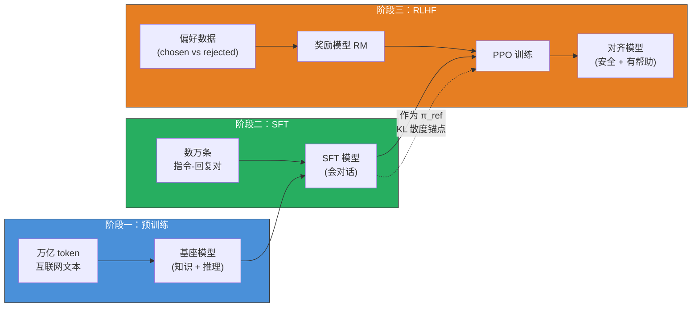
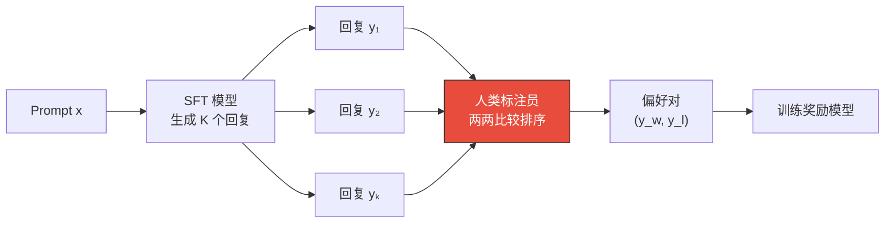
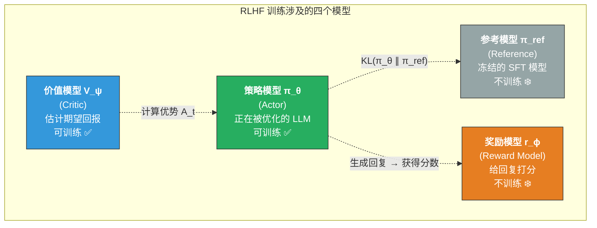
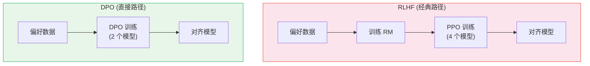
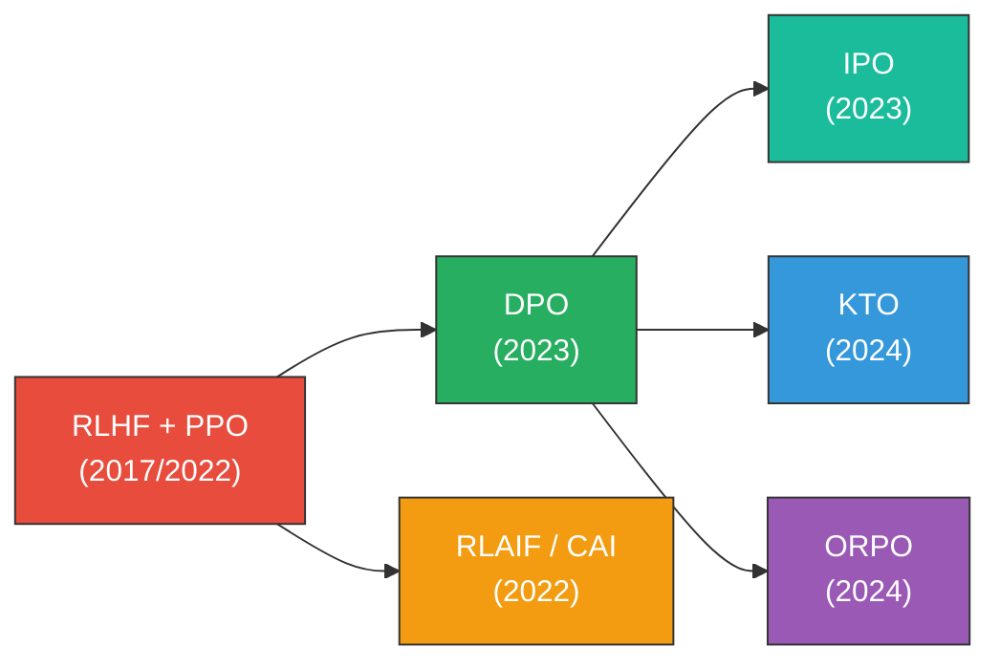

# 基于人类反馈的强化学习（RLHF）

> RLHF 是让 AI 从"能回答问题"进化到"回答得像人类期望的那样好"的关键技术——它不教模型新知识，而是教模型在多个"都对"的回答中选择人类最偏好的那个。

## 关键概念

| 概念 | 含义 |
|------|------|
| RLHF（Reinforcement Learning from Human Feedback） | 通过人类偏好数据训练奖励模型，再用强化学习优化语言模型输出，使其符合人类价值观 |
| 奖励模型（Reward Model, RM） | 一个学会"像人类一样打分"的模型，输入 (prompt, response)，输出标量奖励值 |
| PPO（Proximal Policy Optimization） | RLHF 中最常用的 RL 算法，通过裁剪机制保证策略更新幅度不会太大 |
| KL 散度惩罚 | 限制 RL 训练后的模型不能偏离 SFT 模型太远，防止"奖励黑客"行为 |
| Bradley-Terry 模型 | 将人类偏好（"A 比 B 好"）转化为概率分布的数学框架 |
| DPO（Direct Preference Optimization） | 无需训练奖励模型，直接从偏好数据优化策略的替代方案 |
| 偏好数据（Preference Data） | 形如 (prompt, chosen, rejected) 的三元组，其中 chosen 是人类更偏好的回复 |
| 对齐税（Alignment Tax） | RLHF 对齐后模型在某些基准任务上的性能轻微下降现象 |

## 详细笔记

### 直觉理解：RLHF 为什么重要？

想象你是一家餐厅的老板，刚培训了一批厨师（SFT 模型）。他们都能做出"正确"的菜——不会把糖当盐、不会忘记开火。但问题是：同一道红烧肉，有的厨师做得偏甜、有的偏咸、有的火候过了、有的摆盘随意。**这些版本从"正确性"角度看都没问题，但食客有明确的偏好。**

RLHF 的做法是：
1. **收集食客反馈**：让食客试吃两盘红烧肉，说出更喜欢哪盘（偏好数据）
2. **训练一个"美食评委"**：根据大量食客反馈，训练一个能自动打分的评委（奖励模型）
3. **让厨师根据评委分数改进**：厨师不断尝试新做法，评委打分，厨师朝高分方向调整（PPO 训练）

这就是 RLHF 解决的核心问题：**在所有"正确"的回答中，找到人类最偏好的那种风格**——更有帮助、更安全、更诚实（Helpful, Harmless, Honest，即 3H 原则）。

SFT 只能模仿训练数据中的回答方式（模仿学习），而 RLHF 能让模型学到一个**泛化的偏好函数**——即使面对全新的问题，也能生成人类偏好的回答风格。

### RLHF 在 LLM 训练流水线中的位置

注意 SFT 模型在 RLHF 中承担**双重角色**：
- **初始策略**（PPO 训练的起点）
- **参考策略 $\pi_{\text{ref}}$**（KL 散度约束的锚点，防止模型"跑偏"）

### RLHF 三阶段详解

#### 第一步：SFT（监督微调）

详见 → [SFT 学习笔记](./supervised-fine-tuning-sft.md)

SFT 得到的模型 $\pi^{\text{SFT}}$ 是后续所有工作的基础。

#### 第二步：训练奖励模型（Reward Model）

**目标**：学一个函数 $r_\phi(x, y)$，输入 prompt $x$ 和 response $y$，输出一个标量分数，使得**人类更偏好的回复获得更高的分数**。

**数据收集流程**：

InstructGPT 的做法：对同一个 prompt 生成 4-9 个回复，让标注员进行全排序，然后从中提取出 $\binom{K}{2}$ 个偏好对。这比单独收集每一对更高效。

**Bradley-Terry 偏好模型**：

将"人类觉得 $y_w$ 比 $y_l$ 好"建模为概率：

$$P(y_w \succ y_l \mid x) = \sigma(r_\phi(x, y_w) - r_\phi(x, y_l))$$

其中：
- $y_w$（winner）：人类更偏好的回复
- $y_l$（loser）：人类不偏好的回复
- $\sigma(\cdot)$：Sigmoid 函数，$\sigma(z) = \frac{1}{1+e^{-z}}$
- $r_\phi(x, y)$：奖励模型输出的标量奖励

**直觉**：如果 $r_\phi(x, y_w)$ 比 $r_\phi(x, y_l)$ 高很多，sigmoid 输出接近 1，意味着模型非常确信 $y_w$ 更好——这符合人类判断。

**奖励模型损失函数**：

$$\mathcal{L}_{\text{RM}} = -\mathbb{E}_{(x, y_w, y_l) \sim \mathcal{D}} \left[ \log \sigma(r_\phi(x, y_w) - r_\phi(x, y_l)) \right]$$

其中：
- $\mathcal{D}$：人类偏好数据集
- $\phi$：奖励模型的参数

最小化这个损失等价于最大化奖励模型正确排序偏好对的概率。

**实现细节**：
- 奖励模型通常是在 SFT 模型基础上，将最后的 LM head 替换为一个线性层（输出维度 = 1）
- InstructGPT 使用 6B 参数的奖励模型（比策略模型 175B 小很多）
- 训练时奖励值需要做归一化，防止分数漂移

#### 第三步：PPO 强化学习优化

这是 RLHF 的核心和难点。目标是找到策略 $\pi_\theta$，使其生成的回复获得高奖励，同时不偏离 SFT 模型太远。

**RLHF 总体优化目标**：

$$\max_{\pi_\theta} \mathbb{E}_{x \sim \mathcal{D},\, y \sim \pi_\theta(\cdot|x)} \left[ r_\phi(x, y) \right] - \beta \cdot \text{KL}\left(\pi_\theta \| \pi_{\text{ref}}\right)$$

其中：
- $\pi_\theta$：当前正在训练的策略（语言模型）
- $\pi_{\text{ref}}$：参考策略，通常是 SFT 模型（冻结不更新）
- $r_\phi(x, y)$：奖励模型给出的分数
- $\beta$：KL 惩罚系数，控制偏离程度（典型值 0.01 ~ 0.2）
- $\text{KL}(\pi_\theta \| \pi_{\text{ref}}) = \mathbb{E}_{y \sim \pi_\theta} \left[ \log \frac{\pi_\theta(y|x)}{\pi_{\text{ref}}(y|x)} \right]$

**为什么需要 KL 约束？** 没有 KL 约束，模型会学会"欺骗"奖励模型——生成一些得分很高但语义退化的输出（Reward Hacking）。例如无限重复某些让奖励模型给高分的短语。KL 约束确保模型保持在"合理的语言"空间内。

**PPO 裁剪目标函数**：

PPO 是一种策略梯度算法，核心创新是**裁剪机制**，防止单次更新幅度过大导致训练不稳定：

$$\mathcal{L}^{\text{CLIP}} = \mathbb{E}_t \left[ \min \left( \rho_t \cdot \hat{A}_t, \; \text{clip}(\rho_t, 1-\varepsilon, 1+\varepsilon) \cdot \hat{A}_t \right) \right]$$

其中：
- $\rho_t = \frac{\pi_\theta(a_t | s_t)}{\pi_{\theta_{\text{old}}}(a_t | s_t)}$：新旧策略的概率比（probability ratio）
- $\hat{A}_t$：优势函数估计（Advantage），衡量"这个 action 比平均好多少"
- $\varepsilon$：裁剪范围，通常 0.1 ~ 0.2
- $\text{clip}(\rho_t, 1-\varepsilon, 1+\varepsilon)$：将概率比限制在 $[1-\varepsilon, 1+\varepsilon]$ 范围内

**在 LLM 的 RLHF 场景中**，这些 RL 概念对应为：
- **State（状态）$s_t$**：已生成的 token 序列 $(x, y_{<t})$
- **Action（动作）$a_t$**：下一个生成的 token $y_t$
- **Policy（策略）$\pi_\theta$**：语言模型本身
- **Reward（奖励）**：只在最后一个 token 处给出 $r_\phi(x, y)$（稀疏奖励）

**广义优势估计（GAE, Generalized Advantage Estimation）**：

$$\hat{A}_t = \sum_{l=0}^{T-t} (\gamma \lambda)^l \delta_{t+l}$$

其中 $\delta_t = r_t + \gamma V(s_{t+1}) - V(s_t)$ 是 TD 误差（Temporal Difference error），$\gamma$ 是折扣因子，$\lambda$ 是 GAE 平滑系数。

**价值函数损失**：

$$\mathcal{L}^{V} = \mathbb{E}_t \left[ (V_\psi(s_t) - V_t^{\text{target}})^2 \right]$$

价值函数 $V_\psi(s_t)$ 估计从状态 $s_t$ 出发的期望累计奖励，用于计算优势函数。

**PPO 总损失**：

$$\mathcal{L}^{\text{PPO}} = -\mathcal{L}^{\text{CLIP}} + c_1 \cdot \mathcal{L}^{V} - c_2 \cdot H(\pi_\theta)$$

其中 $H(\pi_\theta)$ 是策略的熵，鼓励探索；$c_1, c_2$ 是系数。

#### RLHF 训练过程的四个模型

**关键观察**：RLHF-PPO 需要**同时在显存中加载 4 个模型**。对于 70B 的 LLM，这意味着约 4 × 70B = 280B 参数的显存占用——这是 RLHF 工程难度极高的根本原因。

### DPO：无需奖励模型的替代方案

**核心洞察**：Rafailov et al. (2023) 发现，RLHF 的优化目标存在**闭式解**——可以直接从偏好数据优化策略，完全绕过奖励模型训练和 RL 过程。

**数学推导关键步骤**：

RLHF 优化目标的最优解为：

$$\pi^*(y|x) = \frac{1}{Z(x)} \pi_{\text{ref}}(y|x) \exp\left(\frac{1}{\beta} r(x, y)\right)$$

对此式取对数，可以解出**隐式奖励**：

$$r(x, y) = \beta \log \frac{\pi^*(y|x)}{\pi_{\text{ref}}(y|x)} + \beta \log Z(x)$$

这意味着：最优策略已经隐式地包含了奖励信息！不需要显式训练一个奖励模型。

将隐式奖励代入 Bradley-Terry 模型，配分函数 $Z(x)$ 消除，得到 **DPO 损失函数**：

$$\mathcal{L}_{\text{DPO}}(\pi_\theta; \pi_{\text{ref}}) = -\mathbb{E}_{(x, y_w, y_l) \sim \mathcal{D}} \left[ \log \sigma \left( \beta \left( \log \frac{\pi_\theta(y_w|x)}{\pi_{\text{ref}}(y_w|x)} - \log \frac{\pi_\theta(y_l|x)}{\pi_{\text{ref}}(y_l|x)} \right) \right) \right]$$

**直觉解读**：DPO 在做什么？
- $\log \frac{\pi_\theta(y_w|x)}{\pi_{\text{ref}}(y_w|x)}$：模型相对于参考策略，给 chosen 回复**增加了多少概率**
- $\log \frac{\pi_\theta(y_l|x)}{\pi_{\text{ref}}(y_l|x)}$：模型相对于参考策略，给 rejected 回复增加了多少概率
- DPO 鼓励差值为正且尽可能大——即**提升 chosen 的概率、降低 rejected 的概率**

**RLHF (PPO) vs DPO 对比**：

| 维度 | RLHF + PPO | DPO |
|------|:----------:|:---:|
| 需要训练的模型 | 4 个（Actor, Critic, RM, Reference） | 2 个（Policy, Reference） |
| 显存需求 | 极高（4× 模型大小） | 较低（2× 模型大小） |
| 工程复杂度 | 极高（RL 调参困难） | 低（类似 SFT 训练） |
| 训练稳定性 | 不稳定（reward hacking, KL 爆炸） | 稳定（标准交叉熵优化） |
| 理论最优性 | ✅ 实时在线生成 + 奖励评估 | ⚠️ 受限于离线偏好数据质量 |
| 迭代能力 | 可在线持续改进 | 需要重新收集偏好数据 |
| 工业采用 | OpenAI (InstructGPT, GPT-4) | Meta (Llama 2/3), Anthropic (部分) |

### 其他偏好优化方法

| 方法 | 核心思路 | 优势 |
|------|----------|------|
| **RLAIF** (Constitutional AI) | 用 AI 反馈替代人类反馈，AI 根据"宪法"原则评判回复 | 无需人工标注，可扩展性强 |
| **KTO** (Kahneman-Tversky Optimization) | 不需要偏好对，只需要"好/坏"二元标签，基于前景理论的损失函数 | 数据需求更低，无需配对 |
| **IPO** (Identity Preference Optimization) | 修复 DPO 的过拟合问题，添加正则化项 | 理论更严谨，偏好对稀少时更鲁棒 |
| **ORPO** (Odds Ratio Preference Optimization) | 无需参考模型，将偏好优化融入 SFT 阶段 | 更简洁，只需 1 个模型 |

演进趋势：从 **4 个模型 → 2 个模型 → 1 个模型**，工程复杂度持续降低。

### 多模态 RLHF

RLHF 在多模态 LLM 中的核心目标是**减少视觉幻觉**（hallucination）——模型声称看到了图片中不存在的内容。

**LLaVA-RLHF (Sun et al., 2023)**：
- 首个将 RLHF 应用于多模态 LLM 的工作
- 使用 AI 反馈（GPT-4）生成偏好数据，避免昂贵的人类视觉标注
- 发现：单纯用文本 RM 会导致"语言偏见"——RM 更偏好长而流畅的回复，即使它与图片无关
- 解决方案：训练**多模态奖励模型**，同时接收图像和文本作为输入

**RLHF-V (Yu et al., 2024)**：
- 专注于细粒度视觉幻觉纠正
- 在 segment 级别（而非整个回复级别）收集偏好标注
- 标注员标记回复中每个 segment 是否存在幻觉
- 使用 DPO 变体（DDPO）在细粒度级别进行偏好优化

### 工程实践要点

**常见训练问题与解决方案**：

| 问题 | 现象 | 解决方案 |
|------|------|----------|
| Reward Hacking | 奖励分数持续上涨但回复质量下降 | 增大 $\beta$（KL 惩罚），改善 RM 质量 |
| KL 散度爆炸 | 策略快速偏离参考模型 | 降低学习率，增大 $\beta$，用自适应 KL 控制器 |
| 奖励模型过拟合 | RM 在验证集偏好准确率下降 | 增加偏好数据多样性，early stopping |
| 模式坍塌 | 模型对不同 prompt 生成极其相似的回复 | 增加熵奖励 $H(\pi_\theta)$，降低 RM 影响 |

**关键超参数**：

| 超参数 | 典型值 | 作用 |
|--------|:------:|------|
| $\beta$（KL 系数） | 0.01 ~ 0.2 | 越大越保守（接近 SFT），越小越激进（追求高奖励） |
| PPO clip $\varepsilon$ | 0.1 ~ 0.2 | 限制单次策略更新幅度 |
| 学习率 | 1e-6 ~ 5e-6 | 远低于 SFT（1e-5），防止剧烈偏移 |
| PPO epochs | 1 ~ 4 | 每批数据的 PPO 更新次数 |
| DPO $\beta$ | 0.1 ~ 0.5 | 控制偏好学习的强度 |

## 个人理解与思考

### RLHF 的本质：偏好学习而非正确性学习

RLHF 解决的不是"对错问题"而是"好坏问题"。SFT 教模型给出"正确"的回答，RLHF 教模型在多个正确回答中选择"最好"的那个。

这个区分很重要：如果模型的知识有缺陷（不知道某个事实），RLHF 无法修复——它只会让模型更"优雅"地回避或者更"自信"地犯错。知识问题要靠预训练和 SFT 的数据覆盖来解决。

### DPO 的优雅与局限

DPO 的数学推导堪称教科书级别的优雅——通过闭式解完全消除了 RL 训练环节。但它有一个根本性局限：**它是离线的**。DPO 只能从固定的偏好数据中学习，而 PPO 可以在线生成新回复并获得奖励反馈。

这意味着：
- 如果偏好数据覆盖了目标分布，DPO 效果可以与 PPO 持平甚至更好
- 如果模型需要探索数据分布之外的行为空间，PPO 的在线学习能力更强

实际趋势是：学术界偏爱 DPO（简单、可复现），工业界在关键产品上仍使用 PPO（可控性更强）。

### 与已有笔记的关联

- **SFT 学习笔记** → [notes/training/supervised-fine-tuning-sft.md](./supervised-fine-tuning-sft.md)：SFT 是 RLHF 的前置步骤，SFT 模型同时作为 PPO 的初始策略和 KL 约束的参考策略。SFT 笔记中提到的 Loss Masking、Chat Template 等概念在 RLHF 训练中同样适用
- **CLIP 论文笔记** → [papers/clip.md](../../papers/clip.md)：CLIP 的对比学习思想与 RLHF 的偏好学习有深层联系——都是在学习"相对关系"（CLIP 学图文匹配 vs RLHF 学回复偏好）而非绝对标签
- **多模态模型发展历程** → [notes/multimodal-arch/mllm-evolution.md](../multimodal-arch/mllm-evolution.md)：RLHF 对应发展历程中的"对齐与安全"阶段；LLaVA-RLHF 和 RLHF-V 代表多模态 RLHF 的前沿探索
- **论文阅读清单** → [papers/README.md](../../papers/README.md)：InstructGPT、DPO、Constitutional AI 等相关论文的阅读追踪

### 常见误区

| 误区 | 纠正 |
|------|------|
| "RLHF 能教模型新知识" | RLHF 只优化模型的输出偏好，不注入新知识。如果预训练阶段没见过某个事实，RLHF 后模型可能会更"自信"地胡说（幻觉加剧） |
| "DPO 完全替代了 RLHF" | DPO 是离线方法，受限于偏好数据的覆盖度。在需要在线探索的场景（如对话安全性的持续改进），PPO 仍有优势。工业级产品（如 GPT-4）仍使用 PPO |
| "奖励分数越高越好" | 奖励分数持续上涨可能是 Reward Hacking 的信号——模型学会了"欺骗"RM 而非真正变好。需要同时监控 KL 散度和人类评估 |
| "RLHF 的 KL 约束是可选的" | 去掉 KL 约束几乎必然导致模式坍塌或奖励黑客。$\beta$ 可以调小但不能为零 |
| "偏好数据需要绝对正确的排序" | 人类标注本身就有噪声和不一致。Bradley-Terry 模型对适量噪声有鲁棒性，但系统性偏差（如偏好更长的回复）会传递到模型中 |
| "多模态 RLHF 和文本 RLHF 完全相同" | 多模态场景需要考虑视觉幻觉和语言偏见问题。文本 RM 会忽视视觉信息，导致模型学会用流畅的文字掩盖视觉错误 |

### 面试/口述版

> RLHF 是 LLM 三阶段训练的最后一步，核心目标是让模型的输出符合人类偏好——更有帮助、更安全、更诚实。具体做法分三步：先用 SFT 得到基础助手，然后从 SFT 模型的多个输出中收集人类偏好排序训练一个奖励模型（基于 Bradley-Terry 概率模型），最后用 PPO 算法最大化奖励模型分数，同时用 KL 散度约束防止模型偏离 SFT 太远导致 reward hacking。RLHF 的工程难度在于需要同时管理四个模型（策略、参考、奖励、价值），因此 DPO 提出了一种更简洁的替代方案——通过数学推导发现最优策略隐含了奖励信息，从而将偏好优化简化为一个类似 SFT 的监督学习问题，只需两个模型。在多模态领域，RLHF 的核心价值是减少视觉幻觉，但需要训练专门的多模态奖励模型以避免纯文本 RM 的语言偏见。

## 相关链接

- [InstructGPT (Ouyang et al., 2022)](https://arxiv.org/abs/2203.02155) — 首次系统定义 SFT + RLHF 流程的奠基性工作
- [DPO (Rafailov et al., 2023)](https://arxiv.org/abs/2305.18290) — 无需 RL 的偏好优化，数学推导优雅
- [Constitutional AI (Bai et al., 2022)](https://arxiv.org/abs/2212.08073) — Anthropic 提出的 RLAIF 范式
- [PPO (Schulman et al., 2017)](https://arxiv.org/abs/1707.06347) — PPO 算法原始论文
- [LLaVA-RLHF (Sun et al., 2023)](https://arxiv.org/abs/2309.14525) — 首个多模态 RLHF 工作
- [RLHF-V (Yu et al., 2024)](https://arxiv.org/abs/2312.00849) — 细粒度视觉幻觉纠正
- [KTO (Ethayarajh & Xu, 2024)](https://arxiv.org/abs/2402.01306) — 无需偏好对的对齐方法
- [ORPO (Hong et al., 2024)](https://arxiv.org/abs/2403.07691) — 无需参考模型的对齐方法
- [Illustrating RLHF — Hugging Face Blog](https://huggingface.co/blog/rlhf) — 优秀的 RLHF 可视化教程
- [The N Implementation Details of RLHF with PPO](https://huggingface.co/blog/the_n_implementation_details_of_rlhf_with_ppo) — PPO 实现细节

## 更新日志

- 2026-02-21: 初始创建
