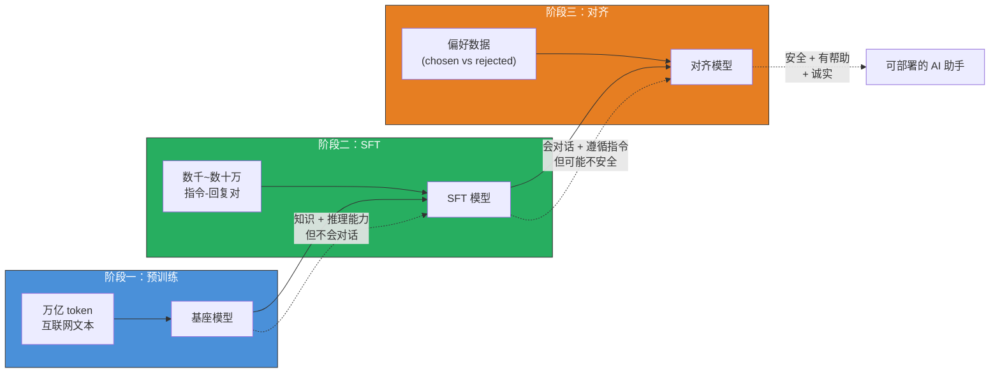
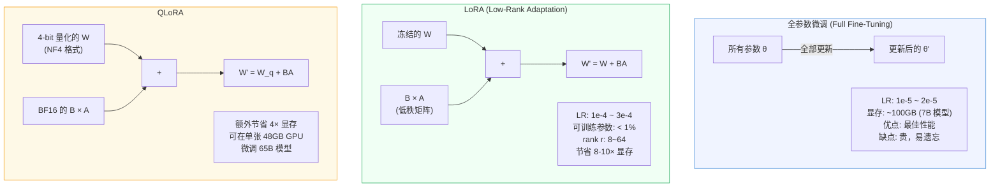
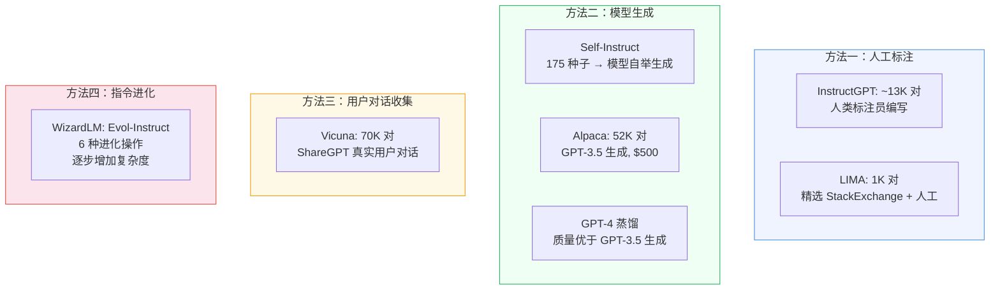
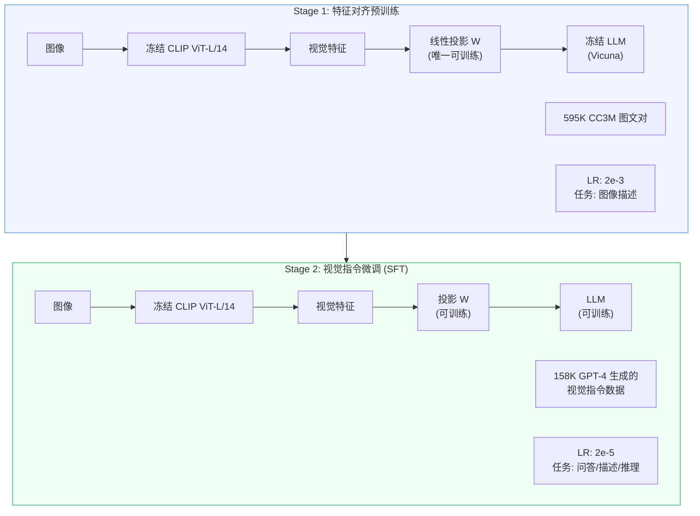

# 监督微调（Supervised Fine-Tuning, SFT）

> SFT 是连接"预训练基座模型"和"可用的 AI 助手"之间的关键桥梁——它不教模型新知识，而是教模型如何用已有知识回答人类的问题。

## 关键概念

| 概念 | 含义 |
|------|------|
| SFT（Supervised Fine-Tuning） | 在预训练模型基础上，用（指令, 回复）配对数据做有监督训练，使模型学会遵循指令 |
| 指令微调（Instruction Tuning） | SFT 的同义词，强调训练目标是让模型理解并执行自然语言指令 |
| Loss Masking | 只在 Assistant 回复的 token 上计算损失，忽略 System/User 的 token |
| Chat Template | 将结构化对话（角色 + 内容）转化为模型能理解的特殊 token 序列的格式模板 |
| LoRA（Low-Rank Adaptation） | 冻结原始权重，只训练低秩分解矩阵，减少可训练参数到 < 1% |
| 视觉指令微调（Visual Instruction Tuning） | SFT 在多模态场景的扩展——用（图像 + 指令, 回复）数据训练多模态模型 |
| Superficial Alignment Hypothesis | LIMA 论文提出的假说：SFT 只教会模型输出格式，知识能力全来自预训练 |

## 详细笔记

### 直觉理解：SFT 到底在做什么？

想象你招聘了一个知识渊博的专家（预训练模型），他读过互联网上几乎所有的文字——百科全书、论文、代码、论坛帖子。但问题是：你问他"法国的首都是什么？"，他可能不会直接回答"巴黎"，而是继续补全句子，写出"法国的首都是什么？这个问题经常出现在地理考试中……"——因为他在训练时只学过"预测下一个词"，没人教过他"回答问题"这种**交互格式**。

**SFT 就是教这个专家如何"回答问题"**。通过展示几千到几十万个"问题→回答"的范例，让专家学会：
- 用户问问题时，要**直接回答**而非继续补全
- 要以**助手的口吻**而非网页文章的风格说话
- 要**结构化**地组织回答（分点、代码块、解释等）

LIMA 论文将这一洞察总结为 **"Superficial Alignment Hypothesis"**（表面对齐假说）：

> 模型的知识和能力几乎全部来自预训练；SFT 只是教模型用哪种输出格式与人类交互。

这解释了为什么仅 **1000 条高质量数据**（LIMA）就能训练出接近 GPT-4 水平的助手——因为 SFT 需要传递的"信息量"远比预训练少得多。

### SFT 在 LLM 训练流水线中的位置



| 阶段 | 数据规模 | 核心贡献 | 局限 |
|------|:--------:|----------|------|
| 预训练 | 万亿级 token | 世界知识、语言能力、推理能力 | 不会遵循指令 |
| **SFT** | **数千~数百万对** | **指令遵循、输出格式、对话能力** | **可能产生有害内容** |
| RLHF/DPO | 数万~数十万偏好对 | 人类价值对齐、安全性、减少幻觉 | "对齐税"——能力略有下降 |

SFT 模型同时也是 RLHF 中 PPO 训练的**起点（初始策略）**和**参考策略**（用于 KL 散度约束），防止对齐后的模型偏离 SFT 模型太远。

### 核心数学：Loss 函数与 Loss Masking

#### SFT 损失函数

给定数据集 $\mathcal{D} = \{(x^{(i)}, y^{(i)})\}_{i=1}^{N}$，其中：
- $x^{(i)}$：指令/提示（包含 System 消息 + User 问题）
- $y^{(i)} = (y_1, y_2, \dots, y_T)$：目标回复，长度为 $T$ 个 token

SFT 的训练目标是**仅在回复 token 上做因果语言建模（Next-Token Prediction）**：

$$\mathcal{L}_{\text{SFT}} = -\frac{1}{|\mathcal{D}|}\sum_{i=1}^{N}\sum_{t=1}^{T_i}\log P_\theta(y_t^{(i)} \mid x^{(i)}, y_{<t}^{(i)})$$

其中：
- $P_\theta$：参数为 $\theta$ 的语言模型
- $y_{<t}$：位置 $t$ 之前的所有回复 token（自回归条件）
- $T_i$：第 $i$ 个样本的回复长度

这本质上是**条件最大似然估计**：$\theta^* = \arg\max_\theta \sum_{(x,y) \in \mathcal{D}} \log P_\theta(y \mid x)$

#### Loss Masking（关键实现细节）

**损失只在 Assistant 回复的 token 上计算，System 和 User 的 token 不参与梯度更新**。

```
Token 序列:  [SYSTEM] [系统提示词...] [USER] [用户问题...] [ASST] [助手回复...]
Labels:      [-100]   [-100 ...]     [-100] [-100 ...]   [助手] [回复 token...]
                ↑ 不计算 loss                                ↑ 只在这里计算 loss
```

在 PyTorch 中，将需要忽略的位置的 label 设为 `-100`（`nn.CrossEntropyLoss` 的默认 `ignore_index`）：

```python
# Loss Masking 的核心实现
labels = input_ids.clone()
labels[:prompt_length] = -100  # 屏蔽指令部分
loss = F.cross_entropy(logits, labels, ignore_index=-100)
```

**不做 Loss Masking 的后果**：模型会浪费大量容量去"记住"用户的问题应该长什么样，甚至在推理时混淆自己的角色，开始重复用户的提问。

### Chat Template：模型的"通信协议"

不同模型使用不同的 Chat Template 将结构化对话转为 token 序列。**使用错误的模板会导致性能严重下降**。

**ChatML 格式**（Qwen、部分 Mistral 模型使用）：
```
<|im_start|>system
你是一个有帮助的助手。<|im_end|>
<|im_start|>user
法国的首都是什么？<|im_end|>
<|im_start|>assistant
法国的首都是巴黎。<|im_end|>
```

**LLaMA-3 格式**：
```
<|begin_of_text|><|start_header_id|>system<|end_header_id|>

你是一个有帮助的助手。<|eot_id|><|start_header_id|>user<|end_header_id|>

法国的首都是什么？<|eot_id|><|start_header_id|>assistant<|end_header_id|>

法国的首都是巴黎。<|eot_id|>
```

### SFT 的训练策略

#### 全参数微调 vs. 参数高效微调



**LoRA 的数学原理**：

冻结预训练权重 $W \in \mathbb{R}^{d \times k}$，注入可训练的低秩分解：

$$W' = W + \Delta W = W + BA$$

其中：
- $B \in \mathbb{R}^{d \times r}$（初始化为零）
- $A \in \mathbb{R}^{r \times k}$（随机高斯初始化）
- $r \ll \min(d, k)$（秩，通常 8/16/32/64）

初始时 $BA = 0$，模型完全等价于原始模型。训练过程中只更新 $A$ 和 $B$。

**典型超参数对比**：

| 方法 | 学习率 | 可训练参数占比 | 7B 模型显存需求 |
|------|:------:|:-------------:|:--------------:|
| 全参数微调 | 1e-5 ~ 2e-5 | 100% | ~100GB |
| LoRA | 1e-4 ~ 3e-4 | 0.1% ~ 1% | ~16GB |
| QLoRA | 1e-4 ~ 2e-4 | 0.1% ~ 1% | ~6GB |

#### 序列打包（Packing）vs. 填充（Padding）

| 策略 | 做法 | 优点 | 注意事项 |
|------|------|------|----------|
| Padding | 所有序列填充到相同长度 | 实现简单，无跨序列污染 | GPU 算力浪费在 padding token 上 |
| Packing | 多条短序列拼接到一个上下文窗口内 | 吞吐量提升 **6-10 倍** | 需要 Flash Attention 2 防止跨序列注意力污染 |

### SFT 数据的构建方法

数据质量是 SFT 成功的关键。LIMA 论文的核心发现：**1000 条高质量数据 > 52000 条噪声数据**。



**数据质量的三大要素**（LIMA 论文的消融实验得出）：
1. **回复质量**：准确、格式良好、内容充实
2. **指令多样性**：覆盖不同任务类型、领域和提问方式——这是最重要的因素
3. **风格一致性**：统一的助手人格，不忽冷忽热

| 数据集 | 规模 | 来源 | 特点 |
|--------|:----:|------|------|
| InstructGPT SFT | ~13K | 人工标注 | 原始 RLHF 流程起点 |
| Alpaca | 52K | GPT-3.5 生成 | Self-Instruct 方法，成本 $500 |
| Vicuna | 70K | ShareGPT 真实对话 | 多轮对话，用户真实需求 |
| LIMA | 1K | 精选 StackExchange + 人工 | 少而精，证明质量 > 数量 |
| WizardLM | 70K | Evol-Instruct 进化生成 | 逐步增加复杂度 |

### 多模态 SFT：视觉指令微调

多模态 SFT 将文本 SFT 扩展到"图像 + 文本"场景。以 LLaVA 为代表，采用两阶段训练：



**LLaVA 视觉指令数据的构建**（158K 样本）：
- 图像来源：COCO 训练集
- 生成方法：将图像的 caption + bounding box 信息**以文本形式**输入纯文本 GPT-4，让 GPT-4 生成多轮问答对
- 三种类型：58K 对话式问答 + 23K 详细描述 + 77K 复杂推理

**多模态 SFT 数据格式**：

```json
{
  "image": "COCO_train2014_000000033471.jpg",
  "conversations": [
    {"from": "human", "value": "<image>\n这张图片中巴士是什么颜色的？"},
    {"from": "gpt", "value": "图片中的巴士是白色和蓝色的。"}
  ]
}
```

其中 `<image>` 标记会在运行时被视觉编码器输出的视觉 token 替换。

**不同多模态模型的 SFT 策略对比**：

| 模型 | 视觉编码器冻结？ | LLM 微调？ | SFT 数据量 |
|------|:----------------:|:----------:|:----------:|
| LLaVA | 是 | 全参数 | 158K |
| LLaVA-1.5 | 是 | 全参数 | 665K |
| Qwen-VL | 是（Stage 3） | 全参数 | 多任务混合 |
| InternVL | 是 | 全参数 | ~4M |

共同特点：**视觉编码器在 SFT 阶段始终冻结**——只训练连接器和 LLM。

### SFT 模型的评估方法

| 评估方法 | 机制 | 优点 | 局限 |
|----------|------|------|------|
| MT-Bench | 80 个多轮问题，GPT-4 打分 1-10 | 快速、覆盖 8 个类别 | GPT-4 有偏好偏差（长度、风格） |
| AlpacaEval 2.0 | 805 条指令，胜率对比参考模型 | 成本 <$10，与人类偏好相关性 0.98 | 依赖自动评委 |
| Chatbot Arena | 众包盲评，ELO 评分 | 真实用户偏好，无自动评委偏差 | 收敛慢（需数周）|

## 个人理解与思考

### SFT 的本质：格式学习而非知识注入

SFT 领域最重要的洞察来自 LIMA 论文：**SFT 本质上是在教模型"说话方式"而非"说话内容"**。

这对实际训练有深刻指导意义：
- 如果模型在某领域知识不足，**加更多 SFT 数据无法解决**——应该补充预训练阶段的领域数据
- 如果模型知识充足但输出格式不对，**少量高质量 SFT 数据即可**
- 数据多样性比数据数量更重要——覆盖更多任务类型，而非同一类型的大量重复

### 多模态 SFT 的独特挑战

与纯文本 SFT 不同，多模态 SFT 需要处理"视觉特征对齐"的额外难题。LLaVA 的两阶段设计是一个优雅的解决方案——先用低成本的对齐预训练让 LLM "认识"视觉 token，再用高质量指令数据教会它"看图说话"。

一个值得关注的趋势是 **SFT 数据规模的差异**：LLaVA 用 158K 数据就能获得不错的效果，而 InternVL 用了 4M 数据。这暗示多模态 SFT 可能比纯文本 SFT 需要更多数据——因为视觉理解的"任务空间"比纯文本更大（空间关系、计数、OCR、细粒度识别等维度都需要覆盖）。

### 与已有笔记的关联

- **CLIP 论文笔记** → [papers/clip.md](../../papers/clip.md)：CLIP 的视觉编码器（ViT-L/14）是 LLaVA 等多模态 SFT 的标准视觉骨干
- **多模态模型发展历程** → [notes/multimodal-arch/mllm-evolution.md](../multimodal-arch/mllm-evolution.md)：SFT 对应发展历程中的"第五阶段：多模态 LLM 诞生"，LLaVA 开创了视觉指令微调范式
- **实验代码** → [experiments/notebooks/multimodal_pretrain_fsdp.ipynb](../../experiments/notebooks/multimodal_pretrain_fsdp.ipynb)：Notebook 中的对比预训练对应 SFT 的前置阶段（预训练），理解对比学习后再学 SFT 更完整
- **论文阅读清单** → [papers/README.md](../../papers/README.md)：InstructGPT、Self-Instruct、LoRA、QLoRA 等相关论文的阅读追踪

### 常见误区

| 误区 | 纠正 |
|------|------|
| "SFT 数据越多越好" | LIMA 证明 1K 高质量数据可以接近 GPT-4。关键是**质量和多样性**，不是数量。在同质化数据上堆量会导致过拟合而非泛化能力提升 |
| "SFT 能教模型新知识" | SFT 主要教模型**输出格式**，知识来自预训练。如果模型不知道某个事实，SFT 无法补救——它只会让模型更"自信"地说出错误答案 |
| "Loss Masking 是可选的" | 不做 Loss Masking 是一个严重的 bug。模型会浪费容量记忆 User 的提问模式，甚至在推理时混淆角色开始"扮演"用户 |
| "Chat Template 无所谓" | 每个模型都有特定的 Chat Template，使用错误的模板会**严重降低性能**。LLaMA-2、LLaMA-3、Qwen 的模板都不同 |
| "LoRA 一定比全参数微调差" | 在高质量数据上，LoRA (rank 64) + 全 Linear 层适配的效果已经非常接近全参数微调，且节省 8-10 倍显存 |
| "多模态 SFT 需要训练视觉编码器" | 主流方案（LLaVA、Qwen-VL、InternVL）在 SFT 阶段都**冻结视觉编码器**，只训练连接器和 LLM |

### 面试/口述版

> SFT 是大语言模型三阶段训练流程（预训练 → SFT → RLHF/DPO）中的第二步，本质是教模型"如何回答问题"而非"学会新知识"。核心做法是用（指令, 回复）配对数据做 Next-Token Prediction，但只在 Assistant 回复的 token 上计算 Loss（Loss Masking），不对 User/System 的 token 计算梯度。LIMA 论文证明了 1000 条高质量数据就能训练出接近 GPT-4 的助手，因为 SFT 的本质只是"格式对齐"。在多模态领域，LLaVA 开创了视觉指令微调范式——先用图文对做对齐预训练，再用 GPT-4 生成的视觉指令数据做 SFT，整个过程冻结视觉编码器、只训练投影层和 LLM。参数高效方面，LoRA 和 QLoRA 可以将可训练参数压缩到 < 1%，使得在消费级 GPU 上微调大模型成为可能。

## 相关链接

- [InstructGPT (Ouyang et al., 2022)](https://arxiv.org/abs/2203.02155) — 首次系统定义 SFT + RLHF 流程
- [Self-Instruct (Wang et al., 2022)](https://arxiv.org/abs/2212.10560) — 模型自举生成指令数据
- [LIMA (Zhou et al., 2023)](https://arxiv.org/abs/2305.11206) — "Less Is More"，Superficial Alignment Hypothesis
- [LLaVA (Liu et al., 2023)](https://arxiv.org/abs/2304.08485) — 视觉指令微调的开创性工作
- [LoRA (Hu et al., 2021)](https://arxiv.org/abs/2106.09685) — 参数高效微调方法
- [QLoRA (Dettmers et al., 2023)](https://arxiv.org/abs/2305.14314) — 4-bit 量化 + LoRA
- [MT-Bench / Chatbot Arena (Zheng et al., 2023)](https://arxiv.org/abs/2306.05685) — SFT 模型评估方法

## 更新日志

- 2026-02-21: 初始创建
