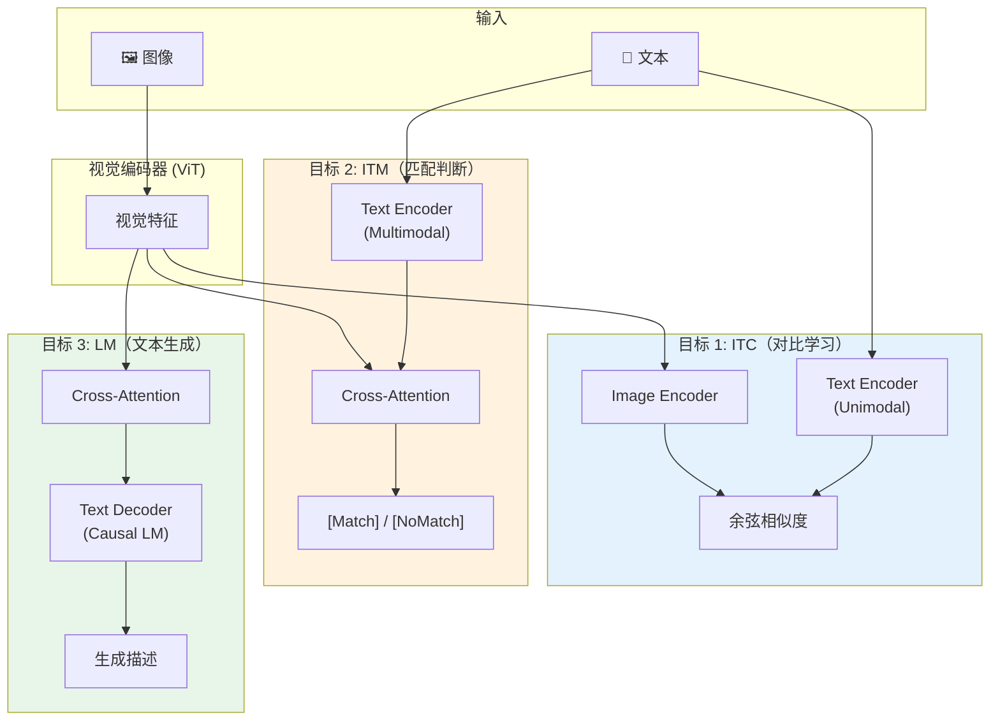
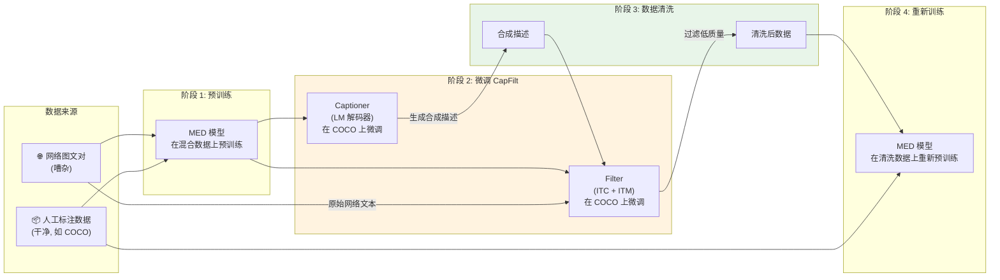
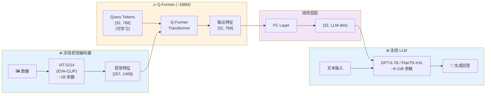
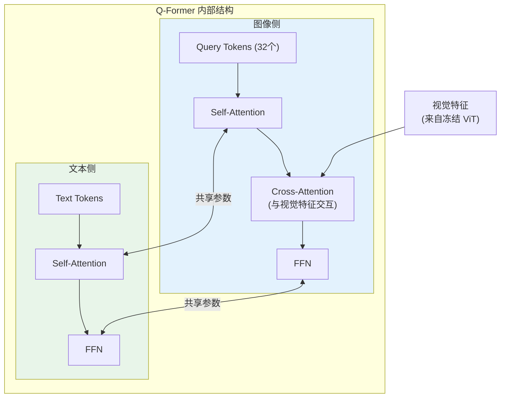
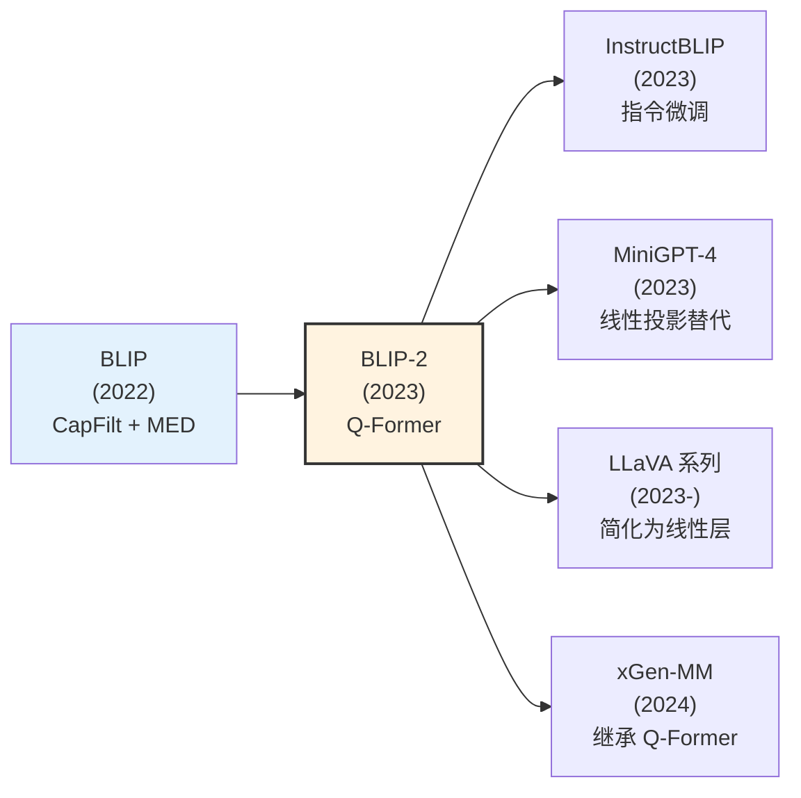

# BLIP 与 BLIP-2：从数据引导到模态桥接

> BLIP 系列解决了视觉-语言预训练的两大核心问题：**BLIP** 用 CapFilt 机制自动清洗嘈杂的网络图文数据，并统一了理解与生成任务；**BLIP-2** 进一步提出 Q-Former 作为轻量"翻译官"，以极小的可训练参数桥接冻结的视觉编码器和大语言模型，大幅降低多模态预训练成本。

## 关键概念

| 概念 | 含义 |
|------|------|
| BLIP（Bootstrapping Language-Image Pre-training） | 通过数据引导（CapFilt）和多任务统一架构实现视觉-语言预训练 |
| CapFilt（Captioner + Filter） | BLIP 的数据清洗机制：用 Captioner 生成合成描述，用 Filter 过滤噪声文本 |
| MED（Mixture of Encoder-Decoder） | BLIP 的混合编码器-解码器架构，通过参数共享统一 ITC、ITM、LM 三个目标 |
| ITC（Image-Text Contrastive） | 图文对比学习目标，对齐图像和文本的全局表征（详见 [contrastive-learning.md](../fundamentals/contrastive-learning.md)） |
| ITM（Image-Text Matching） | 图文匹配目标，细粒度判断图文是否匹配（二分类） |
| LM（Language Modeling） | 语言建模目标，基于图像生成对应描述（Image Captioning） |
| BLIP-2 | BLIP 的升级版，冻结视觉编码器和 LLM，用 Q-Former 桥接 |
| Q-Former（Querying Transformer） | BLIP-2 的核心模块，用一组可学习的 Query Token 从冻结视觉编码器中提取与语言相关的视觉特征 |
| Query Token | Q-Former 中的可学习嵌入（32 个），作为视觉信息的"压缩查询器" |
| 两阶段预训练（Two-stage Pre-training） | BLIP-2 的训练策略：第一阶段视觉-语言表征学习，第二阶段视觉-语言生成学习 |
| 冻结策略（Frozen Strategy） | 预训练好的视觉编码器和 LLM 参数不更新，只训练桥接模块 |
| Bootstrap（引导/自举） | 用模型自身的输出来改善训练数据质量的循环过程 |

## 详细笔记

### 一、为什么需要 BLIP？

#### 视觉-语言预训练的数据困境

2021 年，CLIP 证明了大规模图文对比学习的巨大潜力（详见 [contrastive-learning.md](../fundamentals/contrastive-learning.md)）。但 CLIP 和后续模型面临两个核心问题：

**问题一：网络数据极其嘈杂**

大规模图文对来自网络爬取（如 LAION、CC 数据集），其中充斥着：
- 图文不匹配（图片是猫，alt-text 是广告语）
- 描述过于简短或无信息量（"image"、"photo"）
- 重复、低质量的文本

人工清洗数以亿计的图文对完全不现实。

**问题二：理解与生成的割裂**

- CLIP 只做对比学习 → 擅长检索和分类，但**不能生成文本**
- VLP（如 OSCAR、UNITER）做生成 → 但视觉理解能力弱
- 没有一个统一的框架同时做好理解和生成

**BLIP 的直觉**：用模型自己来清洗数据（像一个自我改进的循环），同时设计一个能兼顾理解和生成的统一架构。

### 二、BLIP 的核心创新

#### 2.1 MED 架构：一个模型，三个任务

BLIP 提出了 MED（Mixture of Encoder-Decoder）架构，通过**参数共享**在一个模型中统一三个预训练目标：



三个目标的协同：

| 目标 | 作用 | 文本编码器类型 | 注意力掩码 |
|------|------|--------------|-----------|
| ITC | 学习全局图文对齐 | 单模态（Bi Self-Attention） | 双向 |
| ITM | 学习细粒度图文匹配 | 多模态（+ Cross-Attention） | 双向 |
| LM | 学习图像条件文本生成 | 解码器（+ Cross-Attention） | Causal（因果） |

**参数共享的精妙设计**：
- ITC 的 Text Encoder（单模态）和 ITM 的 Text Encoder（多模态）共享 Self-Attention 层
- ITM 的多模态编码器和 LM 的解码器共享 Cross-Attention 层和 FFN
- 唯一区别：LM 的 Self-Attention 使用因果掩码（只看左侧），ITM 使用双向掩码

这种设计让模型同时学到了全局对齐（ITC）、细粒度理解（ITM）和生成能力（LM），而参数量几乎没有增加。

#### 2.2 ITC 损失

与 CLIP 类似（详见 [contrastive-learning.md](../fundamentals/contrastive-learning.md)），BLIP 的 ITC 使用 InfoNCE 损失对齐图像和文本表征：

$$\mathcal{L}_{\text{ITC}} = -\frac{1}{2} \left( \mathbb{E}\left[\log \frac{\exp(s(I, T) / \tau)}{\sum_{T'} \exp(s(I, T') / \tau)}\right] + \mathbb{E}\left[\log \frac{\exp(s(T, I) / \tau)}{\sum_{I'} \exp(s(T, I') / \tau)}\right] \right)$$

其中 $s(I, T) = f_v(I)^\top f_t(T)$ 是图文余弦相似度，$\tau$ 是温度参数。

BLIP 引入了 **Momentum Distillation**：维护一个动量模型（EMA 更新），用动量模型的 soft pseudo-targets 替代 one-hot 标签，提供更平滑的监督信号。

#### 2.3 ITM 损失

ITM 是一个二分类任务——判断图文对是否匹配：

$$\mathcal{L}_{\text{ITM}} = -\mathbb{E}\left[y \log p_{\text{match}} + (1 - y) \log (1 - p_{\text{match}})\right]$$

其中 $y \in \{0, 1\}$ 是匹配标签。

**Hard Negative Mining**：BLIP 利用 ITC 的相似度矩阵选择**困难负样本**——选择相似度高但实际不匹配的图文对作为负样本，而非随机负样本。这大幅提升了 ITM 的辨别能力。

#### 2.4 LM 损失

LM 目标让模型学会基于图像生成文本描述（自回归方式）：

$$\mathcal{L}_{\text{LM}} = -\sum_{t=1}^{T} \log p_\theta(w_t \mid w_{<t}, I)$$

通过 Cross-Attention 注入视觉信息，解码器自回归生成每个 token。

#### 2.5 总损失

$$\mathcal{L}_{\text{BLIP}} = \mathcal{L}_{\text{ITC}} + \mathcal{L}_{\text{ITM}} + \mathcal{L}_{\text{LM}}$$

### 三、CapFilt：用数据引导清洗噪声数据

#### 3.1 核心思想

CapFilt 是 BLIP 最独特的贡献之一——利用预训练模型自身的能力来清洗训练数据：



#### 3.2 Captioner 和 Filter 的分工

| 组件 | 来源 | 功能 | 微调数据 |
|------|------|------|---------|
| Captioner | MED 的 LM 解码器 | 为网络图像生成新的合成描述 | COCO Captions |
| Filter | MED 的 ITC + ITM | 判断图文对是否匹配，过滤噪声 | COCO Captions |

**工作流程**：
1. 对每张网络图像，Captioner 生成一条合成描述
2. Filter 对**原始网络文本**和**合成描述**分别打分
3. Filter 判定为"不匹配"的文本被**丢弃**
4. 保留通过 Filter 的原始文本 + 合成描述，构成清洗后数据集

#### 3.3 为什么 CapFilt 有效

**Captioner 的价值**：即使一张图片的原始网络文本质量差，Captioner 可以用视觉内容生成一条高质量的合成描述。这相当于给每张图片"补了一条好的描述"。

**Filter 的价值**：即使 Captioner 也可能生成错误的描述（幻觉），Filter 可以识别并过滤这些错误。Filter 同时过滤了原始的噪声文本和 Captioner 的错误输出。

**互补关系**：Captioner 擅长"创造"，Filter 擅长"判断"——两者配合实现了数据质量的自动提升。

#### 3.4 引导循环（Bootstrapping）

CapFilt 可以迭代运行：
1. 用清洗后的数据重新训练模型
2. 用更好的模型再次运行 CapFilt
3. 获得更干净的数据，再次训练

每次迭代，数据质量和模型性能都会提升——这就是"bootstrapping"（引导/自举）的含义。BLIP 论文中实验显示，即使只做一轮 CapFilt，性能提升就已经非常显著。

### 四、BLIP 的下游任务表现

BLIP 在多个任务上展现了理解与生成的统一能力：

| 任务类型 | 具体任务 | 使用的目标 | 方法 |
|---------|---------|----------|------|
| 理解 | 图文检索（Image-Text Retrieval） | ITC + ITM | ITC 粗排 → ITM 精排 |
| 理解 | 视觉问答（VQA） | ITM + LM | 编码图像+问题 → 解码答案 |
| 生成 | 图像描述（Image Captioning） | LM | 输入图像 → 自回归生成描述 |
| 理解 | 视觉推理（Visual Reasoning） | ITM | NLVR2 等 |

**检索的两阶段策略**特别精妙：
1. **ITC 粗排**：用 ITC 的向量相似度快速从大规模候选中筛选 Top-K
2. **ITM 精排**：用 ITM 的 Cross-Attention 对 Top-K 做细粒度匹配重排

这种方式既保证了效率（ITC 只需向量内积），又保证了精度（ITM 做深度交互）。

### 五、从 BLIP 到 BLIP-2：为什么需要升级

#### BLIP 的局限

1. **视觉编码器需要训练**：BLIP 端到端训练 ViT，计算成本高
2. **无法利用 LLM**：BLIP 的文本解码器是从头训练的小型 Transformer，远不如 GPT/LLaMA 等预训练 LLM 强大
3. **扩展性差**：模型变大时，训练成本线性增长

#### BLIP-2 的核心思路

> **与其从头训练所有组件，不如站在巨人的肩膀上——冻结已有的顶级视觉编码器和 LLM，只训练一个轻量的"翻译官"把它们连接起来。**

这个"翻译官"就是 **Q-Former**。

### 六、BLIP-2 架构详解

#### 6.1 整体架构



**参数效率对比**：

| 组件 | 参数量 | 是否训练 |
|------|--------|---------|
| 视觉编码器（ViT-G） | ~1B | ❄️ 冻结 |
| Q-Former | ~188M | 🔥 训练 |
| 线性投影层 | ~几M | 🔥 训练 |
| LLM（OPT/FlanT5） | 6-11B | ❄️ 冻结 |
| **可训练参数占比** | | **~1.5%** |

只需训练约 188M 参数（占总参数的 ~1.5%），就能将顶级视觉编码器和 LLM 连接起来——这是 BLIP-2 最大的工程价值。

#### 6.2 Q-Former 的内部结构

Q-Former 是一个特殊的 Transformer，包含两个子模块：



**Query Tokens 的角色**：
- 32 个可学习的嵌入向量，维度 768
- 通过 Cross-Attention 从视觉特征中"查询"与语言相关的信息
- 起到信息瓶颈（Information Bottleneck）作用：将高维视觉特征（257 个 token）压缩到 32 个语义表征

**Self-Attention 的掩码策略**：

在不同的预训练目标下，Q-Former 使用不同的注意力掩码来控制 Query Token 和 Text Token 之间的交互：

| 预训练目标 | Query↔Text 交互 | 目的 |
|-----------|:---:|------|
| ITC | ❌ 禁止 | 独立编码图文，防止信息泄露 |
| ITM | ✅ 双向 | 允许深度交叉理解 |
| ITG | ➡️ 单向（Text 可看 Query） | Causal 生成，Text 可参考视觉信息 |

#### 6.3 两阶段预训练

**第一阶段：视觉-语言表征学习（Representation Learning）**

Q-Former 连接冻结的视觉编码器，学习视觉-语言对齐：

三个目标（与 BLIP 类似但作用于 Q-Former）：
1. **ITC**：Query 输出 vs Text 输出的对比学习
2. **ITM**：Query + Text 的匹配判断
3. **ITG（Image-grounded Text Generation）**：Query 提供视觉信息，生成文本

$$\mathcal{L}_{\text{stage1}} = \mathcal{L}_{\text{ITC}} + \mathcal{L}_{\text{ITM}} + \mathcal{L}_{\text{ITG}}$$

这一阶段让 Query Token 学会从视觉编码器中提取**与语言相关的视觉信息**。

**第二阶段：视觉-语言生成学习（Generative Learning）**

Q-Former 连接冻结的 LLM，学习将视觉信息"翻译"为 LLM 能理解的表征：

$$\mathcal{L}_{\text{stage2}} = -\sum_{t=1}^{T} \log p_{\text{LLM}}(w_t \mid w_{<t}, \text{Proj}(Q\text{-Former}(I)))$$

- Q-Former 的 32 个输出 token 经过线性投影后作为 LLM 的 "soft visual prompt"
- LLM 把这些视觉 token 当作前缀，基于它们生成文本
- 整个过程只更新 Q-Former 和投影层，LLM 完全冻结

### 七、BLIP vs BLIP-2 对比

| 维度 | BLIP | BLIP-2 |
|------|------|--------|
| **视觉编码器** | ViT（端到端训练） | ViT-G（冻结） |
| **文本模型** | 自训练的小型 Transformer | OPT/FlanT5 等预训练 LLM（冻结） |
| **桥接方式** | 直接 Cross-Attention | Q-Former（可学习 Query） |
| **可训练参数** | 全部（~数百M） | ~188M（Q-Former） |
| **数据清洗** | CapFilt（核心创新） | 继承 BLIP 的数据 |
| **预训练目标** | ITC + ITM + LM | 两阶段：ITC+ITM+ITG → LLM 生成 |
| **生成能力** | 有限（小型解码器） | 强大（借助 LLM） |
| **训练成本** | 高（端到端） | 低（只训练 Q-Former） |
| **零样本能力** | 中等 | 强（继承 LLM 的零样本能力） |

### 八、Q-Former 的设计直觉

#### 为什么需要 Query Token？

直接将 ViT 的所有 257 个 token 输入 LLM 有两个问题：
1. **信息冗余**：ViT 的很多 token 是低级视觉特征（边缘、纹理），与语言无关
2. **序列太长**：257 个视觉 token + 文本 token 会大幅增加 LLM 的计算成本

Query Token 起到**信息漏斗**的作用：
- 32 个 Query 通过 Cross-Attention "询问"视觉编码器
- 只提取与语言理解相关的高层语义信息
- 将 257 个视觉 token 压缩为 32 个语义 token

这类似于"让一个翻译官用 32 个关键词总结一幅画的内容"。

#### Q-Former vs 其他桥接方式

| 桥接方式 | 代表模型 | 可训练参数 | 视觉信息保留度 | 训练复杂度 |
|---------|---------|----------|--------------|----------|
| 线性投影 | LLaVA | 极少（~几M） | 高（保留所有 token） | 低 |
| Q-Former | BLIP-2 | 中（~188M） | 中（压缩到 32 token） | 中 |
| Cross-Attention 插入 | Flamingo | 中-高 | 高（每层交互） | 高 |
| Perceiver Resampler | Flamingo | 中 | 中（类似 Query） | 中 |

### 九、BLIP-2 的下游能力

#### 零样本视觉问答

```
输入图像: [一张猫在键盘上的照片]
Prompt: "Question: What is the cat doing? Answer:"

Q-Former 输出 → [32 个视觉 token] → LLM 前缀
LLM 生成: "The cat is sitting on a keyboard."
```

#### 零样本图像描述

```
输入图像: [一张日落海滩的照片]
Prompt: "a photo of"

LLM 补全: "a photo of a beautiful sunset over the ocean
with waves crashing on the sandy beach."
```

#### 视觉对话

BLIP-2 可以进行多轮视觉对话，每轮将 Q-Former 的视觉 token 作为上下文前缀，LLM 基于对话历史和视觉信息生成回复。

### 十、BLIP 系列的影响与后续发展

#### 对多模态架构的影响

BLIP-2 的 Q-Former 思路深刻影响了后续模型的设计（详见 [mllm-evolution.md](../multimodal-arch/mllm-evolution.md)）：



有趣的是，后续很多成功模型（如 LLaVA）反而**放弃了 Q-Former**，回归更简单的线性投影。这说明：
- Q-Former 的信息压缩可能丢失了重要的细粒度视觉信息
- 更简单的架构 + 更多数据和更好的训练策略，可能比复杂的桥接模块更有效
- 但 Q-Former 在**计算效率**上仍有明显优势（32 个 token vs 数百个）

#### CapFilt 的持续影响

BLIP 的数据引导思想影响深远：
- **LLaVA** 使用 GPT-4 生成高质量指令数据
- **ShareGPT4V** 用 GPT-4V 为图像生成详细描述
- **Self-instruct** 系列方法都延续了"用模型输出改善训练数据"的理念

## 个人理解与思考

### 交叉引用

1. **[contrastive-learning.md](../fundamentals/contrastive-learning.md)** — BLIP 的 ITC 目标直接基于对比学习框架，8.3 节专门讨论了 BLIP/BLIP-2 的 ITC 变体
2. **[mllm-evolution-history.md](./mllm-evolution-history.md)** — BLIP 和 BLIP-2 在多模态模型发展史中的定位，以及与 CLIP、LLaVA 等模型的关系
3. **[mllm-evolution.md](../multimodal-arch/mllm-evolution.md)** — BLIP-2 的 Q-Former 作为多模态桥接方式之一的详细架构分析
4. **[dino.md](./dino.md)** — BLIP-2 使用 EVA-CLIP 作为视觉编码器，而 EVA-CLIP 结合了 CLIP 和 DINO 的训练策略
5. **[transformer.md](../fundamentals/transformer.md)** — Q-Former 的 Cross-Attention 和 Self-Attention 机制基于 Transformer 架构
6. **[supervised-fine-tuning-sft.md](../training/supervised-fine-tuning-sft.md)** — InstructBLIP 在 BLIP-2 基础上做指令微调，与 SFT 方法论直接相关
7. **[rlhf.md](../training/rlhf.md)** — BLIP-2 的 LLM 组件（OPT/FlanT5）通常经过 RLHF 对齐

### 常见误区

| 误区 | 纠正 |
|------|------|
| "BLIP 和 BLIP-2 是同一个模型的不同版本" | BLIP 和 BLIP-2 的架构完全不同——BLIP 是端到端训练的统一模型，BLIP-2 是冻结大模型 + 轻量桥接的模块化架构 |
| "Q-Former 就是一个普通的 Transformer" | Q-Former 有独特的双子结构（Query 侧 + Text 侧共享参数），且使用不同的注意力掩码策略来适配不同的训练目标 |
| "BLIP-2 的 Query Token 类似于 ViT 的 [CLS] token" | [CLS] 是单个聚合 token，而 Query Token 是 32 个可学习向量，通过 Cross-Attention 主动"查询"视觉特征，信息容量和灵活性远超 [CLS] |
| "CapFilt 只是简单的数据过滤" | CapFilt 包含 Captioner（生成）和 Filter（过滤）两个组件，不仅过滤坏数据，还生成好数据来补充 |
| "BLIP-2 冻结所有参数" | BLIP-2 冻结视觉编码器和 LLM，但 Q-Former（~188M）和线性投影层是完全训练的 |
| "Q-Former 比线性投影严格更优" | LLaVA 证明简单的线性投影 + 高质量数据可以达到甚至超越 Q-Former 的效果，且保留更多视觉细节 |
| "BLIP-2 的两阶段训练可以合并为一阶段" | 两阶段是必要的——第一阶段学习视觉-语言对齐（无 LLM），第二阶段才接入 LLM 学习生成。跳过第一阶段会导致 Q-Former 无法从视觉编码器中提取有意义的信息 |

### 面试/口述版

BLIP 系列解决了视觉-语言预训练的两大核心问题。**BLIP**（2022）提出了 MED 统一架构，通过参数共享在一个模型中同时做对比学习（ITC）、匹配判断（ITM）和文本生成（LM），并用 CapFilt 机制自动清洗网络噪声数据——Captioner 生成合成描述、Filter 过滤低质量文本，实现了数据质量的自我提升。**BLIP-2**（2023）进一步提出了冻结策略：保持预训练好的视觉编码器（ViT-G）和大语言模型（OPT/FlanT5）参数不变，只训练一个轻量的 Q-Former（~188M 参数）作为桥接。Q-Former 用 32 个可学习的 Query Token 通过 Cross-Attention 从视觉编码器中提取语言相关的视觉特征，再经线性投影送入 LLM。两阶段预训练策略让 Q-Former 先学视觉-语言对齐，再学如何"翻译"给 LLM，最终只用约 1.5% 的可训练参数就实现了强大的多模态理解和生成能力。

## 相关链接

### 核心论文
- [BLIP: Bootstrapping Language-Image Pre-training for Unified Vision-Language Understanding and Generation (Li et al., 2022)](https://arxiv.org/abs/2201.12086) — BLIP 原始论文，ICML 2022
- [BLIP-2: Bootstrapping Language-Image Pre-training with Frozen Image Encoders and Large Language Models (Li et al., 2023)](https://arxiv.org/abs/2301.12597) — BLIP-2 原始论文，ICML 2023

### 后续工作
- [InstructBLIP: Towards General-purpose Vision-Language Models with Instruction Tuning (Dai et al., 2023)](https://arxiv.org/abs/2305.06500) — BLIP-2 + 指令微调
- [LLaVA: Visual Instruction Tuning (Liu et al., 2023)](https://arxiv.org/abs/2304.08485) — 简化 Q-Former 为线性投影
- [MiniGPT-4: Enhancing Vision-Language Understanding with Advanced LLMs (Zhu et al., 2023)](https://arxiv.org/abs/2304.10592) — 基于 BLIP-2 的架构

### 基础方法
- [CLIP (Radford et al., 2021)](https://arxiv.org/abs/2103.00020) — 大规模图文对比学习的先驱
- [Flamingo (Alayrac et al., 2022)](https://arxiv.org/abs/2204.14198) — 另一种多模态桥接方案（Cross-Attention 插入）

### 开源实现
- [Salesforce LAVIS](https://github.com/salesforce/LAVIS) — BLIP/BLIP-2 官方实现
- [HuggingFace Transformers](https://huggingface.co/docs/transformers/model_doc/blip-2) — BLIP-2 HuggingFace 集成

### 本仓库相关笔记
- [对比学习笔记](../fundamentals/contrastive-learning.md) — BLIP 的 ITC 损失详解
- [多模态模型发展历程](./mllm-evolution-history.md) — BLIP 系列在 MLLM 演化中的定位
- [多模态架构设计](../multimodal-arch/mllm-evolution.md) — Q-Former 与其他桥接方式的对比

## 更新日志

- 2026-03-21: 初始创建，覆盖 BLIP（MED + CapFilt）和 BLIP-2（Q-Former + 两阶段预训练），含架构对比和下游应用
