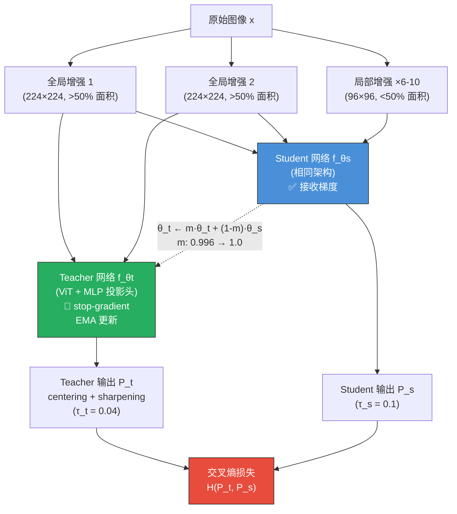
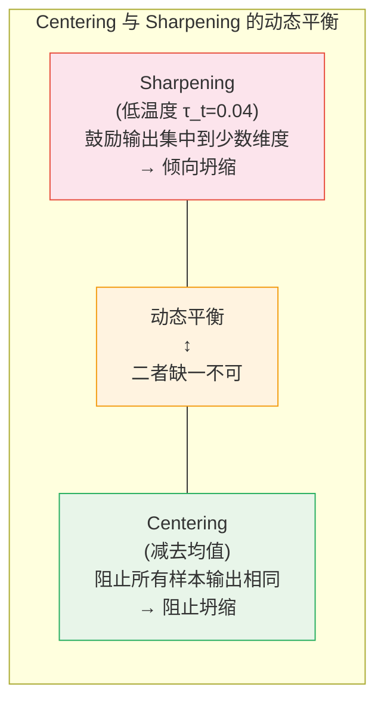
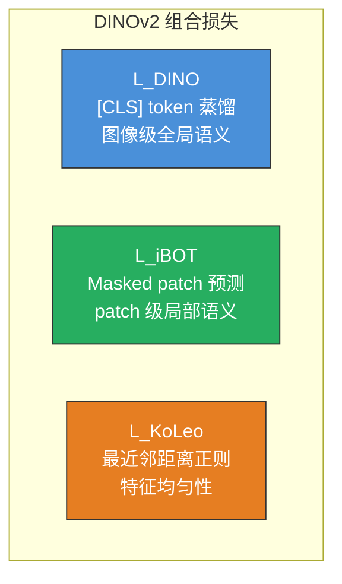
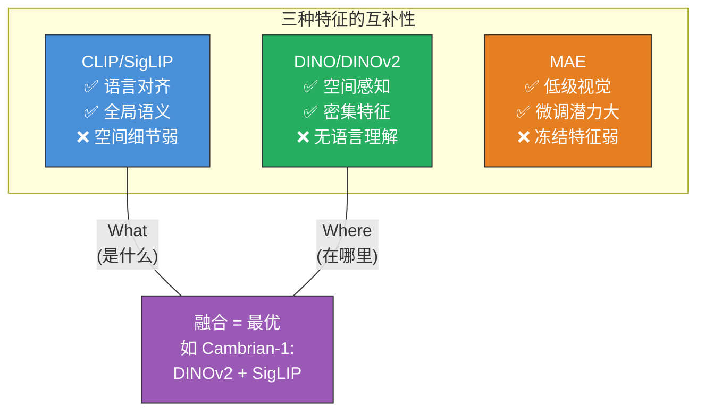

# DINO 与 DINOv2：自蒸馏视觉表征学习

> DINO 用"自己教自己"的方式让 ViT 学会了理解图像——不需要任何标签，仅通过 Student-Teacher 自蒸馏，ViT 的注意力图中就自发涌现出了语义分割能力。DINOv2 将这一思路推向极致，训练出了当前最强的通用视觉特征骨干。

## 关键概念

| 概念 | 含义 |
|------|------|
| DINO（Self-**DI**stillation with **NO** labels） | 基于 Student-Teacher 自蒸馏的自监督视觉表征学习方法，核心发现是 ViT 注意力图涌现语义分割 |
| 自蒸馏（Self-Distillation） | Student 和 Teacher 共享相同架构，Teacher 通过 Student 的指数移动平均（EMA）更新，不接收梯度 |
| Multi-Crop | 对同一图像生成全局视图（224×224）和局部视图（96×96），Teacher 只看全局，Student 看全部 |
| Centering | 对 Teacher 输出减去 running mean，防止所有样本坍缩到同一输出 |
| Sharpening | 用极低温度（$\tau_t=0.04$）使 Teacher 输出接近 one-hot，鼓励确定性预测 |
| DINOv2 | DINO 的大规模升级版，结合 DINO 蒸馏 + iBOT 掩码预测 + KoLeo 正则化，142M 数据训练 |
| iBOT（Image BERT with Online Tokenizer） | 对 Student 的 patch token 做随机 masking，预测 Teacher 对应位置的输出 |
| KoLeo 正则化 | 基于最近邻距离的熵估计器，鼓励特征在超球面上均匀分布 |
| 涌现分割（Emergent Segmentation） | ViT 的 [CLS] 自注意力图自发包含物体边界和语义分割信息，无需任何分割标注 |

## 详细笔记

### 直觉理解：DINO 在做什么？

想象你在训练一个助教（Student）和一个导师（Teacher）。导师比助教稍微好一点（因为它是助教的"平滑版本"），导师看一幅完整的画（全局视图），助教只看到画的一个小角落（局部视图）。

**训练目标**：助教仅凭小角落就要猜出导师看到完整画面后的"总结"。

这迫使助教学会**从局部推断全局**——这正是理解图像语义的核心能力。如果你只看到猫的耳朵，就应该知道这是一只猫；只看到轮子，就应该知道这是一辆车。

更神奇的是：当这个框架与 ViT 结合时，ViT 的注意力图中**自发涌现出语义分割能力**——不同的注意力头自动学会关注不同的物体和部件，完全不需要任何分割标注。这一发现震惊了视觉社区。

### 一、DINO 架构与训练

#### 整体框架

**关键不对称性**：
- Teacher **只看全局视图**（224×224，覆盖 >50% 面积）
- Student **看所有视图**（全局 + 局部 96×96 裁剪）
- 梯度**只流过 Student**，Teacher 通过 EMA 更新

#### 数学定义

**Student 输出分布**：

$$P_s^{(k)}(x) = \frac{\exp\big(g_{\theta_s}^{(k)}(x) / \tau_s\big)}{\sum_{k'=1}^{K} \exp\big(g_{\theta_s}^{(k')}(x) / \tau_s\big)}$$

**Teacher 输出分布**（含 centering）：

$$P_t^{(k)}(x) = \frac{\exp\big((g_{\theta_t}^{(k)}(x) - c^{(k)}) / \tau_t\big)}{\sum_{k'=1}^{K} \exp\big((g_{\theta_t}^{(k')}(x) - c^{(k')}) / \tau_t\big)}$$

其中：
- $g_\theta(\cdot)$：投影头输出（$K$ 维向量，DINO 中 $K=65536$）
- $\tau_s = 0.1$：Student 温度（较高 → 软分布）
- $\tau_t = 0.04$：Teacher 温度（较低 → 尖锐分布）
- $c$：centering 向量

**总损失**：对所有"Teacher 全局视图 × Student 任意视图"对（排除同一视图）计算交叉熵：

$$\mathcal{L} = \sum_{\substack{x \in \{x_1^g, x_2^g\}}} \; \sum_{\substack{x' \in \mathcal{V},\; x' \neq x}} H(P_t(x),\; P_s(x'))$$

$$H(P_t, P_s) = -\sum_{k=1}^{K} P_t^{(k)} \log P_s^{(k)}$$

#### Teacher 动量更新

$$\theta_t \leftarrow m \cdot \theta_t + (1-m) \cdot \theta_s$$

$m$ 使用 **cosine schedule** 从 0.996 逐渐增加到 1.0。训练初期 Teacher 快速跟随 Student，后期 Teacher 变化极为缓慢，提供稳定的"教学目标"。

### 二、防止模式坍缩：Centering + Sharpening

没有负样本来"推开"不同样本的表征，为什么 DINO 不会坍缩到所有输出都一样？答案在于 centering 和 sharpening 的**对抗平衡**。

#### Centering

对 Teacher 输出减去一个 running mean：

$$c \leftarrow m_c \cdot c + (1-m_c) \cdot \frac{1}{B}\sum_{i=1}^{B} g_{\theta_t}(x_i), \quad m_c = 0.9$$

**作用**：如果所有样本输出相同的向量 $v$，则 $c \to v$，减去后变为零向量，softmax 后变均匀分布——交叉熵损失不再提供有用梯度，**坍缩解不是不动点**。

Centering 的效果是**防止某一维度主导**，鼓励不同样本有不同输出。

#### Sharpening

$$\tau_t = 0.04 \ll \tau_s = 0.1$$

低温度使 Teacher 输出非常 sharp（接近 one-hot），鼓励模型做出**确定性预测**。

消融实验表明：**单独使用 centering 或 sharpening 都会坍缩，二者缺一不可**。

### 三、Multi-Crop 策略

| 视图类型 | 数量 | 分辨率 | 覆盖面积 | 输入给 |
|----------|:----:|:------:|:--------:|:------:|
| 全局视图 | 2 | 224×224 | > 50% | Teacher + Student |
| 局部视图 | 6-10 | 96×96 | < 50% | **仅 Student** |

**核心洞察——Local-to-Global Correspondence**：Student 看到一个小裁剪（可能只包含猫的耳朵），却要预测出 Teacher 看到完整图片后的输出（代表"这是一只猫"的语义）。这迫使模型学会从**局部线索推断全局语义**。

### 四、涌现的语义分割能力

DINO 最惊人的发现：**ViT 最后一层 [CLS] token 对 patch tokens 的自注意力图中，自发涌现出语义分割信息**。

- 不同 attention head 自动**专注于不同物体或部件**
- 注意力图能精确勾勒出**物体边界**
- 这种能力在有监督训练的 ViT 中**不存在**——是 DINO 自蒸馏独有的

**为什么会涌现？** 一种解释是：local-to-global 任务迫使 [CLS] token 需要"知道"每个 patch 属于哪个语义区域。因为局部裁剪可能只包含某个物体的一部分，模型需要理解空间语义结构才能做出正确预测。

**k-NN 分类器**直接在 DINO 特征上达到 **74.5% ImageNet Top-1**（ViT-S/16），无需任何微调——说明特征空间结构极其良好。

### 五、DINOv2：大规模通用视觉基础模型

DINOv2（Oquab et al., 2023）不是全新方法，而是**系统性的工程升级**——在数据、模型规模、训练目标三个维度全面提升。

#### 组合损失函数

$$\mathcal{L} = \mathcal{L}_{\text{DINO}} + \lambda \cdot \mathcal{L}_{\text{iBOT}} + \lambda_{\text{KoLeo}} \cdot \mathcal{L}_{\text{KoLeo}}$$

**$\mathcal{L}_{\text{DINO}}$**：与 DINO v1 相同，对 [CLS] token 做 Student-Teacher 交叉熵蒸馏 → 学习**全局语义**

**$\mathcal{L}_{\text{iBOT}}$**（来自 iBOT 论文）：
1. 对 Student 输入的 patch tokens 做随机 masking（~30%）
2. Student 预测被 mask 位置的 Teacher 输出（Teacher 看到完整未 mask 图像）

$$\mathcal{L}_{\text{iBOT}} = \sum_{i \in \mathcal{M}} H\big(P_t^{\text{patch}_i}(x),\; P_s^{\text{patch}_i}(\hat{x})\big)$$

→ 学习 **patch 级局部语义**，对分割、检测等密集任务至关重要

**$\mathcal{L}_{\text{KoLeo}}$**（Kozachenko-Leonenko 正则化）：

$$\mathcal{L}_{\text{KoLeo}} = -\frac{1}{n}\sum_{i=1}^{n} \log\big(d_{\min}(z_i)\big), \quad d_{\min}(z_i) = \min_{j \neq i}\|z_i - z_j\|$$

最大化 batch 内特征的最近邻距离 → 鼓励特征在超球面上**均匀分布**，防止坍缩

#### LVD-142M 数据集

核心洞察：**数据质量与算法同等重要**。用自监督特征来筛选训练数据（bootstrapping），无需人工标注。

#### 模型规模与蒸馏

| 模型 | 参数量 | Patch Size | Embed Dim | 层数 | 头数 |
|------|:------:|:----------:|:---------:|:----:|:----:|
| ViT-S/14 | 21M | 14 | 384 | 12 | 6 |
| ViT-B/14 | 86M | 14 | 768 | 12 | 12 |
| ViT-L/14 | 300M | 14 | 1024 | 24 | 16 |
| **ViT-g/14** | **1.1B** | **14** | **1536** | **40** | **24** |

训练策略：先训练最大的 ViT-g/14 → 用它作为 Teacher 蒸馏出小模型（ViT-S/B/L）。

#### 关键实验结果

**ImageNet 分类（冻结特征 + 线性探针）**：

| 方法 | 模型 | Linear Probing | k-NN |
|------|------|:--------------:|:----:|
| DINO | ViT-B/16 | 78.2% | 76.1% |
| MAE | ViT-H/14 | 76.6% | — |
| CLIP | ViT-L/14 | ~79% | — |
| **DINOv2** | **ViT-g/14** | **86.3%** | **83.5%** |
| DINOv2 (蒸馏) | ViT-L/14 | 83.5% | 81.6% |

86.3% 的线性探针准确率**接近有监督训练水平**——自监督学习的里程碑。

**密集预测任务（冻结特征 + 线性头，无微调）**：
- 语义分割 ADE20K：49.0 mIoU
- 深度估计 NYUd：优于多个有监督基线
- 实例检索 Oxford/Paris：SOTA

### 六、DINO vs CLIP vs MAE：三大范式对比

| 维度 | DINO/DINOv2 | CLIP/SigLIP | MAE |
|------|:-----------:|:-----------:|:---:|
| 监督信号 | 自蒸馏（纯视觉） | 图文对比（弱监督） | 像素重建（自监督） |
| 训练数据 | 纯图像（无标注） | 图文对（需要文本） | 纯图像（无标注） |
| 全局语义 | 强 | **最强（文本对齐）** | 弱 |
| 密集/空间特征 | **最强** | 弱 | 微调后强 |
| Zero-shot 分类 | ❌ 不支持 | ✅ 原生支持 | ❌ 不支持 |
| Linear Probing | **86.3%** | ~79% | 76.6% |
| 冻结特征可用性 | **极强** | 强 | 弱（需微调） |
| 语义分割 | **自发涌现** | 弱 | 无 |
| 语言理解 | ❌ | ✅ | ❌ |

**核心互补关系**：

### 七、DINO/DINOv2 在多模态 LLM 中的角色

#### 为什么多模态 LLM 需要 DINOv2？

CLIP/SigLIP 作为视觉编码器的局限：
- 受文本描述偏置——只关注"可用语言描述"的视觉概念
- 空间/密集特征弱——难以精确理解物体的位置、大小、空间关系
- 对纹理、材质、几何结构的感知不足

DINOv2 的互补价值：
- **空间理解**：patch 特征保留精确空间信息
- **无语言偏置**：能捕获难以用语言描述的视觉特征
- **细粒度感知**：对纹理、材质、几何结构理解更强

#### Cambrian-1：多编码器融合的典范

Cambrian-1（Tong et al., 2024）系统性地评估了不同视觉编码器对多模态 LLM 的影响：

| 编码器组合 | 平均性能 | 特点 |
|:----------:|:--------:|------|
| SigLIP 单独 | 基线 | 语言对齐好，空间感知一般 |
| DINOv2 单独 | 低于 SigLIP | 空间感知强，但无语言对齐 |
| **DINOv2 + SigLIP** | **最优** | **互补融合，全面最强** |

Cambrian-1 使用 **Spatial Vision Aggregator (SVA)** 通过 cross-attention 从多个编码器聚合信息。

#### 主流模型的视觉编码器选择

| 多模态 LLM | 视觉编码器 | 用法 |
|:----------:|:----------:|------|
| LLaVA / LLaVA-1.5 | CLIP ViT-L/14 | 单编码器 |
| InternVL | InternViT-6B | SigLIP + DINO 混合训练 |
| **Cambrian-1** | **DINOv2 + SigLIP** | **SVA 双编码器融合** |
| PaliGemma | SigLIP-So400m | 单编码器 |
| Depth Anything | DINOv2 (frozen) | 深度估计骨干 |

### 八、实现细节

**DINO 关键超参数**：

| 超参数 | 值 | 说明 |
|--------|:--:|------|
| $\tau_s$（Student 温度） | 0.1 | 固定 |
| $\tau_t$（Teacher 温度） | 0.04 → 0.07 | warmup |
| $m$（EMA 动量） | 0.996 → 1.0 | cosine schedule |
| $m_c$（center 动量） | 0.9 | 固定 |
| 投影头输出维度 $K$ | 65536 | 高维有利 |
| 投影头结构 | 3 层 MLP | hidden 2048, bottleneck 256 |
| Batch size | 1024 | |
| 优化器 | AdamW | lr = 0.0005 × batch/256 |
| 训练 epochs | 100-300 | |

**DINOv2 关键差异**：

| 维度 | DINO | DINOv2 |
|------|------|--------|
| 损失函数 | 仅 CLS 蒸馏 | CLS 蒸馏 + iBOT + KoLeo |
| 数据 | ImageNet-1K (1.3M) | LVD-142M (142M) |
| 最大模型 | ViT-B/8 (86M) | ViT-g/14 (1.1B) |
| Patch size | 16 或 8 | 14 |
| 密集特征 | 通过注意力图间接获取 | iBOT 直接学习 |
| 训练基础设施 | 16 V100 GPU | ~50 A100 GPU + FSDP + Flash Attention |

## 个人理解与思考

### DINO 的核心洞见：对称性破缺产生结构

DINO 的设计充满了优雅的不对称性：
- Teacher vs Student 的**温度不对称**（0.04 vs 0.1）
- 全局 vs 局部的**视图不对称**（Teacher 只看全局）
- 梯度的**方向不对称**（只流过 Student）

正是这些不对称性创造了学习的"压力"——Student 必须从有限信息中推断出 Teacher 从完整信息中得到的结论。没有这些不对称性，系统要么坍缩（两端学到同样的平凡解），要么无法收敛。

### DINOv2 + CLIP 融合是当前最佳实践

Cambrian-1 的实验清晰地表明：单一视觉编码器无法同时满足"语言理解"和"空间感知"两个需求。DINOv2 + SigLIP 的融合方案目前是多模态 LLM 视觉编码的最佳实践——SigLIP 负责"这是什么"（语义分类），DINOv2 负责"在哪里/什么结构"（空间理解）。

### 涌现性质的深层含义

DINO 中语义分割的涌现是深度学习中"涌现能力"的典型案例。模型从未被要求做分割，但分割能力作为完成自蒸馏任务的"副产品"自发出现了。这暗示着：**好的自监督目标可能隐含地教会模型远超预期的能力**。类似地，LLM 的 Next-Token Prediction 目标也涌现出了推理、代码生成等能力。

### 与已有笔记的关联

- **对比学习详解** → [notes/fundamentals/contrastive-learning.md](../fundamentals/contrastive-learning.md)：DINO 在对比学习笔记中已作为"无负样本"方法介绍。本篇是更深入的独立展开，DINO 与 BYOL 同属"非对比式自蒸馏"范式
- **CLIP 论文笔记** → [papers/clip.md](../../papers/clip.md)：CLIP 与 DINO 是互补的两种视觉编码器——CLIP 有语言对齐但空间感知弱，DINO 有强空间感知但无语言理解
- **Transformer 架构详解** → [notes/fundamentals/transformer.md](../fundamentals/transformer.md)：DINO 的 backbone 是 ViT（Vision Transformer），涌现分割利用了 Transformer 自注意力机制的可解释性
- **多模态模型发展历程** → [notes/multimodal-arch/mllm-evolution.md](../multimodal-arch/mllm-evolution.md)：DINOv2 对应发展历程中第六阶段"规模化"的视觉骨干升级
- **SFT 学习笔记** → [notes/training/supervised-fine-tuning-sft.md](../training/supervised-fine-tuning-sft.md)：多模态 SFT 中冻结的视觉编码器可以是 CLIP 或 DINOv2 或二者融合
- **大模型优化技术** → [notes/training/llm-optimization-techniques.md](../training/llm-optimization-techniques.md)：DINOv2 训练使用了 FSDP、Flash Attention、混合精度等本笔记中讨论的优化技术

### 常见误区

| 误区 | 纠正 |
|------|------|
| "DINO 是对比学习" | DINO **不使用负样本和对比损失**。它是自蒸馏方法，用交叉熵匹配 Teacher-Student 的输出分布，与 SimCLR/MoCo 的对比范式本质不同 |
| "DINOv2 只是 DINO 的更大版本" | DINOv2 新增了 iBOT 掩码预测（学习 patch 级特征）、KoLeo 正则化、LVD-142M 数据策展——这些是质的变化，不仅是量的扩大 |
| "CLIP 特征在所有任务上都优于 DINO" | 在密集预测任务（分割、深度估计）和空间推理上，DINOv2 **显著优于** CLIP。两者各有所长，最佳方案是融合 |
| "涌现分割需要大模型" | DINO ViT-S/16（仅 21M 参数）就已展现出涌现分割能力。这是方法层面的特性，不是规模的产物 |
| "Centering 和 Sharpening 作用相同" | 它们作用**相反**：Sharpening 鼓励输出集中（倾向坍缩），Centering 阻止所有样本输出相同（阻止坍缩）。二者是动态平衡关系 |
| "DINOv2 可以做 zero-shot 分类" | DINOv2 是纯视觉自监督模型，**没有语言对齐**，不支持 zero-shot 分类。需要 CLIP/SigLIP 才能做 zero-shot |
| "自监督方法不如有监督方法" | DINOv2 ViT-g/14 的 linear probing 达到 86.3%，已接近有监督训练的最好结果 |

### 面试/口述版

> DINO 是一种基于 Student-Teacher 自蒸馏的自监督视觉表征学习方法，核心设计是 Teacher 只看图像的全局裁剪而 Student 看所有裁剪（包括局部小区域），通过交叉熵损失让 Student 从局部推断全局语义。Teacher 通过 Student 参数的 EMA 更新（动量 0.996→1.0），不接收梯度；坍缩通过 centering（减均值阻止所有样本输出相同）和 sharpening（低温度 τ=0.04 鼓励确定性预测）的对抗平衡来避免。最令人惊叹的发现是，当与 ViT 结合时，自注意力图中自发涌现出语义分割能力——无需任何分割标注。DINOv2 在此基础上加入 iBOT 掩码 patch 预测（学习局部 patch 级特征）、KoLeo 正则化（鼓励特征均匀分布），并在精心策展的 142M 图像上训练出 ViT-g/14（1.1B 参数），冻结特征 linear probing 达到 86.3%、密集预测也达到 SOTA。在多模态 LLM 中，DINOv2 与 CLIP/SigLIP 高度互补——后者提供语言对齐和全局语义，DINOv2 提供精细空间感知和密集特征——Cambrian-1 证明两者融合是当前最优方案。

## 相关链接

- [DINO (Caron et al., 2021)](https://arxiv.org/abs/2104.14294) — 自蒸馏 ViT，涌现语义分割
- [DINOv2 (Oquab et al., 2023)](https://arxiv.org/abs/2304.07193) — 通用视觉基础模型
- [iBOT (Zhou et al., 2022)](https://arxiv.org/abs/2111.07832) — 在线 Tokenizer 的掩码图像建模
- [BYOL (Grill et al., 2020)](https://arxiv.org/abs/2006.07733) — 无负样本的自监督学习先驱
- [SwAV (Caron et al., 2020)](https://arxiv.org/abs/2006.09882) — Multi-crop 策略的来源
- [MAE (He et al., 2022)](https://arxiv.org/abs/2111.06377) — 掩码自编码器
- [Cambrian-1 (Tong et al., 2024)](https://arxiv.org/abs/2406.16860) — DINOv2 + SigLIP 融合的多模态 LLM
- [Depth Anything (Yang et al., 2024)](https://arxiv.org/abs/2401.10891) — DINOv2 用于深度估计
- [DINOv2 官方代码](https://github.com/facebookresearch/dinov2) — Meta 开源实现

## 更新日志

- 2026-02-21: 初始创建
