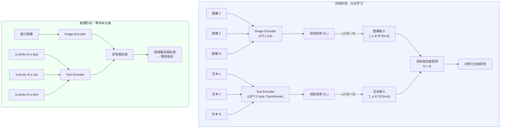

# Learning Transferable Visual Models From Natural Language Supervision (CLIP)

- **作者**: Alec Radford, Jong Wook Kim, Chris Hallacy, Aditya Ramesh, Gabriel Goh, Sandhini Agarwal, Girish Sastry, Amanda Askell, Pamela Mishkin, Jack Clark, Gretchen Krueger, Ilya Sutskever
- **机构**: OpenAI
- **发表**: ICML, 2021
- **链接**: [arXiv](https://arxiv.org/abs/2103.00020) | [Code](https://github.com/openai/CLIP)

## TL;DR

CLIP（Contrastive Language-Image Pre-training）通过在 4 亿个从互联网收集的图文对上进行对比学习，训练出一个能同时理解图像和文本的双塔模型。训练完成后，只需用自然语言描述类别（如 "a photo of a dog"），就能实现零样本（Zero-Shot）图像分类，在 ImageNet 上达到 76.2% 的 Top-1 准确率——与全监督训练的 ResNet-50 性能相当，且无需使用任何 ImageNet 标注数据。

## 动机与问题

### 背景：视觉模型的瓶颈

在 CLIP 之前，主流的计算机视觉模型依赖于**固定类别集合**的有监督训练（如在 ImageNet 的 1000 个类别上训练）。这种范式存在三个根本问题：

1. **标注成本高**：每个新任务都需要大量人工标注的数据集
2. **泛化能力差**：模型只能识别训练集中见过的类别，无法灵活推广
3. **分布偏移脆弱**：当测试数据的分布与训练数据略有不同时，性能急剧下降

### NLP 的启示

与此同时，NLP 领域已经通过大规模文本预训练（GPT、BERT）实现了强大的零样本迁移能力。关键洞察是：**自然语言本身就是一种灵活的监督信号**——它不像类别标签那样是封闭集合，而是能描述任意概念的开放词汇表。

### CLIP 的核心问题

> 能否利用互联网上大量天然存在的图文配对数据，通过自然语言监督来训练视觉模型，从而实现真正的零样本视觉识别？

之前也有工作探索过类似方向（如 VirTex、ICMLM、ConVIRT），但都受限于数据规模（百万级）和模型容量，未能在标准基准上展现出有竞争力的零样本迁移能力。CLIP 的关键贡献在于将这一思路**扩展到 4 亿数据对**的规模，并证明了对比学习在这个规模下的高效性。

## 方法

### 直觉理解

想象你在浏览一个有 4 亿张图片的相册，每张图片旁边都有一段文字说明。CLIP 的训练目标很简单：让模型学会"配对"——给定一批图片和一批文字说明，模型要能正确找出哪段文字描述的是哪张图片。这就像一个大规模的"连连看"游戏。一旦模型学会了图像和文本之间的对应关系，我们就可以用文字描述来"告诉"模型要识别什么，实现零样本分类。

### 整体架构



### 技术方案详解

#### 1. 数据集：WebImageText（WIT）

CLIP 构建了一个名为 WIT 的大规模数据集：

- **规模**：4 亿个（图像, 文本）对
- **构建方法**：
  1. 从英文 Wikipedia 高频词汇和 WordNet 同义词集中提取约 50 万个查询词
  2. 用这些查询词在互联网上搜索并收集图文对
  3. 每个查询词保留最多 2 万对，保证概念分布的均衡性
- **规模参考**：WIT 的文本总词数与训练 GPT-2 的 WebText 语料库相当

#### 2. 双塔编码器

**Image Encoder**（两种选择）：
- **ResNet 系列**：ResNet-50/101 及其放大版本（RN50x4、RN50x16、RN50x64），使用 Attention Pooling 替代全局平均池化
- **ViT 系列**：ViT-B/32、ViT-B/16、ViT-L/14（最佳），标准 Vision Transformer 架构

**Text Encoder**：
- 架构：GPT-2 风格的 Transformer（因果自注意力掩码）
- 规模：12 层，512 维隐藏层，8 个注意力头，共 6300 万参数
- 词表：49,152 个 BPE token，最大序列长度 76
- 取最后一个 token（[EOS] 位置）的隐藏状态作为文本表征

#### 3. 对比学习目标

给定一个包含 $N$ 个图文对的 mini-batch，CLIP 的训练目标是最大化 $N$ 个正确配对的相似度，同时最小化 $N^2 - N$ 个错误配对的相似度。

**核心公式**：

首先计算图像和文本的嵌入向量：

$$I_e = \text{L2Norm}(f_\theta(x) \cdot W_i), \quad T_e = \text{L2Norm}(g_\phi(t) \cdot W_t)$$

其中：
- $f_\theta(x)$：Image Encoder 对图像 $x$ 的输出特征（维度 $d_i$）
- $g_\phi(t)$：Text Encoder 对文本 $t$ 的输出特征（维度 $d_t$）
- $W_i \in \mathbb{R}^{d_i \times d_e}$：图像投影矩阵，将图像特征映射到共享嵌入空间
- $W_t \in \mathbb{R}^{d_t \times d_e}$：文本投影矩阵，将文本特征映射到共享嵌入空间
- $d_e$：共享嵌入空间维度（ViT-B 为 512，ViT-L 为 768）

然后计算缩放后的余弦相似度矩阵：

$$s_{ij} = I_{e_i}^\top \cdot T_{e_j} \cdot \exp(\tau)$$

其中 $\tau$ 是一个**可学习的温度参数**（标量），初始化为 $\ln(1/0.07) \approx 2.66$，训练时裁剪上界使 $\exp(\tau) \leq 100$。温度越高，相似度分布越尖锐，模型对正负样本的区分越严格。

对称 InfoNCE 损失：

$$\mathcal{L}_{i \to t} = -\frac{1}{N} \sum_{i=1}^{N} \log \frac{\exp(s_{ii})}{\sum_{j=1}^{N} \exp(s_{ij})}$$

$$\mathcal{L}_{t \to i} = -\frac{1}{N} \sum_{i=1}^{N} \log \frac{\exp(s_{ii})}{\sum_{j=1}^{N} \exp(s_{ji})}$$

$$\mathcal{L} = \frac{1}{2}(\mathcal{L}_{i \to t} + \mathcal{L}_{t \to i})$$

其中：
- $\mathcal{L}_{i \to t}$：图像到文本方向的损失——对每张图像，在 $N$ 个文本中找到正确配对
- $\mathcal{L}_{t \to i}$：文本到图像方向的损失——对每段文本，在 $N$ 个图像中找到正确配对
- $s_{ii}$：第 $i$ 个图文正确配对的相似度（对角线元素）
- $s_{ij}$（$i \neq j$）：错误配对的相似度（非对角线元素，充当负样本）

**论文原文的伪代码**（NumPy 风格）：

```python
# image_encoder - ResNet or Vision Transformer
# text_encoder  - CBOW or Text Transformer
# I[n, h, w, c] - minibatch of aligned images
# T[n, l]       - minibatch of aligned texts
# W_i[d_i, d_e] - learned proj of image to embed
# W_t[d_t, d_e] - learned proj of text to embed
# t             - learned temperature parameter

# 提取各模态的特征表征
I_f = image_encoder(I)  # [n, d_i]
T_f = text_encoder(T)   # [n, d_t]

# 投影到共享嵌入空间并归一化
I_e = l2_normalize(np.dot(I_f, W_i), axis=1)  # [n, d_e]
T_e = l2_normalize(np.dot(T_f, W_t), axis=1)  # [n, d_e]

# 计算缩放后的余弦相似度矩阵
logits = np.dot(I_e, T_e.T) * np.exp(t)  # [n, n]

# 对称交叉熵损失
labels = np.arange(n)  # 正确配对在对角线上
loss_i = cross_entropy_loss(logits, labels, axis=0)
loss_t = cross_entropy_loss(logits, labels, axis=1)
loss = (loss_i + loss_t) / 2
```

#### 4. 零样本推理

训练完成后，CLIP 通过以下步骤实现零样本分类：

1. 将每个类别名称嵌入 **Prompt 模板**，如 `"A photo of a {class_name}."`
2. 用 Text Encoder 编码所有类别的文本描述，得到类别嵌入
3. 用 Image Encoder 编码输入图像
4. 计算图像嵌入与所有类别嵌入的余弦相似度
5. 选择相似度最高的类别作为预测结果

**Prompt Engineering 技巧**：
- 使用 `"A photo of a {label}."` 比单独使用类别名提升约 **1.3 个百分点**
- 使用 **80 种不同的 Prompt 模板**进行 Ensemble（如 "a bad photo of a {label}"、"a photo of many {label}" 等），对文本嵌入取平均，可再提升约 **3.5 个百分点**
- Prompt Ensemble 的文本嵌入可以离线预计算，**不增加推理成本**

#### 5. 训练细节

| 超参数 | 值 |
|--------|------|
| Batch Size | 32,768 |
| 训练轮数 | 32 epochs |
| 优化器 | AdamW（解耦权重衰减） |
| 学习率策略 | Cosine Schedule + Linear Warmup |
| 精度 | 混合精度（FP16） |
| 训练硬件 | ViT-L/14: 256 张 V100 训练 12 天 |

## 关键图表

论文中最重要的图表总结：

- **Figure 1**（训练流程图）：展示对比预训练和零样本推理的完整流程，是理解 CLIP 的最核心图示
- **Figure 2**（效率对比）：Predictive vs. Contrastive 目标的零样本学习效率对比——对比目标的训练效率是预测目标的 **4 倍以上**
- **Figure 5**（零样本 vs. 线性探针）：在 27 个数据集上，零样本 CLIP 在 16 个数据集上超过了全监督 ResNet-50 的线性探针
- **Figure 13**（鲁棒性）：CLIP 在 ImageNet 分布偏移上的鲁棒性，弥合了约 **75%** 的鲁棒性差距

## 实验结果

### 核心结果：零样本 ImageNet 性能

| 模型 | 零样本 Top-1 准确率 |
|------|:-------------------:|
| ViT-B/32 | 63.3% |
| ViT-B/16 | 68.3% |
| ViT-L/14 | 75.5% |
| ViT-L/14@336px | **76.2%** |
| 全监督 ResNet-50（参考） | 76.1% |

ViT-L/14@336px 的零样本性能与在 128 万张 ImageNet 标注图像上训练的 ResNet-50 相当——而 CLIP 没有使用任何 ImageNet 标注数据。

### 消融实验分析

#### 消融一：训练目标的选择——对比 vs. 预测

这是论文最关键的消融之一，比较了三种不同的训练目标在零样本 ImageNet 上的效率：

| 训练目标 | 相对效率 | 直觉解释 |
|----------|:--------:|----------|
| Transformer 语言模型（逐词预测） | 1× (基线) | 要预测完整句子，任务过难 |
| 词袋预测（Bag of Words） | ~3× | 只需预测出现了哪些词，降低难度 |
| **对比学习（CLIP 最终方案）** | **~12×** | 只需区分正确配对，进一步简化 |

**关键洞察**：对比目标不需要模型生成精确的文字描述，只需要区分"这段文字和这张图片是否匹配"。这大幅降低了任务难度，使模型能将更多容量用于学习视觉语义对齐，而非语言生成。在同等算力下，对比方法在 4 亿数据上达到约 41% 的零样本准确率，而 Transformer 语言模型仅约 16%。

#### 消融二：Image Encoder 架构——ResNet vs. ViT

| 模型 | 计算量 | 零样本 Top-1 |
|------|:------:|:------------:|
| RN50 | 1× | ~40% |
| RN101 | ~1.5× | ~43% |
| RN50x4 | ~4× | ~51% |
| RN50x16 | ~16× | ~60% |
| RN50x64 | ~64× | ~69% |
| ViT-B/32 | ~4× | 63.3% |
| ViT-B/16 | ~16× | 68.3% |
| ViT-L/14 | ~36× | **75.5%** |

**关键洞察**：在相同计算量下，ViT 比 ResNet 的计算效率高出约 **3 倍**。例如 ViT-B/32 在约 4 倍基线算力时达到 63.3%，而 ResNet 需要 RN50x16（16 倍算力）才达到约 60%。这验证了 Vision Transformer 在大规模训练场景下的架构优势。

#### 消融三：Prompt Engineering 与 Ensemble

| Prompt 策略 | ImageNet Top-1 | 增益 |
|-------------|:--------------:|:----:|
| 仅类别名称 | ~71.4% | 基线 |
| + "A photo of a {label}." | ~72.7% | +1.3% |
| + 80 种模板 Ensemble | **~76.2%** | +4.8% |

**关键洞察**：直接使用类别名（如 "crane"）存在多义性问题——它可以指起重机或丹顶鹤。Prompt 模板提供了上下文消歧能力，Ensemble 进一步增强了鲁棒性。这一发现直接启发了后续 Prompt Learning 方向的研究（如 CoOp、CoCoOp）。

### 分布偏移鲁棒性

在 5 个 ImageNet 分布偏移测试集上（ImageNet-V2、ImageNet-R、ImageNet-A、ImageNet-Sketch、ObjectNet），CLIP 的零样本性能远优于传统有监督模型。标准 ResNet-101 在分布偏移下有显著的准确率下降，而 CLIP 弥合了约 **75%** 的鲁棒性差距。

这说明基于自然语言监督学到的表征更加泛化，不会过拟合于特定数据集的偏差。

### 零样本表现的"优势区"与"劣势区"

**优势数据集**（零样本准确率 > 90%）：
- STL-10: 99.3%（刷新当时 SOTA）
- Food101、OxfordPets、CIFAR-10、Caltech101

**劣势数据集**（零样本表现不佳）：
- EuroSAT（卫星图像）、DTD（纹理）、UCF101（动作识别）、MNIST
- 细粒度分类（汽车型号区分等）
- 涉及计数、空间关系等抽象推理的任务

这些劣势反映了 CLIP 训练数据中这些领域的覆盖不足，以及对比学习范式在抽象推理能力上的局限。

## 个人评价

### 优点

1. **范式转变**：CLIP 从根本上改变了视觉模型的训练方式——从"为每个任务收集标注数据"转向"用自然语言定义任务"。这是一个真正的 paradigm shift，为后来的多模态大模型（LLaVA、Qwen-VL 等）奠定了基础
2. **优雅的简洁性**：整个方法极其简洁——双塔编码器 + 线性投影 + 对比损失，没有复杂的模块设计。论文的伪代码仅十余行，却实现了惊人的效果。这种"大道至简"的设计哲学值得学习
3. **数据规模的说服力**：从 YFCC-15M 的 11.5% 零样本准确率到 WIT-400M 的 76.2%，CLIP 用实验证明了 Scaling Law 在多模态领域同样成立
4. **开创性的 Zero-Shot 范式**：通过 Prompt 模板将分类问题转化为图文匹配问题，这一思路直接影响了后续 MLLM 的设计，也启发了 Prompt Engineering 这个研究方向

### 局限

1. **数据集未公开**：WIT 数据集未开源，限制了学术界的复现和进一步研究（后来由 LAION 社区通过 LAION-400M/5B 部分弥补）
2. **细粒度与抽象推理能力不足**：在需要精细视觉理解（纹理、卫星图像）和抽象推理（计数、空间关系）的任务上表现较差
3. **计算成本极高**：最佳模型需要 256 张 V100 训练 12 天（等效数千 GPU 小时），对大多数研究组来说难以负担
4. **语言偏差**：仅使用英文数据训练，存在文化和语言偏差。论文中也承认模型可能会继承互联网数据中的社会偏见
5. **仅支持图像级理解**：CLIP 输出的是全局图像表征，不能做区域级别的定位（如目标检测、分割），限制了在密集预测任务上的应用

### 启发

1. **自然语言作为通用接口**：CLIP 证明了自然语言可以作为视觉任务的通用指令接口，这直接导向了后续 Visual Instruction Tuning（LLaVA）的方向——如果用自然语言可以描述类别，那为什么不用自然语言描述更复杂的视觉任务？
2. **预训练视觉编码器的基石**：CLIP 训练出的视觉编码器（特别是 ViT-L/14）至今仍是大量多模态模型（LLaVA、BLIP-2 等）的默认视觉骨干，理解 CLIP 是理解后续 MLLM 的前置条件
3. **对比学习 vs. 生成学习的权衡**：CLIP 选择对比目标而非生成目标，牺牲了生成能力换取了效率和判别能力。后续的 BLIP 和 CoCa 则尝试统一两者，这个权衡值得持续关注
4. **Prompt Engineering 的重要性**：+4.8% 的准确率提升仅来自更好的文本提示设计，说明"如何向模型表达你的意图"本身就是一个关键问题

## 相关工作

### 前驱工作
- **ConVIRT**（2020）：CLIP 的直接前身，在医学图像上使用类似的对比学习方法，但规模较小。CLIP 可以看作 ConVIRT 在数据和模型规模上的极致放大
- **VirTex**（2021）：使用图像描述生成（captioning）作为预训练目标，属于 CLIP 比较的"预测式"路线

### 推荐接下来阅读的论文

| 优先级 | 论文 | 理由 |
|:------:|------|------|
| ⭐⭐⭐ | **An Image is Worth 16x16 Words (ViT)** (Dosovitskiy et al., 2020) | CLIP 最佳 Image Encoder 的基础架构，理解 ViT 是理解 CLIP 视觉端的前提 |
| ⭐⭐⭐ | **BLIP-2: Bootstrapping Language-Image Pre-training with Frozen Image Encoders and LLMs** (Li et al., 2023) | 直接使用 CLIP 的视觉编码器，引入 Q-Former 实现与 LLM 的桥接，是从"图文对齐"到"多模态 LLM"的关键一步 |
| ⭐⭐⭐ | **Visual Instruction Tuning (LLaVA)** (Liu et al., 2023) | 用更简洁的方式（线性投影）连接 CLIP 视觉编码器和 LLM，开创了视觉指令微调范式 |
| ⭐⭐ | **SigLIP: Sigmoid Loss for Language Image Pre-Training** (Zhai et al., 2023) | 将 CLIP 的 Softmax 损失替换为 Sigmoid 损失，消除了对大 Batch Size 的依赖，是 CLIP 训练方法的重要改进 |
| ⭐⭐ | **Learning to Prompt for Vision-Language Models (CoOp)** (Zhou et al., 2022) | 将 CLIP 的手工 Prompt 模板替换为可学习的连续 Prompt，系统性地提升了 CLIP 的下游任务适配能力 |

## 更新日志

- 2026-02-21: 初始创建
